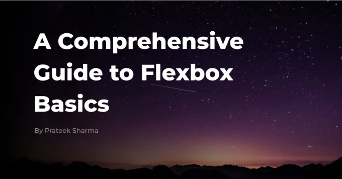

현대 웹 개발 영역에서는 다양한 기기와 화면 크기에 매끄럽게 적응하는 레이아웃을 만드는 것이 중요합니다. Flexbox CSS(유연한 박스 레이아웃)는 반응형 및 유연한 레이아웃을 쉽게 구현하는 강력한 도구로 부상했습니다.

이 포괄적인 가이드에서는 Flexbox의 기본 개념을 탐구하며, 각 속성을 예제와 함께 살펴보면서 실제 응용을 파악하는 데 도움이 되도록 합니다.

# Flexbox 기본 개념 이해

<!-- ui-log 수평형 -->

<ins class="adsbygoogle"
      style="display:block"
      data-ad-client="ca-pub-4877378276818686"
      data-ad-slot="9743150776"
      data-ad-format="auto"
      data-full-width-responsive="true"></ins>
<component is="script">
(adsbygoogle = window.adsbygoogle || []).push({});
</component>

플렉스박스는 공간을 효율적으로 분배하고 항목을 정렬하는 더 효율적인 방법을 제공하기 위해 설계되었습니다. 이는 해당 항목의 크기나 내용에 관계없이 컨테이너 내에서 항목을 정렬합니다. 플렉스박스의 핵심은 두 가지 구성 요소인 플렉스 컨테이너와 플렉스 아이템을 중심으로 돌아갑니다.

# 플렉스 컨테이너

플렉스 컨테이너는 "플렉스" 또는 "인라인-플렉스"로 display 속성이 설정된 HTML 요소입니다. 이는 플렉스 아이템의 부모 요소 역할을 하며, 플렉스 아이템이 배치되는 맥락을 정의합니다. 플렉스 컨테이너를 만들려면 간단히 컨테이너 요소의 display 속성을 "플렉스"로 설정하면 됩니다.

```js
.container {
  display: flex;
}
```

<!-- ui-log 수평형 -->

<ins class="adsbygoogle"
      style="display:block"
      data-ad-client="ca-pub-4877378276818686"
      data-ad-slot="9743150776"
      data-ad-format="auto"
      data-full-width-responsive="true"></ins>
<component is="script">
(adsbygoogle = window.adsbygoogle || []).push({});
</component>

# 플렉스 아이템

플렉스 아이템은 플렉스 컨테이너의 즉시 하위 항목입니다. 이러한 항목은 컨테이너 내에서 수평 또는 수직으로 정렬될 수 있으며 사용 가능한 공간에 맞게 크기를 동적으로 조정할 수 있습니다. 기본적으로 플렉스 아이템은 플렉스 컨테이너의 주축을 따라 행으로 배치됩니다.

```js
<div class="container">
  <div class="item">Item 1</div>
  <div class="item">Item 2</div>
  <div class="item">Item 3</div>
</div>
```

```css
.item {
  flex: 1; /* 균일한 플렉스 분배 */
}
```

<!-- ui-log 수평형 -->

<ins class="adsbygoogle"
      style="display:block"
      data-ad-client="ca-pub-4877378276818686"
      data-ad-slot="9743150776"
      data-ad-format="auto"
      data-full-width-responsive="true"></ins>
<component is="script">
(adsbygoogle = window.adsbygoogle || []).push({});
</component>

# Flexbox 속성

Flexbox는 컨테이너 내의 플렉스 아이템의 레이아웃 및 정렬을 제어하기 위한 다양한 속성을 제공합니다. 주요 속성과 실제 예제를 통해 어떻게 사용하는지 살펴보겠습니다.

## 1- flex-direction

flex-direction 속성은 플렉스 컨테이너 내에서 주축의 방향을 정의합니다. 플렉스 아이템이 행(기본값), 열 또는 반대 순서로 배치되는지를 지정할 수 있습니다.

<!-- ui-log 수평형 -->

<ins class="adsbygoogle"
      style="display:block"
      data-ad-client="ca-pub-4877378276818686"
      data-ad-slot="9743150776"
      data-ad-format="auto"
      data-full-width-responsive="true"></ins>
<component is="script">
(adsbygoogle = window.adsbygoogle || []).push({});
</component>

```js
.container {
  display: flex;
  flex-direction: row; /* Default: Items are laid out in a row */
}
```

## 2- justify-content

justify-content 속성은 flex 컨테이너의 주축을 따라 flex 항목을 정렬합니다. 이를 사용하면 flex 항목 간의 간격 및 주변 공간 분배를 제어할 수 있습니다.

```js
.container {
  display: flex;
  justify-content: center; /* 주축을 따라 항목을 중앙에 정렬합니다. */
}
```

<!-- ui-log 수평형 -->

<ins class="adsbygoogle"
      style="display:block"
      data-ad-client="ca-pub-4877378276818686"
      data-ad-slot="9743150776"
      data-ad-format="auto"
      data-full-width-responsive="true"></ins>
<component is="script">
(adsbygoogle = window.adsbygoogle || []).push({});
</component>

## 3- align-items

align-items 속성은 플렉스 컨테이너의 교차 축을 따라 플렉스 항목을 정렬합니다. 이는 플렉스 항목이 모든 사용 가능한 공간을 차지하지 않을 때 컨테이너 내에서 어떻게 위치하는지를 결정합니다.

```js
.container {
  display: flex;
  align-items: center; /* 항목을 교차 축의 중앙에 정렬 */
}
```

## 4- flex-wrap

<!-- ui-log 수평형 -->

<ins class="adsbygoogle"
      style="display:block"
      data-ad-client="ca-pub-4877378276818686"
      data-ad-slot="9743150776"
      data-ad-format="auto"
      data-full-width-responsive="true"></ins>
<component is="script">
(adsbygoogle = window.adsbygoogle || []).push({});
</component>

테이블 태그를 마크다운 형식으로 변경하세요.

The flex-wrap 속성은 flex 아이템이 컨테이너를 넘어갈 경우 여러 줄에 걸쳐 래핑해야 하는지 여부를 지정합니다. 이 속성을 사용하면 flex 아이템이 한 줄에 배치되는지 여러 줄로 래핑되는지를 제어할 수 있습니다.

```js
.container {
  display: flex;
  flex-wrap: wrap; /* 필요에 따라 여러 줄에 걸쳐 flex 아이템 래핑 */
}
```

## 5- flex-grow, flex-shrink 그리고 flex-basis

이 속성들은 flex 아이템이 성장하거나 축소하고, flex 컨테이너 내에서 공간을 분배하는 방식을 제어합니다. 이러한 속성을 조정하여 개별 flex 아이템의 유연성을 제어할 수 있습니다.

<!-- ui-log 수평형 -->

<ins class="adsbygoogle"
      style="display:block"
      data-ad-client="ca-pub-4877378276818686"
      data-ad-slot="9743150776"
      data-ad-format="auto"
      data-full-width-responsive="true"></ins>
<component is="script">
(adsbygoogle = window.adsbygoogle || []).push({});
</component>

```js
.item {
  flex: 1; /* 동일한 유연한 분배 */
}
```

## 6- align-self

align-self 속성은 각각의 플렉스 아이템에 대해 align-items로 설정된 정렬을 재정의합니다. 이를 사용하면 특정 플렉스 아이템을 컨테이너의 나머지 아이템과 다르게 정렬할 수 있습니다.

```js
.item {
  align-self: flex-end; /* 이 아이템을 교차 축의 끝에 정렬합니다. */
}
```

<!-- ui-log 수평형 -->

<ins class="adsbygoogle"
      style="display:block"
      data-ad-client="ca-pub-4877378276818686"
      data-ad-slot="9743150776"
      data-ad-format="auto"
      data-full-width-responsive="true"></ins>
<component is="script">
(adsbygoogle = window.adsbygoogle || []).push({});
</component>

## 7- 순서

order 속성은 플렉스 아이템이 컨테이너 내에서 나타나는 순서를 지정합니다. 이를 사용하면 HTML의 소스 순서를 수정하지 않고도 플렉스 아이템의 순서를 재배치할 수 있습니다.

```js
.item {
  order: 1; /* 이 아이템의 순서를 플렉스 컨테이너 내에서 변경 */
}
```

# 결론

<!-- ui-log 수평형 -->

<ins class="adsbygoogle"
      style="display:block"
      data-ad-client="ca-pub-4877378276818686"
      data-ad-slot="9743150776"
      data-ad-format="auto"
      data-full-width-responsive="true"></ins>
<component is="script">
(adsbygoogle = window.adsbygoogle || []).push({});
</component>

유연하고 직관적인 Flexbox CSS는 다양한 화면 크기와 디바이스에 매끄럽게 적응하는 반응형 레이아웃을 생성하는 데 유용합니다. Flexbox의 기본 원리를 습득하고 각 속성이 어떻게 작용하는지 이해함으로써, 현대적인 웹 인터페이스를 디자인하는 데 다양한 가능성을 확보할 수 있습니다. 단순한 내비게이션 메뉴부터 복잡한 그리드 레이아웃까지 만들 때, Flexbox는 효율적이고 효과적으로 디자인 목표를 달성할 수 있는 도구를 제공합니다. 연습과 실험을 통해, Flexbox를 활용하여 다양한 플랫폼에서 사용자들을 기쁘게 할만한 멋진 반응형 웹 경험을 만들어낼 수 있습니다.
