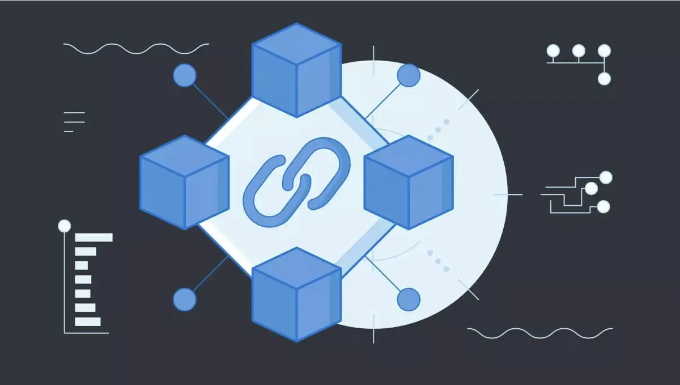

마이크로 프론트엔드는 모놀리식 프론트엔드를 작은 관리 가능한 조각으로 분해하는 웹 응용 프로그램을 구축하는 아키텍처 접근 방식입니다. 이러한 작은 조각인 마이크로 프론트엔드는 독립적으로 개발, 테스트 및 배포할 수 있습니다. 이 방식은 크고 복잡한 응용 프로그램에 특히 유용하며, 서로 간섭하지 않고 프론트엔드의 다른 부분에 대해 다른 팀이 작업할 수 있도록 합니다.

React.js로 마이크로 프론트엔드를 구현하려면 다음 기본 단계를 따를 수 있습니다:

- 마이크로 프론트엔드 구조 설계: 응용 프로그램을 마이크로 프론트엔드로 어떻게 분할할지 결정하세요. 기능별로, 특징별로 또는 프로젝트에 맞는 다른 논리적 그룹화 방식으로 분할할 수 있습니다.

<!-- ui-log 수평형 -->

<ins class="adsbygoogle"
      style="display:block"
      data-ad-client="ca-pub-4877378276818686"
      data-ad-slot="9743150776"
      data-ad-format="auto"
      data-full-width-responsive="true"></ins>
<component is="script">
(adsbygoogle = window.adsbygoogle || []).push({});
</component>

- 모듈 페더레이션 라이브러리 선택: 웹팩 5에서는 모듈 페더레이션 기능이 도입되었습니다. 이 기능을 통해 서로 다른 애플리케이션 간에 JavaScript 모듈을 로드하고 공유할 수 있습니다. 이것은 마이크로 프론트엔드를 만드는 데 매우 중요합니다. React.js 애플리케이션에서 이를 구성하기 위해 "module-federation" 플러그인을 사용할 수 있습니다.

- 개별 마이크로 프론트엔드 생성: 각 마이크로 프론트엔드는 별도의 React 애플리케이션입니다. create-react-app 또는 선호하는 다른 방법을 사용하여 이를 생성할 수 있습니다.

- 공유 의존성 정의: 마이크로 프론트엔드에서 사용할 공유 의존성을 식별하세요. React, React Router 또는 기타 라이브러리가 이에 포함될 수 있습니다. 모듈 페더레이션을 사용하여 이러한 의존성이 마이크로 프론트엔드 간에 공유되도록 보장하세요.

- 라우팅 구현: 마이크로 프론트엔드 아키텍처에서 라우팅을 어떻게 처리할지 결정하세요. URL을 기반으로 적절한 마이크로 프론트엔드를 로드하고 표시하는 중앙 라우팅 애플리케이션을 사용하거나 각 마이크로 프론트엔드 내에서 라우팅을 구현할 수 있습니다.

<!-- ui-log 수평형 -->

<ins class="adsbygoogle"
      style="display:block"
      data-ad-client="ca-pub-4877378276818686"
      data-ad-slot="9743150776"
      data-ad-format="auto"
      data-full-width-responsive="true"></ins>
<component is="script">
(adsbygoogle = window.adsbygoogle || []).push({});
</component>

1. 마이크로 프론트엔드 통합: 주요 셸 애플리케이션에 사용자 상호작용이나 라우팅에 따라 마이크로 프론트엔드를 동적으로 통합하고 로드합니다. 보통 import() 함수를 사용하여 필요한 마이크로 프론트엔드를 로드합니다.

2. 마이크로 프론트엔드 간 통신: 마이크로 프론트엔드 간의 통신 방법을 고려해보세요. 사용자 요구 사항에 따라 사용자 정의 이벤트, Redux와 같은 전역 상태 관리자 또는 기타 통신 방법을 사용할 수 있습니다.

3. 테스트 및 배포: 각 마이크로 프론트엔드를 독립적으로 테스트하고 배포할 수 있습니다. 컨테이너화나 서버리스 배포와 같은 배포 전략을 사용하여 제품 환경에서 마이크로 프론트엔드를 관리하세요.

4. 오류 처리 및 모니터링: 마이크로 프론트엔드 아키텍처 내에서 문제를 추적하기 위한 오류 처리와 모니터링을 구현하세요. 중앙 집중식 로깅 및 모니터링 도구를 사용하여 문제를 식별하고 해결하는 데 더욱 효과적으로 도움을 받을 수 있습니다.

<!-- ui-log 수평형 -->

<ins class="adsbygoogle"
      style="display:block"
      data-ad-client="ca-pub-4877378276818686"
      data-ad-slot="9743150776"
      data-ad-format="auto"
      data-full-width-responsive="true"></ins>
<component is="script">
(adsbygoogle = window.adsbygoogle || []).push({});
</component>

. 확장과 유지보수: 애플리케이션이 발전함에 따라, 마이크로 프론트엔드를 지속적으로 모니터링하고 유지보수하세요. 필요한 대로 인프라를 확장하고 아키텍처를 조정할 준비를 해두세요.

마이크로 프론트엔드를 구현하는 것은 복잡성을 도입할 수 있으므로 프로젝트 요구 사항에 적합한 해결책인지 신중히 고려하세요. 대규모 복잡한 애플리케이션의 경우 여러 개발팀이 있는 경우 강력한 접근 방식일 수 있지만 독자적인 일련의 도전 과제를 야기할 수도 있습니다.

## 마이크로 프론트엔드 기반 애플리케이션의 전형적인 트리 구조:

```js
my-microfrontend-app/
│
├── shell/ (메인 쉘)
│   ├── src/
│   │   ├── components/
│   │   │   ├── Header.js
│   │   │   ├── Footer.js
│   │   ├── App.js
│   │   ├── index.js
│   ├── package.json
│   ├── webpack.config.js
│
├── microfrontend1/ (마이크로 프론트엔드 1)
│   ├── src/
│   │   ├── components/
│   │   │   ├── Microfrontend1Component.js
│   │   ├── App.js
│   │   ├── index.js
│   ├── package.json
│   ├── webpack.config.js
│
├── microfrontend2/ (마이크로 프론트엔드 2)
│   ├── src/
│   │   ├── components/
│   │   │   ├── Microfrontend2Component.js
│   │   ├── App.js
│   │   ├── index.js
│   ├── package.json
│   ├── webpack.config.js
│
├── shared/ (마이크로 프론트엔드 및 메인 쉘 간의 공유 코드)
│   ├── components/
│   │   ├── SharedComponent.js
│   ├── utils/
│   │   ├── api.js
│
├── node_modules/
├── package.json
├── webpack.config.js
├── .gitignore
├── README.md
```

<!-- ui-log 수평형 -->

<ins class="adsbygoogle"
      style="display:block"
      data-ad-client="ca-pub-4877378276818686"
      data-ad-slot="9743150776"
      data-ad-format="auto"
      data-full-width-responsive="true"></ins>
<component is="script">
(adsbygoogle = window.adsbygoogle || []).push({});
</component>

이 구조는 간단화된 예제입니다. 각 디렉토리(shell, microfrontend1, microfrontend2, shared)는 자체 소스 파일, 자체 package.json 및 자체 Webpack 구성을 가진 별도의 React 애플리케이션을 나타냅니다. "shared" 디렉토리에는 각 마이크로 프론트엔드 및 주 쉘 간에 공유되는 코드가 들어 있습니다.

리얼 마이크로 프론트엔드 기반 애플리케이션에서는 특정 요구사항과 의존성에 따라 구조가 더 복잡해질 수 있음을 유념해야 합니다. 각 마이크로 프론트엔드는 독립적으로 개발 및 배포될 수 있어 애플리케이션의 개발 및 유지 관리에 큰 유연성을 제공합니다.

코드를 작성해 봅시다..

이 예제에서는 두 개의 별도 마이크로 프론트엔드를 로드하고 메인 페이지의 다른 섹션에 해당 컴포넌트를 표시하는 주 애플리케이션이 있습니다.
세 개의 별도 React 프로젝트 "MainApp", "Microfrontend1", "Microfrontend2"가 있다고 가정해 보겠습니다. 이것이 어떻게 구성될 수 있는지 살펴봅시다:

<!-- ui-log 수평형 -->

<ins class="adsbygoogle"
      style="display:block"
      data-ad-client="ca-pub-4877378276818686"
      data-ad-slot="9743150776"
      data-ad-format="auto"
      data-full-width-responsive="true"></ins>
<component is="script">
(adsbygoogle = window.adsbygoogle || []).push({});
</component>

MainApp: 미니 프론트엔드를 로드하는 주 애플리케이션입니다.

```js
// MainApp.js
import React from "react";
import ReactDOM from "react-dom";

function MainApp() {
  return (
    <div>
      <h1>Application Principale</h1>
      <div id="microfrontend1"></div>
      <div id="microfrontend2"></div>
    </div>
  );
}

ReactDOM.render(<MainApp />, document.getElementById("root"));
```

Microfrontend1: 첫 번째 미니 프론트엔드입니다.

```js
// Microfrontend1.js
import React from "react";
import ReactDOM from "react-dom";

function Microfrontend1() {
  return <h2>Microfrontend 1</h2>;
}

ReactDOM.render(<Microfrontend1 />, document.getElementById("microfrontend1"));
```

<!-- ui-log 수평형 -->

<ins class="adsbygoogle"
      style="display:block"
      data-ad-client="ca-pub-4877378276818686"
      data-ad-slot="9743150776"
      data-ad-format="auto"
      data-full-width-responsive="true"></ins>
<component is="script">
(adsbygoogle = window.adsbygoogle || []).push({});
</component>

# Microfrontend2: 두 번째 마이크로프론트엔드.

```js
// Microfrontend2.js
import React from "react";
import ReactDOM from "react-dom";

function Microfrontend2() {
  return <h2>Microfrontend 2</h2>;
}

ReactDOM.render(<Microfrontend2 />, document.getElementById("microfrontend2"));
```

## 웹팩 설정:

마이크로프론트엔드 환경에서 가져오기와 종속성을 처리하기 위해 웹팩과 바벨을 구성하는 방법은 다음과 같습니다.

<!-- ui-log 수평형 -->

<ins class="adsbygoogle"
      style="display:block"
      data-ad-client="ca-pub-4877378276818686"
      data-ad-slot="9743150776"
      data-ad-format="auto"
      data-full-width-responsive="true"></ins>
<component is="script">
(adsbygoogle = window.adsbygoogle || []).push({});
</component>

마이크로 프론트엔드 프로젝트(예: "마이크로프론트엔드1" 및 "마이크로프론트엔드2")마다 사용자 지정 Webpack 구성이 필요합니다. Webpack에 대한 예시 구성은 다음과 같습니다:

```js
// webpack.config.js
const path = require("path");

module.exports = {
  entry: "./src/index.js", // 애플리케이션 진입점
  output: {
    path: path.resolve(__dirname, "dist"),
    filename: "bundle.js",
  },
  module: {
    rules: [
      {
        test: /\.(js|jsx)$/,
        exclude: /node_modules/,
        use: {
          loader: "babel-loader", // 코드 변환을 위해 Babel 사용
        },
      },
    ],
  },
  resolve: {
    extensions: [".js", ".jsx"], // .js 및 .jsx 파일을 확장자를 지정하지 않고 가져올 수 있게 함
  },
};
```

각 마이크로 프론트엔드 프로젝트에 webpack, webpack-cli 및 babel-loader를 포함한 필요한 종속성을 설치해야 합니다.

## Babel 설정:

<!-- ui-log 수평형 -->

<ins class="adsbygoogle"
      style="display:block"
      data-ad-client="ca-pub-4877378276818686"
      data-ad-slot="9743150776"
      data-ad-format="auto"
      data-full-width-responsive="true"></ins>
<component is="script">
(adsbygoogle = window.adsbygoogle || []).push({});
</component>

마이크로 프론트엔드 프로젝트마다 필요한 변환을 정의하는 바벨 구성 파일도 있어야 합니다. 아래는 .babelrc 파일의 예시입니다:

```js
{
  "presets": ["@babel/preset-env", "@babel/preset-react"],
  "plugins": [
    // 필요한 경우 다른 바벨 플러그인을 추가할 수 있습니다
  ]
}
```

각 마이크로 프론트엔드 프로젝트에 @babel/preset-env 및 @babel/preset-react와 같은 필요한 바벨 종속성을 설치해야 합니다.

## 웹팩 별칭 구성하기:

<!-- ui-log 수평형 -->

<ins class="adsbygoogle"
      style="display:block"
      data-ad-client="ca-pub-4877378276818686"
      data-ad-slot="9743150776"
      data-ad-format="auto"
      data-full-width-responsive="true"></ins>
<component is="script">
(adsbygoogle = window.adsbygoogle || []).push({});
</component>

마이크로 프론트엔드와 메인 쉘 간의 가져오기를 간편하게 하려면 웹팩 별명을 사용할 수 있어요. 메인 쉘 웹팩 구성에서 각 마이크로 프론트엔드를 위한 별명을 정의하여 가져오기를 간소화할 수 있어요. 여기에 예시가 있어요:

```js
// webpack.config.js de la coquille principale
const path = require("path");

module.export = {
  // ...
  resolve: {
    alias: {
      microfrontend1: path.resolve(__dirname, "path/to/microfrontend1"),
      microfrontend2: path.resolve(__dirname, "path/to/microfrontend2"),
      // 필요한 경우 다른 마이크로 프론트엔드를 위한 별명을 정의해 주세요
    },
    extensions: [".js", ".jsx"],
  },
};
```

이를 통해 마이크로 프론트엔드에서 메인 쉘로 컴포넌트를 가져오는 방법으로 다음과 같이 사용할 수 있어요:

```js
import Microfrontend1Component from "microfrontend1/components/Microfrontend1Component";
import Microfrontend2Component from "microfrontend2/components/Microfrontend2Component";
```

<!-- ui-log 수평형 -->

<ins class="adsbygoogle"
      style="display:block"
      data-ad-client="ca-pub-4877378276818686"
      data-ad-slot="9743150776"
      data-ad-format="auto"
      data-full-width-responsive="true"></ins>
<component is="script">
(adsbygoogle = window.adsbygoogle || []).push({});
</component>

## 종속성 관리:

각 미크로 프론트엔드의 종속성을 적절한 패키지 관리 도구인 npm 또는 Yarn을 사용하여 독립적으로 관리해야 합니다. 각 미크로 프론트엔드는 종속성을 지정하는 자체 package.json 파일을 가져야 합니다. 또한 각 미크로 프론트엔드와 메인 셸은 각각의 종속성을 지정하는 자체 package.json을 가져야 합니다.

충돌을 피하기 위해 종속성을 버전별로 관리하는 것도 중요합니다.

<!-- ui-log 수평형 -->

<ins class="adsbygoogle"
      style="display:block"
      data-ad-client="ca-pub-4877378276818686"
      data-ad-slot="9743150776"
      data-ad-format="auto"
      data-full-width-responsive="true"></ins>
<component is="script">
(adsbygoogle = window.adsbygoogle || []).push({});
</component>

위의 구성을 사용하면 마이크로 프론트엔드 환경에서 가져오기 및 종속성을 효과적으로 관리할 수 있습니다. 귀하의 특정 요구 사항과 응용 프로그램 구조에 따라 이러한 구성을 사용자 정의하십시오.

"이 기사를 읽어 주셔서 감사합니다. 곧 뵙겠습니다!"
