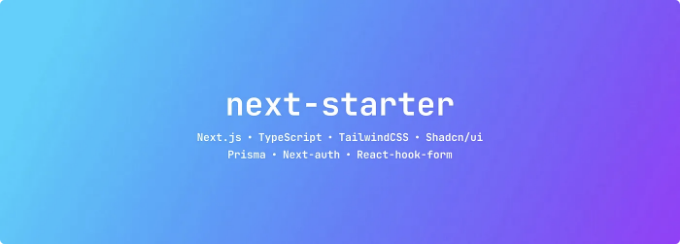
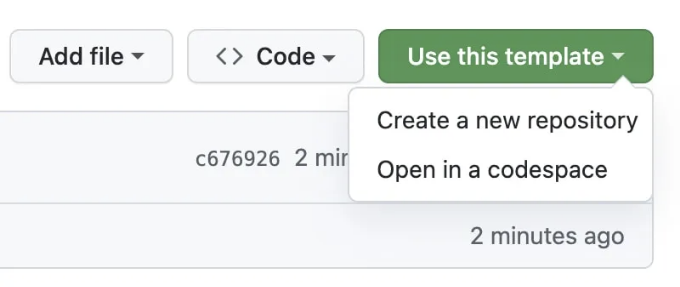

안녕하세요,
저는 Next.js를 위한 스타터 템플릿을 만들었어요. 이 템플릿은 TypeScript, Tailwind, 그리고 shadcn/ui의 기능을 모두 포함하고 있어요. 저는 이미 여기에 대해 글을 썼지만, Next-auth, Prisma, React-hook-form, T3-env와 같은 몇 가지 새로운 기능을 추가했어요.

가까운 미래에 이 프로젝트를 위한 CLI를 만들고 싶어해요. 프로젝트에 포함되지 않은 어떤 기술들을 추가할 수 있을까요?

이 프로젝트가 마음에 드셨다면, 별을 한 개라도 주시면 감사하겠어요. 🌟

<!-- ui-log 수평형 -->

<ins class="adsbygoogle"
      style="display:block"
      data-ad-client="ca-pub-4877378276818686"
      data-ad-slot="9743150776"
      data-ad-format="auto"
      data-full-width-responsive="true"></ins>
<component is="script">
(adsbygoogle = window.adsbygoogle || []).push({});
</component>

https://github.com/Skolaczk/next-starter

# 개요

Next.js 스타터 템플릿은 TypeScript, Tailwind CSS, Next-auth, Eslint, 테스팅 도구 등과 같은 다양한 기능으로 가득한 채 제공됩니다. 효율적이고 스타일리시한 프로젝트를 즉시 시작하세요.

# 기능

<!-- ui-log 수평형 -->

<ins class="adsbygoogle"
      style="display:block"
      data-ad-client="ca-pub-4877378276818686"
      data-ad-slot="9743150776"
      data-ad-format="auto"
      data-full-width-responsive="true"></ins>
<component is="script">
(adsbygoogle = window.adsbygoogle || []).push({});
</component>

- 🚀 Next.js 14 (App router)
- ⚛️ React 18
- 📘 Typescript
- 🎨 TailwindCSS — 클래스 정렬, 병합 및 린팅
- 🛠️ Shadcn/ui — 사용자 정의 가능한 UI 구성요소
- 🔒 Next-auth — Next.js용 간단한 인증 라이브러리 (GitHub 제공자)
- 🛡️ Prisma — 노드.js를 위한 ORM
- 📋 React-hook-form — 쉽고 효율적인 폼 관리
- 🔍 Zod — 스키마 유효성 검사 라이브러리
- 🧪 Jest & React Testing Library — 단위 테스트용으로 설정됨
- 🎭 Playwright — 엔드 투 엔드 테스트용으로 설정됨
- 📈 Absolute Import & Path Alias — @/ 접두사를 사용하여 컴포넌트 가져오기
- 💅 Prettier — 코드 포매터
- 🧹 Eslint — 코드 린팅 도구
- 🐶 Husky & Lint Staged — 변경된 파일에 대해 커밋하기 전 스크립트 실행
- 🔹 아이콘 — Lucide에서 제공
- 🌑 다크 모드 — next-themes로 가능
- 🗺️ 사이트맵 및 robots.txt — next-sitemap으로 가능
- 📝 Commitlint — 깃 커밋을 린트
- 🤖 Github actions — PR에서 코드 린트
- ⚙️ T3-env — 환경 변수 관리
- 💯 완벽한 Lighthouse 점수

# 🚀 배포

# 시작하기

## 1. 이 템플릿을 다음 세 가지 방법 중 하나로 클론합니다

<!-- ui-log 수평형 -->

<ins class="adsbygoogle"
      style="display:block"
      data-ad-client="ca-pub-4877378276818686"
      data-ad-slot="9743150776"
      data-ad-format="auto"
      data-full-width-responsive="true"></ins>
<component is="script">
(adsbygoogle = window.adsbygoogle || []).push({});
</component>

- 이 저장소를 템플릿으로 사용합니다



- create-next-app을 사용합니다

```js
npx create-next-app -e https://github.com/Skolaczk/next-starter my-project-name
```

<!-- ui-log 수평형 -->

<ins class="adsbygoogle"
      style="display:block"
      data-ad-client="ca-pub-4877378276818686"
      data-ad-slot="9743150776"
      data-ad-format="auto"
      data-full-width-responsive="true"></ins>
<component is="script">
(adsbygoogle = window.adsbygoogle || []).push({});
</component>

- git clone을 사용하여

```js
git clone https://github.com/Skolaczk/next-starter my-project-name
```

## 2. 종속 항목 설치

```js
npm install
```

<!-- ui-log 수평형 -->

<ins class="adsbygoogle"
      style="display:block"
      data-ad-client="ca-pub-4877378276818686"
      data-ad-slot="9743150776"
      data-ad-format="auto"
      data-full-width-responsive="true"></ins>
<component is="script">
(adsbygoogle = window.adsbygoogle || []).push({});
</component>

## 3. 허스키 준비하기

만약 허스키를 사용하고 싶다면 필요합니다

```js
npm run prepare
```

## 4. 개발 서버 실행하기

<!-- ui-log 수평형 -->

<ins class="adsbygoogle"
      style="display:block"
      data-ad-client="ca-pub-4877378276818686"
      data-ad-slot="9743150776"
      data-ad-format="auto"
      data-full-width-responsive="true"></ins>
<component is="script">
(adsbygoogle = window.adsbygoogle || []).push({});
</component>

서버를 시작하려면 이 명령어를 사용해보세요:

```js
npm run dev
```

그리고 이 앱을 확인하려면 http://localhost:3000/ 로 이동해보세요.

만약 이 프로젝트가 마음에 드신다면, 별을 한 개 남겨주시면 감사하겠습니다. 🌟😊

<!-- ui-log 수평형 -->

<ins class="adsbygoogle"
      style="display:block"
      data-ad-client="ca-pub-4877378276818686"
      data-ad-slot="9743150776"
      data-ad-format="auto"
      data-full-width-responsive="true"></ins>
<component is="script">
(adsbygoogle = window.adsbygoogle || []).push({});
</component>
