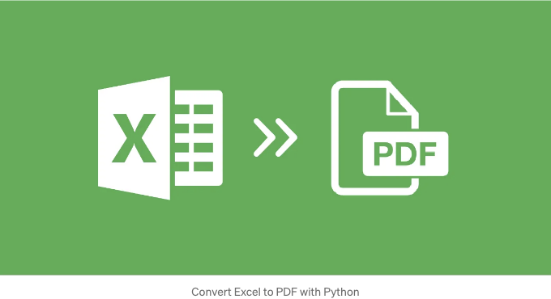

요즘에는 비즈니스, 기관 및 개인들이 데이터 관리와 분석을 위한 필수 도구로 Microsoft Excel을 사용하고 있습니다. 그러나 원본 형식의 Excel 파일을 공유하는 것이 적합하지 않은 경우가 있습니다. 문서의 형식을 보존하거나 다른 기기 또는 운영 체제 간의 호환성을 보장하거나 무단 수정을 방지하는 등 다양한 이유로 인해입니다. 이러한 경우 Excel 파일을 PDF 형식으로 변환해야 할 필요성이 생깁니다.

Excel을 PDF로 변환하는 것은 데이터가 풍부한 파일을 공유하고 배포할 때 원본 문서의 무결성을 유지하면서 신뢰할 수 있고 편리한 솔루션을 제공합니다. 본 문서에서는 Python을 사용하여 Spire.XLS for Python을 활용해 Excel 문서를 PDF 파일로 변환하는 방법을 소개하겠습니다.

- Python에서 특정 워크시트를 PDF로 변환하기
- Python에서 전체 Excel 문서를 PDF로 변환하기

<!-- ui-log 수평형 -->

<ins class="adsbygoogle"
      style="display:block"
      data-ad-client="ca-pub-4877378276818686"
      data-ad-slot="9743150776"
      data-ad-format="auto"
      data-full-width-responsive="true"></ins>
<component is="script">
(adsbygoogle = window.adsbygoogle || []).push({});
</component>

## 종속성 설치

이 솔루션을 사용하려면 Python 프로그램에서 Excel 문서를 읽고 생성 및 조작할 수 있는 Python 라이브러리인 Spire.XLS가 종속성으로 설치되어야 합니다. 다음 pip 명령을 실행하여 Spire.XLS for Python을 설치할 수 있습니다.

```js
pip install Spire.XLS
```

## 특정 워크시트를 Python에서 PDF로 변환하기

<!-- ui-log 수평형 -->

<ins class="adsbygoogle"
      style="display:block"
      data-ad-client="ca-pub-4877378276818686"
      data-ad-slot="9743150776"
      data-ad-format="auto"
      data-full-width-responsive="true"></ins>
<component is="script">
(adsbygoogle = window.adsbygoogle || []).push({});
</component>

특정 워크시트를 PDF 문서로 변환하려면 Worksheet.SaveToPdf() 메소드를 사용합니다. 전체적으로 보기 좋은 모양을 갖기 위해서는 콘텐츠 주위의 여백을 조정하고 생성된 PDF 페이지가 표준 페이지 크기(예: A4)인지 또는 콘텐츠에 맞는 적합한 페이지 크기인지를 결정해야 할 수도 있습니다.

다음 코드 조각은 지정된 페이지 설정으로 워크시트를 PDF 문서로 변환하는 방법을 보여줍니다.

```js
from spire.xls import *
from spire.common import *

# Workbook 객체 생성
workbook = Workbook()

# Excel 문서 로드
workbook.LoadFromFile("C:\\Users\\Administrator\\Desktop\\input.xlsx")

# 특정 워크시트 가져오기
sheet = workbook.Worksheets[1]

# PageSetup 객체 가져오기
pageSetup = sheet.PageSetup

# 페이지 여백 설정
pageSetup.TopMargin = 0.3
pageSetup.BottomMargin = 0.3
pageSetup.LeftMargin = 0.3
pageSetup.RightMargin = 0.3

# 변환 시 워크시트를 페이지에 맞게 설정
workbook.ConverterSetting.SheetFitToPage = True

# 워크시트를 PDF 파일로 변환
sheet.SaveToPdf("output/WorksheetToPdf.pdf")
workbook.Dispose()
```

## 파이썬에서 전체 Excel 문서를 PDF로 변환하기

<!-- ui-log 수평형 -->

<ins class="adsbygoogle"
      style="display:block"
      data-ad-client="ca-pub-4877378276818686"
      data-ad-slot="9743150776"
      data-ad-format="auto"
      data-full-width-responsive="true"></ins>
<component is="script">
(adsbygoogle = window.adsbygoogle || []).push({});
</component>

엑셀 문서 전체를 PDF 파일로 변환하려면 Workbook.SaveToFile() 메서드를 사용하면 됩니다. 변환 전에 페이지 설정을 지정할 수도 있습니다. 다음 코드 조각에서는 어떻게 하는지 보여줍니다.

```js
from spire.xls import *
from spire.common import *

# Workbook 객체 생성
workbook = Workbook()

# Excel 문서 불러오기
workbook.LoadFromFile("C:\\Users\\Administrator\\Desktop\\sample.xlsx")

# 워크북의 워크시트를 반복
for sheet in workbook.Worksheets:

    # PageSetup 객체 가져오기
    pageSetup = sheet.PageSetup

    # 페이지 여백 설정
    pageSetup.TopMargin = 0.3
    pageSetup.BottomMargin = 0.3
    pageSetup.LeftMargin = 0.3
    pageSetup.RightMargin = 0.3

# 변환 시 워크시트를 페이지에 맞추도록 설정
workbook.ConverterSetting.SheetFitToPage = True

# PDF 파일로 변환
workbook.SaveToFile("output/ToPdf.pdf", FileFormat.PDF)
workbook.Dispose()
```
