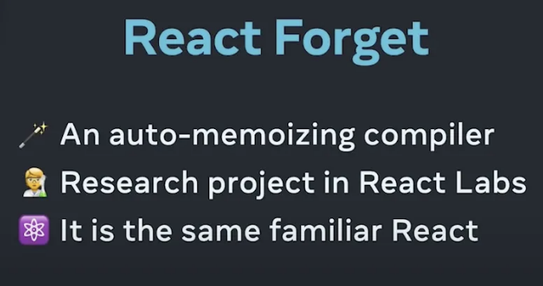

리액트가 마지막 버전을 출시한 날짜는 2022년 6월 14일로, 버전 번호는 18.2.0이었습니다. 인기 있는 기술의 경우, 이처럼 느리게 업데이트되는 것은 정말 드뭅니다. 이는 커뮤니티에서 몇몇 영향력 있는 인물들 사이에 불만을 일으켰고, 이에 대해 제 이전 게시물에서 다뤘습니다. 관심 있는 분들은 "리액트 커뮤니티의 의견 차이"를 확인할 수 있습니다.

커뮤니티에서 늘어나는 불만의 여파로, 새로운 리액트 버전 소식이 드디어 전해졌습니다.

리액트 팀은 이번까지 새로운 공식 버전을 발표하지 않은 비판에 대해 응답했습니다. 카나리아 버전에 이전에 출시된 기능들은 서로 연관이 깊어, 이들이 함께 작동할 수 있도록 안정 버전에 순차적으로 출시할 수 있도록 하는 데 시간이 많이 필요했습니다.

<!-- ui-log 수평형 -->

<ins class="adsbygoogle"
      style="display:block"
      data-ad-client="ca-pub-4877378276818686"
      data-ad-slot="9743150776"
      data-ad-format="auto"
      data-full-width-responsive="true"></ins>
<component is="script">
(adsbygoogle = window.adsbygoogle || []).push({});
</component>

사실, 공식 버전이 거의 2년 동안 릴리스되지 않았지만 캐너리 버전은 use, useOptimistic hook, use client, use server 디렉티브와 같은 상당한 업데이트를 경험했습니다. 이러한 업데이트는 React 생태계를 객관적으로 풍부하게 만들어주었으며 특히 Next.js 및 Remix와 같은 풀 스택 프레임워크의 신속한 개발을 촉진했습니다.

React 팀은 다음 버전이 주요 릴리스이며, 버전 번호는 19.0.0이 될 것을 확인했습니다.

# v19에서 새로운 기능 예측

이제, React 팀의 최신 뉴스를 기반으로 v19에서 공식적으로 릴리스될 예상 새로운 기능을 미리 살펴보겠습니다.

<!-- ui-log 수평형 -->

<ins class="adsbygoogle"
      style="display:block"
      data-ad-client="ca-pub-4877378276818686"
      data-ad-slot="9743150776"
      data-ad-format="auto"
      data-full-width-responsive="true"></ins>
<component is="script">
(adsbygoogle = window.adsbygoogle || []).push({});
</component>

## 자동 메모이제이션

React Conf 2021에서 Huang Xuan이 소개한 React Forget을 기억하시나요?



지금 이제 됐어요.

<!-- ui-log 수평형 -->

<ins class="adsbygoogle"
      style="display:block"
      data-ad-client="ca-pub-4877378276818686"
      data-ad-slot="9743150776"
      data-ad-format="auto"
      data-full-width-responsive="true"></ins>
<component is="script">
(adsbygoogle = window.adsbygoogle || []).push({});
</component>

인스타그램의 프로덕션 환경에서 이미 적용된 컴파일러입니다. React 팀은 이를 Meta 내의 더 많은 플랫폼에 적용할 계획이며, 미래에 오픈 소스로 공개할 예정입니다.

새로운 컴파일러를 사용하기 전에, 우리는 불필요한 다시 렌더링을 줄이기 위해 직접 상태를 캐시하는 useMemo, useCallback 및 memo를 사용했습니다. 이 구현은 실행 가능하지만, React 팀은 그들이 상상하는 이상적인 방법은 아니라고 믿습니다. React가 상태 변경 시 필요한 부분만 자동으로 다시 렌더링할 수 있는 솔루션을 찾고 있었습니다. 몇 년에 걸친 노력 끝에, 새로운 컴파일러가 드디어 성공적으로 나왔습니다.

새로운 React 컴파일러는 즉시 사용 가능한 기능으로, 개발자들에게 또 다른 패러다임 변화를 제공할 것입니다. 이것은 v19의 가장 기대되는 기능입니다.

재밌게도, React 팀은 새로운 컴파일러를 소개할 때 "React Forget"에 대해 언급하지 않았는데, 이로 인해 커뮤니티로부터 재미있는 댓글이 등장했습니다: 그들은 React Forget을 잊고 Forget 섹션에서 Forget을 언급을 잊었습니다.🤣

<!-- ui-log 수평형 -->

<ins class="adsbygoogle"
      style="display:block"
      data-ad-client="ca-pub-4877378276818686"
      data-ad-slot="9743150776"
      data-ad-format="auto"
      data-full-width-responsive="true"></ins>
<component is="script">
(adsbygoogle = window.adsbygoogle || []).push({});
</component>

## 동작

React Actions은 React 팀이 클라이언트에서 서버로 데이터를 전송하기 위한 솔루션을 탐색하는 일환으로 개발되었습니다. 이 기능을 사용하면 개발자들이 DOM 요소 (예: `form/`)에 함수를 전달할 수 있습니다:

```js
<form action={search}>
  <input name="query" />
  <button type="submit">검색</button>
</form>
```

액션 함수는 동기적 또는 비동기적일 수 있습니다. 액션을 사용할 때 React는 데이터 제출의 라이프사이클을 개발자 대신 관리합니다. useFormStatus 및 useFormState 훅을 통해 현재 상태 및 폼 작업의 응답에 접근할 수 있습니다.

<!-- ui-log 수평형 -->

<ins class="adsbygoogle"
      style="display:block"
      data-ad-client="ca-pub-4877378276818686"
      data-ad-slot="9743150776"
      data-ad-format="auto"
      data-full-width-responsive="true"></ins>
<component is="script">
(adsbygoogle = window.adsbygoogle || []).push({});
</component>

클라이언트와 서버 간 상호 작용 시나리오에서 사용할 수 있는 액션들이 있습니다. 이는 데이터베이스 변경(데이터 추가, 삭제, 업데이트) 및 폼 구현(로그인 폼, 등록 폼 등) 등에 사용될 수 있습니다.

useFormStatus 및 useFormState와 결합하는 것 외에도, 액션은 useOptimistic 및 use server와 함께 사용할 수도 있습니다. 이에 대해 자세히 설명하는 것은 긴 토론이 될 수 있지만, 앞으로 나올 기사를 따라와 주시면 액션의 상세 사용법을 소개할 예정입니다.

## 지시문: use client 및 use server

use client 및 use server 지시문은 오랜 시간 동안 Canary 버전에서 사용할 수 있었으며, 최종적으로 v19에서 Stable 버전에 추가될 예정입니다.

<!-- ui-log 수평형 -->

<ins class="adsbygoogle"
      style="display:block"
      data-ad-client="ca-pub-4877378276818686"
      data-ad-slot="9743150776"
      data-ad-format="auto"
      data-full-width-responsive="true"></ins>
<component is="script">
(adsbygoogle = window.adsbygoogle || []).push({});
</component>

이전에는 Next.js가 이 두 가지 지시문을 프로덕션에서 사용하고 있어 React 생태계를 손상시킨다며 자주 불만이 제기되었습니다. Next.js를 비난하고 React 팀을 비난하여 Next.js가 불안정한 기능을 미리 사용하도록 허용했다고 비판하는 것이었습니다. 그러나 이러한 우려는 대부분 불필요합니다. 이 두 가지 지시문은 Next.js와 Remix와 같은 풀 스택 프레임워크를 위해 설계되었기 때문에 React를 사용하여 애플리케이션을 개발하는 일반 개발자들은 당장 이를 거의 필요로하지 않을 것입니다.

React를 사용하고 있다면 풀 스택 프레임워크가 아닌 경우, 이 두 가지 지시문의 목적을 이해하는 것만으로 충분합니다: use client 및 use server는 프론트엔드 및 서버 사이드 환경 간의 "분할 지점"을 표시합니다. use client는 패키징 도구에 `script` 태그를 생성하도록 지시하고, use server는 패키징 도구에 POST 엔드포인트를 만들도록 지시합니다. 이러한 지시문을 사용하면 개발자들이 동일한 파일 내에서 클라이언트 측 및 서버 측 코드를 작성할 수 있습니다.

## 낙관적 업데이트를 위한 useOptimistic

useOptimistic는 v19에서 안정적으로 지정될 것으로 예상되는 새로운 훅입니다. useOptimistic를 사용하면 비동기 작업(예: 네트워크 요청) 중에 UI를 낙관적으로 업데이트할 수 있습니다. 현재 상태와 업데이트 함수를 매개변수로 받아들이며, 비동기 작업 중에 상태의 사본을 반환할 수 있습니다. 현재 상태와 작업 입력을 사용하여 비동기 작업 대기 중에 사용될 낙관적 상태를 반환하는 함수를 제공해야 합니다.

<!-- ui-log 수평형 -->

<ins class="adsbygoogle"
      style="display:block"
      data-ad-client="ca-pub-4877378276818686"
      data-ad-slot="9743150776"
      data-ad-format="auto"
      data-full-width-responsive="true"></ins>
<component is="script">
(adsbygoogle = window.adsbygoogle || []).push({});
</component>

아래는 어떻게 정의되어 있는지입니다:

```js
const [optimisticState, addOptimistic] = useOptimistic(state, updateFn);

// 또는
const [optimisticState, addOptimistic] = useOptimistic(
  state,
  // updateFn
  (currentState, optimisticValue) => {
    // 낙관적인 값을 포함하여 새로운 상태를 병합하고 반환합니다.
  }
);
```

매개변수

state: 초기 상태 값 및 진행 중인 작업이 없을 때 반환되는 값입니다.
updateFn(currentState, optimisticValue): addOptimistic에 전달된 현재 상태와 낙관적인 값을 받아 낙관적인 상태 결과를 리턴하는 함수입니다. updateFn은 currentState 및 optimisticValue 두 매개변수를 받습니다. 리턴 값은 currentState 및 optimisticValue를 병합한 값이 됩니다.

<!-- ui-log 수평형 -->

<ins class="adsbygoogle"
      style="display:block"
      data-ad-client="ca-pub-4877378276818686"
      data-ad-slot="9743150776"
      data-ad-format="auto"
      data-full-width-responsive="true"></ins>
<component is="script">
(adsbygoogle = window.adsbygoogle || []).push({});
</component>

반환 값

optimisticState: 생성된 낙관적인 상태입니다. 작업이 진행 중인 경우에는 updateFn에 의해 반환된 값과 동일하며, 작업이 진행 중이 아닐 때는 상태와 같습니다.
addOptimistic: 낙관적 업데이트 중에 호출되는 디스패치 함수입니다. optimisticValue(어떤 유형의 값이든 될 수 있음)라는 매개변수를 받아 상태와 optimisticValue를 사용하여 updateFn을 호출합니다.

더 자세한 예시:

```js
import { useOptimistic } from 'react';
function AppContainer() {
  const [state, setState] = useState(initialState); // 초기 상태가 있는 것으로 가정
  const [optimisticState, addOptimistic] = useOptimistic(
    state,
    // updateFn
    (currentState, optimisticValue) => {
      // 병합하여 반환: 새로운 상태, 낙관적 값
      return { …currentState, …optimisticValue };
    }
  );
  // 폼 제출과 같은 비동기 작업이 있는 경우를 가정
  function handleSubmit(data) {
    // 실제 데이터 제출 전에 낙관적 업데이트 사용
    addOptimistic({ data: '낙관적인 데이터' });
    // 그런 다음 비동기 작업 수행
    fetch('/api/submit', {
      method: 'POST',
      headers: {
        'Content-Type': 'application/json',
      },
      body: JSON.stringify(data),
      })
      .then(response => response.json())
      .then(realData => {
        // 실제 데이터로 상태 업데이트
        setState(prevState => ({ …prevState, data: realData }));
    });
  }
  return (
    // optimisticState를 사용하여 UI 렌더링
    <div>{optimisticState.data}</div>
  );
}
```

<!-- ui-log 수평형 -->

<ins class="adsbygoogle"
      style="display:block"
      data-ad-client="ca-pub-4877378276818686"
      data-ad-slot="9743150776"
      data-ad-format="auto"
      data-full-width-responsive="true"></ins>
<component is="script">
(adsbygoogle = window.adsbygoogle || []).push({});
</component>

`useOptimistic`은 비동기 작업 중에 예상 결과를 렌더링하며, 작업이 완료되고 상태가 업데이트되면 실제 결과(성공 또는 실패)를 렌더링합니다.

## 기타 업데이트

또한, React 팀 멤버 안드류 클락은 2024년에 다음과 같은 변경사항이 있을 것이라고 밝혔습니다:

🟡 `forwardRef` → `ref`는 프롭으로: 자식 컴포넌트에서 내부 요소나 컴포넌트에 대한 참조를 프롭으로 취급하여 간단하게 처리합니다.
🟡 `React.lazy` → `RSC, promise-as-child`: 코드 분할 및 지연 로딩 기능을 향상시킵니다.
🟡 `useContext` → `use(Context)`: Context에 액세스하는 새로운 방법을 제공합니다.
🟡 `throw promise` → `use(promise)`: 비동기 데이터 로딩 처리를 개선합니다.
🟡 `Context.Provider` → `Context`: 컨텍스트 프로바이더를 간단하게 사용할 수 있도록 합니다.

<!-- ui-log 수평형 -->

<ins class="adsbygoogle"
      style="display:block"
      data-ad-client="ca-pub-4877378276818686"
      data-ad-slot="9743150776"
      data-ad-format="auto"
      data-full-width-responsive="true"></ins>
<component is="script">
(adsbygoogle = window.adsbygoogle || []).push({});
</component>

그러나 공식 React 웹사이트에서는 아직 이러한 잠재적인 업데이트에 대한 상세 정보를 제공하지 않았습니다.

# 결론

React는 원대한 비전을 갖고 있습니다. 그들은 프론트엔드와 백엔드 간의 경계를 흐려지게 하고 클라이언트 측 능력에서의 우위를 유지하면서 커뮤니티의 풀스택 프레임워크에 대한 인프라를 제공하는 것을 목표로 하고 있습니다. 프론트엔드와 백엔드 간의 장벽을 허물면 프론트엔드 엔지니어들이 경력적 한계를 극복하는 데 도움이 될 수 있기 때문에 저는 그들의 접근 방식을 매우 감사히 생각합니다.

React 19는 훅이 소개된 후의 또 다른 마일스톤 버전이 될 것입니다. Andrew Clark는 새 버전이 3월이나 4월에 출시될 것이라고 말했습니다. 기대해 봅시다!

<!-- ui-log 수평형 -->

<ins class="adsbygoogle"
      style="display:block"
      data-ad-client="ca-pub-4877378276818686"
      data-ad-slot="9743150776"
      data-ad-format="auto"
      data-full-width-responsive="true"></ins>
<component is="script">
(adsbygoogle = window.adsbygoogle || []).push({});
</component>

제 소개

저는 프론트엔드 엔지니어이자 풀스택 개발자로, AI 통합을 지지하는 사람입니다.

Next.js와 Node.js 프로젝트에 참여하며, 이와 관련된 지식을 공유하고 있습니다.

Twitter: https://twitter.com/weijunext
Github: https://github.com/weijunext
블로그: https://weijunext.com/

<!-- ui-log 수평형 -->

<ins class="adsbygoogle"
      style="display:block"
      data-ad-client="ca-pub-4877378276818686"
      data-ad-slot="9743150776"
      data-ad-format="auto"
      data-full-width-responsive="true"></ins>
<component is="script">
(adsbygoogle = window.adsbygoogle || []).push({});
</component>

# 스택더미 🎓

끝까지 읽어 주셔서 감사합니다. 떠나시기 전에:

- 작가를 클립하고 팔로우해 주시면 감사하겠습니다! 👏
- 저희를 팔로우해 주세요: X | LinkedIn | YouTube | Discord
- 다른 플랫폼들도 방문해 보세요: In Plain English | CoFeed | Venture | Cubed
- 스택델믹닷컴에서 더 많은 콘텐츠를 만나보세요
