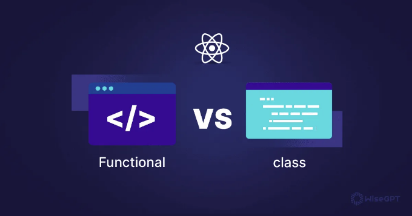

React 개발을 시작하는 경우, class와 functional 컴포넌트 중 어떤 것을 선택해야 할지 고민하게 될 것입니다. 이 글에서는 이 두 유형의 컴포넌트 간의 차이를 살펴보고, 그들의 독특한 특성과 장점, 프로젝트에서 언제 사용해야 하는지를 알아볼 것입니다. 그러니 마법사 모자와 지팡이를 쥐고 함께 알아봅시다!

# Class 컴포넌트: 옛날의 수호자

class 컴포넌트를 React의 노련한 노인 마법사로 상상해보세요. 이들은 초기부터 존재해 왔고 우아하고 정교하게 힘을 발휘하고 있습니다. class 컴포넌트는 ES6 클래스를 사용하여 정의되며 React.Component 클래스를 확장합니다. 라이프사이클 메서드에 넉넉한 접근 권한을 가지고 있어 상태를 관리하고 DOM에 주문을 걸거나 다른 컴포넌트와 소통하는 등의 작업을 할 수 있습니다. 예시를 살펴보겠습니다:

<!-- ui-log 수평형 -->

<ins class="adsbygoogle"
      style="display:block"
      data-ad-client="ca-pub-4877378276818686"
      data-ad-slot="9743150776"
      data-ad-format="auto"
      data-full-width-responsive="true"></ins>
<component is="script">
(adsbygoogle = window.adsbygoogle || []).push({});
</component>

```js
import React, { Component } from "react";

class WizardComponent extends Component {
  constructor(props) {
    super(props);
    this.state = {
      spellCount: 0,
    };
  }

  castSpell = () => {
    this.setState({ spellCount: this.state.spellCount + 1 });
  };

  render() {
    return (
      <div>
        <p>Total Spells Cast: {this.state.spellCount}</p>
        <button onClick={this.castSpell}>Cast Spell</button>
      </div>
    );
  }
}

export default WizardComponent;
```

# 기능적인 컴포넌트: 새로운 요술사들

기능적인 컴포넌트, 리액트의 젊고 민첩한 요술사들을 소개합니다. 이러한 컴포넌트는 단순한 자바스크립트 함수로 정의되며 마법의 재료로 props를 받아들이고 UI를 만들기 위한 JSX 주문을 반환합니다. 처음에는 클래스 컴포넌트의 견고함이 부족했지만, 리액트 훅스가 소개되면서 상태를 다루고 부수효과를 수행하는 능력을 포함한 놀라운 힘을 획득했습니다. 예제를 살펴보겠습니다:

```js
import React, { useState } from "react";

const SorcererComponent = () => {
  const [spellCount, setSpellCount] = useState(0);

  const castSpell = () => {
    setSpellCount(spellCount + 1);
  };

  return (
    <div>
      <p>Total Spells Cast: {spellCount}</p>
      <button onClick={castSpell}>Cast Spell</button>
    </div>
  );
};

export default SorcererComponent;
```

<!-- ui-log 수평형 -->

<ins class="adsbygoogle"
      style="display:block"
      data-ad-client="ca-pub-4877378276818686"
      data-ad-slot="9743150776"
      data-ad-format="auto"
      data-full-width-responsive="true"></ins>
<component is="script">
(adsbygoogle = window.adsbygoogle || []).push({});
</component>

# 강자 대결: 힘의 대결

이제 경쟁자를 소개했으니, 강점을 비교해보겠습니다:

- 유연성: 클래스 컴포넌트는 라이프사이클 메소드에 접근할 수 있어 복잡한 상호작용과 상태 관리에 이상적입니다. 훅의 힘을 가진 함수형 컴포넌트는 간결하고 사용하기 쉬워 가벼운 UI 요소에 적합합니다.
- 성능: 클래스 컴포넌트는 라이프사이클 메소드 때문에 약간의 무게를 지니고 있지만, 함수형 컴포넌트는 가벼우며 빠르기 때문에 성능이 중요한 애플리케이션에서 선호되는 선택입니다.
- 우아함: 함수형 컴포넌트는 간결한 구문과 관심사의 명확한 분리로 우아함 경쟁에서 승리합니다. 클래스 컴포넌트는 강력하지만 때로는 장황하고 보일러플레이트가 많이 느껴질 수 있습니다.

# 챔피언을 선택하세요:

<!-- ui-log 수평형 -->

<ins class="adsbygoogle"
      style="display:block"
      data-ad-client="ca-pub-4877378276818686"
      data-ad-slot="9743150776"
      data-ad-format="auto"
      data-full-width-responsive="true"></ins>
<component is="script">
(adsbygoogle = window.adsbygoogle || []).push({});
</component>

클래스 컴포넌트를 선택해야 하는 때와 함수형 컴포넌트를 채택해야 하는 때는 무엇일까요?

- 복잡한 로직, 상태 관리, 그리고 생명주기 메서드가 필요한 상호작용을 위해서는 클래스 컴포넌트를 선택하세요.
- 간단한 UI 요소, 재사용 가능한 프레젠테이션 컴포넌트, 그리고 상태 관리와 사이드 이펙트를 위해 Hooks의 강력함을 이용할 때는 함수형 컴포넌트를 활용하세요.

# 결론

React 컴포넌트의 영역에서, 클래스와 함수형 컴포넌트 둘 다 중요한 자리를 차지합니다. 클래스 컴포넌트의 지식을 활용하거나 Hooks를 활용한 현대적인 함수형 컴포넌트의 힘을 이용하더라도 그들의 차이를 이해하면 React 애플리케이션을 활기차게 만들 수 있습니다.

<!-- ui-log 수평형 -->

<ins class="adsbygoogle"
      style="display:block"
      data-ad-client="ca-pub-4877378276818686"
      data-ad-slot="9743150776"
      data-ad-format="auto"
      data-full-width-responsive="true"></ins>
<component is="script">
(adsbygoogle = window.adsbygoogle || []).push({});
</component>

행복한 코딩하세요! 🚀
