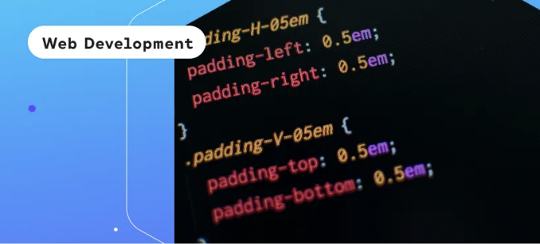

반응형 디자인은 사용자들과 신뢰 관계를 형성하는 데 도움이 되므로, 웹 개발자는 CSS, 그리드 레이아웃 및 SASS 사용 방법을 알아야 합니다.

안녕하세요! 👋 여러분! 먼저 이 글은 The Ironhack Blog에 게시된 원본 기사입니다. 거기에서 무료 기술 노하우를 더 많이 즐기고 기술 분야에서 새로운 커리어를 시작하는데 영감을 받을 수 있습니다!

현대 웹 개발에는 하나의 프로그래밍 언어 이상, 프레임워크, 작업 방법론 등 다양한 기술 습득이 필요합니다. 이러한 웹 페이지를 생성하고 디자인하는 과정은 다른 직업과 마찬가지로 배워야할 것들이 많습니다. 기술이 급속히 발전하는 상황에서 웹 디자이너는 모든 이러한 발전과 변화를 따라가고 여러 플랫폼과 기기에서 페이지를 구축하는 방법을 숙지해야 합니다.

<!-- ui-log 수평형 -->

<ins class="adsbygoogle"
      style="display:block"
      data-ad-client="ca-pub-4877378276818686"
      data-ad-slot="9743150776"
      data-ad-format="auto"
      data-full-width-responsive="true"></ins>
<component is="script">
(adsbygoogle = window.adsbygoogle || []).push({});
</component>

반응형 웹 디자인은 쉬운 작업이 아니지만, 웹 개발자가 SASS를 사용하는 등의 방법으로 프로세스를 용이하게 할 수 있습니다. SASS는 CSS 그리드 레이아웃을 지원하는 CSS 전처리기로, SASS를 이해하는 데는 반응형 웹 디자인의 기본을 이해하는 것이 필수적입니다.

# 반응형 웹 디자인

반응형 웹 디자인은 다양한 플랫폼에서 웹 사이트나 애플리케이션이 동일한 형식을 유지하도록 보장합니다.

사용자가 더 나은 경험을 할 수 있도록, 디자인은 페이지를 너무 많이 변경하지 않는 쉬운 전환을 가져야 합니다. 이를 위해 웹 개발자는 유연한 그리드와 레이아웃을 결합하여 이미지와 CSS 미디어 쿼리를 활용할 것입니다. 사용자가 태블릿에서 스마트폰으로 전환할 때, 웹 사이트는 이미지 크기, 스크립팅 기능, 해상도에 맞게 조정되어야 합니다. 클라이언트의 요구에 따라 다른 값 집합으로 변경되어야 합니다.

<!-- ui-log 수평형 -->

<ins class="adsbygoogle"
      style="display:block"
      data-ad-client="ca-pub-4877378276818686"
      data-ad-slot="9743150776"
      data-ad-format="auto"
      data-full-width-responsive="true"></ins>
<component is="script">
(adsbygoogle = window.adsbygoogle || []).push({});
</component>

웹사이트에 반응형 웹 디자인을 적용하려면 다음이 필요합니다:

- CSS와 HTML: 이 두 가지 컴퓨터 언어는 웹 개발자에게 매우 중요합니다. 왜냐하면 이 두 언어가 웹사이트의 반응형 웹 디자인을 구성하는 코드이기 때문입니다. 함께 사용하면 웹 브라우저에서 페이지의 레이아웃과 디자인을 결정합니다.
- HTML은 페이지에 배치되는 구조, 요소, 그리고 콘텐츠에 중점을 둡니다. CSS는 이미 HTML이 있는 페이지의 요소들의 레이아웃과 디자인을 수정할 수 있게 해줍니다.
- CSS 코드는 HTML 페이지의 `style` 부분에 포함되거나 별도의 스타일시트 파일에 작성될 수도 있습니다.
- 미디어 쿼리: 웹 개발에서 쿼리는 미디어 요소를 정의하는 방법으로 작동합니다. 몇몇 프로그래밍 언어의 if 절과 유사하게 동작하며 특정 매개변수에 부딪힐 때 페이지가 화면 크기에 맞게 적응합니다. 화면 크기에 따라 미디어 쿼리는 미디어 요소가 적절히 맞게 배치되도록 합니다.
- 가변 레이아웃: 이전과 달리 정적 값을 지정해야 했던 웹 개발자에게 동적 값을 부여할 수 있는 기회를 제공합니다. 예를 들어 뷰포트 길이의 백분율을 값으로 설정하고 화면 크기에 따라 달라지는 컨테이너 요소 크기가 화면에 맞게 조정됩니다.
- 플렉스박스 레이아웃: 가변 레이아웃이 백분율 기반의 유연성을 제공했다면, 플렉스박스 레이아웃은 다른 접근 방식을 취합니다. 플렉스박스 레이아웃은 사용 가능한 공간을 확장하거나 넘치는 경우 아이템을 축소하는 플렉스 컨테이너 역할을 합니다. 이러한 유형의 레이아웃은 CSS 모듈로, 다양한 요소를 배치하는 효율적인 방법으로 만들어졌습니다. 플렉스 컨테이너는 복잡하지만 웹 개발자에게 크로스 플랫폼 디자인에 더 많은 자유를 제공하는 고유한 속성을 갖고 있습니다.
- 반응형 이미지: 가변 레이아웃과 유사하게 반응형 이미지는 이미지의 길이와 너비를 결정하는 동적 단위를 사용합니다. img 태그에 HTML `srcset` 속성을 삽입하여 이미지의 다른 버전을 기기에 맞게 조절할 수 있습니다.
- 속도: 반응형 웹 디자인 페이지에서 중요한 부분은 페이지가 얼마나 빨리 로드되는지이며, 웹 개발자는 스타일이 페이지 렌더링을 지연하거나 방해하지 않도록 주의해야 합니다. 이미지 최적화, 효율적인 CSS 레이아웃 배치, 캐싱 구현 등 여러 가지 방법을 통해 페이지를 더 빨리 만들 수 있습니다. 그러나 프로세스를 최적화하는 창의적인 방법은 개별 웹 개발자에 달려 있습니다.

반응형 웹 디자인의 이러한 구성 요소는 중요한 구성 요소이며, 이를 웹 페이지에 적용하는 작업은 복잡할 수 있지만, CSS 그리드 레이아웃은 데이터를 더 간결하게 구성하고 전체 프로세스를 단순화합니다.

# CSS 그리드 레이아웃

<!-- ui-log 수평형 -->

<ins class="adsbygoogle"
      style="display:block"
      data-ad-client="ca-pub-4877378276818686"
      data-ad-slot="9743150776"
      data-ad-format="auto"
      data-full-width-responsive="true"></ins>
<component is="script">
(adsbygoogle = window.adsbygoogle || []).push({});
</component>

격자는 일반적으로 정보를 구성하는 훌륭한 방법이며, CSS 그리드 관점에서는 웹 개발자가 2차원 레이아웃 시스템을 생성하고 정보를 행과 열로 구성하는 데 도움을 줍니다. 그들은 행이나 열 중 하나를 처리하는 CSS 플렉스박스 대신 동시에 처리하지는 않지만 사용됩니다. 그리드의 세부 사항을 살펴보며 그 복잡성을 더 잘 이해해 봅시다.

# 그리드 용어

다음 그리드 용어는 그리드의 다른 부분을 설명하는 데 사용됩니다:

- 그리드 컨테이너: 그리드 레이아웃으로 구성되도록 설정된 요소로, 모든 그리드 항목의 컨테이너로 간주됩니다.
- 그리드 항목: 그리드 컨테이너에 직접 포함된 그리드 항목은 컨테이너와 동일한 그리드 속성 구성을 받습니다.
- 그리드 라인: 이러한 라인은 행과 열을 나누는 기능을 하며 그리드의 전체 구조를 결정합니다. 사용 편의를 위해 그리드 라인에는 양수(1에서 n)와 음수(-1에서 -n) 값이 부여됩니다.
- 그리드 셀: 그리드의 단일 단위로, 네 개의 그리드 라인에 의해 제한되며 그 안에 내용을 배치합니다.
- 그리드 트랙: 연속적인 그리드 셀로, 수평 또는 수직일 수 있으며 이는 두 그리드 라인 사이의 공간으로, 본질적으로 그리드 영역입니다.
- 그리드 영역: 영역을 생각할 때 모양을 떠올리며, 이것은 네 개의 그리드 라인과 여러 그리드 셀로 구성된 직사각형입니다. 이것은 여러 행과 열을 차지할 수 있습니다.

<!-- ui-log 수평형 -->

<ins class="adsbygoogle"
      style="display:block"
      data-ad-client="ca-pub-4877378276818686"
      data-ad-slot="9743150776"
      data-ad-format="auto"
      data-full-width-responsive="true"></ins>
<component is="script">
(adsbygoogle = window.adsbygoogle || []).push({});
</component>

# 그리드 속성

그리드 컨테이너에 영향을 주는 다양한 그리드 속성이 있습니다:

- Display: 이는 그리드 컨테이너의 표시를 정의하며 inline-grid 또는 grid 두 가지 옵션이 있습니다.
- grid-template-columns/grid-template-rows: 이 속성은 그리드의 열과 행의 개수를 설정하며 컨텐츠에 따라 자동 크기 조정 기능이 있습니다.
- grid-column-gap/grid-row-gap: 이 속성은 열과 행 사이의 간격을 만듭니다.
- Align-items: 블록 또는 열 라인상에서 그리드 항목 배치를 정의하며 start, end, center, stretch 또는 baseline과 같은 선택지를 제공합니다.
- Justify-items: 인라인 또는 행 라인상에서 그리드 항목 배치를 설정하며 start, end, center, stretch 또는 baseline과 같은 선택지를 제공합니다.
- 분수 단위 (fr): 그리드 레이아웃 내에서 이를 사용하여 단위를 그리드 컨테이너의 여유 공간의 일부로 설정할 수 있으며 반응형 디자인을 훨씬 유연하게 만들어줄 수 있습니다.

그리드에 대한 이 모든 정보를 알고 있다면, 웹 개발자는 SASS라는 CSS 전처리기를 사용하여 페이지를 더욱 개선하고 작업을 용이하게 할 수 있습니다.

<!-- ui-log 수평형 -->

<ins class="adsbygoogle"
      style="display:block"
      data-ad-client="ca-pub-4877378276818686"
      data-ad-slot="9743150776"
      data-ad-format="auto"
      data-full-width-responsive="true"></ins>
<component is="script">
(adsbygoogle = window.adsbygoogle || []).push({});
</component>

# SASS를 활용한 현대적인 웹 개발

CSS는 HTML에서 한걸음 더 나아간 것이지만, 웹 개발자들은 CSS 전처리기인 SASS와 같은 것들을 활용하여 웹 페이지를 더욱 풍부하게 만드는 과정을 간소화하고 개선했습니다. SASS를 사용하는 장점 중 일부는 다음과 같습니다.

- 변수: 변수 덕분에 값이나 그룹을 저장하고 SASS 파일 전체에서 반복해서 사용할 수 있습니다. 이 기능은 매우 유용하며, 일반적으로 웹 개발자가 동일한 코드를 반복 작성해야 하는 CSS 작성보다 더 간단합니다. SCSS 파일을 컴파일하면 SASS가 변수를 준비하여 저장된 값을 대체할 수 있습니다.
- Nesting: CSS로 코딩할 때는 구문이 복잡할 수 있는데, SASS의 중첩 구문을 사용하면 요소를 더 깔끔하게 대상으로 할 수 있습니다. 중첩 구문은 다른 코드 내에서 코드를 수행하는 것으로, CSS 선택자를 활용하여 HTML 요소를 중첩할 수 있습니다. 결과적으로 구문이 자연스럽고 읽기 쉽으며 시간이 지날수록 더 지속적입니다.
- Mixins: 함수와 유사한 Mixins는 값을 반환하거나 그룹을 가져와 기본값을 구현하는 동시에 매개변수를 사용할 수 있습니다. 이 기능으로 웹 개발자는 스타일시트에서 반복되는 코드 블록을 재작성할 수 있으며 한 번 Mixin을 정의하면 페이지 어디에나 배치할 수 있습니다.
- 문서화: SASS가 인기가 많기 때문에 온라인에는 빠르게 배우고 마스터할 수 있는 많은 문서가 있습니다. 튜토리얼과 리소스를 찾기에 좋은 곳은 공식 페이지나 커뮤니티 페이지입니다. 이러한 것들은 문제 해결에 유용할 것입니다.
- 가져오기: 대규모 프로젝트는 관리와 통제하기가 어려울 수 있지만, 가져오기 규칙 덕분에 작은 SASS 파일을 주 파일로 가져와 모든 코드를 더 쉽게 관리할 수 있습니다.
- 호환성: SASS는 많은 프론트엔드 개발자가 널리 사용하는데, 이에 따라 많은 프론트엔드 프레임워크가 클라이언트를 위해 SASS와 호환되도록 되었습니다. Bootstrap과 Foundation과 같은 프레임워크를 SASS와 함께 숙달하면 페이지의 프레임워크를 사용자 정의하는데 쉽게 수정할 수 있습니다.

반응형 웹 디자인은 복잡하지만, SASS와 같은 도구 덕분에 웹 개발자는 여러 플랫폼과 기기에서 일관성 있는 웹 페이지를 유지할 수 있다는 것에 안심할 수 있습니다. 사용자가 기기를 변경해도 동일한 페이지와 브랜딩을 만나야 하므로 이는 사이트와의 신뢰를 쌓고 유지하는 데 중요합니다. 웹 개발자는 매력적이고 기능적이며 직관적인 디자인을 만들기 위해 많은 것을 배워야 하며 기술이 변화함에 따라 가장 혁신적인 도구에 대해 최신으로 유지해야 합니다. SASS와 같은 새로운 방법론과 도구를 즐기며 웹 페이지를 디자인하는 것이 좋다면, 더 이상의 이야기는 없습니다. 아이언핵의 웹 개발 과정을 확인해보세요.

<!-- ui-log 수평형 -->

<ins class="adsbygoogle"
      style="display:block"
      data-ad-client="ca-pub-4877378276818686"
      data-ad-slot="9743150776"
      data-ad-format="auto"
      data-full-width-responsive="true"></ins>
<component is="script">
(adsbygoogle = window.adsbygoogle || []).push({});
</component>

만약 그것을 즐겼다면, 당신이 볼 웹 개발 부트캠프의 힘을 보기 전까지 기다려보세요! 그것은 현재 구직 시장에서 가장 인기 있는 기술을 가르치는 우수한 풀 스택 개발자 과정과 당신이 취업 준비를 올바르게 도와주는 맞춤형 커리어 서비스를 결합한 것입니다. 첫 번째 기술 직업을 얻고, 당신이 사랑하는 경력을 쌓으세요.
