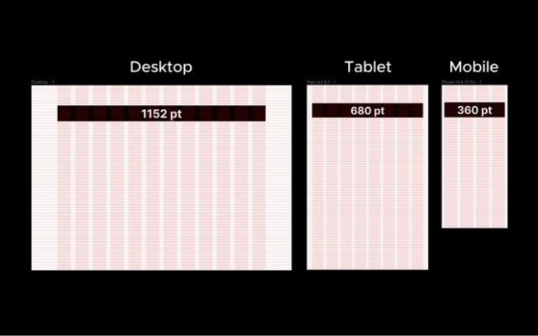
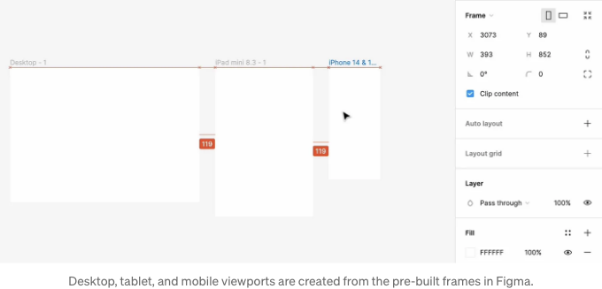
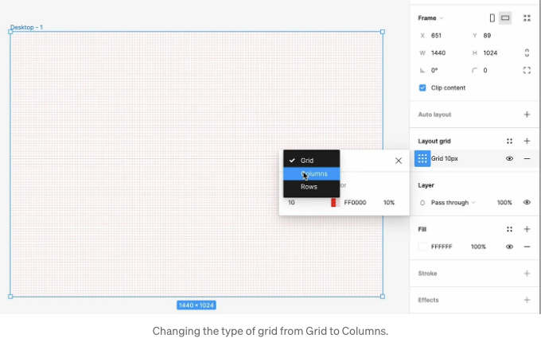
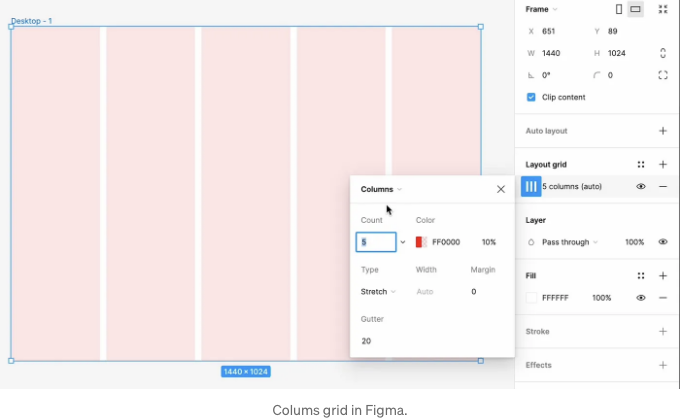
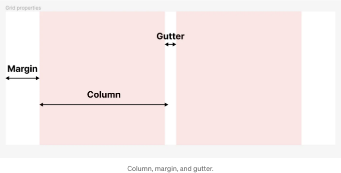
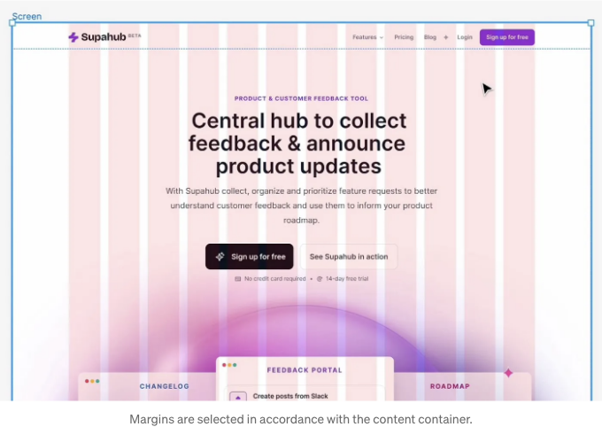
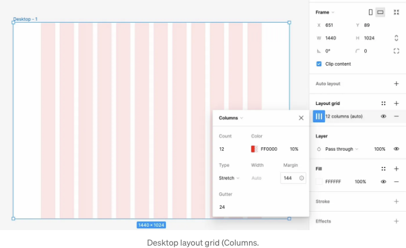
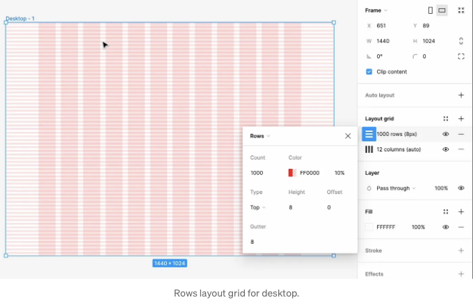
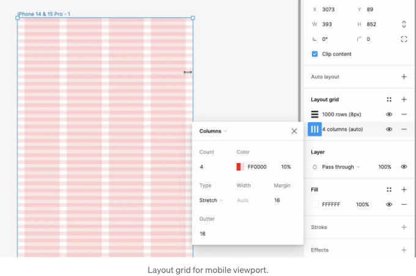

Figma를 사용하여 반응형 레이아웃 그리드를 디자인하는 것은 다양한 화면 크기에 매끄럽게 적응하는 디자인을 보장하는 강력한 방법입니다. Figma의 레이아웃 그리드를 활용하면, 일관된 크기 조정 가능한 디자인을 만들어 다양한 기기 화면에 쉽게 적응시킬 수 있습니다.

다음은 Figma에서 반응형 레이아웃 그리드를 생성하는 단계별 안내서입니다:

## 1. 데스크탑, 태블릿 및 모바일용 프레임 생성하기

<!-- ui-log 수평형 -->

<ins class="adsbygoogle"
      style="display:block"
      data-ad-client="ca-pub-4877378276818686"
      data-ad-slot="9743150776"
      data-ad-format="auto"
      data-full-width-responsive="true"></ins>
<component is="script">
(adsbygoogle = window.adsbygoogle || []).push({});
</component>

툴바에서 프레임 도구를 선택하거나 키보드에서 “F”를 누른 다음 캔버스를 클릭하여 프레임을 생성하세요. 프레임의 미리 설정된 크기를 선택하거나 사용자 정의 차원을 정의할 수 있어요. 첫 번째 옵션이 더 좋아요. 데스크탑을 위한 데스크톱 프레임, 태블릿을 위한 아이패드 미니, 그리고 모바일을 위한 아이폰 14 & 15 Pro 중에서 선택할 수 있어요.

## 2. 레이아웃 그리드 추가하기

프레임을 선택한 상태에서 오른쪽 패널에서 “디자인” 탭을 선택하세요. 여기에서 “레이아웃 그리드” 옵션을 볼 수 있어요. 새로운 그리드를 추가하려면 “+” 아이콘을 클릭하세요. Figma는 세 가지 유형의 그리드를 제공해요: 그리드 (기본값), 열, 행이 있어요.

<!-- ui-log 수평형 -->

<ins class="adsbygoogle"
      style="display:block"
      data-ad-client="ca-pub-4877378276818686"
      data-ad-slot="9743150776"
      data-ad-format="auto"
      data-full-width-responsive="true"></ins>
<component is="script">
(adsbygoogle = window.adsbygoogle || []).push({});
</component>

반응형 디자인을 위해서는 먼저 열 그리드를 생성해야 합니다. 레이아웃 그리드 설정을 클릭하세요. 그리고 드롭다운 메뉴에서 열을 선택하세요. 열 그리드는 UI 요소를 수평으로 정렬하는 데 사용됩니다. 그리드 시스템의 각 열은 정확히 동일한 크기입니다.

## 3. Columns 그리드 구성

<!-- ui-log 수평형 -->

<ins class="adsbygoogle"
      style="display:block"
      data-ad-client="ca-pub-4877378276818686"
      data-ad-slot="9743150776"
      data-ad-format="auto"
      data-full-width-responsive="true"></ins>
<component is="script">
(adsbygoogle = window.adsbygoogle || []).push({});
</component>

“열”을 선택한 후에는 그리드 설정을 구성할 수 있습니다. 주요 설정은 다음과 같습니다:

- 유형: 반응형 그리드를 만들고자 하는 경우, 열이 프레임을 채우도록 하려면 "Stretch"를 선택해야 합니다.
- 개수: 열의 수입니다. 데스크톱의 경우, 디자인 유연성을 위해 12열 그리드를 사용하는 것이 일반적입니다.
- 거터: 열 사이의 간격입니다. 이는 콘텐츠가 일관된 간격을 유지할 수 있도록 도와줍니다.
- 마진: 열과 프레임 가장자리 사이의 공간입니다.

8포인트 그리드를 만드는 경우, 거터에 대해 8로 나눌 수 있는 값으로 설정해야 합니다. 거터를 24로 설정하는 것을 권장드립니다.

<!-- ui-log 수평형 -->

<ins class="adsbygoogle"
      style="display:block"
      data-ad-client="ca-pub-4877378276818686"
      data-ad-slot="9743150776"
      data-ad-format="auto"
      data-full-width-responsive="true"></ins>
<component is="script">
(adsbygoogle = window.adsbygoogle || []).push({});
</component>

여백은 그리드 시스템의 오른쪽과 왼쪽에 있는 빈 영역입니다. 화면 가장자리까지 그리드를 항상 확장하길 원하지는 않을 수 있습니다. 그래서 여백을 설정하여 컨테이너에 얼마나 많은 빈 공간을 두고 싶은지를 지정할 수 있습니다. 여백에 관해선 일반적으로 여백의 크기는 컨테이너의 너비에 따라 선택됩니다.

모든 프로젝트는 다르며, 컨테이너의 크기를 정의하는 엄격한 규칙은 없습니다. 저는 일반적으로 데스크톱용 컨테이너 크기로 1152포인트를 사용합니다. 여백은 그에 따라 선택됩니다 - 제 경우에는 144포인트일 것입니다. 이 숫자는 어떻게 계산되었을까요? 뷰포트의 크기인 1440에서 컨테이너의 크기인 1152포인트를 뺀 다음 2로 나누어 계산했습니다.

<!-- ui-log 수평형 -->

<ins class="adsbygoogle"
      style="display:block"
      data-ad-client="ca-pub-4877378276818686"
      data-ad-slot="9743150776"
      data-ad-format="auto"
      data-full-width-responsive="true"></ins>
<component is="script">
(adsbygoogle = window.adsbygoogle || []).push({});
</component>

## 4. 행 그리드 만들기

수평 그리드를 작성한 후, 이제 수직 그리드를 만들어봅시다. 프레임을 선택하고 레이아웃 섹션에서 다시 플러스 버튼을 클릭합니다. 이번에는 설정을 "행"으로 변경합니다. 수평 그리드에서는 화면 상단에서 시작하려고 하므로 "Top" 유형을 선택하세요. 그리고 카운트 설정에 1000을 입력하세요. 이렇게 하면 모든 프레임을 행으로 채우게 됩니다. 오프셋은 0으로 설정해야 합니다. 왜냐하면 화면 상단부터 시작하기 때문입니다. 그리고 8포인트 그리드를 사용하므로 높이는 8로, 거터도 8로 설정합니다. 1000까지 세기 때문에 프레임의 높이를 변경해도 여전히 행을 볼 수 있습니다.

## 5. 태블릿 및 모바일 뷰포트에 그리드 시스템 복사하기

<!-- ui-log 수평형 -->

<ins class="adsbygoogle"
      style="display:block"
      data-ad-client="ca-pub-4877378276818686"
      data-ad-slot="9743150776"
      data-ad-format="auto"
      data-full-width-responsive="true"></ins>
<component is="script">
(adsbygoogle = window.adsbygoogle || []).push({});
</component>

데스크톱 그리드 작업이 끝나면 태블릿을 위한 그리드를 만들 차례에요. 처음부터 시작하고 싶지 않다면, 데스크톱용으로 만든 레이아웃 그리드를 태블릿 프레임에 그대로 복사하여 붙여 넣고, 수평 그리드의 값을 수정하면 돼요.

세로 그리드(행이 있는 그리드)는 모든 세 가지 뷰포트에서 동일할 것이기 때문에, 수평 그리드(열이 있는 그리드)만 수정할 거예요. 레이아웃 그리드 설정을 클릭하고 열을 8로 설정하세요. 태블릿에서는 작업 공간이 더 적으므로 일반적으로 열의 수를 줄이는데, 여분 여백은 32이고 거터는 16이 될 거예요.

마지막으로, 태블릿용 레이아웃 그리드를 모바일로 복사하여 붙여 넣을 수 있어요. 모바일에서는 열의 수를 4로 줄이면 될 거에요. 여분 여백은 16으로 설정하고, 거터도 16으로 맞출 거예요. 모바일에서의 최소 권장 여백 크기는 16이어야 하는데, 이는 콘텐츠 주변에 안전한 공간을 보장해줘요. 또한 16은 8포인트 그리드를 만드는 우리의 목표와 일치하도록 8로 나눌 수 있는 값이에요.

<!-- ui-log 수평형 -->

<ins class="adsbygoogle"
      style="display:block"
      data-ad-client="ca-pub-4877378276818686"
      data-ad-slot="9743150776"
      data-ad-format="auto"
      data-full-width-responsive="true"></ins>
<component is="script">
(adsbygoogle = window.adsbygoogle || []).push({});
</component>

# 프로덕트 디자인을 전문으로 하고 싶나요?

인터랙션 디자인 패키지를 시도해보세요. 이 패키지는 제품 디자인의 전반적인 스펙트럼을 다루는 온라인 디자인 강좌를 제공합니다. 기초부터 고급 수준까지 다양한 커리큘럼이 준비되어 있습니다.

이 글에는 제휴 링크가 포함되어 있습니다.
