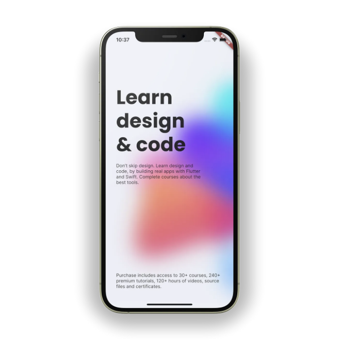
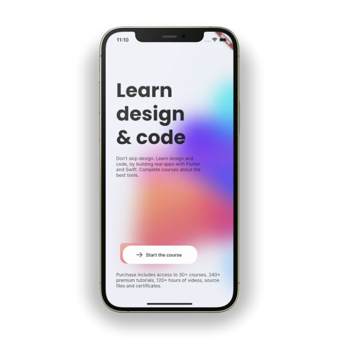
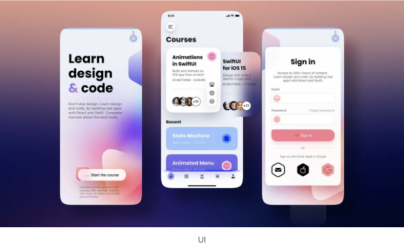

저희의 Rive와 Flutter를 활용한 애니메이션 앱 제작 튜토리얼 시리즈에 오신 것을 환영합니다! 이번 시리즈에서는 앱을 돋보이게 만들어줄 멋진 애니메이션을 만드는 데 중점을 두고 진행할 것입니다.


첫 번째 에피소드에서는 Flutter 프로젝트를 설정하고 Rive를 통합하는 방법부터 시작합니다. 그런 다음 Rive의 강력한 디자인 도구를 사용하여 모양을 활용한 아름다운 배경 애니메이션을 만들어볼 것입니다.

## 시작하기

<!-- ui-log 수평형 -->

<ins class="adsbygoogle"
      style="display:block"
      data-ad-client="ca-pub-4877378276818686"
      data-ad-slot="9743150776"
      data-ad-format="auto"
      data-full-width-responsive="true"></ins>
<component is="script">
(adsbygoogle = window.adsbygoogle || []).push({});
</component>

첫 번째 할 일은 GitHub에서 시작 프로젝트를 복제하는 것입니다. 이 프로젝트에는 앱 개발을 시작하는 데 필요한 모든 파일과 에셋이 포함되어 있습니다. 이 작업을 위해 제공된 링크(https://github.com/abuanwar072/Build-an-Animated-App-with-Rive-and-Flutter/tree/Starting)를 방문하면 됩니다. 프로젝트를 복제한 후에는 선호하는 코드 편집기에서 열고 다음 단계에 대비하세요.

프로젝트에는 프로젝트에 필요한 모든 에셋을 보유한 assets 디렉토리가 포함되어 있습니다. 이 디렉토리 안에는 시리즈에서 사용될 모든 Rive 애니메이션을 포함하는 RiveAssets라는 폴더도 있습니다.

## 애니메이션된 모양

이 프로젝트에서는 OnboardingScreen에서 작업을 시작할 것입니다.

<!-- ui-log 수평형 -->

<ins class="adsbygoogle"
      style="display:block"
      data-ad-client="ca-pub-4877378276818686"
      data-ad-slot="9743150776"
      data-ad-format="auto"
      data-full-width-responsive="true"></ins>
<component is="script">
(adsbygoogle = window.adsbygoogle || []).push({});
</component>

위 코드는 현재 lib/screens/onboarding/onboarding_screen.dart 파일에 위치한 빈 화면을 나타냅니다.

```js
Scaffold(
  body: Stack(
    children: [
      const RiveAnimation.asset("assets/RiveAssets/shapes.riv"),
    ],
  ),
)
```

위의 코드에서 Stack 위젯 내부에는 앱에서 사용할 Rive 애니메이션을 정의합니다. 앱에 Rive 애니메이션을 추가하는 것은 이미지를 추가하는 것과 유사합니다. 자산의 위치를 정의하기만 하면 됩니다.

<!-- ui-log 수평형 -->

<ins class="adsbygoogle"
      style="display:block"
      data-ad-client="ca-pub-4877378276818686"
      data-ad-slot="9743150776"
      data-ad-format="auto"
      data-full-width-responsive="true"></ins>
<component is="script">
(adsbygoogle = window.adsbygoogle || []).push({});
</component>


## 블러 추가

이제 애니메이션에 블러를 추가할 시간입니다. 이를 위해 BackdropFilter 위젯을 사용하고 RiveAnimation 위젯 뒤에 정의해야 합니다. 블러량을 조절하기 위해 sigmaX 및 sigmaY 속성을 사용하여 수평 및 수직 방향의 가우시안 블러의 표준 편차를 지정할 수 있습니다. 이러한 값들을 조절하여 블러 효과의 강도를 미세 조정하고 원하는 시각적 효과를 만들 수 있습니다.

```js
Positioned.fill(
  child: BackdropFilter(
    filter: ImageFilter.blur(sigmaX: 30, sigmaY: 30),
    child: const SizedBox(),
  ),
),
```

<!-- ui-log 수평형 -->

<ins class="adsbygoogle"
      style="display:block"
      data-ad-client="ca-pub-4877378276818686"
      data-ad-slot="9743150776"
      data-ad-format="auto"
      data-full-width-responsive="true"></ins>
<component is="script">
(adsbygoogle = window.adsbygoogle || []).push({});
</component>


애니메이션을 더욱 향상시키기 위해 이미지를 추가하고 추가적인 흐림 효과를 적용할 수 있습니다. 이를 위해 이미지와 흐림 효과를 Rive 애니메이션 위에 배치할 것입니다. 이렇게 함으로써 Rive 애니메이션을 이미지와 흐림 효과 위에 표시할 수 있습니다.

```js
Positioned(
  width: MediaQuery.of(context).size.width * 1.7,
  bottom: 200,
  left: 100,
  child: Image.asset("assets/Backgrounds/Spline.png"),
),
Positioned.fill(
  child: BackdropFilter(
    filter: ImageFilter.blur(sigmaX: 20, sigmaY: 10),
  ),
),
```

```


```

<!-- ui-log 수평형 -->

<ins class="adsbygoogle"
      style="display:block"
      data-ad-client="ca-pub-4877378276818686"
      data-ad-slot="9743150776"
      data-ad-format="auto"
      data-full-width-responsive="true"></ins>
<component is="script">
(adsbygoogle = window.adsbygoogle || []).push({});
</component>

## 온보딩 화면 UI

백그라운드 애니메이션을 완료했으니, 이제 온보딩 화면의 UI를 만들어 봅시다. 화면 상단에 큰 제목을 넣고, 몇 줄의 텍스트를 뒤이어 표시할 것입니다. 화면 하단에는 애니메이션 버튼을 배치하고, 몇 줄의 추가 텍스트가 더 있을 것입니다.

```js
SafeArea(
  child: Padding(
    padding: const EdgeInsets.symmetric(horizontal: 32),
    child: Column(
      crossAxisAlignment: CrossAxisAlignment.start,
      children: [
        const Spacer(),
        SizedBox(
          width: 260,
          child: Column(
            children: const [
              Text(
                "디자인과 코딩 배우기",
                style: TextStyle(
                  fontSize: 60,
                  fontFamily: "Poppins",
                  height: 1.2,
                ),
              ),
              SizedBox(height: 16),
              Text(
                "디자인을 건너뛰지 마세요. 플러터와 스위프트로 실제 앱을 만들면서 디자인과 코딩을 배우세요. 최고의 도구에 관한 강좌를 완료하세요.",
              ),
            ],
          ),
        ),
        const Spacer(flex: 2),

        // TODO: 애니메이션 버튼 추가

        const Padding(
          padding: EdgeInsets.symmetric(vertical: 24),
          child: Text(
            "구입하시면 30개 이상의 강좌, 240개 이상의 프리미엄 자습서, 120시간 이상의 비디오, 소스 파일 및 수료증에 접근할 수 있습니다.",
          ),
        ),
      ],
    ),
  ),
),
```



<!-- ui-log 수평형 -->

<ins class="adsbygoogle"
      style="display:block"
      data-ad-client="ca-pub-4877378276818686"
      data-ad-slot="9743150776"
      data-ad-format="auto"
      data-full-width-responsive="true"></ins>
<component is="script">
(adsbygoogle = window.adsbygoogle || []).push({});
</component>

## 애니메이션 버튼

저희 앱에서 사용할 버튼은 Rive를 사용하여 만들어졌어요. 사용자가 버튼을 탭하면 애니메이션이 시작되도록 원해요. 어떻게 Rive 에셋에 상호 작용성을 추가하여 이 효과를 달성할 수 있는지 보여드릴게요. 아래 코드로 애니메이션된 버튼을 추가하세요.

```js
GestureDetector(
  onTap: () {
    // TODO: 애니메이션 시작
  },
  child: SizedBox(
    height: 64,
    width: 260,
    child: Stack(
      children: [
        RiveAnimation.asset(
          "assets/RiveAssets/button.riv",
          // TODO: Rive 컨트롤러 추가
        ),
        Positioned.fill(
          top: 8,
          child: Row(
            mainAxisAlignment: MainAxisAlignment.center,
            children: const [
              Icon(CupertinoIcons.arrow_right),
              SizedBox(width: 8),
              Text(
                "코스 시작",
                style: TextStyle(fontWeight: FontWeight.w600),
              ),
            ],
          ),
        )
      ],
    ),
  ),
)
```

버튼의 아이콘과 텍스트를 중앙에 배치하기 위해 고정 크기와 Stack 위젯을 사용했어요. Stack 위젯을 사용하면 여러 자식을 하나의 컨테이너에 겹쳐 놓을 수 있어요.

<!-- ui-log 수평형 -->

<ins class="adsbygoogle"
      style="display:block"
      data-ad-client="ca-pub-4877378276818686"
      data-ad-slot="9743150776"
      data-ad-format="auto"
      data-full-width-responsive="true"></ins>
<component is="script">
(adsbygoogle = window.adsbygoogle || []).push({});
</component>



우리가 다루어야 할 한 가지 질문은 사용자가 버튼을 누르면 애니메이션을 어떻게 시작할지입니다. 이를 위해 우리는 RiveAnimationController를 사용해야 합니다. 이 컨트롤러를 사용하면 버튼에 상호 작용을 추가하고 애니메이션의 재생을 제어할 수 있습니다.

```js
late RiveAnimationController _btnAnimationColtroller;

@override
void initState() {
  _btnAnimationColtroller = OneShotAnimation(
    "active",
    autoplay: false,
  );
  super.initState();
}
```

Rive는 OneShot, Loop, PingPong 세 가지 유형의 애니메이션을 지원합니다. 저는 버튼 애니메이션이 OneShot 유형인 것을 고려하여 OneShotAnimation을 사용하고 있습니다. 이 유형은 애니메이션이 한 번 재생되고 멈추도록 허용합니다. 사용자 작업(예: 버튼 탭)으로 트리거되는 애니메이션에 유용합니다. 사용 중인 animationName인 "active"는 버튼.rive 파일에 정의된 애니메이션의 이름을 가리킵니다. 이 파일을 Rive에서 열면 idl과 active 두 가지 애니메이션이 있음을 알 수 있습니다. active 애니메이션에는 애니메이션의 모든 키프레임과 속성이 포함되어 있고 idl 애니메이션은 버튼의 기본 상태를 정의하는 데 사용되는 플레이스홀더입니다.

<!-- ui-log 수평형 -->

<ins class="adsbygoogle"
      style="display:block"
      data-ad-client="ca-pub-4877378276818686"
      data-ad-slot="9743150776"
      data-ad-format="auto"
      data-full-width-responsive="true"></ins>
<component is="script">
(adsbygoogle = window.adsbygoogle || []).push({});
</component>

자, 이제 버튼에 컨트롤러를 추가해 봅시다. 이 작업을 수행하려면 다음 코드로 TODO: Rive 컨트롤러 추가 부분을 대체하면 됩니다:

```js
controllers: [_btnAnimationColtroller];
```

사용자가 버튼을 탭할 때 애니메이션을 시작하려면 onTap 이벤트 핸들러에서 버튼 애니메이션을 true로 설정하면 됩니다. 이를 위해 TODO: 애니메이션 시작 부분을 다음 코드로 대체해 주세요:

```js
_btnAnimationController.isActive = true;
```

<!-- ui-log 수평형 -->

<ins class="adsbygoogle"
      style="display:block"
      data-ad-client="ca-pub-4877378276818686"
      data-ad-slot="9743150776"
      data-ad-format="auto"
      data-full-width-responsive="true"></ins>
<component is="script">
(adsbygoogle = window.adsbygoogle || []).push({});
</component>


온라인 스토어를 멋지게 만들고 싶나요? FlutterShop이 최고급 UI 킷으로 등장했습니다. FlutterShop을 사용하면 아름답고 직관적이며 프로페셔널한 등급의 전자 상거래 앱을 쉽게 만들 수 있습니다. 프로든 경험이 풍부한 개발자든 막 시작한 초보든, FlutterShop의 사용자 친화적인 디자인과 다양한 사용자 정의 옵션으로 성공적인 온라인 스토어를 만들기에 이상적인 선택입니다.

이번 에피소드에서는 Rive와 Flutter를 사용하여 시각적으로 매력적이고 상호작용적인 OnboardingScreen을 만드는 방법을 배웠습니다. 다음 에피소드에서는 로그인 모델과 사용자 정의 텍스트 필드를 만들어 앱을 계속 개발할 것입니다. 또한 앱이 로그인 중일 때 표시할 수 있는 로딩 애니메이션과, 오류가 발생하거나 로그인 성공 시 활성화되는 오류 및 성공 애니메이션도 만들 것입니다.


<!-- ui-log 수평형 -->

<ins class="adsbygoogle"
      style="display:block"
      data-ad-client="ca-pub-4877378276818686"
      data-ad-slot="9743150776"
      data-ad-format="auto"
      data-full-width-responsive="true"></ins>
<component is="script">
(adsbygoogle = window.adsbygoogle || []).push({});
</component>



이 튜토리얼에 대한 생각을 듣고 싶어요. 도움이 되었던 점이 무엇인지 궁금해요. 즐거우셨고 유용하게 느꼈다면 👏 클랩(clap) 한 번 눌러주세요. 여러분의 피드백은 저에게 중요하며, 여러분에게 가치 있는 콘텐츠를 제작할 수 있도록 도와줍니다. 이 튜토리얼을 읽어주셔서 감사합니다. Rive와 Flutter로 하는 애니메이션 여행에 도움이 되었기를 바라요.
