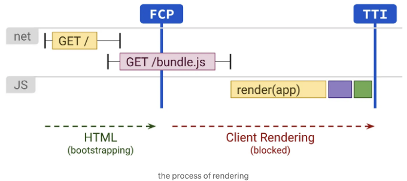
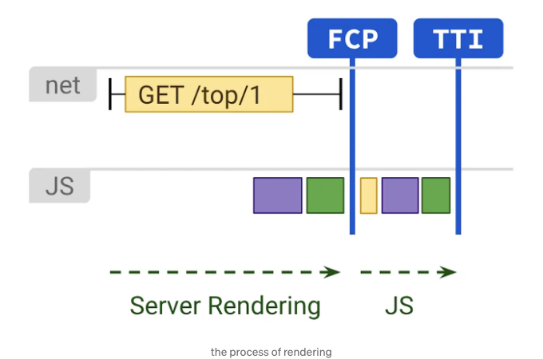
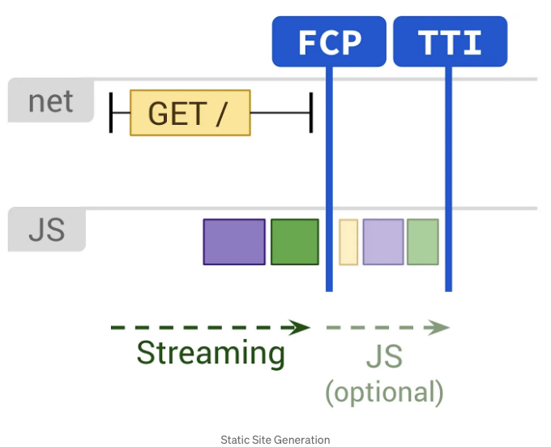
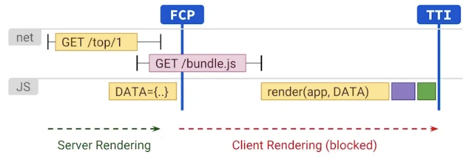
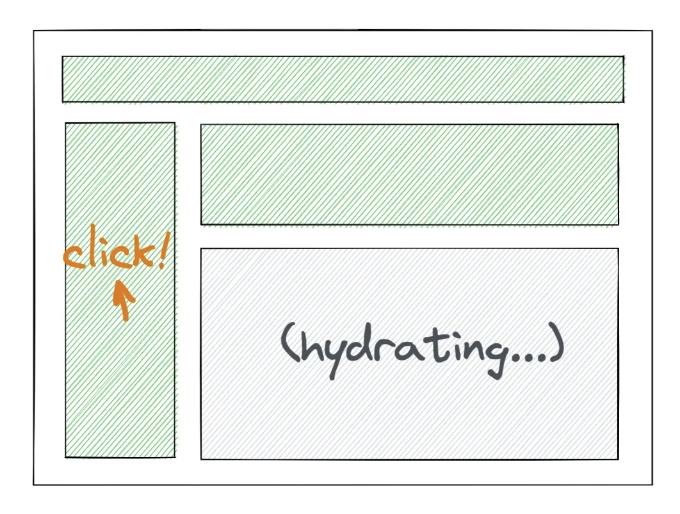
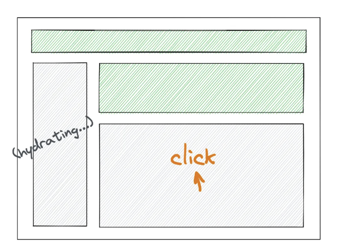

# 클라이언트 측 렌더링

CSR은 클라이언트 측 렌더링(Client Side Rendering)의 약자로, 브라우저에서 페이지를 렌더링하는 과정을 의미합니다.



브라우저는 먼저 페이지 HTML을 요청하고, 페이지 내의 자바스크립트 및 CSS와 같은 자원 파일을로드한 후, 브라우저에서 페이지 HTML의 계산 및 렌더링을 완료합니다. TTFB(Time To First Byte)를 최소화할 수 있지만, 클라이언트와 서버가 몇 번 상호작용할 것이기 때문에 (정적 자원 가져오기, 데이터 가져오기), js 다운로드 및 실행을 기다린 후 진행되어야 하는 차단 프로세스 때문에 사용자는 페이지 콘텐츠를 볼 수 있기 전에 렌더링이 완료되기를 기다려야 하므로 FP, FCP 시간이 더 오래 걸릴 것입니다. SPA 페이지의 경우, 사전 렌더링, 코드 분할, 지연 로딩 등을 통해 최적화할 수 있습니다.

TTFB: Time To First Byte, 페이지 요청을 보내서 응답 데이터의 첫 번째 바이트를 받는 데 걸리는 밀리초 수입니다.
FP: First Paint — 사용자가 콘텐츠의 픽셀을 처음으로 볼 때
FCP: First Contentful Paint — 사용자가 콘텐츠를 처음으로 볼 때

그러나 클라이언트 측 로직이 더 복잡해지고 초기화에 더 많은 JS가 실행되어야 하는 경우, 첫 화면 성능이 점차 느려지며, 이로 인해 더 많은 렌더링 패턴을 탐색해야 합니다.

<!-- ui-log 수평형 -->

<ins class="adsbygoogle"
      style="display:block"
      data-ad-client="ca-pub-4877378276818686"
      data-ad-slot="9743150776"
      data-ad-format="auto"
      data-full-width-responsive="true"></ins>
<component is="script">
(adsbygoogle = window.adsbygoogle || []).push({});
</component>

# 서버 렌더링

서버 렌더링은 페이지를 모두 서버 측에서 렌더링하는 과정을 의미합니다. (서버 측 렌더링과는 다릅니다.)



서버 렌더링의 장점은 페이지 템플릿, 데이터 미리 가져오기 및 채우기 등이 서버 측에서 처리되어 완성된 HTML 페이지가 반환되어 빈 페이지 대신에 제공된다는 것입니다. 이로 인해 데이터 가져오기 및 템플릿 렌더링을 위한 추가 클라이언트 측 시간이 없어지며 FP, FCP 및 TTI 시간을 개선할 수 있습니다. 이것은 텍스트와 링크만 있는 페이지의 경험에서 큰 개선을 가져다줍니다. 그러나 TTFB 시간은 서버 측에서 페이지를 생성하는 데 걸리는 시간으로 인해 증가합니다.
서버 렌더링의 단점은 동적 특성이 많은 계산 오버헤드 비용이 수반될 수 있다는 것입니다. React에서 renderToString()은 동기화되고 단일 스레드로 동작하므로 속도가 느릴 수 있습니다. 또한 동일한 애플리케이션을 클라이언트 측에서 한 번, 서버 측에서 한 번 처리/재구성하는 과정은 더 많은 작업을 도입합니다.

<!-- ui-log 수평형 -->

<ins class="adsbygoogle"
      style="display:block"
      data-ad-client="ca-pub-4877378276818686"
      data-ad-slot="9743150776"
      data-ad-format="auto"
      data-full-width-responsive="true"></ins>
<component is="script">
(adsbygoogle = window.adsbygoogle || []).push({});
</component>

# 정적 사이트 생성

정적 사이트 생성, 또는 정적 렌더링이라고도 불리는 것은 빌드 시간 이전에 컨텐츠 HTML을 미리 생성하는 렌더링 모델입니다. 이 렌더링 모드는 빌드 시간에 발생하며 클라이언트 측 JS가 제한적인 경우 빠른 FP, FCP 및 TTI 시간을 제공합니다. 서버 측 렌더링과 달리 정적 렌더링은 실시간 HTML 생성을 필요로하지 않으며 따라서 TTFB 시간을 개선할 수 있습니다. 일반적으로 정적 렌더링은 미리 다른 URL에 대한 다른 HTML 파일을 생성하고 CDN 캐싱의 도움을 받아 액세스를 가속화합니다.



사용자가 페이지를 방문할 때, 그 뒤의 워크플로우는 대략 다음과 같습니다:

1. 클라이언트에서 CDN에 해당 페이지의 HTML을 요청합니다.
2. CDN에 캐시가 있는 경우, 캐시된 컨텐츠가 직접 반환됩니다.
3. CDN에 캐시된 컨텐츠가 없거나 캐시가 유효하지 않은 경우, CDN은 비즈니스 서비스에서 컨텐츠를 가져옵니다. 비즈니스 서비스는 요청을 받아 서버 렌더링을 수행하고 새로운 페이지 컨텐츠를 생성하여 CDN에 반환한 후 사용자에게 결과를 반환하고 새로운 컨텐츠를 노드에 캐싱합니다.
4. 클라이언트가 HTML을 받아 페이지의 전체 정적 컨텐츠를 렌더링합니다. 필요한 경우 비즈니스 서버에서 개인화 또는 실시간 데이터를 가져와 페이지 컨텐츠를 동적으로 완성할 수도 있습니다.

<!-- ui-log 수평형 -->

<ins class="adsbygoogle"
      style="display:block"
      data-ad-client="ca-pub-4877378276818686"
      data-ad-slot="9743150776"
      data-ad-format="auto"
      data-full-width-responsive="true"></ins>
<component is="script">
(adsbygoogle = window.adsbygoogle || []).push({});
</component>

# 서버 측 렌더링

서버 측 렌더링은 서버 렌더링과 클라이언트 측 렌더링의 장단점을 결합한 것입니다. 사용자가 접근할 때 React SSR은 서버에서 React 컴포넌트를 미리 HTML로 렌더링하여 클라이언트에 보내어, 클라이언트가 자바스크립트 렌더링이 완료될 때까지 기본 정적 HTML 콘텐츠를 표시할 수 있게 합니다. 따라서 화이트 스크린을 기다리는 시간을 줄일 수 있습니다. 그런 다음 자바스크립트가 로드된 후, 클라이언트 측 렌더링을 사용하여 React 이벤트 로직을 기존 HTML 구성 요소에 바인딩하여 페이지를 "인터랙티브"하게 만들고, 하이드레이션이 완료된 이후에는 일반적인 React 애플리케이션으로 전환됩니다.



React SSR의 핵심은 이중성인데, 즉, 서버와 클라이언트 양쪽 로직을 구축하기 위해 하나의 코드 세트를 사용하여 최대한의 코드 재사용을 달성하고 두 개의 코드 세트를 유지할 필요가 없도록 하는 것입니다.

<!-- ui-log 수평형 -->

<ins class="adsbygoogle"
      style="display:block"
      data-ad-client="ca-pub-4877378276818686"
      data-ad-slot="9743150776"
      data-ad-format="auto"
      data-full-width-responsive="true"></ins>
<component is="script">
(adsbygoogle = window.adsbygoogle || []).push({});
</component>

● 라우팅 이중성: 양쪽 모두 동일한 라우팅 규칙 세트를 사용합니다. 클라이언트가 라우팅 규칙 표를 정의하고, 서버는 요청 URL을 통해 경로를 매치하여 렌더링해야 하는 구성 요소를 얻습니다.
● 데이터 이중성: 양쪽 모두 데이터 가져오기 명세를 정의합니다. (next.js를 예로 들면) 데이터 요청은 라이프사이클 메서드가 아닌 컴포넌트 정적 메서드 getInitialProps에 배치됩니다. 페이지가 초기화되고 로드될 때, 서버 측에서만 getInitialProps를 호출하여 이 컴포넌트에 필요한 데이터를 사전로드한 후 데이터를 컴포넌트로 전달합니다. 경로 전환 시 클라이언트 측에서 getInitialProps를 실행합니다.
● 렌더링 이중성: 데이터 주입/탈수화를 통해 서버 측과 브라우저 측에서 렌더링된 구성 요소는 동일한 프롭스와 DOM 구조를 갖게 되어, 구성 요소가 한 번만 렌더링되도록 보장합니다. 서버 측은 사전로드된 데이터를 브라우저(전역 변수)에 주입하여 브라우저 측에서 액세스할 수 있게 하며, 클라이언트 측은 ReactDOM.hydrate를 사용하여 데이터를 해당 컴포넌트로 주입합니다.

현재 SSR은 주로 다음 두 시나리오에서 사용됩니다:
● SEO 최적화, SSR은 검색 엔진이 전체 페이지 콘텐츠를 크롤링할 수 있도록 합니다.
● 첫 화면 렌더링 시간 최적화, 주로 모바일 및 약한 네트워크 상황에서 사용됩니다.

SSR에는 아래와 같은 단점이 있습니다:
● 서버는 매번 실시간으로 HTML을 생성해야 하며, 반환하기 전에 모든 구성 요소의 HTML을 준비해야 합니다. 구성 요소가 필요로 하는 데이터가 오래 걸리면 전체 HTML의 생성을 차단할 수 있습니다.

<!-- ui-log 수평형 -->

<ins class="adsbygoogle"
      style="display:block"
      data-ad-client="ca-pub-4877378276818686"
      data-ad-slot="9743150776"
      data-ad-format="auto"
      data-full-width-responsive="true"></ins>
<component is="script">
(adsbygoogle = window.adsbygoogle || []).push({});
</component>

- HTML 계산 생성은 서버 측에 위치하며, 서버 측의 부하 압력은 상대적으로 크고, 추가 기계 비용 및 운영 및 유지 보수 비용이 필요합니다.

- 수화 프로세스는 일회성(all or nothing)이며, 사용자는 모든 구성 요소의 JavaScript를 로드하고 수화가 완료될 때까지 어떤 구성 요소와 상호 작용할 수 있도록 기다려야 합니다. 렌더링 로직이 복잡할 경우 페이지의 FCP와 TTI 간 (입력 상자를 렌더링하지만 입력할 수 없음) 상호 작용이 짧은 시간 동안 발생할 수 있습니다.

# React18 Fizz

React 18의 새로운 SSR 아키텍처인 React Fizz는 스트리밍 HTML(스트리밍 렌더링) 및 선택적 수화 두 가지 주요 기능을 제공하며, SSR의 앞서 언급한 단점도 해결합니다. React 18은 일시적으로 lazy와 Suspense API의 기능을 확장하여 두 가지를 서버 측에서 직접 결합하여 사용합니다. 서버 측에서는 데이터를 스트림으로 반환하기 위해 renderToString 대신 renderToPipeableStream을 사용하고, 클라이언트 측에서는 스트림으로 반환되면 즉시 React 구성 요소 수화를 시작하기 위해 hydrateRoot를 사용하여 스트리밍 렌더링을 수행합니다.

<!-- ui-log 수평형 -->

<ins class="adsbygoogle"
      style="display:block"
      data-ad-client="ca-pub-4877378276818686"
      data-ad-slot="9743150776"
      data-ad-format="auto"
      data-full-width-responsive="true"></ins>
<component is="script">
(adsbygoogle = window.adsbygoogle || []).push({});
</component>

```js
import { Suspense, lazy } from "react";

const Comment = lazy(() => {
  return new Promise((resolve) => {
    fetchData().then(() => {
      resolve(import("./components/Content"));
    });
  });
});

function Homepage() {
  return (
    <div className="App">
      <Header></Header>
      <Suspense fallback={<Spinner />}>
        <Comment></Comment>
      </Suspense>
    </div>
  );
}

export default Homepage;
```

처음에는 준비가 안 된 Suspense된 콘텐츠 컴포넌트만 보여지며, 플레이스홀더 스피너만 반환됩니다. 각 Suspended 컴포넌트는 사용자에게 보이는 템플릿 플레이스홀더로 ID와 함께 주석을 달아서 전송된 상태 조각을 기록하며, 나중에 유효한 컴포넌트로 채워집니다. Suspense가 끝나면 준비된 콘텐츠 컴포넌트와 플레이스홀더를 대체하는 데 사용되는 스크립트가 계속 전달되어 브라우저가 "증분 렌더링"을 가능하게 합니다.

lazy와 Suspense를 지원하여 React SSR이 페이지의 이미 준비된 부분을 가능한 일찍 처리할 수 있게 해 주는 또 다른 기능은, 다른 부분에 차단당하지 않고 이미 동기적으로 로드할 필요가 없는 컴포넌트를 선택적으로 lazy와 Suspense로 감쌀 수 있다는 것입니다 (클라이언트 측 렌더링과 동일). React의 물줄기의 세분화는 Suspense의 범위에 따라 다르며, 각 Suspense 레이어는 물줄기의 "티어"입니다. 모든 컴포넌트가 물줄기를 수행하거나 수행하지 않는 것입니다.

그리고 React는 사용자 상호작용 클릭을 우선 순위 큐로 유지해 해당 컴포넌트의 물줄기 우선 처리를 기록하며, 물줄기가 완료되면 컴포넌트는 상호작용에 응답하여 이벤트를 재생합니다. (멋있죠!)



페이지가 완전히 수화되지 않았을 때 수화구 영역에서 발생한 클릭 이벤트는 브라우저가 Suspense 내용을 수화하는 동안 발생하는 미세한 간격에서 이벤트를 처리할 수 있습니다. 이를 통해 클릭은 즉시 처리되며 브라우저는 저렴한 장치에서 긴 수화 중에 느려지지 않습니다.```

<!-- ui-log 수평형 -->

<ins class="adsbygoogle"
      style="display:block"
      data-ad-client="ca-pub-4877378276818686"
      data-ad-slot="9743150776"
      data-ad-format="auto"
      data-full-width-responsive="true"></ins>
<component is="script">
(adsbygoogle = window.adsbygoogle || []).push({});
</component>



사이드바 하이드레이션 중에 React는 컨텐츠 영역에서 클릭이 발생할 때 기록하고, 컨텐츠를 더 긴급하게 하이드레이션하도록 우선순위를 정합니다. 컨텐츠 영역이 하이드레이션된 후에, React는 기록된 클릭을 "재생"하고 (다시 디스패치하여), 컴포넌트가 상호작용에 반응하도록 합니다. 그 다음에, React에 긴급한 작업이 없어졌기 때문에, React는 다시 사이드바를 하이드레이션할 것입니다.

하지만

React 18.0에서 SSR `Suspense`가 아직 데이터 요청 시 Suspense를 지원하지 않는다는 점을 언급해야 합니다. 이러한 기능은 18.x에서 react-fetch와 Server Component와 함께 출시될 수 있습니다. 우리는 현재 lazy에서 중단을 강제할 수밖에 없는데, 이는 서버 측과 클라이언트 측 코드의 이질성을 야기합니다. 서버 측은 요청 및 lazy가 감싸여야 하지만, 클라이언트는 동일한 래핑을 할 수 없습니다. 그렇지 않으면 코드 분할 파일도 fetch 이후에 로드될 때까지 기다려야 하며, 이는 성능 이슈가 발생할 수 있습니다.
따라서 React가 공식적으로 react-fetch를 출시하거나 커뮤니티에서 완전한 프레임워크 솔루션을 제공하기 전에, 두 단에서 데이터 이동성을 보장하기 위해 직접 데이터 검색에 관한 SSR 로직을 연구해야 합니다.

<!-- ui-log 수평형 -->

<ins class="adsbygoogle"
      style="display:block"
      data-ad-client="ca-pub-4877378276818686"
      data-ad-slot="9743150776"
      data-ad-format="auto"
      data-full-width-responsive="true"></ins>
<component is="script">
(adsbygoogle = window.adsbygoogle || []).push({});
</component>

# 결론

본 글에서는 일반적으로 사용되는 여러 웹 렌더링 방법을 간략히 소개했습니다. 각각의 장단점 및 비즈니스 특성을 종합적으로 고려하여 사용할 수 있습니다. 도움이 되었으면 좋겠습니다.
