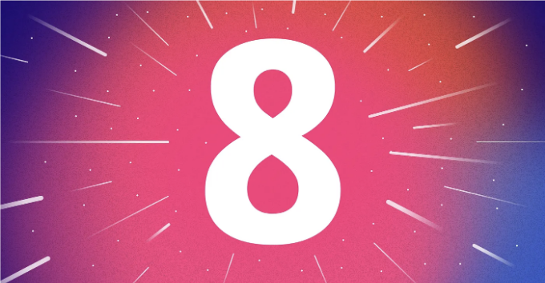
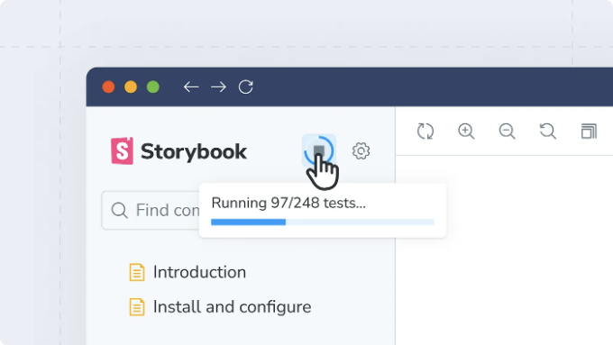
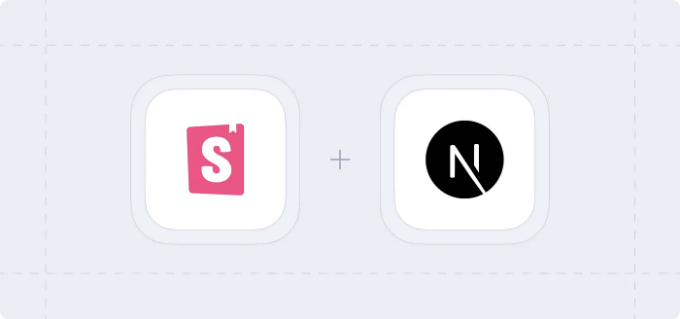
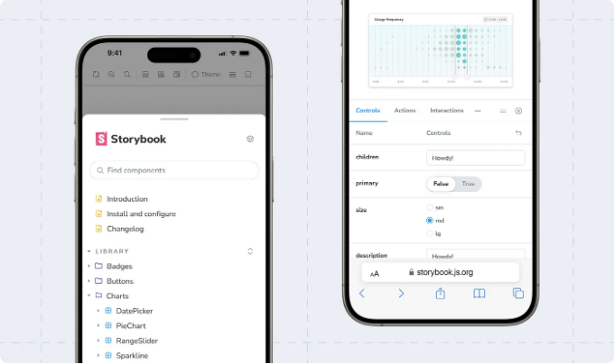
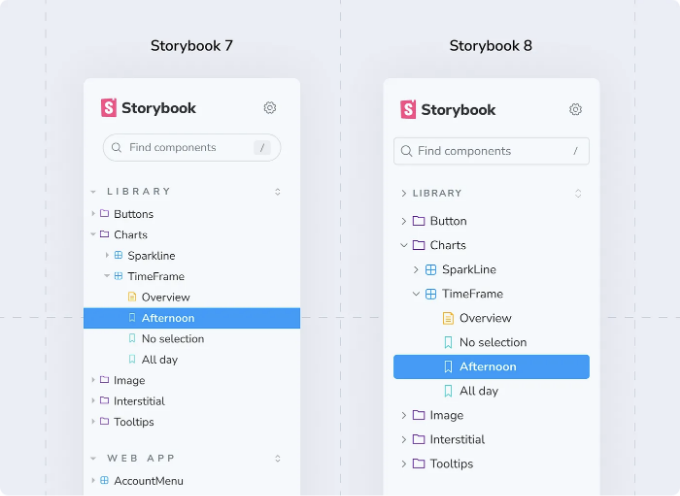
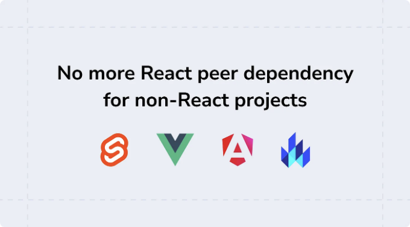
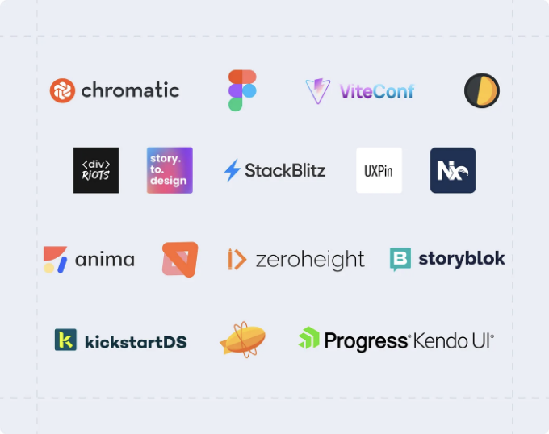

스토리북은 컴포넌트와 페이지를 구축하고 테스트하며 문서화하는 업계 표준 UI 도구입니다. 수천 개의 팀에서 사용되며, 모든 주요 JavaScript 프레임워크와 통합되어 있으며 대부분의 주요 디자인 및 개발 도구와 결합됩니다.

오늘, 저는 스토리북 8 버전을 발표하는 것을 기쁘게 생각합니다! 스토리북의 최신 버전은 218명의 기여자로부터의 773개 PR을 통해 8,865개의 커밋을 결합했습니다. 이 변경 사항에는 스토리북의 테스트 및 문서화 기능 세트에 대한 주요 개선 사항이 포함되어 있으며 React, Vue, Angular, 웹 컴포넌트, Svelte 등을 통한 프레임워크 호환성 및 사용자 경험을 강화했습니다. 다음은 릴리스의 주요 내용을 발견할 수 있는 하이라이트입니다:

📸 내장된 시각적 테스트
⚛️ React Server Component 지원
🎛️ 업그레이드된 Vue 및 React 컨트롤 자동 생성
⚡️ 재설계된 Vite 지원, Vitest 테스트 및 Vite 5 지원
🧪 2~4배 빠른 테스트 빌드
✨ 새롭게 디자인된 데스크탑 UI
📲 재구성된 모바일 UX
🙅‍♀️ React 의존성 제거 (React 프로젝트가 아닌 경우)

<!-- ui-log 수평형 -->

<ins class="adsbygoogle"
      style="display:block"
      data-ad-client="ca-pub-4877378276818686"
      data-ad-slot="9743150776"
      data-ad-format="auto"
      data-full-width-responsive="true"></ins>
<component is="script">
(adsbygoogle = window.adsbygoogle || []).push({});
</component>

# 내장된 시각적 테스트

Storybook 8의 주요 기능은 새로운 Visual Tests 애드온입니다. 이 애드온을 사용하면 UI 버그를 이전보다 더 빠르고 쉽게 찾을 수 있습니다. 이 애드온은 Storybook 유지보수자들이 개발한 시각적 테스팅 클라우드 서비스인 Chromatic을 Storybook에 최초로 가져왔습니다.



버튼을 클릭하면 모든 스토리를 동시에 테스트하고, 각각을 이전 버전과 비교하여 시각적인 변경 사항을 정확하게 파악할 수 있습니다. 그러고 나서 Storybook 사이드바를 필터링하여 시각적 차이가 있는 스토리만 표시하고 해당 변경 사항을 하나씩 확인할 수 있습니다.

<!-- ui-log 수평형 -->

<ins class="adsbygoogle"
      style="display:block"
      data-ad-client="ca-pub-4877378276818686"
      data-ad-slot="9743150776"
      data-ad-format="auto"
      data-full-width-responsive="true"></ins>
<component is="script">
(adsbygoogle = window.adsbygoogle || []).push({});
</component>

이 프로세스는 Chromatic의 CI 워크플로를 반영하지만, 이제는 PR을 제출하거나 심지어 변경 사항을 커밋할 필요 없이 Storybook 내에서 모두 직접 작업할 수 있습니다!

시각적 테스트는 슈퍼파워이며, Visual Tests 애드온을 통해 이전보다 더 쉽게 접근할 수 있습니다.

# React Server Component (RSC) 지원

React Server Components는 React에 대한 패러다임 변화로, 컴포넌트가 전적으로 서버에서 렌더링됩니다. 우리는 React 코어 팀의 RSC 탐색 및 RSC 앱 개발을 이끄는 Next.js의 친구들을 밀접히 지켜보고 있습니다.

<!-- ui-log 수평형 -->

<ins class="adsbygoogle"
      style="display:block"
      data-ad-client="ca-pub-4877378276818686"
      data-ad-slot="9743150776"
      data-ad-format="auto"
      data-full-width-responsive="true"></ins>
<component is="script">
(adsbygoogle = window.adsbygoogle || []).push({});
</component>

Storybook 7가 출시된 이후, Storybook의 RSC 지원이 언제 도입될지에 대한 많은 질문을 받았어요. 사실, 이는 우리의 가장 인기 있는 GitHub 이슈 중 하나예요.

Storybook 8는 여러분의 요청에 응답하여, 첫 번째 실험적인 React Server Components 지원을 소개했어요. 지금은 Next.js와만 호환되는 실험적인 RSC 솔루션으로 분류되고 있어요. 앞으로도 계속해서 이 기능을 더 확장해 나갈 거예요.



Storybook 8의 실험적인 RSC 지원에 대해 자세히 알아보려면, Next.js, Mock Service Worker 및 Storybook 8로 RSC 앱을 만드는 방법을 확인해보세요. 우리는 최상의 방법을 개선하는 동안 더 많은 정보를 공유할 계획이에요.

<!-- ui-log 수평형 -->

<ins class="adsbygoogle"
      style="display:block"
      data-ad-client="ca-pub-4877378276818686"
      data-ad-slot="9743150776"
      data-ad-format="auto"
      data-full-width-responsive="true"></ins>
<component is="script">
(adsbygoogle = window.adsbygoogle || []).push({});
</component>

# 개선된 React 및 Vue 컨트롤 자동 생성

Storybook의 대표적인 기능 중 하나는 컴포넌트 입력을 상호작용적으로 수정하여 새로운 컴포넌트 상태를 탐색할 수 있는 자동으로 생성된 UI 컨트롤입니다.

React 및 Vue 프로젝트에서, Storybook 8은 컨트롤 자동 생성에 대한 주요 개선을 소개합니다. 이를 위해 사용하는 라이브러리(문서 생성기로도 알려짐)를 업그레이드했습니다.

React 사용자들을 위해, Storybook 8은 훨씬 빠른 문서 생성 라이브러리인 react-docgen으로 전환했습니다. 현재의 TypeScript 기반 솔루션과는 달리, react-docgen은 훨씬 빠르고 대부분의 컴포넌트에 대해 충분히 좋은 얕은 분석 결과를 생성합니다. 당사의 테스트에서는 react-docgen을 사용하면 React Storybook의 시작 속도가 최대 50% 빨라졌습니다. TypeScript 솔루션 전체는 여전히 필요한 사용자를 위해 대체 솔루션으로 사용할 수 있습니다. 자세한 내용은 React 문서 생성기 문서에서 확인하세요.

<!-- ui-log 수평형 -->

<ins class="adsbygoogle"
      style="display:block"
      data-ad-client="ca-pub-4877378276818686"
      data-ad-slot="9743150776"
      data-ad-format="auto"
      data-full-width-responsive="true"></ins>
<component is="script">
(adsbygoogle = window.adsbygoogle || []).push({});
</component>

Vue 사용자를 위한 Storybook 8은 공식 Vue docgen 패키지인 vue-component-meta를 지원합니다. 이 패키지는 Volar에 의해 구동되며, 이를 공식 Vue VSCode 플러그인으로 인식할 수 있습니다. vue-component-meta로 업그레이드하면 Storybook이 유형을 처리하는 방법과 컨트롤을 자동 생성하는 능력이 향상됩니다. Storybook 8의 Vue 변경 사항에 대해 더 알아보려면 Vue docgen 발표문이나 Vue docgen 문서를 확인해주세요.

# 재설계된 Vite 지원, Vitest 기반의 테스트 프레임워크 및 Vite 5 호환성

Storybook 7의 가장 큰 성과 중 하나는 Storybook의 제로 구성 Vite 지원을 소개한 것입니다.

그 이후로 Vite 사용량이 계속해서 급증하고 있습니다. 오늘날 Vite는 새 Storybook 프로젝트의 거의 절반을 차지하고 있습니다. 그에 따라, 우리는 Vite 통합을 계속해서 강화하고 개선해왔습니다.

<!-- ui-log 수평형 -->

<ins class="adsbygoogle"
      style="display:block"
      data-ad-client="ca-pub-4877378276818686"
      data-ad-slot="9743150776"
      data-ad-format="auto"
      data-full-width-responsive="true"></ins>
<component is="script">
(adsbygoogle = window.adsbygoogle || []).push({});
</component>

우선, Storybook 8은 Vite 5를 지원하는 기능을 추가했어요. Vite 5는 Vite의 최신 버전이에요. Vite 5 지원을 소개하면서, 우리는 Storybook이 대신 설정하는 부분이 너무 많다는 것을 깨달았어요. 그래서 다른 Vite 버전을 지원하는 것이 어려웠어요. 따라서 Storybook 8은 plugin-react, plugin-vue와 같은 Vite 플러그인을 구성하는 데 더 많은 제어권을 주고, 이러한 종속성을 Storybook 외부로 옮깁니다. 거의 모든 Vite 프로젝트에는 이러한 플러그인이 미리 구성되어 있는데, 비표준적인 작업을 하지 않는 한 별도의 변경이 필요하지 않을 거에요!

또한, Storybook 8은 우리의 새로운 프레임워크인 @storybook/test의 일부로 Vite의 테스트 패키지인 Vitest를 통합했어요. 이 새로운 테스트 프레임워크는 두 이전 패키지인 @storybook/jest와 @storybook/testing-library를 대체하며, Vitest의 spy와 expect를 사용할 수 있게 해주며, 더 작은 설치 크기를 갖고 있어요. Storybook 8의 테스트 개선에 대해 더 알아보세요.

# 테스트 빌드 속도 2–4배 빨라짐

Storybook 8은 새로운 "테스트 모드"를 도입하여, Storybook의 정적 빌드를 2~4배 빠르게 만들어줘요.

<!-- ui-log 수평형 -->

<ins class="adsbygoogle"
      style="display:block"
      data-ad-client="ca-pub-4877378276818686"
      data-ad-slot="9743150776"
      data-ad-format="auto"
      data-full-width-responsive="true"></ins>
<component is="script">
(adsbygoogle = window.adsbygoogle || []).push({});
</component>

Storybook을 테스트 도구로 사용할 때 Storybook의 문서 작성 또는 자동 생성된 컨트롤과 같은 기능이 필요하지 않을 수 있다는 것을 관찰했습니다.

따라서 Storybook 8은 새로운 --test CLI 플래그를 제공하여 Storybook의 표준 기능을 비활성화하는 간소화된 테스트 워크플로우를 제공합니다. 이 플래그를 사용하면 빌드 시간이 크게 단축되고 더 작은 빌드 출력이 생성됩니다. 앞으로도 각 릴리스에서 새로운 최적화 가능성을 계속해서 탐색할 것입니다!

# 업데이트된 모바일 및 데스크탑 UI

Storybook 8의 UI는 다양한 세련됨과 연마를 가져와서 디자인 감각이 예민하신 분이라면 이 변경 사항을 좋아하실 것으로 생각합니다.

<!-- ui-log 수평형 -->

<ins class="adsbygoogle"
      style="display:block"
      data-ad-client="ca-pub-4877378276818686"
      data-ad-slot="9743150776"
      data-ad-format="auto"
      data-full-width-responsive="true"></ins>
<component is="script">
(adsbygoogle = window.adsbygoogle || []).push({});
</component>

Storybook의 모바일 UI를 완전히 새롭게 개조했습니다. 이제 내비게이션 사이드바와 애드온 패널이 페이지 아래에서 스프링업되어 휴대전화에서 엄지손가락으로 쉽게 활성화할 수 있습니다. 이전 버전과는 달리, 이러한 패널은 Storybook의 주요 "캔버스" 영역과 우아하게 공존합니다.



또한, 데스크탑 UI를 다시 설계하여 오랜 기간 동안 존재해온 응닑성 버그를 수정했습니다. 브라우저가 데스크탑과 모바일 상태 사이에서 크기를 조정할 때 이전 스토리들이 다시 재부팅되는 문제를 Storybook 8에서 부드럽고 맛있는 전환으로 해결했으며, 업데이티된 타이포그래피와 새로운 아이콘 세트로 완성되었습니다.



<!-- ui-log 수평형 -->

<ins class="adsbygoogle"
      style="display:block"
      data-ad-client="ca-pub-4877378276818686"
      data-ad-slot="9743150776"
      data-ad-format="auto"
      data-full-width-responsive="true"></ins>
<component is="script">
(adsbygoogle = window.adsbygoogle || []).push({});
</component>

# 비-React 프로젝트에서 더 이상 React 요구 사항 없음

Storybook 7에서 우리는 모든 프레임워크 프로젝트에 대한 React를 동료 종속성으로 만들기로 힘든 결정을 내렸습니다. 이 변경으로 Storybook이 pnpm 및 다른 최신 패키지 관리자와 호환되었지만, 비-React 사용자에게는 씁쓸한 결정이었습니다.

다행히, 그 이후에 의존성 처리와 패키지 미리 번들링에 대해 많은 것을 배웠으며(감사 tsup!), Storybook 8은 이제 비-React Storybooks를 위한 React 동료 종속성을 제거했습니다. Storybook의 UI는 여전히 React로 작성되었지만, 이제 package.json에서 react 및 react-dom 종속성을 작별할 수 있습니다!



<!-- ui-log 수평형 -->

<ins class="adsbygoogle"
      style="display:block"
      data-ad-client="ca-pub-4877378276818686"
      data-ad-slot="9743150776"
      data-ad-format="auto"
      data-full-width-responsive="true"></ins>
<component is="script">
(adsbygoogle = window.adsbygoogle || []).push({});
</component>

# 프레임워크별 개선 사항

작년에 확대된 핵심 팀의 유지보수 노력 덕분에 스토리북은 오늘날 지금까지보다 더 빠르고 더 호환성이 뛰어나며 더 안정적입니다. 이것이 하이라이트입니다!

React: React에는 실험적인 React Server Component 지원과 자동으로 대화형 컨트롤을 생성하는 데 빠르한 기본값으로 사용되는 react-docgen이 포함됩니다.

Vue: Vue에는 최신 Vue 기능과 TypeScript 유형을 지원하는 Volar가 제공하는 자동 생성된 컨트롤이 포함되었습니다. 또한 문서에서 동적 소스 스니펫과 새로운 유지보수자인 Chakir와 Lars가 제공하는 다양한 버그 수정이 추가되었습니다.

<!-- ui-log 수평형 -->

<ins class="adsbygoogle"
      style="display:block"
      data-ad-client="ca-pub-4877378276818686"
      data-ad-slot="9743150776"
      data-ad-format="auto"
      data-full-width-responsive="true"></ins>
<component is="script">
(adsbygoogle = window.adsbygoogle || []).push({});
</component>

Angular: Angular은 Angular 16/17 지원, 중첩 모듈 메타데이터, 독립형 디렉티브, 쉽게 작성 가능한 스토리, 그리고 많은 버그 수정 사항을 제공합니다. 또한 앞으로의 버전에서 고성능 빌드 옵션을 지원하기 위해 Angular 코어 팀과 협력하고 있습니다.

Web Components: Storybook의 웹 컴포넌트 스토리는 Lit으로 작성되었으며 Lit3를 지원하도록 업데이트했습니다. 또한 자동 생성된 컨트롤과 동적으로 생성된 소스 코드 스니펫과 관련된 문제를 해결했습니다.

Svelte: Storybook의 Svelte 지원은 Storybook 코어 팀, Svelte 코어 팀 및 커뮤니티로부터 많은 사랑을 받았습니다. 주요 개선 사항으로 Svelte 5 (사전 릴리스) 지원, SvelteKit 페이지 및 네비게이션 모킹, 그리고 Storybook의 "네이티브" Svelte 스토리 형식에 대한 주요 수정/개선 사항이 포함되어 있습니다.

# 시작하기

<!-- ui-log 수평형 -->

<ins class="adsbygoogle"
      style="display:block"
      data-ad-client="ca-pub-4877378276818686"
      data-ad-slot="9743150776"
      data-ad-format="auto"
      data-full-width-responsive="true"></ins>
<component is="script">
(adsbygoogle = window.adsbygoogle || []).push({});
</component>

Storybook 8를 새로 설치하려면 다음을 실행하세요:

```js
npx storybook@latest init
```

기존의 Storybook을 Storybook 8로 업그레이드하려면 다음을 실행하세요:

```js
npx storybook@latest upgrade
```

<!-- ui-log 수평형 -->

<ins class="adsbygoogle"
      style="display:block"
      data-ad-client="ca-pub-4877378276818686"
      data-ad-slot="9743150776"
      data-ad-format="auto"
      data-full-width-responsive="true"></ins>
<component is="script">
(adsbygoogle = window.adsbygoogle || []).push({});
</component>

Storybook 8의 출시를 축하합니다

Storybook 8로 업그레이드하는 데 도움이 필요하시면 Storybook 8 이전 가이드를 참조하여 Storybook 7에서 Storybook 8로 업그레이드하는 방법이나 Storybook 6에서 Storybook 8로 업그레이드하는 방법을 배울 수 있습니다. 또는 GitHub의 확장 Storybook 마이그레이션 가이드를 참고하세요.

Storybook 7와 Storybook 8 사이에서 전 세계 커뮤니티에서 GitHub 2023 글로벌 대단한 상을 수상한 Storybook은 동일한 정신으로 3월 28일 두 번의 밋업을 개최합니다. 현지 프론트엔드 시장에서 Storybook 8 출시를 축하하실 수 있습니다. 파리에서 함께하거나 뉴욕에서 함께하십시오!

또한, 전 세계 프론트엔드 생태계의 커뮤니티 론칭 파트너 모두에게 감사드립니다. Chromatic, Figma, ViteConf, Omlet, DivRiots, story.to.design, StackBlitz, UXpin, Nx, Mock Service Worker, Anima, Zeplin, zeroheight, Storyblok, kickstartDS, 그리고 Kendo UI에 감사드립니다.

<!-- ui-log 수평형 -->

<ins class="adsbygoogle"
      style="display:block"
      data-ad-client="ca-pub-4877378276818686"
      data-ad-slot="9743150776"
      data-ad-format="auto"
      data-full-width-responsive="true"></ins>
<component is="script">
(adsbygoogle = window.adsbygoogle || []).push({});
</component>



# 크레딧

# 핵심 팀

마이클 아레스타드, 얀 브라가, 조아우 카르도소, 마이클 찬, 톰 콜먼, 찰스 드 드뤼울, 놀베르트 드 랑겐, 숀 이브닝, 카일 가흐, 게르트 헨겔벨트, 돔 누예른, 발렌틴 파콰비크, 카스퍼 폴런, 차키르 카탭, 예페 라인홀드, 라스 리커트, 카이 뢰더, 마이클 실만 (저!), 조 바운, 바른 바카르, 이안 반 스쿠텐, 다니엘 윌리엄스, 조쉬 우딩, 그리고 바네사 유언

<!-- ui-log 수평형 -->

<ins class="adsbygoogle"
      style="display:block"
      data-ad-client="ca-pub-4877378276818686"
      data-ad-slot="9743150776"
      data-ad-format="auto"
      data-full-width-responsive="true"></ins>
<component is="script">
(adsbygoogle = window.adsbygoogle || []).push({});
</component>
