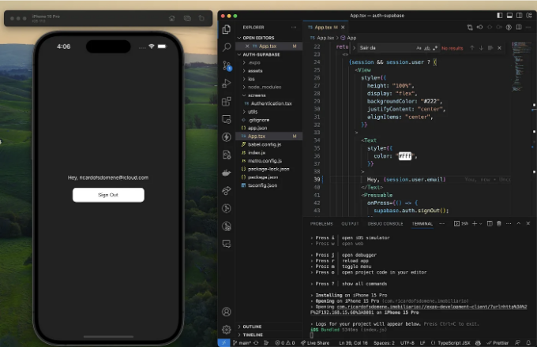

# 마무리

이 글에서는 Expo를 사용하여 React Native 앱에 Supabase 인증을 통합하는 과정을 살펴보겠습니다. 제공된 단계별 지침을 따르면 모바일 애플리케이션에 인증 기능을 쉽게 추가하여 보안 및 사용자 경험을 향상시킬 수 있습니다.

# 왜 Supabase가 좋은 선택인가?

<!-- ui-log 수평형 -->

<ins class="adsbygoogle"
      style="display:block"
      data-ad-client="ca-pub-4877378276818686"
      data-ad-slot="9743150776"
      data-ad-format="auto"
      data-full-width-responsive="true"></ins>
<component is="script">
(adsbygoogle = window.adsbygoogle || []).push({});
</component>

Supabase는 여러 가지 이유로 개발자들에게 강력한 도구로 두드러지는데요:

- 사용 편의성: Supabase는 사용자 친화적인 인터페이스와 간단한 설정 프로세스를 제공하여 초보자들에게도 쉽게 접근할 수 있습니다.
- 확장성: 어플리케이션이 성장함에 따라 Supabase는 성능을 희생하지 않고도 요구사항을 충족시키기 위해 손쉽게 확장될 수 있습니다.
- 실시간 기능: Supabase는 실시간 기능을 기본으로 제공하여 동적이고 인터랙티브한 어플리케이션을 구축할 수 있습니다.
- 오픈 소스: 오픈 소스인 Supabase는 투명성과 유연성을 제공하여 플랫폼을 사용자 정의하고 기여할 수 있도록 합니다.
- 포괄적인 문서: Supabase는 포괄적인 문서와 커뮤니티 지원을 제공하여 성공을 위해 필요한 모든 리소스를 확보할 수 있습니다.

Supabase를 인증 수단으로 선택함으로써 당신의 React Native 앱을 크게 향상시킬 수 있는 강력하고 확장 가능하며 개발자 친화적인 솔루션을 선택하게 됩니다.

먼저 이 인증 플로우를 복제하려면 Supabase 계정과 프로젝트가 필요합니다.

<!-- ui-log 수평형 -->

<ins class="adsbygoogle"
      style="display:block"
      data-ad-client="ca-pub-4877378276818686"
      data-ad-slot="9743150776"
      data-ad-format="auto"
      data-full-width-responsive="true"></ins>
<component is="script">
(adsbygoogle = window.adsbygoogle || []).push({});
</component>

React Native Expo 애플리케이션을 설정하려면 터미널(맥 또는 리눅스 사용자)이나 명령 프롬프트(윈도우 사용자)에서 다음 명령을 실행하세요.

참고: Node.js가 필요합니다.

```js
npx create-expo-app -t expo-template-blank-typescriptbash
```

이제 React Native Expo 애플리케이션이 준비되었습니다. 실행하려면 터미널에서 다음 명령을 실행하세요.

<!-- ui-log 수평형 -->

<ins class="adsbygoogle"
      style="display:block"
      data-ad-client="ca-pub-4877378276818686"
      data-ad-slot="9743150776"
      data-ad-format="auto"
      data-full-width-responsive="true"></ins>
<component is="script">
(adsbygoogle = window.adsbygoogle || []).push({});
</component>

```js
cd yourApplicationName && npx expo start
```

이제 애플리케이션이 실행 중입니다. 동일한 터미널에서 QR 코드를 스캔하여 전화기에서 테스트할 수 있습니다 (기기와 전화기가 동일한 네트워크에 연결된 경우에만 작동합니다). 또는 현재 사용 중인 OS에 따라 iOS 또는 Android 에뮬레이터에서 애플리케이션을 실행할 수도 있습니다.

이제 Supabase에서 필요한 종속성을 설치해 봅시다:

```js
npx expo install @supabase/supabase-js @react-native-async-storage/async-storage react-native-elements react-native-url-polyfill
```

<!-- ui-log 수평형 -->

<ins class="adsbygoogle"
      style="display:block"
      data-ad-client="ca-pub-4877378276818686"
      data-ad-slot="9743150776"
      data-ad-format="auto"
      data-full-width-responsive="true"></ins>
<component is="script">
(adsbygoogle = window.adsbygoogle || []).push({});
</component>

```js
import "react-native-url-polyfill/auto";
import AsyncStorage from "@react-native-async-storage/async-storage";
import { createClient } from "@supabase/supabase-js";

const supabaseUrl = "";
const supabaseAnonKey = "";

export const supabase = createClient(supabaseUrl, supabaseAnonKey, {
  auth: {
    storage: AsyncStorage,
    autoRefreshToken: true,
    persistSession: true,
    detectSessionInUrl: false,
  },
});
```

screens/Authentication.tsx

```js
import React, { useState } from "react";
import { Alert, StyleSheet, View, AppState } from "react-native";
import { Button, Input } from "react-native-elements";
import { supabase } from "../utils/supabase";

// Supabase Auth에서 세션을 자동으로 지속적으로 새로고침하도록 지시합니다.
// 앱이 활성 상태인 경우, 사용자의 세션이 종료되면 'onAuthStateChange' 이벤트를 계속
// 받게됩니다. 'TOKEN_REFRESHED' 또는 'SIGNED_OUT' 이벤트가 발생합니다.
// 이는 한 번만 등록해야 합니다.
AppState.addEventListener("change", (state) => {
  if (state === "active") {
    supabase.auth.startAutoRefresh();
  } else {
    supabase.auth.stopAutoRefresh();
  }
});

export default function Authentication() {
  const [email, setEmail] = useState("");
  const [password, setPassword] = useState("");
  const [loading, setLoading] = useState(false);

  async function signInWithEmail() {
    setLoading(true);
    const { error } = await supabase.auth.signInWithPassword({
      email: email,
      password: password,
    });

    console.log("에러", error);

    if (error) Alert.alert(error.message);
    setLoading(false);
  }

  async function signUpWithEmail() {
    setLoading(true);
    const {
      data: { session },
      error,
    } = await supabase.auth.signUp({
      email: email,
      password: password,
    });

    if (error) Alert.alert(error.message);
    if (!session) Alert.alert("이메일 인증을 위해 받은 메일함을 확인해주세요!");
    setLoading(false);
  }

  return (
    <View style={styles.container}>
      <View style={[styles.verticallySpaced, styles.mt20]}>
        <Input label="이메일" leftIcon={{ type: "font-awesome", name: "envelope" }} onChangeText={(text) => setEmail(text)} value={email} placeholder="email@address.com" autoCapitalize={"none"} />
      </View>
      <View style={styles.verticallySpaced}>
        <Input
          label="비밀번호"
          leftIcon={{ type: "font-awesome", name: "lock" }}
          onChangeText={(text) => setPassword(text)}
          value={password}
          secureTextEntry={true}
          placeholder="비밀번호"
          autoCapitalize={"none"}
        />
      </View>
      <View style={[styles.verticallySpaced, styles.mt20]}>
        <Button title="로그인" disabled={loading} onPress={() => signInWithEmail()} />
      </View>
      <View style={styles.verticallySpaced}>
        <Button title="가입하기" disabled={loading} onPress={() => signUpWithEmail()} />
      </View>
    </View>
  );
}

const styles = StyleSheet.create({
  container: {
    marginTop: 40,
    padding: 12,
  },
  verticallySpaced: {
    paddingTop: 4,
    paddingBottom: 4,
    alignSelf: "stretch",
  },
  mt20: {
    marginTop: 20,
  },
});
```

<!-- ui-log 수평형 -->

<ins class="adsbygoogle"
      style="display:block"
      data-ad-client="ca-pub-4877378276818686"
      data-ad-slot="9743150776"
      data-ad-format="auto"
      data-full-width-responsive="true"></ins>
<component is="script">
(adsbygoogle = window.adsbygoogle || []).push({});
</component>

App.tsx

```js
import { StatusBar } from "expo-status-bar";
import { Pressable, StyleSheet, Text, View } from "react-native";
import Home from "./screens/Authentication";
import { supabase } from "./utils/supabase";
import { useEffect, useState } from "react";
import { Session } from "@supabase/supabase-js";
import Authentication from "./screens/Authentication";

export default function App() {
  const [session, setSession] = (useState < Session) | (null > null);

  useEffect(() => {
    supabase.auth.getSession().then(({ data: { session } }) => {
      setSession(session);
    });

    supabase.auth.onAuthStateChange((_event, session) => {
      setSession(session);
    });
  }, []);

  return (
    <>
      {session && session.user ? (
        <View
          style={{
            height: "100%",
            display: "flex",
            backgroundColor: "#222",
            justifyContent: "center",
            alignItems: "center",
          }}
        >
          <Text
            style={{
              color: "#FFF",
            }}
          >
            Hey, {session.user.email}
          </Text>
          <Pressable
            onPress={() => {
              supabase.auth.signOut();
            }}
            style={{
              marginTop: 20,
              display: "flex",
              justifyContent: "center",
              alignItems: "center",
              height: 40,
              width: 200,
              backgroundColor: "#FFF",
              borderRadius: 10,
            }}
          >
            <Text
              style={{
                color: "#333",
              }}
            >
              Sign Out
            </Text>
          </Pressable>
        </View>
      ) : (
        <Authentication />
      )}
      <StatusBar style="light" />
    </>
  );
}

const styles = StyleSheet.create({
  container: {
    flex: 1,
    backgroundColor: "#fff",
    alignItems: "center",
    justifyContent: "center",
  },
});
```

초기 React Native Expo 앱에서 Supabase Authentication을 시작하는 데 도움이 되었기를 바래요! 코딩을 즐기세요! 칭찬해 주세요!
