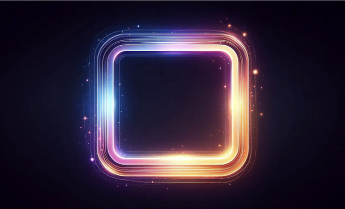
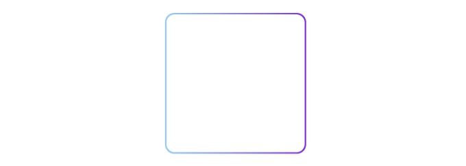
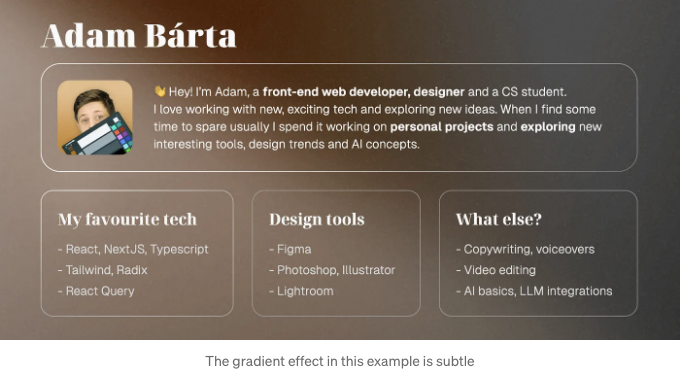

우리 모두가 CSS로 간단한 테두리를 만드는 방법을 알고 있지만, 여러분이 웹사이트를 빛낼 수 있는 추가적인 단계를 밟고 싶다면 어떻게 해야 할까요? 여러 방법이 있습니다.

## 1. 🔖 그라데이션 테두리

간단하지만 효과적입니다. 그라데이션 테두리는 JavaScript 없이도 사이트에 스타일을 추가할 수 있습니다. 이것을 만드는 여러 방법이 있습니다. 생소한 border-image 속성을 사용하거나 더 쉽게는 단순한 `background`를 사용할 수 있습니다.

<!-- ui-log 수평형 -->

<ins class="adsbygoogle"
      style="display:block"
      data-ad-client="ca-pub-4877378276818686"
      data-ad-slot="9743150776"
      data-ad-format="auto"
      data-full-width-responsive="true"></ins>
<component is="script">
(adsbygoogle = window.adsbygoogle || []).push({});
</component>

유일한 주의점은 두 개의 컨테이너를 서로 중첩해야 한다는 것입니다.



```js
.wrapper {
  height: 300px;
  width: 300px;
  padding: 3px;
  background: linear-gradient(to right, lightskyblue, blueviolet);
  border-radius: 20px;
}
.content {
  height: 100%;
  background-color: white;
  border-radius: 18px;
}
```

<!-- ui-log 수평형 -->

<ins class="adsbygoogle"
      style="display:block"
      data-ad-client="ca-pub-4877378276818686"
      data-ad-slot="9743150776"
      data-ad-format="auto"
      data-full-width-responsive="true"></ins>
<component is="script">
(adsbygoogle = window.adsbygoogle || []).push({});
</component>

# 2. 🔥 Border with reactive glow

더 나아가고 싶다면, 테두리가 사용자의 마우스 커서에 반응하는 것이 좋습니다. 불행하게도, 여기서는 HTML과 CSS만으로는 사용할 수 없어서 조금 더 복잡해집니다.

자바스크립트가 필요합니다. 두 개의 컨테이너를 중첩시킨 다음 각각에 마우스 커서를 따르는 블롭을 추가하면 시작할 수 있습니다.

# 3. 🎉 카드를 투명하게 만들기

<!-- ui-log 수평형 -->

<ins class="adsbygoogle"
      style="display:block"
      data-ad-client="ca-pub-4877378276818686"
      data-ad-slot="9743150776"
      data-ad-format="auto"
      data-full-width-responsive="true"></ins>
<component is="script">
(adsbygoogle = window.adsbygoogle || []).push({});
</component>

만약 우리가 진짜로 게임을 업하고 멋진 배경 위에 테두리 컨테이너를 표시하고 싶다면 어떻게 될까요?

그러나 여기서 문제가 발생합니다. 우리가 배경을 테두리로 사용하기 때문에 이를 제거하거나 투명하게 만들 수 없습니다. 따라서 우리의 배경 이미지가 보일 수밖에 없습니다. 그런데 우리는 어떻게 할까요?



## ✏️ 만약 SVG로 직접 테두리를 만들면 어떨까요?

<!-- ui-log 수평형 -->

<ins class="adsbygoogle"
      style="display:block"
      data-ad-client="ca-pub-4877378276818686"
      data-ad-slot="9743150776"
      data-ad-format="auto"
      data-full-width-responsive="true"></ins>
<component is="script">
(adsbygoogle = window.adsbygoogle || []).push({});
</component>

배경 요소와 컨테이너 중첩을 버리고 원하는 요소 주변에 SVG를 만들어보는 건 어때요?

처음에는 좀 복잡해 보일 수 있지만, 결과는 가치가 있어요. 이렇게 간단화된 코드를 확인해보세요:

```js
<div class="relative">
  <!-- 콘텐츠 크기를 기반으로 하고 테두리 너비로 오프셋을 조정합니다 -->
  <svg
      viewBox={`0 0 ${dimensions.width + 1} ${dimensions.height + 1}`}
      style={{
          pointerEvents: "none",
          position: "absolute",
          width: dimensions.width,
          height: dimensions.height,
      }}
  >
      <defs>
          <linearGradient
              id="borderGradient"
              x1="100%"
              y1="80%"
              x2="0%"
              y2="0%"
          >
              <stop
                  offset="0%"
                  style={{
                      stopColor: "#FFFFFF",
                      stopOpacity: 0.8,
                  }}
              />
              <stop
                  offset="100%"
                  style={{
                      stopColor: "#B0B0B0",
                      stopOpacity: 0.2,
                  }}
              />
          </linearGradient>
      </defs>
      <rect
          x="1"
          y="1"
          width={dimensions.width - 1}
          height={dimensions.height - 1}
          fill="none"
          strokeWidth="1"
          stroke="borderGradient"
      />
  </svg>
  <div class="content"></div>
</div>
```

## 🖱️ 마우스 효과 추가하기

<!-- ui-log 수평형 -->

<ins class="adsbygoogle"
      style="display:block"
      data-ad-client="ca-pub-4877378276818686"
      data-ad-slot="9743150776"
      data-ad-format="auto"
      data-full-width-responsive="true"></ins>
<component is="script">
(adsbygoogle = window.adsbygoogle || []).push({});
</component>

여기서 상황이 더 복잡해져서 현재로서는 깊게 파고들지 않겠습니다.

본질적으로 SVG에 다른 그래디언트를 추가하고 이를 마우스에 따라 움직이도록 만들어야 합니다 - 두 번째 예제와 같은 원리입니다.

그래디언트는 다음과 같이 보일 수 있습니다:

```js
<radialGradient
    id="radialGradient"
    cx="50%"
    cy="50%"
    r="80%"
    fx="50%"
    fy="50%"
>
    <stop
        offset="0%"
        style={
            stopColor: "#fff",
            stopOpacity: 1,
            transition: "stop-opacity 1s",
        }
    />
    <stop
        offset="100%"
        style={
            stopColor: "#fff",
            stopOpacity: 0,
            transition: "stop-opacity 1s",
        }
    />
</radialGradient>
```

<!-- ui-log 수평형 -->

<ins class="adsbygoogle"
      style="display:block"
      data-ad-client="ca-pub-4877378276818686"
      data-ad-slot="9743150776"
      data-ad-format="auto"
      data-full-width-responsive="true"></ins>
<component is="script">
(adsbygoogle = window.adsbygoogle || []).push({});
</component>
