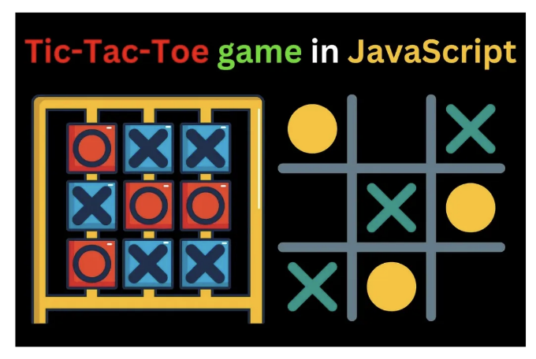
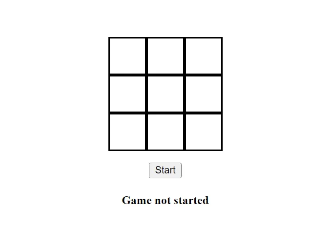

안녕하세요!!

모두가 학창 시절에 유명한 Tic-Tac-Toe 게임을 했을 것입니다. 그리고 오늘은 그것을 순수 자바스크립트(Vanilla JavaScript)를 사용하여 구현해 보려 합니다.

또한 이것은 제 친구 중 한 명이 머신 코딩 면접에서 물어본 질문이기도 했어요.

<!-- ui-log 수평형 -->

<ins class="adsbygoogle"
      style="display:block"
      data-ad-client="ca-pub-4877378276818686"
      data-ad-slot="9743150776"
      data-ad-format="auto"
      data-full-width-responsive="true"></ins>
<component is="script">
(adsbygoogle = window.adsbygoogle || []).push({});
</component>

동일한 작업을 계속하기 위해 3개의 파일이 필요합니다:

- HTML
- CSS (약간의 스타일링 추가를 위해)
- JavaScript 파일 (여기에 마법이 들어갑니다)

그러니 이제 코딩 부분으로 들어가 봅시다!!

- HTML 파일

<!-- ui-log 수평형 -->

<ins class="adsbygoogle"
      style="display:block"
      data-ad-client="ca-pub-4877378276818686"
      data-ad-slot="9743150776"
      data-ad-format="auto"
      data-full-width-responsive="true"></ins>
<component is="script">
(adsbygoogle = window.adsbygoogle || []).push({});
</component>

파일에서 각 상자에 아이디를 부여했고, 배열과 같이 행 및 열을 지정했습니다. 게임을 시작하는 시작 버튼과 게임 상태를 보여주는 메시지도 있습니다 (h4 태그).

```js
<!DOCTYPE html>
<head>
    <link href="game.css" rel="stylesheet" />
</head>
```

```js
<body>
    <div id="container">
        <div>
            <div class="box" id="1" data-row="1" data-col="1"></div>
            <div class="box" id="2" data-row="1" data-col="2"></div>
            <div class="box" id="3" data-row="1" data-col="3"></div>
        </div>
```

```js
<div>
  <div class="box" id="4" data-row="2" data-col="1"></div>
  <div class="box" id="5" data-row="2" data-col="2"></div>
  <div class="box" id="6" data-row="2" data-col="3"></div>
</div>
```

<!-- ui-log 수평형 -->

<ins class="adsbygoogle"
      style="display:block"
      data-ad-client="ca-pub-4877378276818686"
      data-ad-slot="9743150776"
      data-ad-format="auto"
      data-full-width-responsive="true"></ins>
<component is="script">
(adsbygoogle = window.adsbygoogle || []).push({});
</component>

```js
<div>
  <div class="box" id="7" data-row="3" data-col="1"></div>
  <div class="box" id="8" data-row="3" data-col="2"></div>
  <div class="box" id="9" data-row="3" data-col="3"></div>
</div>
```

```js
<button id="start-btn">시작</button>
<h4 id="game-status">게임이 시작되지 않았습니다</h4>
</div>
</body>
<script src="game.js"></script>
</html>
```

2. CSS

여기에는 기본적인 스타일이 구현되어 있습니다. 더 많은 스타일링을 추가하여 색상, 테두리 등을 변경하여 더 좋아 보이게 할 수 있습니다.```

<!-- ui-log 수평형 -->

<ins class="adsbygoogle"
      style="display:block"
      data-ad-client="ca-pub-4877378276818686"
      data-ad-slot="9743150776"
      data-ad-format="auto"
      data-full-width-responsive="true"></ins>
<component is="script">
(adsbygoogle = window.adsbygoogle || []).push({});
</component>

```css
body {
  display: flex;
  align-items: center;
  justify-content: center;
  height: 100vh;
}
```

```css
#container {
  display: flex;
  flex-direction: column;
  justify-content: center;
  align-items: center;
}
```

```css
.box {
  width: 3rem;
  aspect-ratio: 1;
  border: 2px solid black;
  display: flex;
  justify-content: center;
  align-items: center;
}
```

```css
#container > div {
  display: flex;
}
```

<!-- ui-log 수평형 -->

<ins class="adsbygoogle"
      style="display:block"
      data-ad-client="ca-pub-4877378276818686"
      data-ad-slot="9743150776"
      data-ad-format="auto"
      data-full-width-responsive="true"></ins>
<component is="script">
(adsbygoogle = window.adsbygoogle || []).push({});
</component>

```js
#start-btn {
  margin-top: 1rem;
}
```



이것이 브라우저에서 우리의 HTML 및 CSS 결과물이 보이는 방식입니다.

이제 로직 부분으로 넘어가 봅시다.

<!-- ui-log 수평형 -->

<ins class="adsbygoogle"
      style="display:block"
      data-ad-client="ca-pub-4877378276818686"
      data-ad-slot="9743150776"
      data-ad-format="auto"
      data-full-width-responsive="true"></ins>
<component is="script">
(adsbygoogle = window.adsbygoogle || []).push({});
</component>

3. 자바스크립트

게임이 동작하는 모든 곳입니다. 한 줄씩 살펴보시고 이해하기 쉽도록 최대한 간단하게 설명하겠습니다.

우선, 변수들을 정의했습니다.

boxes : HTML 요소들의 배열

<!-- ui-log 수평형 -->

<ins class="adsbygoogle"
      style="display:block"
      data-ad-client="ca-pub-4877378276818686"
      data-ad-slot="9743150776"
      data-ad-format="auto"
      data-full-width-responsive="true"></ins>
<component is="script">
(adsbygoogle = window.adsbygoogle || []).push({});
</component>

totalMovesMade: 플레이어 'x'와 플레이어 'y'의 움직임 수의 합입니다.

```js
const boxes = document.getElementsByClassName("box");
const size = 3; // 보드의 사이즈*size
let currentPlayer = "x";
let totalMovesMade = 0;
let isGameOver = false;
const msg = document.getElementById("game-status");
```

다른 변수들이 어떤 용도인지 쉽게 이해하실 수 있다고 생각해요 :)

이제 우리는 사이즈 = size\*size의 2차원 배열을 생성하고 null 값으로 초기화합니다. 이 배열은 각 플레이어의 움직임을 추적하며 승자를 확인하거나 게임이 비겼는지를 확인하는 데 사용될 것입니다.

<!-- ui-log 수평형 -->

<ins class="adsbygoogle"
      style="display:block"
      data-ad-client="ca-pub-4877378276818686"
      data-ad-slot="9743150776"
      data-ad-format="auto"
      data-full-width-responsive="true"></ins>
<component is="script">
(adsbygoogle = window.adsbygoogle || []).push({});
</component>

```js
let boardArr = Array(size)
  .fill()
  .map(() => Array(size).fill(null));
```

우리의 HTML에 "시작" 버튼이 있습니다. 이제 "click" 이벤트 리스너를 추가하고, 이를 통해 "startGame()" 함수를 호출할 겁니다.

```js
document.getElementById("start-btn").addEventListener("click", startGame);
```

```js
function startGame() {
  msg.textContent = "게임 진행 중...";
  document.getElementById("start-btn").disabled = true;
  for (let box of boxes) {
    box.addEventListener("click", (e) => {
      if (isGameOver) {
        alert("게임 오버!! 페이지를 새로고침하여 재시작할 수 있습니다.");
        return;
      }
```

<!-- ui-log 수평형 -->

<ins class="adsbygoogle"
      style="display:block"
      data-ad-client="ca-pub-4877378276818686"
      data-ad-slot="9743150776"
      data-ad-format="auto"
      data-full-width-responsive="true"></ins>
<component is="script">
(adsbygoogle = window.adsbygoogle || []).push({});
</component>

```js
const id = e.target.id; // 클릭한 상자의 id
const row = parseInt(e.target.dataset.row); // 플레이어가 클릭한 행
const col = parseInt(e.target.dataset.col); // 플레이어가 클릭한 열
```

```js
// 이미 해당 행과 열에 수를 두었는지 확인하고 이미 둬져 있으면 반환
if (boardArr[row - 1][col - 1] != null) return;
```

```js
makeMove(id, row, col);
updateBoardArray(row, col);
```

```js
if (totalMovesMade >= size * 2 - 1) checkIsGameOver(row, col);
```

<!-- ui-log 수평형 -->

<ins class="adsbygoogle"
      style="display:block"
      data-ad-client="ca-pub-4877378276818686"
      data-ad-slot="9743150776"
      data-ad-format="auto"
      data-full-width-responsive="true"></ins>
<component is="script">
(adsbygoogle = window.adsbygoogle || []).push({});
</component>

```js
// 선수 교체
      currentPlayer = currentPlayer == "x" ? "y" : "x";
    });
  }
}
```

버튼을 클릭하면 "startGame()"이 호출되고, 메시지가 "게임 진행 중..."으로 변경되며 "시작" 버튼이 비활성화됩니다.

함수 안에는 각 상자에 클릭 이벤트 리스너가 추가되었는데, 이는 함수를 2번째 인수로 전달하여 실행됩니다.

현재 플레이어가 상자 중 하나를 클릭하면 이 코드 블록이 실행됩니다. 여기서 makeMove(), updateBoard(), checkIsGameOver()와 같이 호출된 3개의 추가 함수를 볼 수 있습니다. 마지막에는 현재 플레이어를 토글합니다.```

<!-- ui-log 수평형 -->

<ins class="adsbygoogle"
      style="display:block"
      data-ad-client="ca-pub-4877378276818686"
      data-ad-slot="9743150776"
      data-ad-format="auto"
      data-full-width-responsive="true"></ins>
<component is="script">
(adsbygoogle = window.adsbygoogle || []).push({});
</component>

위 함수에서 볼 수 있듯이 코드 라인이 있습니다. 플레이어가 한 번 움직였을 때 우승자를 확인하는 것은 의미가 없습니다. 따라서 우승자를 확인하려면 적어도 (size\*2–1) 번의 움직임이 필요합니다. 저희의 경우 사이즈는 3이므로 총 5번 이상의 움직임이 필요합니다.

```js
if (totalMovesMade >= size * 2 - 1) checkIsGameOver(row, col);
```

"makeMove()" 함수는 해당 상자에 'x' 또는 'y'를 표시하고 총 움직인 횟수를 1 증가시킵니다.

```js
function makeMove(boxId) {
  boxes[boxId - 1].textContent = currentPlayer; // 상자에 x 또는 y를 입력합니다
  totalMovesMade += 1;
}
```

<!-- ui-log 수평형 -->

<ins class="adsbygoogle"
      style="display:block"
      data-ad-client="ca-pub-4877378276818686"
      data-ad-slot="9743150776"
      data-ad-format="auto"
      data-full-width-responsive="true"></ins>
<component is="script">
(adsbygoogle = window.adsbygoogle || []).push({});
</component>

"updateBoardArray()" 함수는 currentPlayer 변수가 보유한 값을 사용하여 배열을 업데이트합니다 (x 또는 y).

```js
function updateBoardArray(row, col) {
  boardArr[row - 1][col - 1] = currentPlayer; // 해당 row-col에 움직임이 있음을 나타내는 보드를 업데이트합니다
}
```

이제 승자를 확인하는 코드의 주요 로직을 진행하고 있습니다.

- 게임에서 승자는 간단한 규칙을 통해 결정될 수 있습니다. 특정 플레이어가 행, 열 또는 대각선 중 하나를 자신의 기호로 채웠다면 해당 플레이어가 승자가 됩니다. 따라서 움직임이 있는 셀의 행, 열 및 양 대각선을 횡단해야 합니다. 이를 위해 4개의 변수가 필요합니다.
- 플레이어가 필요로 하는 움직임 수는 보드 크기와 같아야 합니다. 우리의 경우 3입니다. 따라서 4개의 변수 중 어느 하나의 카운트가 크기 변수와 일치한다면 승자가 있고 게임이 종료됩니다.
- 마지막으로 전체 움직임이 크기인 3에 도달하면 게임이 비긴 것으로 간주됩니다.

<!-- ui-log 수평형 -->

<ins class="adsbygoogle"
      style="display:block"
      data-ad-client="ca-pub-4877378276818686"
      data-ad-slot="9743150776"
      data-ad-format="auto"
      data-full-width-responsive="true"></ins>
<component is="script">
(adsbygoogle = window.adsbygoogle || []).push({});
</component>

```js
function checkIsGameOver(row, col) {
```

```js
let horizontolCount = 0;
let verticalCount = 0;
let leftDiagonalCount = 0;
let rightDiagonalCount = 0;
```

```js
// 현재 플레이어의 이동을 수평, 수직 및 대각선으로 이동하며 계산합니다.
  for (let i = 0; i < size; i++) {
    if (boardArr[row - 1][i] == currentPlayer) horizontolCount += 1;
    if (boardArr[i][col - 1] == currentPlayer) verticalCount += 1;
```

```js
// row == col 일 때만 왼쪽 대각선을 확인합니다.
if (row == col) {
  if (boardArr[i][i] == currentPlayer) leftDiagonalCount += 1;
}
```

<!-- ui-log 수평형 -->

<ins class="adsbygoogle"
      style="display:block"
      data-ad-client="ca-pub-4877378276818686"
      data-ad-slot="9743150776"
      data-ad-format="auto"
      data-full-width-responsive="true"></ins>
<component is="script">
(adsbygoogle = window.adsbygoogle || []).push({});
</component>

```js
//rightDiagonalTraverse
if (boardArr[i][size - 1 - i] == currentPlayer) rightDiagonalCount += 1;
```

```js
const condition1 = horizontalCount == size || verticalCount == size;
const condition2 = leftDiagonalCount == size || rightDiagonalCount == size;
```

```js
if (condition1 || condition2) {
      msg.textContent = `Player ${currentPlayer} won!!`;
      isGameOver = true;
      return;
    }
  }
  if (totalMovesMade == size * size) msg.textContent = `Game draw!!`;
}
```

행복한 코딩 하세요!!

<!-- ui-log 수평형 -->

<ins class="adsbygoogle"
      style="display:block"
      data-ad-client="ca-pub-4877378276818686"
      data-ad-slot="9743150776"
      data-ad-format="auto"
      data-full-width-responsive="true"></ins>
<component is="script">
(adsbygoogle = window.adsbygoogle || []).push({});
</component>

감사합니다!! 좋아요와 댓글을 달아주시면 감사하겠어요.
