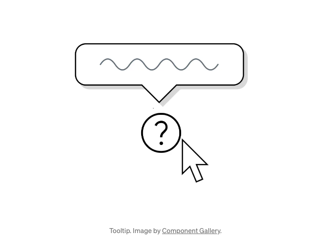

툴팁은 사용자가 아이콘 위에 마우스를 올릴 때 화면에 나타나는 설명 텍스트 상자입니다. 작은 크기임에도 불구하고, 툴팁은 훌륭한 사용자 경험을 만드는 데 중요한 역할을 합니다.

# 툴팁의 목적

툴팁은 사용자가 인터페이스를 탐색하는 동안 추가적인 맥락과 안내를 제공하기 위해 존재합니다. 툴팁은 다음과 같은 기능을 할 수 있습니다:

<!-- ui-log 수평형 -->

<ins class="adsbygoogle"
      style="display:block"
      data-ad-client="ca-pub-4877378276818686"
      data-ad-slot="9743150776"
      data-ad-format="auto"
      data-full-width-responsive="true"></ins>
<component is="script">
(adsbygoogle = window.adsbygoogle || []).push({});
</component>

## 생소한 아이콘, 필드 이름 또는 기능 설명

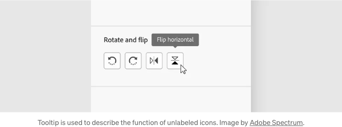

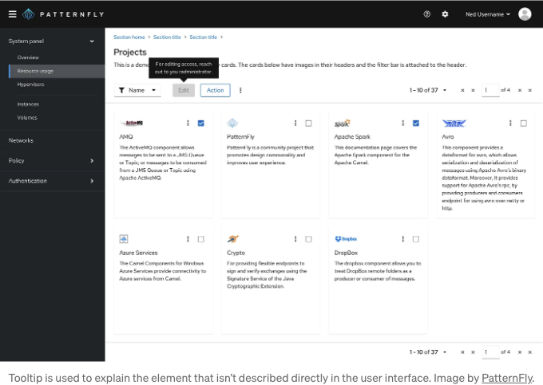

## 작업을 완료하는 방법에 대해서 지시하기

<!-- ui-log 수평형 -->

<ins class="adsbygoogle"
      style="display:block"
      data-ad-client="ca-pub-4877378276818686"
      data-ad-slot="9743150776"
      data-ad-format="auto"
      data-full-width-responsive="true"></ins>
<component is="script">
(adsbygoogle = window.adsbygoogle || []).push({});
</component>

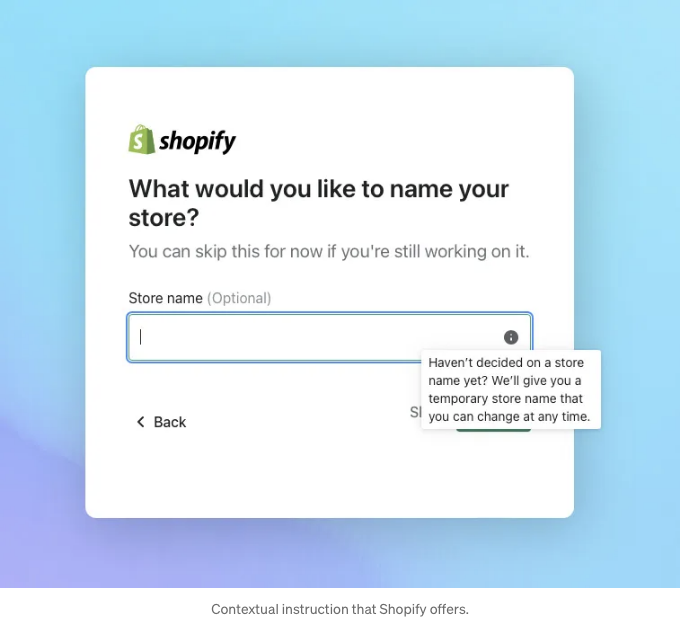

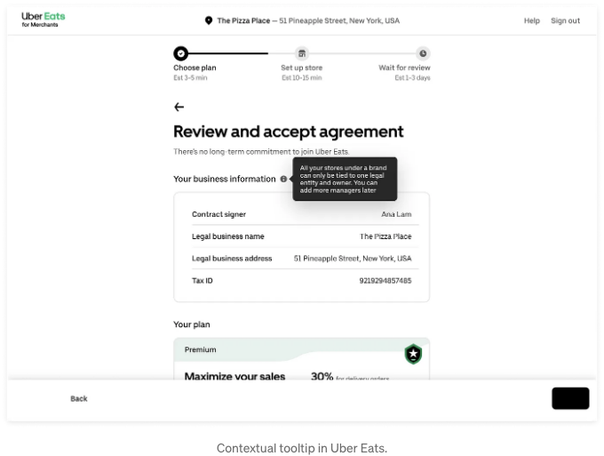

## 추가 도움이 되는 정보 제공

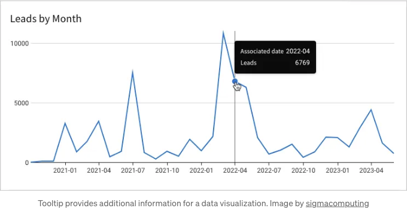

<!-- ui-log 수평형 -->

<ins class="adsbygoogle"
      style="display:block"
      data-ad-client="ca-pub-4877378276818686"
      data-ad-slot="9743150776"
      data-ad-format="auto"
      data-full-width-responsive="true"></ins>
<component is="script">
(adsbygoogle = window.adsbygoogle || []).push({});
</component>

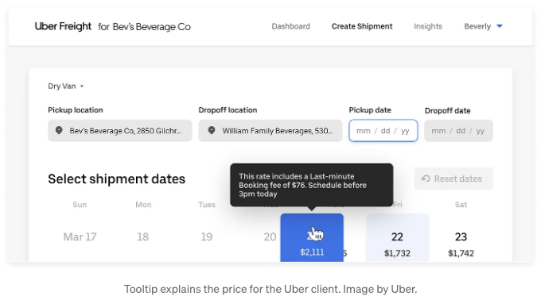

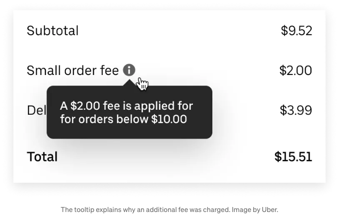

## 제품을 더 효과적으로 사용하는 방법에 대해 사용자에게 교육하기

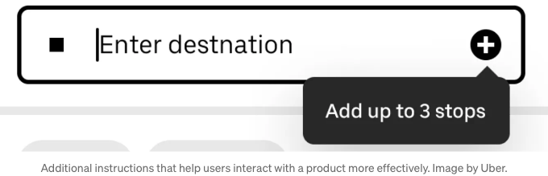

<!-- ui-log 수평형 -->

<ins class="adsbygoogle"
      style="display:block"
      data-ad-client="ca-pub-4877378276818686"
      data-ad-slot="9743150776"
      data-ad-format="auto"
      data-full-width-responsive="true"></ins>
<component is="script">
(adsbygoogle = window.adsbygoogle || []).push({});
</component>

## 사용자를 안심시키기

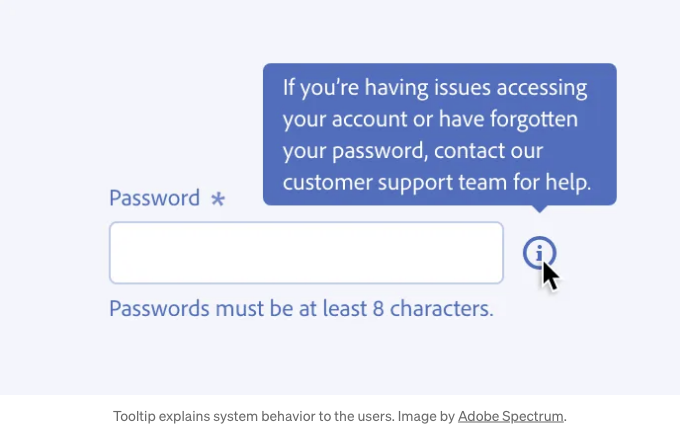

# 툴팁 디자인하는 방법

여기 Figma에서 인터랙티브 툴팁을 디자인하는 빠른 튜토리얼이 있습니다.

<!-- ui-log 수평형 -->

<ins class="adsbygoogle"
      style="display:block"
      data-ad-client="ca-pub-4877378276818686"
      data-ad-slot="9743150776"
      data-ad-format="auto"
      data-full-width-responsive="true"></ins>
<component is="script">
(adsbygoogle = window.adsbygoogle || []).push({});
</component>

## 상호 작용 동작

마우스를 사용하여 객체 위에 호버할 때 툴팁에 300밀리초의 지연 입력이 있어야 하고, 1초 후에 사라져야 합니다.

## 위치

화면 부동산 및 의도에 따라 툴팁은 UI 요소 위, 아래 및 양쪽에 나타날 수 있습니다.

<!-- ui-log 수평형 -->

<ins class="adsbygoogle"
      style="display:block"
      data-ad-client="ca-pub-4877378276818686"
      data-ad-slot="9743150776"
      data-ad-format="auto"
      data-full-width-responsive="true"></ins>
<component is="script">
(adsbygoogle = window.adsbygoogle || []).push({});
</component>

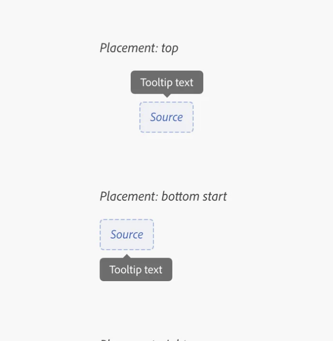

툴팁을 배치할 때, 사용자가 현재 상호작용하는 UI 요소와 겹치지 않도록 유의해주세요.

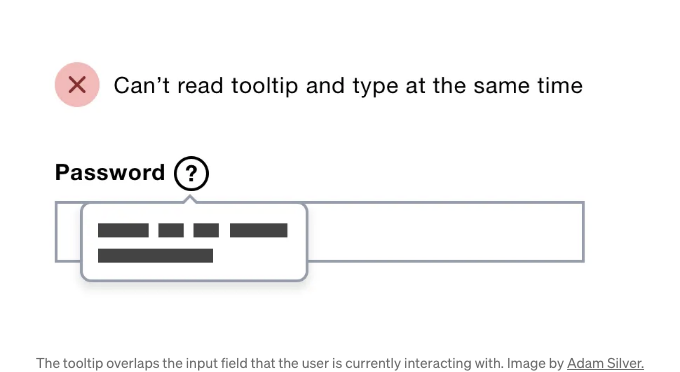

# 디자인 권고 사항

<!-- ui-log 수평형 -->

<ins class="adsbygoogle"
      style="display:block"
      data-ad-client="ca-pub-4877378276818686"
      data-ad-slot="9743150776"
      data-ad-format="auto"
      data-full-width-responsive="true"></ins>
<component is="script">
(adsbygoogle = window.adsbygoogle || []).push({});
</component>

## 툴팁을 절약하게 사용해주세요

너무 많은 툴팁은 사용자들을 혼란스럽게 만들 수 있어요. 많은 툴팁이 필요한 기능을 만드는 중이라면, 디자인과 경험에서 언어를 명확히 하는 데 노력해보세요.

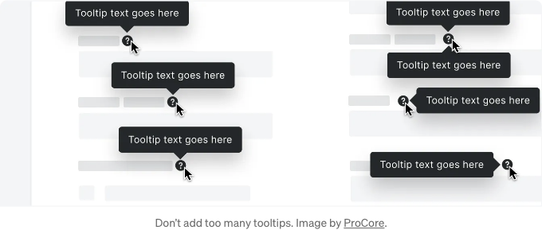

복잡하거나 위험한 항목 또는 자주 오해되는 항목에 대한 설명을 우선시해주세요.

<!-- ui-log 수평형 -->

<ins class="adsbygoogle"
      style="display:block"
      data-ad-client="ca-pub-4877378276818686"
      data-ad-slot="9743150776"
      data-ad-format="auto"
      data-full-width-responsive="true"></ins>
<component is="script">
(adsbygoogle = window.adsbygoogle || []).push({});
</component>

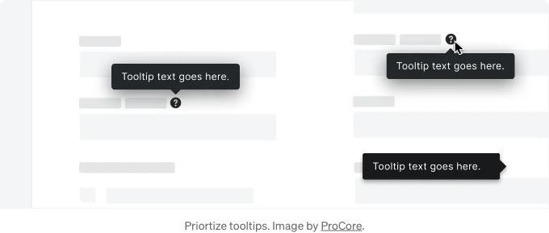

## 중요 정보 전달에 툴팁을 사용하지 마세요

"결제 방법이 만료되었습니다"와 같은 중요 정보를 전달하기 위해 툴팁을 사용하지 마세요.

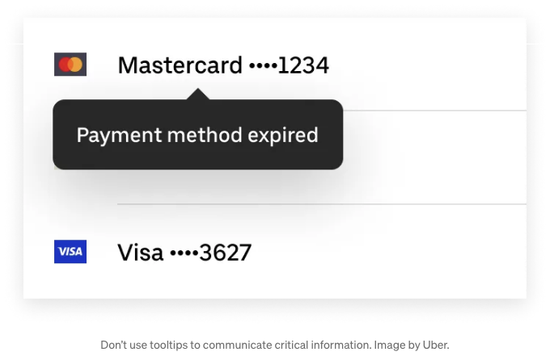

<!-- ui-log 수평형 -->

<ins class="adsbygoogle"
      style="display:block"
      data-ad-client="ca-pub-4877378276818686"
      data-ad-slot="9743150776"
      data-ad-format="auto"
      data-full-width-responsive="true"></ins>
<component is="script">
(adsbygoogle = window.adsbygoogle || []).push({});
</component>

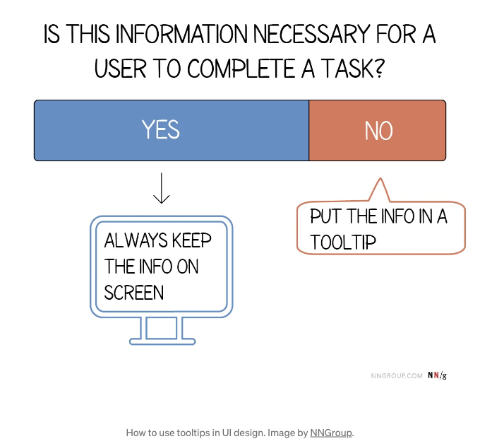

## 요소를 간결하게 설명하거나 확장하세요

툴팁 텍스트는 명확하고 간결하며 빠르게 스캔할 수 있어야 합니다. 평범한 언어를 사용하고 핵심으로 바로 들어가세요(사용자가 알아야 할 내용을 가능한 한 적은 단어로 설명). 문자 수 제한은 20자로, 이는 공백을 포함한 2~5단어 사이입니다.

<!-- ui-log 수평형 -->

<ins class="adsbygoogle"
      style="display:block"
      data-ad-client="ca-pub-4877378276818686"
      data-ad-slot="9743150776"
      data-ad-format="auto"
      data-full-width-responsive="true"></ins>
<component is="script">
(adsbygoogle = window.adsbygoogle || []).push({});
</component>

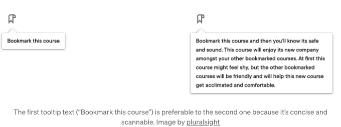

## 도구 설명에 상호 작용 요소를 추가하지 마세요

도구 설명은 호버(hover)시에만 나타나거나 키보드 포커스가 있을 때에만 나타납니다. 다른 요소로 포커스가 전환되면 도구 설명이 사라집니다. 이러한 이유로 도구 설명에는 링크나 버튼을 포함시키지 말아야 합니다.

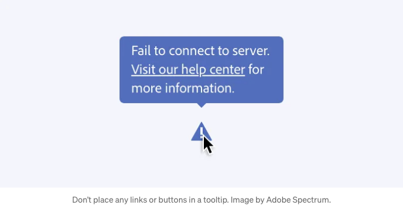

<!-- ui-log 수평형 -->

<ins class="adsbygoogle"
      style="display:block"
      data-ad-client="ca-pub-4877378276818686"
      data-ad-slot="9743150776"
      data-ad-format="auto"
      data-full-width-responsive="true"></ins>
<component is="script">
(adsbygoogle = window.adsbygoogle || []).push({});
</component>

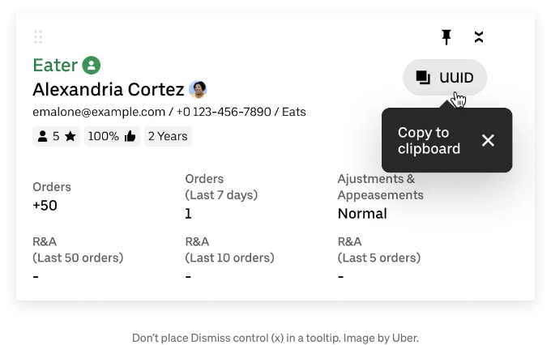

## 키보드로 접근 가능한 툴팁

툴팁은 키보드로 탐색 및 스크린 리더를 통해 접근 가능해야 합니다.

키보드 상호작용

<!-- ui-log 수평형 -->

<ins class="adsbygoogle"
      style="display:block"
      data-ad-client="ca-pub-4877378276818686"
      data-ad-slot="9743150776"
      data-ad-format="auto"
      data-full-width-responsive="true"></ins>
<component is="script">
(adsbygoogle = window.adsbygoogle || []).push({});
</component>

- Tab: 트리거에 포커스를 이동하고 툴팁을 엽니다.
- Esc: 툴팁을 닫습니다

# 제품 디자인을 마스터하고 싶나요?

인터랙션 디자인 재단을 시도해보세요. 이 곳에서는 제품 디자인의 전 영역을 다루는 온라인 디자인 과정을 제공합니다. 기초부터 고급 수준까지 모두 포함되어 있습니다.
