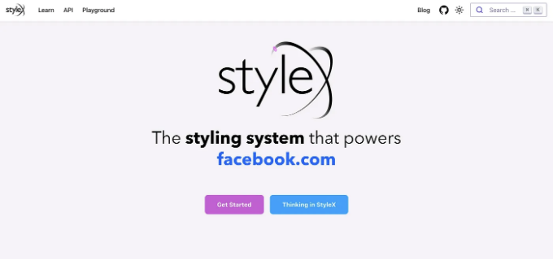

## 2024년을 위한 MUI, Headless UI, Stylex, Chakra UI 및 Ant Design 탐험!

2024년에 어플리케이션을 개발 중이라면 빠르게 일해야 합니다. 많은 React UI 컴포넌트 라이브러리들이 공개로 제공되고 있기 때문에 UI 컴포넌트를 직접 구축하는 데 시간을 투자할 필요가 없습니다!

이 라이브러리들은 버튼, 폼, 메뉴, 그리고 모달을 포함하고 있습니다. UI 컴포넌트 라이브러리를 사용하면 시간과 노력을 절약할 수 있으며, 이러한 컴포넌트들을 처음부터 구축할 필요가 없습니다.

그러니, 2024년의 최고의 5가지 React UI 컴포넌트 라이브러리를 살펴봅시다. 각 라이브러리의 기능과 이점에 대해 설명하겠습니다. 여러분이 어떤 것을 선택할지 결정할 수 있도록 도와드리겠습니다.

<!-- ui-log 수평형 -->

<ins class="adsbygoogle"
      style="display:block"
      data-ad-client="ca-pub-4877378276818686"
      data-ad-slot="9743150776"
      data-ad-format="auto"
      data-full-width-responsive="true"></ins>
<component is="script">
(adsbygoogle = window.adsbygoogle || []).push({});
</component>

# 1. MUI

Material-UI은 구글의 Material Design을 구현한 오픈 소스 React 컴포넌트 라이브러리입니다. 제품 생산에 즉시 사용할 수 있는 사전 구축 UI 컴포넌트의 포괄적인 모음입니다.

## 특징:

- 포괄적인 컴포넌트 세트: Material-UI에는 버튼, 메뉴, 폼, 테이블 등 여러 컴포넌트가 포함되어 있습니다.
- 모바일 최우선 접근 방식: Material-UI는 모바일 최우선으로 설계되어 어떤 기기에서도 훌륭하게 표시됩니다, 스마트폰부터 데스크탑까지.
- 사용자 정의 가능: Material-UI 컴포넌트는 쉽게 사용자 지정하여 브랜드 가이드라인이나 앱 디자인과 일치시킬 수 있습니다.
- 접근성: Material-UI 컴포넌트는 접근성을 고려하여 구축되었으므로 장애를 가진 사람들도 사용할 수 있습니다.
- 테마 지원: Material-UI는 테마를 지원하므로 앱의 모양과 느낌을 쉽게 변경할 수 있습니다.

<!-- ui-log 수평형 -->

<ins class="adsbygoogle"
      style="display:block"
      data-ad-client="ca-pub-4877378276818686"
      data-ad-slot="9743150776"
      data-ad-format="auto"
      data-full-width-responsive="true"></ins>
<component is="script">
(adsbygoogle = window.adsbygoogle || []).push({});
</component>

MUI와 같은 프레임워크와 함께 작업하길 원한다면 독립적인 컴포넌트를 만들 수 있습니다.

예를 들어, 사용자 정의 가능한 MUI 테마를 나타내는 이 Bit Component를 살펴보세요:


이 컴포넌트는 어두운 테마를 생성하는 함수를 나타냅니다:

<!-- ui-log 수평형 -->

<ins class="adsbygoogle"
      style="display:block"
      data-ad-client="ca-pub-4877378276818686"
      data-ad-slot="9743150776"
      data-ad-format="auto"
      data-full-width-responsive="true"></ins>
<component is="script">
(adsbygoogle = window.adsbygoogle || []).push({});
</component>

위의 코드 스니펫은 어떤 애플리케이션에도 사용할 수 있는 준비된 다크 테마를 보여줍니다. 사용자들이 해야 할 일은 Bit를 통해 설치하거나 선호하는 패키지 관리자(예: NPM 패키지)를 통해 설치한 후 사용하기 시작하는 것뿐입니다.

Bit에서 테마를 구성한 후 해당 테마를 사용하는 모든 컴포넌트를 볼 수 있습니다:


위의 그래프를 통해 darkTheme 컴포넌트를 사용하는 모든 컴포넌트를 볼 수 있고, 결과적으로 darkTheme의 새 버전을 릴리즈할 경우 영향을 받을 수 있는 위치를 파악할 수 있습니다.

<!-- ui-log 수평형 -->

<ins class="adsbygoogle"
      style="display:block"
      data-ad-client="ca-pub-4877378276818686"
      data-ad-slot="9743150776"
      data-ad-format="auto"
      data-full-width-responsive="true"></ins>
<component is="script">
(adsbygoogle = window.adsbygoogle || []).push({});
</component>

## 2. Headless UI


Headless UI는 완전히 스타일이 없는, 완전히 접근 가능한 UI 구성 요소를 제공하는 React 라이브러리로, Tailwind CSS와 완벽하게 통합되도록 디자인되었습니다.

전통적인 CSS-in-JS 라이브러리와는 달리 Headless UI는 구성 요소의 행동과 접근성에 중점을 둬 시각적 스타일링은 완전히 사용자에게 맡깁니다.

<!-- ui-log 수평형 -->

<ins class="adsbygoogle"
      style="display:block"
      data-ad-client="ca-pub-4877378276818686"
      data-ad-slot="9743150776"
      data-ad-format="auto"
      data-full-width-responsive="true"></ins>
<component is="script">
(adsbygoogle = window.adsbygoogle || []).push({});
</component>

## 특징:

- 스타일이 없고 사용자 정의 가능: Tailwind CSS 또는 사용자 정의 스타일로 모든 시각적 측면을 제어할 수 있는 구성 요소를 제공합니다. 이를 통해 브랜드 및 디자인 방향과 완벽하게 일치시킬 수 있는 최대한의 유연성을 제공합니다.
- 높은 접근성: 모든 구성 요소는 접근성을 염두에 두고 구축되어 사용 가능한 인터페이스를 제공합니다.
- 원활한 Tailwind 통합: Headless UI는 Tailwind CSS와 완벽하게 호환되어 신속한 스타일링 및 반응형 디자인을 위해 유틸리티 클래스를 활용할 수 있습니다.
- 기본 요소로 작성됨: 각 구성 요소는 네이티브 HTML 요소를 사용하여 구축되어 깨끗하고 가벼운 코드를 만들며 최소한의 오버헤드를 갖습니다.
- 상태 관리에 집중: Headless UI는 구성 요소의 상태(열림/닫힘, 선택/선택 취소 등)을 추적하지만 시각적 표현은 완전히 여러분에게 달려 있습니다.

Headless UI로 시작하는 것은 보다 어렵지 않습니다. Headless UI 환경을 시작하기 위해 미리 구축된 Bit 구성 요소를 사용하여 구성 요소를 손쉽게 개발을 시작할 수 있습니다.

해야 할 일은 모두 다음과 같습니다:

<!-- ui-log 수평형 -->

<ins class="adsbygoogle"
      style="display:block"
      data-ad-client="ca-pub-4877378276818686"
      data-ad-slot="9743150776"
      data-ad-format="auto"
      data-full-width-responsive="true"></ins>
<component is="script">
(adsbygoogle = window.adsbygoogle || []).push({});
</component>

- Tailwind 환경 생성
- Bit를 사용하여 빌드 시작하기!

아래에 표시된 다섯 가지 명령어만 알면 됩니다:

```js
// 먼저 bit 작업 공간을 초기화합니다.

bit init

// headless ui 환경을 복제하여 컴포넌트를 생성합니다.

bit fork learnbit-react.headless-ui/envs/react-headless-ui --scope my-org.design

// 원하는 경우 tailwind 구성을 복제합니다. 그렇지 않으면 이 단계를 건너뜁니다!

bit fork learnbit-react.headless-ui/tailwind/configs/tailwind-config --scope my-org.design

// Tailwind가 작동하려면 작업 공간에 종속성을 설치하십시오.

bit install tailwindcss@^2.2.19 postcss@^8.3.6 --type peer

// Headless UI를 사용하여 컴포넌트를 생성하고 시작하십시오.

bit create react ui/tabs --scope my-org.design --env learnbit-react.headless-ui/envs/react-headless-ui
```

Headless UI를 사용자 정의하는 더 포괄적인 안내는 Bit Cloud에서 확인할 수 있습니다.

<!-- ui-log 수평형 -->

<ins class="adsbygoogle"
      style="display:block"
      data-ad-client="ca-pub-4877378276818686"
      data-ad-slot="9743150776"
      data-ad-format="auto"
      data-full-width-responsive="true"></ins>
<component is="script">
(adsbygoogle = window.adsbygoogle || []).push({});
</component>

# 3. StyleX



StyleX는 Meta 팀에서 만든 웹 앱 스타일링을 위한 JavaScript 구문 및 컴파일러입니다. 성능 부담 없이 표준 CSS-in-JS 솔루션과 같은 이점을 제공합니다.

## 특징:

<!-- ui-log 수평형 -->

<ins class="adsbygoogle"
      style="display:block"
      data-ad-client="ca-pub-4877378276818686"
      data-ad-slot="9743150776"
      data-ad-format="auto"
      data-full-width-responsive="true"></ins>
<component is="script">
(adsbygoogle = window.adsbygoogle || []).push({});
</component>

- 확장 가능한: Stylex는 atomic CSS를 사용하여 CSS 코드를 최소화합니다. 이는 전통적인 CSS보다 CSS 코드를 유지 관리하기가 훨씬 쉽게 만듭니다.
- 조합 가능한: 스타일을 수동으로 병합할 필요가 없습니다. Stylex는 컴포넌트 및 파일 경계를 가로지르며 임의의 스타일을 병합하고 조합할 수 있습니다.
- 타입 안전성: 컴포넌트에서 사용할 수 있는 타입 안전한 API를 제공합니다. 이를 통해 컴포넌트 외부에서 스타일의 사용자 정의 가능성을 쉽게 활성화할 수 있습니다.

프로젝트에서 Stylex를 사용하려면 Bit와 함께 작업하는 것을 권장합니다. Bit와 Stylex는 동일한 가치관을 공유합니다. Bit는 조합성, 유지 관리성 및 확장 가능성을 목표로 하는 빌드 시스템입니다.

Bit 작업 공간에 Stylex 환경을 구성 요소 생성기로 추가하면 됩니다:

```js
/** @filename: workspace.jsonc */

{
   // ...
   "teambit.generator/generator": {
      "envs": [
          "learnbit-react.stylex/envs/react-stylex"
      ]
   }
}
```

<!-- ui-log 수평형 -->

<ins class="adsbygoogle"
      style="display:block"
      data-ad-client="ca-pub-4877378276818686"
      data-ad-slot="9743150776"
      data-ad-format="auto"
      data-full-width-responsive="true"></ins>
<component is="script">
(adsbygoogle = window.adsbygoogle || []).push({});
</component>

다음으로, Stylex를 사용하여 컴포넌트를 생성할 수 있어요:

```js
bit create stylex my-theme
```

이 명령은 여러 프로젝트에서 사용할 수 있는 커스텀화된 테마 컴포넌트를 생성할 거에요.

Stylex와 Bit를 함께 사용하는 자세한 설명을 보려면 이 가이드를 참고해주세요:

<!-- ui-log 수평형 -->

<ins class="adsbygoogle"
      style="display:block"
      data-ad-client="ca-pub-4877378276818686"
      data-ad-slot="9743150776"
      data-ad-format="auto"
      data-full-width-responsive="true"></ins>
<component is="script">
(adsbygoogle = window.adsbygoogle || []).push({});
</component>

# 4. Chakra UI

Chakra UI는 접근성이 좋고 세련된 React 애플리케이션을 구축하기 위한 컴포넌트 라이브러리입니다. 버튼, 폼, 입력란, 메뉴 등과 같은 준비된 UI 컴포넌트 세트를 제공하여 프로젝트에 쉽게 통합할 수 있습니다.

## 특징:

- 사용하기 쉽고 이해하기 쉬운 컴포넌트: Chakra UI 컴포넌트는 직관적이고 명확하게 설계되어 초보자와 경험 많은 개발자 모두에게 이상적입니다.
- 모듈화 및 유연한 UI 구성: 각 컴포넌트는 독립적이며 독립적으로 사용할 수 있어 UI를 모듈화하고 유연하게 구성할 수 있습니다.
- 다양한 사용자 정의 옵션: 프롭스와 사용자 정의 테마를 사용하여 Chakra UI 컴포넌트의 거의 모든 측면을 수정하여 원하는 모양과 느낌을 만들어 낼 수 있습니다.
- 네이티브 다크 모드 지원: 대부분의 Chakra UI 컴포넌트는 기본적으로 다크 모드를 지원하여 앱에 세련되고 현대적인 다크 테마를 구현하기 쉽게 합니다.
- 성능을 고려한 구축: Chakra UI는 코드 분할과 같은 기술을 사용하여 앱을 빠르게 로드하고 모든 기기에서 반응성을 유지하도록 보장합니다.

<!-- ui-log 수평형 -->

<ins class="adsbygoogle"
      style="display:block"
      data-ad-client="ca-pub-4877378276818686"
      data-ad-slot="9743150776"
      data-ad-format="auto"
      data-full-width-responsive="true"></ins>
<component is="script">
(adsbygoogle = window.adsbygoogle || []).push({});
</component>

# 5. Ant Design

앤트 디자인은 주로 React를 사용하여 웹 애플리케이션을 구축하는 데 중점을 둔 견고하고 인기 있는 UI 디자인 언어 및 구성 요소 라이브러리입니다.

## 특징:

- 기업 중심: Ant Design는 B2B 사용자 인터페이스를 구축하는 데 탁월하며 효율성, 사용성 및 데이터 가시성을 우선시합니다.
- 매우 사용자 정의 가능: 구성 요소의 모든 측면을 사용자 정의할 수 있습니다. 크기, 색상, 레이아웃, 동작 등을 조정하여 특정 요구 사항과 브랜드 가이드라인과 일치시킬 수 있습니다.
- 광범위한 범위: 버튼, 폼, 테이블, 메뉴, 탐색 요소, 데이터 표시, 피드백 모듈 등 다양한 구성 요소가 사용 가능합니다.
- 모바일 친화적: 구성 요소는 다양한 화면 크기에 적응하여 다양한 기기에서 원활한 경험을 제공합니다.
- 국제화 지원: 인터페이스를 여러 언어로 번역하여 보다 넓은 사용자들에게 도달할 수 있습니다.

<!-- ui-log 수평형 -->

<ins class="adsbygoogle"
      style="display:block"
      data-ad-client="ca-pub-4877378276818686"
      data-ad-slot="9743150776"
      data-ad-format="auto"
      data-full-width-responsive="true"></ins>
<component is="script">
(adsbygoogle = window.adsbygoogle || []).push({});
</component>

# 마무리

프로젝트에 적합한 React 컴포넌트 라이브러리를 선택하는 것은 단순히 트렌드를 따르거나 가장 인기 있는 것을 선택하는 것이 아닙니다.

이는 라이브러리가 프로젝트의 특정 요구 사항, 디자인 목표 및 기술적 제약과 일치하는지를 보장하는 것입니다.

귀하의 선택은 개발 속도, 유지 보수 용이성 및 전체 사용자 경험에 상당한 영향을 미칠 수 있습니다.

<!-- ui-log 수평형 -->

<ins class="adsbygoogle"
      style="display:block"
      data-ad-client="ca-pub-4877378276818686"
      data-ad-slot="9743150776"
      data-ad-format="auto"
      data-full-width-responsive="true"></ins>
<component is="script">
(adsbygoogle = window.adsbygoogle || []).push({});
</component>

이 기사가 도움이 되기를 바랍니다.

읽어 주셔서 감사합니다.

# 더 알아보기
