## Musho와 Figma에서 UX Pilot을 활용하여 디자인 워크플로우 최적화하기

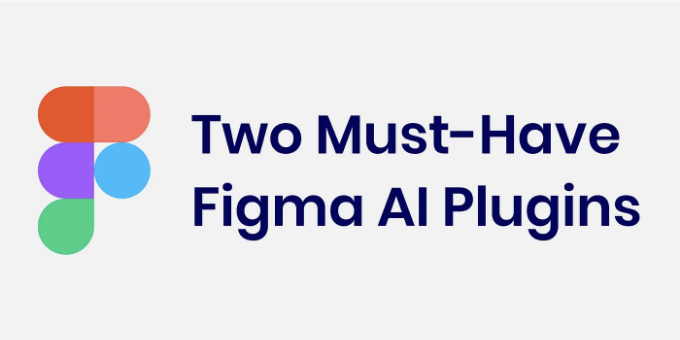

특히 인공지능 기술을 활용한 AI 도구들은 디자인 프로세스를 바꾸고 있습니다. ChatGPT, Gemini, Claude와 같은 챗봇들은 더 효율적으로 작업할 수 있게 도와주며 창의적인 해결책을 생각할 수 있도록 도와줍니다.

이러한 챗봇들 외에도 많은 사람들과 기업들이 이러한 챗봇의 생성모델을 기반으로 특정 작업용 맞춤형 제품을 출시하고 있습니다.

<!-- ui-log 수평형 -->

<ins class="adsbygoogle"
      style="display:block"
      data-ad-client="ca-pub-4877378276818686"
      data-ad-slot="9743150776"
      data-ad-format="auto"
      data-full-width-responsive="true"></ins>
<component is="script">
(adsbygoogle = window.adsbygoogle || []).push({});
</component>

AI 혁신을 보는 효과적인 방법 중 하나는 알려진 채팅 앱 대신 개인 및 소규모 비즈니스가 디자인한 작은 AI 도구와 애플리케이션을 사용하는 것입니다.

픽마는 작은 소프트웨어(또는 가장 흔한 말로는 플러그인)를 실행할 수 있는 훌륭한 플랫폼을 갖췄기 때문에, 모든 피그마 디자이너가 이 혁신을 직접 경험하고 다룰 수 있습니다. 우리는 피그마 커뮤니티의 이러한 플러그인을 사용하여 업무 효율을 높일 수 있습니다.

또한, 이 제품들이 어떻게 작동하는지 확인하고 AI 경험을 디자인하는 방법에 대해 공부할 수 있어요. 내 생각에는 이것이 앞으로 몇 년 동안의 주요 사용자 경험 문제가 될 것입니다.

본 문서에서는 와이어프레임 및 효과적인 UX 글쓰기를 통해 요구 사항을 충족시키는 화면을 작성할 수 있는 두 가지 피그마 플러그인인 Musho와 UX Pilot에 대해 논의하겠습니다. 이를 활용하여 업무 과정을 간소화할 수 있습니다.

<!-- ui-log 수평형 -->

<ins class="adsbygoogle"
      style="display:block"
      data-ad-client="ca-pub-4877378276818686"
      data-ad-slot="9743150776"
      data-ad-format="auto"
      data-full-width-responsive="true"></ins>
<component is="script">
(adsbygoogle = window.adsbygoogle || []).push({});
</component>

플러그인에 대해 설명하고, 덧붙여서 그들과 함께 한 테스트에 대해 설명할 거예요! 이를 통해 그들의 능력에 대한 이해도를 높일 수 있을 거에요.

## Musho

## Musho 플러그인이 하는 일

이 AI 플러그인은 GPT4 AI 모델로 두 가지 유형의 콘텐츠를 만들어줘요: 랜딩 페이지 및 소셜 미디어 자료. 게다가, 여기에서 아무 것이나 생성할 수 있는 실험적인 섹션이 있어요.

<!-- ui-log 수평형 -->

<ins class="adsbygoogle"
      style="display:block"
      data-ad-client="ca-pub-4877378276818686"
      data-ad-slot="9743150776"
      data-ad-format="auto"
      data-full-width-responsive="true"></ins>
<component is="script">
(adsbygoogle = window.adsbygoogle || []).push({});
</component>

## Musho의 작동 방식

Figma 플러그인 섹션에서 Musho를 열고, 로그인하면 준비 완료입니다.

출력 형식(랜딩 페이지, 소셜 미디어, 또는 실험 모드)을 선택하고, 입력 텍스트에 대한 프롬프트를 작성한 후 실행하세요. 플러그인이 작업을 완료할 때까지 기다리고 요청한 내용을 받으세요.

추가로 결과를 다른 사람들과 공유할 수도 있습니다. 왜냐하면 결과물이 포함된 웹페이지를 생성하기 때문이죠.

<!-- ui-log 수평형 -->

<ins class="adsbygoogle"
      style="display:block"
      data-ad-client="ca-pub-4877378276818686"
      data-ad-slot="9743150776"
      data-ad-format="auto"
      data-full-width-responsive="true"></ins>
<component is="script">
(adsbygoogle = window.adsbygoogle || []).push({});
</component>

다음은 프롬프트입니다:

<!-- ui-log 수평형 -->

<ins class="adsbygoogle"
      style="display:block"
      data-ad-client="ca-pub-4877378276818686"
      data-ad-slot="9743150776"
      data-ad-format="auto"
      data-full-width-responsive="true"></ins>
<component is="script">
(adsbygoogle = window.adsbygoogle || []).push({});
</component>

```js
이탈리안 네오폴리탄 피자를 위한 홈페이지 웹사이트를 만드세요.
```

결과는 다음과 같습니다:

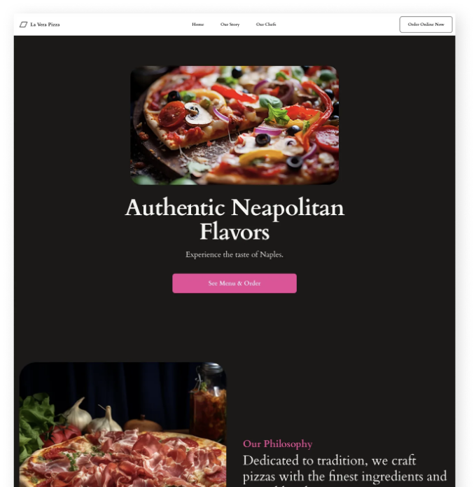

랜딩 페이지가 준비되면 플러그인으로 UI 디자인을 반복적으로 개선할 수 있습니다. 인터페이스에서 일부를 선택하고 생성 요청을 할 수 있습니다.

<!-- ui-log 수평형 -->

<ins class="adsbygoogle"
      style="display:block"
      data-ad-client="ca-pub-4877378276818686"
      data-ad-slot="9743150776"
      data-ad-format="auto"
      data-full-width-responsive="true"></ins>
<component is="script">
(adsbygoogle = window.adsbygoogle || []).push({});
</component>

새로운 AI 복사본과 새 이미지를 생성하도록 요청할 수 있습니다. 이 예시에서는 플러그인에 제목을 변경하도록 요청했습니다:

```js
도시 최고의 네알폴리탄 피자라고 말하도록 제목을 변경하세요.
```

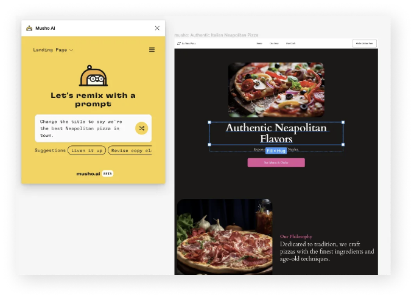

여기 결과입니다:

<!-- ui-log 수평형 -->

<ins class="adsbygoogle"
      style="display:block"
      data-ad-client="ca-pub-4877378276818686"
      data-ad-slot="9743150776"
      data-ad-format="auto"
      data-full-width-responsive="true"></ins>
<component is="script">
(adsbygoogle = window.adsbygoogle || []).push({});
</component>

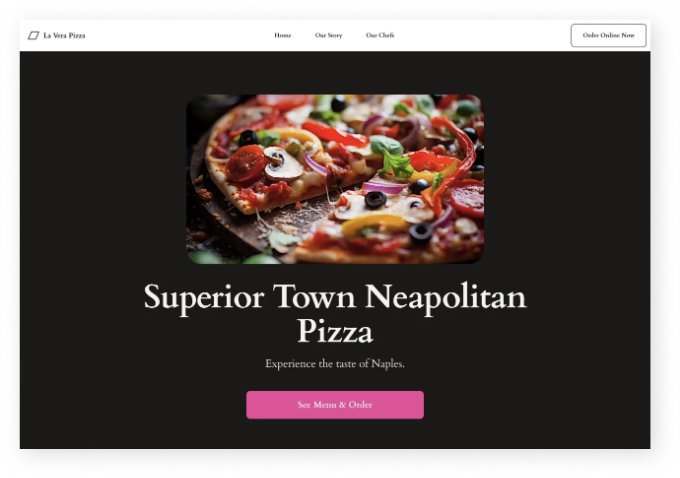

안녕하세요! 히어로 섹션을 더 구체적인 요구사항으로 변경하고 싶어요.

다음은 제가 사용한 프롬프트입니다.

```js
다음 요구 사항으로 히어로 섹션을 재디자인하십시오:
- 히어로 섹션에는 이미지, 제목 및 버튼이 포함되어야 합니다.
- 이미지는 히어로 섹션의 모든 배경이어야 합니다.
- 제목과 버튼은 히어로의 왼쪽에 있어야 하며 이미지 위에 있어야 합니다.
```

<!-- ui-log 수평형 -->

<ins class="adsbygoogle"
      style="display:block"
      data-ad-client="ca-pub-4877378276818686"
      data-ad-slot="9743150776"
      data-ad-format="auto"
      data-full-width-responsive="true"></ins>
<component is="script">
(adsbygoogle = window.adsbygoogle || []).push({});
</component>

여기 결과가 있어요:

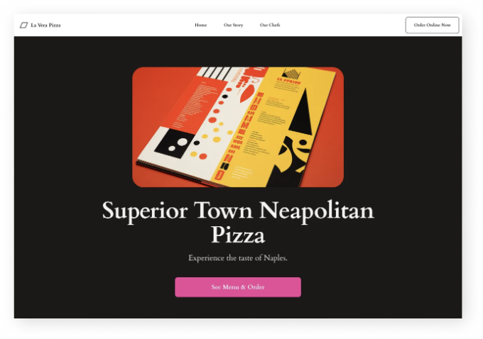

나는 요구사항을 따라간다고 생각해서 좀 더 구체적이고 좋은 결과를 얻을 수 있을 거라고 생각했지만, 위 이미지 결과를 보면 내 요구사항을 충족시키지 못했어요. 또한 실험 모드를 사용하여 히어로 섹션을 요청했지만, 동일한 결과를 받았어요.

## 플러그인의 더 많은 기능

<!-- ui-log 수평형 -->

<ins class="adsbygoogle"
      style="display:block"
      data-ad-client="ca-pub-4877378276818686"
      data-ad-slot="9743150776"
      data-ad-format="auto"
      data-full-width-responsive="true"></ins>
<component is="script">
(adsbygoogle = window.adsbygoogle || []).push({});
</component>

- 기록: 요청한 프롬프트를 저장합니다.
- 스타일과 변수 생성: 프로세스 중에 플러그인에 스타일과 변수 생성을 요청하여 빠르게 반복할 수 있습니다.
- 쉬운 공유 결과: 플러그인은 페이지를 생성한 후 결과를 공유할 수 있는 웹 페이지를 생성합니다.

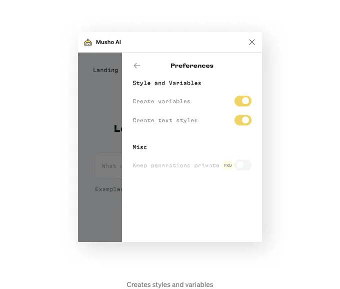

## 이 플러그인에서 좋아한 점

- 히스토리를 저장하기 때문에 이전 프롬프트로 돌아가는 것이 더 쉽습니다.
- 페이지 생성 중에 변수를 생성하는 점이 훌륭합니다. 변수를 생성하면 결과물과의 반복 작업이 훨씬 빠릅니다.

<!-- ui-log 수평형 -->

<ins class="adsbygoogle"
      style="display:block"
      data-ad-client="ca-pub-4877378276818686"
      data-ad-slot="9743150776"
      data-ad-format="auto"
      data-full-width-responsive="true"></ins>
<component is="script">
(adsbygoogle = window.adsbygoogle || []).push({});
</component>

## 요금

- 무료 요금제: 매월 25회 생성 가능.
- 무제한 생성을 위한 매월 $14.99 (연간 요금제).

## 결론

프로젝트를 위한 랜딩 페이지 아이디어를 생성할 수 있는 좋은 디자인 도구입니다.

<!-- ui-log 수평형 -->

<ins class="adsbygoogle"
      style="display:block"
      data-ad-client="ca-pub-4877378276818686"
      data-ad-slot="9743150776"
      data-ad-format="auto"
      data-full-width-responsive="true"></ins>
<component is="script">
(adsbygoogle = window.adsbygoogle || []).push({});
</component>

아직 조금 더 설정이 필요합니다. 디자인 스타일을 선택하고 결과와 쉽게 반복할 수 있는 방법을 찾는 것이 중요합니다. 왜냐하면 쓰기 프롬프트는 민첩성이 필요하기 때문이에요.

게다가, 결과는 요구 사항에 더 정확해야 합니다. 플러그인을 더 사용하고 더 나은 결과를 얻을 수 있다고 생각하지만, 제 생각에는 여기서의 디자인과 개발 목표는 기술을 더 쉽게 제어하고 훨씬 더 정확하게 만드는 것입니다.

제품이 매우 새로운 것이라서 현재 이 단계라는 것은 매우 이해하기 쉬운 부분이고, 미래에는 훨씬 더 나아질 것이라고 믿습니다.

아직은 도구를 사용해보고 어떻게 작동하는지 확인하는 것을 권장합니다. 이는 우리가 향후 업무에서 어떻게 작업할지에 관한 것이기 때문이에요.

<!-- ui-log 수평형 -->

<ins class="adsbygoogle"
      style="display:block"
      data-ad-client="ca-pub-4877378276818686"
      data-ad-slot="9743150776"
      data-ad-format="auto"
      data-full-width-responsive="true"></ins>
<component is="script">
(adsbygoogle = window.adsbygoogle || []).push({});
</component>

## UX Pilot

## UX Pilot 플러그인이 하는 일

Figma 플러그인인 UX Pilot은 제품 디자이너를 위한 "스위스 아미칼" AI 기반 플러그인과 같습니다.

이 플러그인에는 Figma 및 FigJam 플러그인이 있어 다이어그램을 만들거나 UX 리뷰를 요청하거나 워크샵을 만들거나 정보를 종합하거나 정보를 클러스터링할 수 있습니다.

<!-- ui-log 수평형 -->

<ins class="adsbygoogle"
      style="display:block"
      data-ad-client="ca-pub-4877378276818686"
      data-ad-slot="9743150776"
      data-ad-format="auto"
      data-full-width-responsive="true"></ins>
<component is="script">
(adsbygoogle = window.adsbygoogle || []).push({});
</component>

이 게시물에서는 현재 베타 버전인 와이어프레임 기능에만 초점을 맞출 것입니다.

## UX PILOT의 와이어프레임 기능이 작동하는 방법

플러그인 섹션에서 플러그인을 열고 로그인합니다.

로그인한 후에 플러그인의 와이어프레임 섹션을 클릭하고 생성할 화면 수를 선택하고 사용할 AI 모델을 선택하세요. 그런 다음 원하는 내용을 설명하는 프롬프트를 작성하고 플러그인이 생성하도록 하세요.

<!-- ui-log 수평형 -->

<ins class="adsbygoogle"
      style="display:block"
      data-ad-client="ca-pub-4877378276818686"
      data-ad-slot="9743150776"
      data-ad-format="auto"
      data-full-width-responsive="true"></ins>
<component is="script">
(adsbygoogle = window.adsbygoogle || []).push({});
</component>

인공 지능과 관련된 일반적인 규칙으로는, 원하는 결과를 더 정확히 얻기 위해 자세히 명시하는 것이 항상 좋습니다. 예를 들어, 히어로 섹션을 만들고 싶다면, 히어로에는 제목, 이미지 및 버튼이 포함되어야 한다고 설명해 주세요.

현재 웹 앱만 생성할 수 있지만 곧 웹 앱, 모바일 앱 및 랜딩 페이지 중에서 선택할 수 있게 될 것입니다.

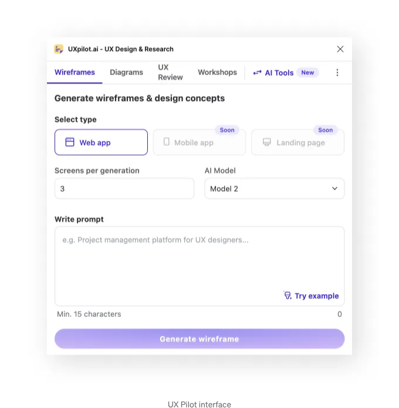

## 이를 테스트한 결과

<!-- ui-log 수평형 -->

<ins class="adsbygoogle"
      style="display:block"
      data-ad-client="ca-pub-4877378276818686"
      data-ad-slot="9743150776"
      data-ad-format="auto"
      data-full-width-responsive="true"></ins>
<component is="script">
(adsbygoogle = window.adsbygoogle || []).push({});
</component>

플러그인이 와이어프레임을 생성하기 때문에 고해상도 화면이 아니라, 제가 응용 프로그램을 만들 수 있는지 테스트하고 싶었어요.

앱에 대해 이야기할 때, 특히 복잡한 앱의 경우, 세부 정보보다는 구조에 집중하는 것이 더 좋습니다. 낮은 해상도 화면부터 시작하면 프로세스가 더 집중될 거예요.

여기 사용한 프롬프트입니다:

```js
레시피 공유 플랫폼을 만들어보세요: 사용자가 레시피를 발견하고 공유하고 저장하며, 다른 음식 애호가 커뮤니티와 상호 작용할 수 있는 웹사이트입니다.
```

<!-- ui-log 수평형 -->

<ins class="adsbygoogle"
      style="display:block"
      data-ad-client="ca-pub-4877378276818686"
      data-ad-slot="9743150776"
      data-ad-format="auto"
      data-full-width-responsive="true"></ins>
<component is="script">
(adsbygoogle = window.adsbygoogle || []).push({});
</component>

여기 결과입니다:

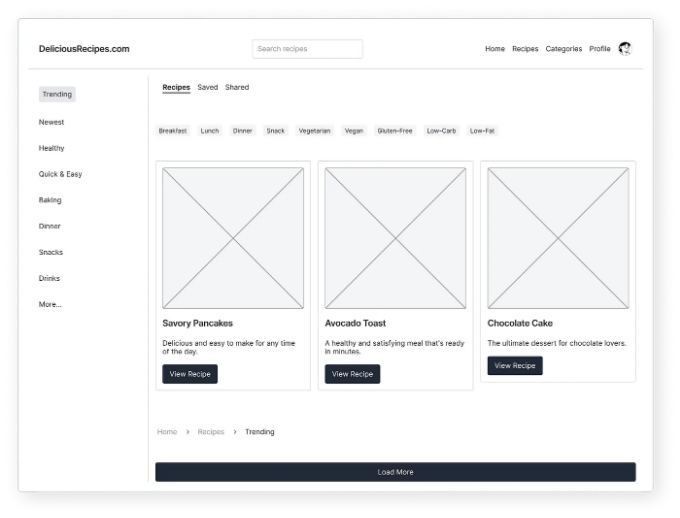

그 결과를 보니 세 가지 옵션이 생성되었습니다: 둘은 작업을 시작하기에 좋았고, 하나는 더 나았을 수도 있습니다. 그래서 또 다른 옵션을 생성하여 다른 선택지를 만들었는데, 그것도 잘 작동했습니다.

인공지능은 어려운 작업을 수행할 때 혼란스러워질 수 있습니다. 다른 AI 모델들을 테스트했을 때도 비슷한 현상이 발생했지만, 미래에는 이 문제가 해결될 것입니다.

<!-- ui-log 수평형 -->

<ins class="adsbygoogle"
      style="display:block"
      data-ad-client="ca-pub-4877378276818686"
      data-ad-slot="9743150776"
      data-ad-format="auto"
      data-full-width-responsive="true"></ins>
<component is="script">
(adsbygoogle = window.adsbygoogle || []).push({});
</component>

저는 복사해서 붙여넣기할 수 없었지만, 모든 자산을 생성하는 사실만으로 "인터페이스 상의 사각형 이동"에 많은 시간을 절약할 수 있다는 것은 이 플러그인의 멋진 사용 사례 중 하나입니다.

그 다음으로, 필터 섹션을 만들 수 있는지 알아보기 위해 이 프롬프트를 작성했습니다. 한 가지 옵션을 생성해 달라고 요청했습니다:

```js
저는 레시피 공유 플랫폼을 디자인했습니다: 사용자들이 레시피를 발견하고 공유하고 저장할 수 있는 웹사이트입니다.
필터 섹션을 만들어 주세요. 이 섹션은 다음을 포함해야 합니다:

-요리 유형 필터: 이탈리안, 멕시칸, 중국 요리 등을 선택할 수 있는 셀렉트 컴포넌트 또는 체크박스 1개.

-식이 제약 필터: 채식주의자, 비건, 글루텐 무제한 등을 위한 필터.

-재료 제외 필터: 특정 재료를 제외할 수 있는 텍스트 입력 또는 선택 매커니즘.

-조리 시간 필터: 조리/준비 시간 범위를 위한 슬라이더 또는 셀렉트 컴포넌트 1개.

-난이도 수준 필터: 레시피 난이도를 선택할 수 있는 섹션 (쉬움, 보통, 어려움).

-식사 유형 필터: 아침식사, 점심식사, 저녁식사, 간식 등을 선택할 수 있는 체크박스 또는 셀렉트 컴포넌트 1개.

-칼로리 범위 필터: 칼로리 범위를 지정하기 위한 슬라이더 또는 입력 필드.

-평점 및 인기도 필터: 사용자 평점이나 인기도에 따라 필터링할 수 있는 옵션.

-기술 또는 장비 필터: 조리 기술이나 특정 주방 장비에 대한 필터링이 필요합니다.
```

여기에 결과가 있습니다:

<!-- ui-log 수평형 -->

<ins class="adsbygoogle"
      style="display:block"
      data-ad-client="ca-pub-4877378276818686"
      data-ad-slot="9743150776"
      data-ad-format="auto"
      data-full-width-responsive="true"></ins>
<component is="script">
(adsbygoogle = window.adsbygoogle || []).push({});
</component>

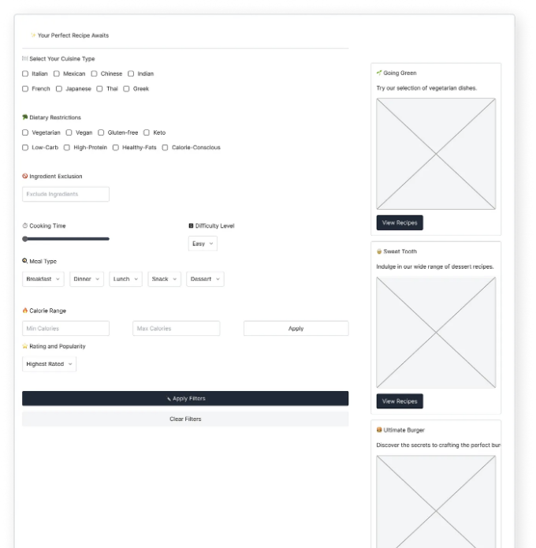

결과는 내가 원하는 대로 모든 입력 유형을 가지고 나왔지만, 내가 정확한 입력 유형을 지정하지 않고 몇 가지 실수를 했기 때문에 혼란스러워졌어요. 예를 들어 여기에서:

```js
식사 유형 필터: 아침, 점심, 저녁, 간식 중 하나의 체크박스 또는 선택 컴포넌트
```

각 종류의 식사를 위한 입력을 생성했지만, 더 정확하게 체크박스 또는 선택 컴포넌트만 사용하도록 명시해야 했어요.

<!-- ui-log 수평형 -->

<ins class="adsbygoogle"
      style="display:block"
      data-ad-client="ca-pub-4877378276818686"
      data-ad-slot="9743150776"
      data-ad-format="auto"
      data-full-width-responsive="true"></ins>
<component is="script">
(adsbygoogle = window.adsbygoogle || []).push({});
</component>

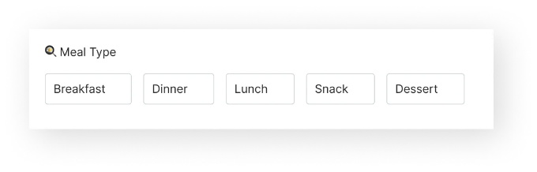

안녕하세요! 다시 다시 쓴 프롬프트를 좀 더 명확하게 만들었고, 다시 실행했어요.

```js
저는 레시피 공유 플랫폼을 디자인하고 있어요. 사용자들이 레시피를 발견하고 공유하고 저장할 수 있는 웹사이트입니다.
필터 섹션을 만들어주세요.

이 섹션에는 다음이 포함되어야 합니다:

- 요리 종류 필터: 이탈리아, 멕시코, 중국 등의 요리 종류를 선택하는 선택 컴포넌트 1개

- 식이 제약 필터: 채식주의자, 비건, 글루텐 무료 등을 위한 선택 컴포넌트 1개

- 재료 제외 필터: 특정 재료를 제외하는 텍스트 입력란 1개

- 조리 시간 필터: 조리 시간 범위를 설정하는 슬라이더 컴포넌트 1개

- 난이도 필터: 레시피 난이도(Easy, Medium, Hard)를 선택하는 선택 컴포넌트 1개

- 식사 유형 필터: 아침식사, 점심식사, 저녁식사, 스낵에 대한 체크박스

- 칼로리 범위 필터: 칼로리 범위를 지정하는 슬라이더 컴포넌트 1개

- 평점 및 인기도 필터: 사용자 평점이나 인기도로 필터링하는 체크박스 5단계로 구성

- 기술 또는 장비 필터: 조리 기술을 필터링하는 선택 컴포넌트 1개
```

요청한 결과물은 제가 원하는 대로 구성되어 있었지만, 아트보드 크기를 변경하는 것이 필요했어요.

<!-- ui-log 수평형 -->

<ins class="adsbygoogle"
      style="display:block"
      data-ad-client="ca-pub-4877378276818686"
      data-ad-slot="9743150776"
      data-ad-format="auto"
      data-full-width-responsive="true"></ins>
<component is="script">
(adsbygoogle = window.adsbygoogle || []).push({});
</component>

플러그인이 더 정확하게 동작하여 내가 지정한 정확한 크기로 메뉴를 생성할 수 있는지 보고 싶었어요. 그래서 메뉴가 사이드 메뉴여야 하고 너비가 최대 320px여야 한다는 조건을 추가했고, 어떻게 보여질지 확인하고 싶어요.

조건을 추가했어요:

```js
-필터 섹션만 생성합니다.
-필터 섹션의 너비는 320px여야 합니다.
```

여기가 결과에요:

<!-- ui-log 수평형 -->

<ins class="adsbygoogle"
      style="display:block"
      data-ad-client="ca-pub-4877378276818686"
      data-ad-slot="9743150776"
      data-ad-format="auto"
      data-full-width-responsive="true"></ins>
<component is="script">
(adsbygoogle = window.adsbygoogle || []).push({});
</component>

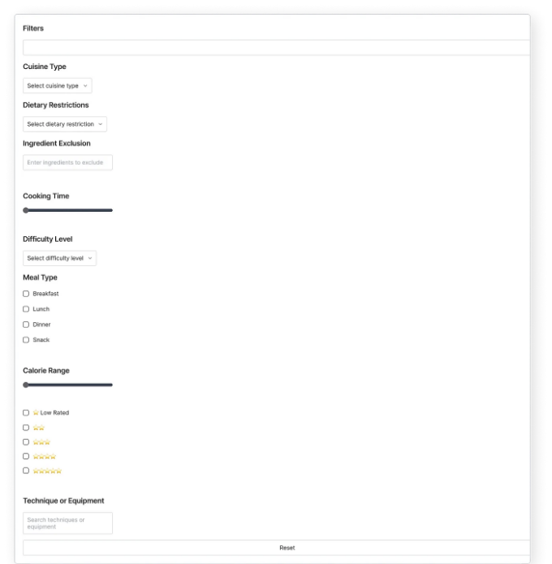

사이드바는 만들어 졌는데 320픽셀이 아닌 것 같아요; 웹 앱 생성의 기본이 1440픽셀이라서 그런 것 같아요, 그렇지만 아무튼, 클릭 두 번으로 320픽셀로 설정했어요, 그래서 큰 문제 아니에요.

## UX Pilot에서 좋았던 점

- 한 번의 클릭으로 많은 아이디어를 제공해줘요, 그래서 빠르게 디자인을 발견하고 더 많은 아이디어를 생성할 수 있어요.
- 와이어프레임을 생성한다는 점이 프로세스를 쉽게 만들어 줘요, 화면 구조에만 집중할 수 있어요.
- 필요한 정보를 쉽게 정리해주어요. 무엇이 필요한지 대강 알고 있다면 Figma에서 사각형을 이리저리 움직이는 시간 낭비하기보다 플러그인에게 일을 시키는 게 더 낫아요.
- 간단한 와이어프레임 디자인입니다. (수기로 쓴 스타일이 아니에요.)
- 세부 사항을 잘 이해해서 구체적으로 표현할 수 있어요.

<!-- ui-log 수평형 -->

<ins class="adsbygoogle"
      style="display:block"
      data-ad-client="ca-pub-4877378276818686"
      data-ad-slot="9743150776"
      data-ad-format="auto"
      data-full-width-responsive="true"></ins>
<component is="script">
(adsbygoogle = window.adsbygoogle || []).push({});
</component>

## 가격

- 무료 플랜: 워크숍 생성, 다이어그램, 플로우차트 및 이해관계자 인터뷰 제공
- 유료 플랜은 매달 6달러이며(연간 구독), 무료 플랜에 추가로 사용자 인터뷰, 디자인 리뷰, 무제한 UX 템플릿, Figma/FigJam의 11가지 AI 툴, 와이어프레임 생성기 등이 포함됩니다.

## 결론

본 플러그인은 좋은 선택이에요. 와이어프레임을 만드는 데 몇 시간을 보내는 대신 클릭 한 번으로 빠르게 만들 수 있어요. 또한 다양한 디자인 아이디어를 탐색하여 UX 디자인 프로세스를 가속화할 수 있습니다.

<!-- ui-log 수평형 -->

<ins class="adsbygoogle"
      style="display:block"
      data-ad-client="ca-pub-4877378276818686"
      data-ad-slot="9743150776"
      data-ad-format="auto"
      data-full-width-responsive="true"></ins>
<component is="script">
(adsbygoogle = window.adsbygoogle || []).push({});
</component>

모든 것을 완벽하게 처리하지는 못했지만, 거의 완벽에 가까웠고, 팀이 이러한 문제를 해결할 것으로 예상됩니다(결국 아직 베타 버전이기 때문에).

피그마 UI 킷을 플러그인과 연결하여 와이어프레임을 고품질 화면으로 변환하면 디자인 작업을 가속화하는 좋은 방법이 될 수 있습니다. 클릭 한 번으로 가능합니다.

## 요약하자면

이 기사에서는 인공지능을 활용한 두 가지 Figma 플러그인을 사용하는 방법을 소개했습니다.

<!-- ui-log 수평형 -->

<ins class="adsbygoogle"
      style="display:block"
      data-ad-client="ca-pub-4877378276818686"
      data-ad-slot="9743150776"
      data-ad-format="auto"
      data-full-width-responsive="true"></ins>
<component is="script">
(adsbygoogle = window.adsbygoogle || []).push({});
</component>

우리가 처음 살펴본 플러그인은 Musho였어요. 이 플러그인은 랜딩 페이지에 더 적합하며 이미지가 포함된 랜딩 페이지를 생성하고 프롬프트를 기반으로 텍스트를 추가할 수 있어요. 우리는 네아폴리탄 피자를 소개하는 랜딩 페이지를 만들기 위해 이를 사용했고, 결과물을 여러 번 수정해 나갔어요.

이어서 UX Pilot을 살펴보았어요. 이 도구는 UX 디자이너에게 유용한 AI 기능을 갖추고 있어요. 우리는 Wireframe 기능에 중점을 두어 그 작동 방식을 보여주고 복잡한 앱을 디자인하는 데 어떻게 도움을 주는지 살펴봤어요. 그 후에 레시피 앱을 만들고 결과물을 여러 번 수정했어요.

<!-- ui-log 수평형 -->

<ins class="adsbygoogle"
      style="display:block"
      data-ad-client="ca-pub-4877378276818686"
      data-ad-slot="9743150776"
      data-ad-format="auto"
      data-full-width-responsive="true"></ins>
<component is="script">
(adsbygoogle = window.adsbygoogle || []).push({});
</component>
