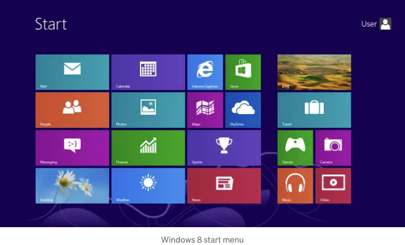

매년 새로운 디자인 트렌드들이 등장하는데, 그것들은 좋아 보이는 것뿐만 아니라 다른 디자이너들에게 영향을 주어 트렌드를 '도용'하도록 만듭니다. 그것을 좋아하든 싫어하든, 실은 어떤 디자인 흐름들이 현명하고 기능적입니다. 이 기능들은 더 적은 공간에 더 많은 정보를 포함하거나 사용자들과 더 많은 상호작용을 만드는 것 등 다양할 수 있습니다.

이제 우리가 지켜봐야 할 인터넷을 접수하는 몇 가지 트렌드를 살펴보겠습니다!

# 어린이의 도시락 상자 이상 — 벤토 박스

벤토 박스는 일본의 기찬상 및 도시락 문화에서 중요한 위치를 차지합니다. 그들은 음식을 꽤 조직된 형식으로 저장하고 물건을 깔끔하게 유지하는 데 잘 알려져 있습니다.

<!-- ui-log 수평형 -->

<ins class="adsbygoogle"
      style="display:block"
      data-ad-client="ca-pub-4877378276818686"
      data-ad-slot="9743150776"
      data-ad-format="auto"
      data-full-width-responsive="true"></ins>
<component is="script">
(adsbygoogle = window.adsbygoogle || []).push({});
</component>

여러분은 누가 이것을 고안한 건지 알 수 없겠지만, 벤토 박스는 음식이 들어있는 가방만큼 디지털 화면에서도 훌륭하게 어울립니다.

벤토는 드리블(Dribbble)이나 베한스(Behance) 같은 플랫폼에서 파도를 일으키기 시작한 또 다른 디자인 트렌드입니다. 수백만 명의 디자이너들이 이를 차용하게 되었는데, 그러나 "모듈식" 디자인 개념은 웹사이트 대시보드를 위해 시작되었습니다. 이는 페이팔(PayPal)과 같은 판매 및 금융 대시보드, Google Ads와 같은 분석 등을 포함합니다.

윈도우폰(Windows phone)과 루미아(Lumia)를 기억하시나요? 그들이 사용했던 UI는 본질적으로 벤토 디자인의 초기 버전이었습니다. 나중에 마이크로소프트도 이 개념을 윈도우 데스크톱 시작 메뉴에 Windows 8로 구현했습니다.

<!-- ui-log 수평형 -->

<ins class="adsbygoogle"
      style="display:block"
      data-ad-client="ca-pub-4877378276818686"
      data-ad-slot="9743150776"
      data-ad-format="auto"
      data-full-width-responsive="true"></ins>
<component is="script">
(adsbygoogle = window.adsbygoogle || []).push({});
</component>

산업 전반에서 사용되던 중, 애플이 처음으로 벤토 그리드를 사용하기로 결정하자 벤토 디자인이 대폭 확산되었습니다. 초기에는 iPhone 랜딩 페이지에서 사용되었지만, 곧 애플 이벤트 슬라이드와 프레젠테이션으로 확대되었습니다.

애플은 메가 트렌드를 시작하는 것으로 널리 알려져 있으며, 벤토는 이 중 하나였습니다. 모든 디자이너와 그들의 삼촌이 프레젠테이션, 웹사이트, 제품 출시 등에 벤토를 사용하고 있습니다.

<!-- ui-log 수평형 -->

<ins class="adsbygoogle"
      style="display:block"
      data-ad-client="ca-pub-4877378276818686"
      data-ad-slot="9743150776"
      data-ad-format="auto"
      data-full-width-responsive="true"></ins>
<component is="script">
(adsbygoogle = window.adsbygoogle || []).push({});
</component>

이전 벤토류 디자인과 새로운 트렌드의 가장 큰 차이는 격자의 각 섹션이 그룹의 일부가 아닌 고유한 공간을 나타낸다는 점입니다.

다른 많은 UI 디자인 트렌드와는 달리, 벤토는 예쁜 레이아웃 스타일 이상으로 발전하고 있습니다. 이제 제품 데모를 포함하고 다양한 고유한 레이아웃과 새로운 시각적 디자인 개념을 섞어 스타일을 부여하고 있습니다.

다음을 참고해보세요:

<!-- ui-log 수평형 -->

<ins class="adsbygoogle"
      style="display:block"
      data-ad-client="ca-pub-4877378276818686"
      data-ad-slot="9743150776"
      data-ad-format="auto"
      data-full-width-responsive="true"></ins>
<component is="script">
(adsbygoogle = window.adsbygoogle || []).push({});
</component>

위 예제는 diagram.com에서 가져왔습니다. 이 사이트는 상호작용하는 경험을 통해 도구가 무엇을 할 수 있는지 실제 예시를 보여주기 위해 벤토 그리드를 사용합니다. 이는 도구를 더 매력적으로 만들어주고 사용자들에게 무엇을 기대해야 하는지 알려줍니다.

우리 디자이너들을 돕기 위해 웹 전체에서 벤토 디자인 영감을 전하는 웹사이트들이 몇 군데 있습니다. bentogrids.com이라는 웹사이트가 그 중 하나인데요, 이곳은 UI 및 그래픽 디자인을 위한 단지 벤토 그리드의 대규모 컬렉션을 제공합니다. 이 웹사이트를 만든 창조자들에게 축복을!

# 공간 디자인 트렌드 & 기술 발전

아침에 일어나서 화장실에서 '중요한 이메일'을 확인하려고 핸드폰을 들어올리는데, 화면에는 애플의 새로운 비전 프로가 가득 차 있습니다. 이것은 2023년 6월 5일 세계의 모든 기술과 디자인 애호가의 정확한 아침이었습니다.

<!-- ui-log 수평형 -->

<ins class="adsbygoogle"
      style="display:block"
      data-ad-client="ca-pub-4877378276818686"
      data-ad-slot="9743150776"
      data-ad-format="auto"
      data-full-width-responsive="true"></ins>
<component is="script">
(adsbygoogle = window.adsbygoogle || []).push({});
</component>

이번 몇 주 동안, 기술 세계에서 이것만큼 논의되는 주제는 없었고 모든 디자이너들이 공간 디자인 기술을 배우려고 노력했습니다. 디자인 트렌드 외에도 다양한 AR/VR 스타트업이 주목을 받았고 그들의 기술에 대한 이야기가 마침내 나왔습니다. 이는 AR과 VR에 정말 필요한 진정한 힘을 실어 주었습니다.

훌륭한 기술이면 훌륭한 디자인 잠재력이 따라옵니다. 스마트워치부터 접히는 폰까지, 디자이너들은 항상 자신들의 적응력을 보여 왔습니다. 공간 디자인도 예외가 아니었습니다.

<!-- ui-log 수평형 -->

<ins class="adsbygoogle"
      style="display:block"
      data-ad-client="ca-pub-4877378276818686"
      data-ad-slot="9743150776"
      data-ad-format="auto"
      data-full-width-responsive="true"></ins>
<component is="script">
(adsbygoogle = window.adsbygoogle || []).push({});
</component>

인기 있는 디자이너를 위한 새로운 도구 "Bezi"의 출시와 함께 제공됩니다. 이 도구는 Figma나 Spline과 유사하지만 3차원 요소가 추가되어 있습니다. 디자이너들은 공간 디자인에 참여할 수 있고, 작동하는 AR/VR 헤드셋을 연결하여 대화형 공간 경험을 만들 수 있습니다.

Bezi가 우리에게 제공하는 작은 시연:

더 나은 AR/VR 경험의 큰 기여자는 더 나은 사용자 경험(UX)입니다. 예쁜 디자인 뒤의 기술을 심오하게 이해하고, 실제 VR 헤드셋을 사용해 테스트하고, 공간 환경에서 것들을 실험하는 것이 이 직업의 일부가 될 것입니다. 우리가 앞으로 나아가면 UX에 대한 현재의 이해에 많은 새로운 교훈과 변화가 있을 것입니다. 그러나 지금 이 기술을 쌓고 나중에 가능하게 사용할 수 있는 기술 중 하나입니다.

<!-- ui-log 수평형 -->

<ins class="adsbygoogle"
      style="display:block"
      data-ad-client="ca-pub-4877378276818686"
      data-ad-slot="9743150776"
      data-ad-format="auto"
      data-full-width-responsive="true"></ins>
<component is="script">
(adsbygoogle = window.adsbygoogle || []).push({});
</component>

애플의 큰 상상력과 깊은 자금 이외에도, 안경을 착용하는 경험을 완전히 새롭게 만드는 몇 가지 기술에 비교적 익숙하지 않은 기업들이 있습니다.

구글의 "구글 글래스" 프로젝트가 대규모 생산에 이르지 않았지만, 선글라스 회사 레이밴은 스마트 웨어러블 경주에 새로운 메타 웨이페어를 선보이며 참여하였습니다.

일반적인 레이밴 디자인에 속지 마세요. 내장 카메라와 스마트 기능을 통해 비디오/이미지를 저장하고 소셜 미디어에 라이브 스트리밍할 수 있습니다. 이것은 사용자 경험과 고객 경험에 새로운 차원을 제공합니다. 어쩌면, 2025년의 트렌드가 될지도 모릅니다!

<!-- ui-log 수평형 -->

<ins class="adsbygoogle"
      style="display:block"
      data-ad-client="ca-pub-4877378276818686"
      data-ad-slot="9743150776"
      data-ad-format="auto"
      data-full-width-responsive="true"></ins>
<component is="script">
(adsbygoogle = window.adsbygoogle || []).push({});
</component>

# 모두가 애니메이션을 만들 수 있어요!

새로운 트렌드는 새로운 기술이 더 많은 사람에게 접근 가능해지면 종종 탄생합니다.

이것이 LottieFiles의 하나의 사명이었습니다. 제가 전도사로서 회사에 합류했을 때, 어떤 툴에서든 어떤 UI에든 쉽게 추가할 수 있는 애니메이션들이 놀라울 정도로 멋있었어요. Lottie 애니메이션에 대한 수요를 보고, 그들은 심지어 Figma용 플러그인을 출시하여 우리가 Figma 애니메이션을 내보낼 수 있는 lottie JSON 파일로 변환할 수 있도록 했죠.

<!-- ui-log 수평형 -->

<ins class="adsbygoogle"
      style="display:block"
      data-ad-client="ca-pub-4877378276818686"
      data-ad-slot="9743150776"
      data-ad-format="auto"
      data-full-width-responsive="true"></ins>
<component is="script">
(adsbygoogle = window.adsbygoogle || []).push({});
</component>

이는 After Effects 및 유사한 소프트웨어의 큰 학습 곡선을 없애줍니다. 따라서 더 많은 디자이너들이 빠르게 자체적으로 애니메이션을 만들 수 있게 되었어요.

요즘 모든 기업의 랜딩 페이지에 매력적인 상호작용이 눈에 띄시나요? 이는 웹사이트 방문자를 위한 차별화된 경험이 필요해지고 제품/서비스를 판매하는 데 스토리텔링에 대한 더 많은 수요가 있기 때문입니다.

다음은 랜딩 페이지의 상호작용 사례입니다:

<!-- ui-log 수평형 -->

<ins class="adsbygoogle"
      style="display:block"
      data-ad-client="ca-pub-4877378276818686"
      data-ad-slot="9743150776"
      data-ad-format="auto"
      data-full-width-responsive="true"></ins>
<component is="script">
(adsbygoogle = window.adsbygoogle || []).push({});
</component>

스크롤 애니메이션을 사용하면 방문자들이 여러분이 제시하는 내용에 몰입할 것입니다. Webflow와 Framer와 같은 노코드 도구들은 디자이너들에게 긴 코드를 쓰지 않고도 이러한 애니메이션 기능을 제공하도록 영원히 혁신하고 있습니다.

여기서 끝이라고 생각할 수도 있겠지만, 애니메이션이 절정을 이루었고 더 이상 기대할 게 없는 것일 수도 있습니다. 우리에게 다행히도 기술 분야의 사람들은 항상 다음 큰 도약을 찾고 있습니다. 또한 끝없는 수많은 능숙한 도구들 덕분에 상상할 수 있는 모든 것이 가능해집니다.

그 중 하나가 새로운 "애니메이션 버튼 트렌드"입니다. 이 새로운 UI 스타일은 단순한 버튼을 활기차게 만들기 위해 애니메이션 기술을 도입합니다. 이 변화는 버튼 주변에 간단한 선 애니메이션부터 마우스 호버 시 버튼 내부에서 별이 움직이는 것까지 다양합니다.

<!-- ui-log 수평형 -->

<ins class="adsbygoogle"
      style="display:block"
      data-ad-client="ca-pub-4877378276818686"
      data-ad-slot="9743150776"
      data-ad-format="auto"
      data-full-width-responsive="true"></ins>
<component is="script">
(adsbygoogle = window.adsbygoogle || []).push({});
</component>

최근에는 많은 디자이너들이 평면 디자인(예를 들어 Medium에 있는 것처럼)에서 더 가상적인 시각 스타일로 전환되고 있다고 이야기하고 있습니다. 이에는 3D 그래픽, 깊이 효과, 뉴에모피즘, 스퀴오모피즘 등이 포함됩니다.

최근에는 많은 기업들이 3D를 핵심 스타일로 채택하는 것을 보았습니다. 웹 및 앱 디자인에서 바로 나타나지 않더라도 로고가 이 새로운 트렌드와 함께 업데이트되고 있습니다.

<!-- ui-log 수평형 -->

<ins class="adsbygoogle"
      style="display:block"
      data-ad-client="ca-pub-4877378276818686"
      data-ad-slot="9743150776"
      data-ad-format="auto"
      data-full-width-responsive="true"></ins>
<component is="script">
(adsbygoogle = window.adsbygoogle || []).push({});
</component>

원형(Like the other design trends), 사람들이 이러한 스타일을 적용하는 큰 이유 중 하나는 Spline 및 Vectary와 같은 "쉽게 사용 가능한" 웹 기반 3D 도구가 등장했기 때문입니다. 이 도구들을 사용하면 웹 및 앱에 3D 에셋을 쉽게 포함할 수 있습니다. 이러한 도구들은 애니메이션을 사용하여 3D 에셋을 살아있게 만들며, 제가 경험해 본 것 중에서 학습 커브가 가장 짧은 것 같습니다.

또 다른 디자인과 트렌드를 항상 주도해온 회사로는 에어비앤비가 있습니다. 그들은 간단하면서 효과적인 앱 디자인과 상호작용으로 널리 알려져 있습니다. 2023년에 그들은 새로운 중요한 기능을 가져올 앱 업데이트를 발표했습니다.

그들은 무엇을 했냐면, 3D적인 시각적 요소를 한 두라도 더 포함했으며, 그들의 발표 비디오는 거의 모두 3D에 관한 것입니다.

<!-- ui-log 수평형 -->

<ins class="adsbygoogle"
      style="display:block"
      data-ad-client="ca-pub-4877378276818686"
      data-ad-slot="9743150776"
      data-ad-format="auto"
      data-full-width-responsive="true"></ins>
<component is="script">
(adsbygoogle = window.adsbygoogle || []).push({});
</component>

등시각적 효과, 3D 캐릭터와 애니메이션, 그리고 다양한 앱 상호작용이 있어 반복해서 보고 싶어지죠. 평면에서 3D로의 전환은 정말 천천히 이루어지고 있으며, 이로 인해이 트렌드가 계속 되리라고 믿습니다.

그렇다면 이 트렌드를 시작한 사람은 항상 의문이 될 것이지만, 현실적이고 공감할 수 있는 디자인에 대한 수요는 우리를 혁신하게 만들고 사용자와 우리 자신의 이기적인 창의적 동기를 불러 일으킵니다.

# A.I. 디자인 도구의 홍수 — 동지인가 적인가?

<!-- ui-log 수평형 -->

<ins class="adsbygoogle"
      style="display:block"
      data-ad-client="ca-pub-4877378276818686"
      data-ad-slot="9743150776"
      data-ad-format="auto"
      data-full-width-responsive="true"></ins>
<component is="script">
(adsbygoogle = window.adsbygoogle || []).push({});
</component>

인공지능은 지난 10년 동안 기술 분야에서 가장 많이 사용되고 인정받는 단어입니다. 일부 디자이너는 이를 자신의 직업 미래에 대한 위협으로 여기지만, 대부분의 사람들은 이 기술을 활용하여 더 빠르고 최고의 디자인을 만들고 있습니다.

일부 디자인 도구는 "A.I. 기반"으로 광고하며, 다양한 수준에서 Open A.I. API를 구현하려 하며, 자체 A.I. 모델에도 작업하고 있습니다. 그러나 대부분의 이러한 A.I. 기능은 단순히 꾸며놓은 것에 불과합니다. UI를 무작위로 디자인하거나 에셋을 섞어 배치하거나 어려운 문제에 대한 기본적인 솔루션을 제공하는 것이 다소 비판할 점입니다. 이는 많은 커뮤니티 회원들이 지지하는 비판입니다.

이러한 꾸며놓음들의 혼란 가운데 구원의 영웅 몇몇이 있습니다. 그 중 하나가 Relume으로, 분명한 팬들 사이에서 매력적인 업체입니다. 이 Webflow에 초점을 맞춘 회사는 Relume A.I.라는 강력한 와이어프레이밍 및 사이트맵 도구를 출시했습니다.

<!-- ui-log 수평형 -->

<ins class="adsbygoogle"
      style="display:block"
      data-ad-client="ca-pub-4877378276818686"
      data-ad-slot="9743150776"
      data-ad-format="auto"
      data-full-width-responsive="true"></ins>
<component is="script">
(adsbygoogle = window.adsbygoogle || []).push({});
</component>

당신이 요청을 넣으면, 즉 프로젝트 설명을 입력하면, 완전하고 자세한 사이트 맵과 와이어프레임이 생성됩니다. 이 와이어프레임에는 빠르게 Figma와 Webflow로 복사할 수 있는 관련 데이터와 레이아웃이 가득합니다.

Chat-GPT가 인간의 창의력을 망가뜨리고 의존성을 만들고 있다고 생각하는 사람은 나뿐인가요?

# 보다 신중하고 이타적인 UX

<!-- ui-log 수평형 -->

<ins class="adsbygoogle"
      style="display:block"
      data-ad-client="ca-pub-4877378276818686"
      data-ad-slot="9743150776"
      data-ad-format="auto"
      data-full-width-responsive="true"></ins>
<component is="script">
(adsbygoogle = window.adsbygoogle || []).push({});
</component>

시각과 UI 디자인에 대해 충분히 이야기했습니다. 최소한 UX는 발전했으며, 이는 UX 연구원과 디자이너들이 집중하는 것으로 정당화될 수 있습니다. 이는 디자인을 접근 가능하고 포용적으로 만들기 위해 프로세스를 단순화하는 것을 의미합니다.

많은 디자이너들이 시각 디자인보다 사용자 경험에 발을 담그고 있습니다. 이로 인해 더 간단하고 실행 가능한 디자인이 중심에 나타나고 있습니다. 지난 몇 년간 산업의 변화에도 불구하고, 디자이너들은 바퀴를 재창조하는 대신 작동하는 방식을 고수하고 있습니다.

<!-- ui-log 수평형 -->

<ins class="adsbygoogle"
      style="display:block"
      data-ad-client="ca-pub-4877378276818686"
      data-ad-slot="9743150776"
      data-ad-format="auto"
      data-full-width-responsive="true"></ins>
<component is="script">
(adsbygoogle = window.adsbygoogle || []).push({});
</component>

위의 Google Trends 그래프는 얼마나 접근성 디자인이 정말 산업 요구사항이 되었는지 보여줍니다.

이러한 접근성 기술은 색 대비, 가독성 있는 글꼴, 인식 가능한 작업 요소부터 다르게 능력이 제한된 사람들에 의한 그림자까지 다양합니다. 이를 통해 접근성 중심의 기능들을 게시판으로 가져옵니다.

## 왜 접근성이 필요한가요?

접근성은 현재 모든 연령대와 신체적 제약을 가진 사람들을 위해 디자인해야 하는 필요성으로 크게 밀려나고 있습니다. 기업들은 모든 다양한 인구층을 대상으로 수혜를 보기를 원하며 모든 측면에서 포용성을 증진시키고자 노력합니다. 점점 더 많은 사람들이 디지털화되면 디자이너가 접근성 있는 디자인에 집중하는 것은 거의 필수적입니다.

<!-- ui-log 수평형 -->

<ins class="adsbygoogle"
      style="display:block"
      data-ad-client="ca-pub-4877378276818686"
      data-ad-slot="9743150776"
      data-ad-format="auto"
      data-full-width-responsive="true"></ins>
<component is="script">
(adsbygoogle = window.adsbygoogle || []).push({});
</component>

수강과 부트캠프가 수요를 잘 파악하고 있고, 학생들이 접근성 디자인에 대한 좋은 지식을 갖추도록 준비하고 있습니다.

## 개인화

접근성 외에도, 개인화가 앱이나 웹사이트에 사람들을 끌어들이는 중요한 요소입니다. 아마도 유튜브에서 이런 작은 메시지를 본 적이 있을 겁니다 —

<!-- ui-log 수평형 -->

<ins class="adsbygoogle"
      style="display:block"
      data-ad-client="ca-pub-4877378276818686"
      data-ad-slot="9743150776"
      data-ad-format="auto"
      data-full-width-responsive="true"></ins>
<component is="script">
(adsbygoogle = window.adsbygoogle || []).push({});
</component>

여러분이도 앱에서 몇 일 동안 새로운 기능을 실험하고, 사용자들이 그것을 좋아하지 않아서 다시 철회하는 것을 볼 수도 있습니다. 이것은 UX 디자이너들이 제품과 서비스의 미래에 대해 주도권을 쥐고 있다는 직접적인 표현입니다.
