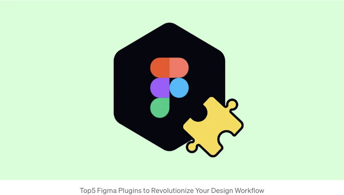

안녕하세요, 디자인 애호가 여러분! 여러분의 Figma 작업 공간을 진지하게 강화할 준비가 되셨나요? 즉시 어필해보세요, 왜냐하면 디자인 커뮤니티에서 게임을 바꾸는 AI 향상 Figma 플러그인의 세계로 뛰어들 준비가 돼 있습니다. 세련된 UI를 만들거나 화려한 그래픽을 즉석에서 만들어야 할 때라면, 이러한 플러그인은 작은 디자인 조수가 있는 것과 같아요. 창의적인 프로세스가 원활하고 빠르며 훨씬 똑똑해집니다. 그러니, 한 번 최고의 AI 기반 Figma 플러그인에 대해 알아보도록 하죠!

## 1. Autoflow — 와이어프레임을 위한 마음 읽는 자

첫 번째로, Autoflow가 등장했어요. 말해드릴게요, 마치 당신의 마음을 읽을 수 있는 것처럼요! 디자인 요소를 연결하기 위해 화살표와 경로를 수동으로 그리는 것에 지쳤나요? Autoflow가 당신을 지원해줄 거에요. 두 객체를 선택하기만 하면, 범벅! — 그들 사이에 완벽히 흐르는 선을 마법처럼 그려줍니다. 마치 사용자의 시선이 어디로 가길 원하는지 정확히 알고 있는 영감을 주는 비서가 있는 것과 같아요.

<!-- ui-log 수평형 -->

<ins class="adsbygoogle"
      style="display:block"
      data-ad-client="ca-pub-4877378276818686"
      data-ad-slot="9743150776"
      data-ad-format="auto"
      data-full-width-responsive="true"></ins>
<component is="script">
(adsbygoogle = window.adsbygoogle || []).push({});
</component>

## 2. Figmotion — Animation Wizard

Figmotion은 정적 디자인을 쉽게 아이캐치하는 애니메이션으로 바꾸어 주는 플러그인입니다. 마치 Figma 안에 있는 개인 애니메이션 스튜디오 같은 존재죠. 당신이 디자인에 생명을 불어넣을 때 마법사가 되어야 할 필요가 없어요; Figmotion은 직관적이고, 말해봐야 할까요, 즐거운 일로 만들어줍니다! 발표 자료에 애니메이션 효과를 더하거나 UI/UX 작업이 기능적일 뿐만 아니라 WOW 요소도 갖추도록 만드는 데 완벽한 툴이에요.

## 3. Content Reel — Lorem Ipsum을 톡톡히 살려주는 킬러

지루한 자리채우기 텍스트와 일반적인 이미지와 작별하세요! Content Reel이 나타났습니다. 멋진 제목이 필요하신가요? 그렇다면. 매력적인 프로필 사진이 필요하신가요? 그런 것들을 제공해주죠. 본 플러그인은 당신이 쉽게 디자인에 끌어다 놓을 수 있는 텍스트, 이미지 및 아이콘의 컬렉션인 콘텐트 릴을 만들고 공유할 수 있게 해줍니다. 손끝으로 끌어다 놓을 수 있는 콘텐트 뷔페가 있는 것과 같아서, 당신의 디자인을 실감나고 공감력이 있는 것으로 만들어주죠.

<!-- ui-log 수평형 -->

<ins class="adsbygoogle"
      style="display:block"
      data-ad-client="ca-pub-4877378276818686"
      data-ad-slot="9743150776"
      data-ad-format="auto"
      data-full-width-responsive="true"></ins>
<component is="script">
(adsbygoogle = window.adsbygoogle || []).push({});
</component>

## 4. Design Lint - 내 개인적인 디자인 비평가

Design Lint은 이를 알려주는 솔직한 친구처럼 작동합니다. 치아 사이에 시금치가 끼어 있다는 사실을 말하는 데 겁이 없는 그 친구 말이죠. 디자인 Lint는 디자인을 불일치와 오류로부터 스캔하여, 세계로 보내기 전에 모든 것이 옳은지 확인하는 필수 플러그인입니다. 서로 어울리지 않는 글꼴부터 틀어지거나 비뚤어진 간격까지, Design Lint는 당신을 검사하여 모든 것이 자리에 맞게 하는 데 도움을 줍니다. 왜냐하면, 솔직히 말해서 때로는 두 번째 눈이 필요한 법이니까요.

## 5. Assistant - AI 공동 디자이너

마침내 마지막으로, 꿈의 AI 공동 디자이너인 Assistant를 만나보세요. 항상 제안을 해주고, 아이디어를 생성하고, 심지어 곧바로 디자인 요소를 만들어 내 줄 친구가 있다고 상상해보세요. 그것이 바로 Assistant입니다. 당신과 같은 열정으로 여러분의 프로젝트에 관심을 두는 슈퍼 스마트하고 슈퍼 창의적인 친구와 공동 작업하듯이 협력하는 느낌을 주죠.

<!-- ui-log 수평형 -->

<ins class="adsbygoogle"
      style="display:block"
      data-ad-client="ca-pub-4877378276818686"
      data-ad-slot="9743150776"
      data-ad-format="auto"
      data-full-width-responsive="true"></ins>
<component is="script">
(adsbygoogle = window.adsbygoogle || []).push({});
</component>

그런 식으로요, 여러분들 — AI로 구동되는 Figma 플러그인의 크림 드 라 크림을 소개했습니다. 디자인 프로세스를 터보 충전할 수 있는 툴들이에요. 경험 있는 전문가든 디자인 여정을 시작한 막내든, 이 도구들은 여러분의 삶을 쉽게 만들어주고 여러분의 작업을 돋보이게 만들어 줄 거예요. 그러니 한 번 시도해보고 어떻게 여러분의 창의력을 발휘할 수 있는지 확인해보세요. 디자인의 미래가 여기 있고, AI가 훌륭하죠!

만약 다른 AI 플러그인을 사용한 적이 있다면 알려주세요 ;)
