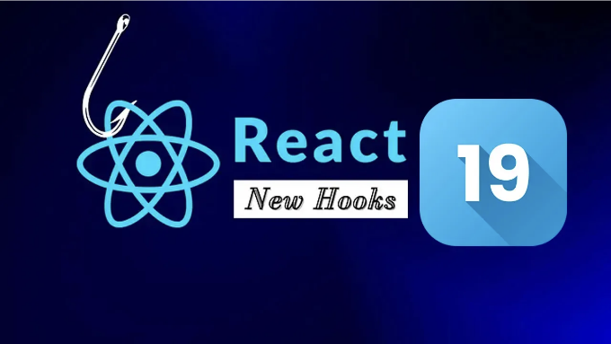

React 19이 나왔어요! 이번에는 흥미로운 새로운 것들이 많이 추가되었어요. 이 중에서 가장 눈에 띄는 것은 네 가지 새로운 훅이에요: useOptimistic, useFormStatus, useFormState, 그리고 재미있게도 use라고 불리우는 훅이 있어요. 이제 이 훅들로 당신의 코딩 모험에 조금의 마법을 부어볼까요?

# React 19의 새로운 훅들 살펴보기:

- useOptimistic: 상상해보세요. 버튼을 클릭하면 즉시 UI가 업데이트되는 걸요! 서버가 따라잡기를 기다릴 필요가 없는 즉각적인 UI 업데이트를 의미하는 낙관적 UI가 있어요. useOptimistic 훅을 사용하면 이를 쉽게 구현할 수 있어요. 서버로부터 확인을 받기 전에 UI를 낙관적으로 업데이트할 수 있게 해주어 사용자 경험을 보다 부드럽게 만들어줘요. useOptimistic를 사용하면 사용자가 피드백을 기다리는 동안 손을 비집고 기다릴 필요가 없어요.

<!-- ui-log 수평형 -->

<ins class="adsbygoogle"
      style="display:block"
      data-ad-client="ca-pub-4877378276818686"
      data-ad-slot="9743150776"
      data-ad-format="auto"
      data-full-width-responsive="true"></ins>
<component is="script">
(adsbygoogle = window.adsbygoogle || []).push({});
</component>

2. useFormStatus: useFormStatus 훅은 폼 필드의 상태를 관리하고 유효성 검사 로직 및 제출 상태를 처리하여 폼 관리를 쉽게 만듭니다. 마지막 폼 제출의 상태 정보를 제공합니다.

3. useFormState: useFormState 훅은 폼 입력 상태 관리자로서 중앙 집중식 메커니즘을 제공하여 값들을 효율적으로 모니터링하고 수정할 수 있습니다. 이는 폼 작업의 결과에 따라 상태를 업데이트할 수 있도록 해줍니다.

이 훅은 두 개의 인수가 필요합니다:

- fn: 이 매개변수는 폼이 제출되거나 버튼이 눌렸을 때 실행할 함수를 나타냅니다. 실행 시, 이 함수는 초기 인수로 폼의 이전 상태(처음에는 전달한 initialState이며, 이후에는 이전 반환 값)를 받고, 그 후에는 일반적인 폼 작업이 받는 인수들이 따라옵니다.
- initialState: 이 인수는 폼에 대한 초기 상태 값을 나타냅니다. 직렬화 가능한 값이어야 합니다. 작업이 처음 호출되면 이 매개변수는 더 이상 관련이 없어집니다.

<!-- ui-log 수평형 -->

<ins class="adsbygoogle"
      style="display:block"
      data-ad-client="ca-pub-4877378276818686"
      data-ad-slot="9743150776"
      data-ad-format="auto"
      data-full-width-responsive="true"></ins>
<component is="script">
(adsbygoogle = window.adsbygoogle || []).push({});
</component>

4. `use`는 다양한 용도로 설계된 React Hook으로, 컴포넌트나 사용자 지정 훅 내에서 Promise나 컨텍스트와 같은 리소스의 값을 가져와 활용하는 데 사용됩니다. `use`를 다른 React Hook과 구분 짓는 특징은 반복문이나 조건문(if 블록과 같은) 내에서 호출될 수 있는 고유한 능력입니다. 하지만, 여전히 `use`를 활용하는 함수는 컴포넌트나 다른 훅이어야 한다는 표준 요구 사항을 준수합니다.

그럼 이만 글을 마치겠습니다! React 19의 새로운 훅과 그들의 잠재적인 사용 방법에 대해 자세히 알아보고 싶다면, 공식 React 문서에서 확인해보세요:
use, useFormState, useFormStatus, useOptimistic

그러니 다음에 코딩하실 때는 이러한 훅을 염두에 두세요. 그들은 여러분의 삶을 더 쉽게 만들어주고 프로젝트를 훨씬 멋지게 만들어줄 거에요. 결국, 웹 개발 세계에서는 항상 새로운 것에 주목하는 것이 중요하니까요. 즐거운 코딩되세요!
