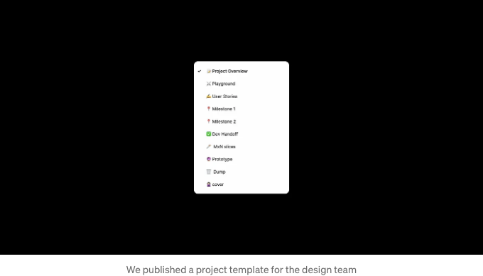

새로운 멋진 제품을 디자인하고 있다고 상상해봐. 집중이 잘되어 창의적인 생각이 넘쳐나지만, 문제 하나가 있어 — 너와 사람들을 놀라게 할 디자인 사이에 서있는 일상적이고 시간이 오래 걸리는 것이 있어.

# Figma 플러그인 등장!! 🚀

Part 1에서 나는 Figma 플러그인을 만들어 나의 아이디어를 현실적이고 유용한 것으로 바꾸고 싶다는 열망에서 시작했다고 말했어. Swiggy에서 내부 플러그인을 만들어 번거로운 작업을 자동화했고, 사용자를 위한 복잡한 문제를 해결하는 데 집중할 수 있도록 도와주었던 이야기야.

<!-- ui-log 수평형 -->

<ins class="adsbygoogle"
      style="display:block"
      data-ad-client="ca-pub-4877378276818686"
      data-ad-slot="9743150776"
      data-ad-format="auto"
      data-full-width-responsive="true"></ins>
<component is="script">
(adsbygoogle = window.adsbygoogle || []).push({});
</component>

저는 그러는 동안, 시스템에서 일하는 법, 개발자와의 더 나은 협업 등과 같이 제 전문 분야 외의 많은 것들을 배울 수 있었습니다. 다른 디자이너들의 삶을 더 쉽게 만드는 것이 정말로 저를 이어나가게 했어요.

이 기사에서는 그 이후로 우리가 개발한 새로운 Figma 플러그인들 뒤에 숨겨진 마법을 풀어드리겠습니다. 그리고 어떻게 이것이 우리의 디자인 능력을 새로운 수준으로 끌어올렸는지에 대해 이야기할 거에요.

놀라실 준비가 되셨나요? 함께 알아보도록 합시다!

<!-- ui-log 수평형 -->

<ins class="adsbygoogle"
      style="display:block"
      data-ad-client="ca-pub-4877378276818686"
      data-ad-slot="9743150776"
      data-ad-format="auto"
      data-full-width-responsive="true"></ins>
<component is="script">
(adsbygoogle = window.adsbygoogle || []).push({});
</component>

# 파일 구성 📝

간단한 것부터 시작해 보죠. 아래 스크린샷을 살펴보세요. 여러 방향을 탐색하다 보면 우리 모두 조금은 엉망일 때가 있죠. 😛

만약 누군가 이 파일에 뛰어들면 어떨까요? 개발자들이 최종 사용자 흐름, 특수 사례, 또는 그 마이크로 상호 작용을 언제 보여줘야 하는지에 대해 계속해서 물어오는 것은 원치 않으실 거예요. 팀 내 새로 온 디자이너나 새 프로젝트를 시작하는 디자이너들을 위해 이전 지식이나 문맥을 전달할 방법이 없었죠.

<!-- ui-log 수평형 -->

<ins class="adsbygoogle"
      style="display:block"
      data-ad-client="ca-pub-4877378276818686"
      data-ad-slot="9743150776"
      data-ad-format="auto"
      data-full-width-responsive="true"></ins>
<component is="script">
(adsbygoogle = window.adsbygoogle || []).push({});
</component>

초반에는 템플릿 프로젝트 파일을 만들었습니다. 이 방법은 어느 정도 작동했지만, 프로젝트를 시작할 때 여전히 파일을 복제하거나 기존 프로젝트를 이 형식으로 정리해야 했습니다. 여전히 많은 노력이 필요했죠.

이것을 더 빠르게 할 수 있는 방법이 없을까 궁금해졌습니다. File Organiser 플러그인을 만들었고, 이 플러그인은 자동으로 파일을 만들고 Project Overview(프로젝트의 기본 요약을 제공), Dev Handoff(최종 사용자 플로우를 고해상도 모의모델로 표시) 등의 페이지로 파일을 정리합니다.

<!-- ui-log 수평형 -->

<ins class="adsbygoogle"
      style="display:block"
      data-ad-client="ca-pub-4877378276818686"
      data-ad-slot="9743150776"
      data-ad-format="auto"
      data-full-width-responsive="true"></ins>
<component is="script">
(adsbygoogle = window.adsbygoogle || []).push({});
</component>

# 이미지 작업하기 🖼️

컴포넌트 내의 이미지를 교체하는 것은 Figma에서는 귀찮은 일이죠. 디자인 시스템의 자리 표시자 이미지로 목업을 디자인하고 제시하는 것은 아무도 원하지 않아요. 예를 들어, 식당 목록 컴포넌트를 생각해보세요. 스타벅스 이미지로 자리 표시자를 바꾸려면 그것을 떼어내지 않고는 불가능합니다.

그래서 우리는 선택한 이미지를 그냥 웹 주소를 사용하여 교체할 수 있는 플러그인을 만들었어요. 이제 컴포넌트나 인스턴스를 떼어내지 않아도 되요. 우리는 이 플러그인을 'Perfect Match!'라고 부르고 있어요! ✨

<!-- ui-log 수평형 -->

<ins class="adsbygoogle"
      style="display:block"
      data-ad-client="ca-pub-4877378276818686"
      data-ad-slot="9743150776"
      data-ad-format="auto"
      data-full-width-responsive="true"></ins>
<component is="script">
(adsbygoogle = window.adsbygoogle || []).push({});
</component>

가장 좋은 부분은 이것이 Swiggy 웹사이트에 제한되지 않는다는 것이다. 당신은 인터넷 상의 어떤 이미지에도 주소를 넣고 바로 적용할 수 있어요!

# 로스트 🔥

이건 제가 가장 좋아하는 부분이에요. 조금 전언이를 들려줄게요.

<!-- ui-log 수평형 -->

<ins class="adsbygoogle"
      style="display:block"
      data-ad-client="ca-pub-4877378276818686"
      data-ad-slot="9743150776"
      data-ad-format="auto"
      data-full-width-responsive="true"></ins>
<component is="script">
(adsbygoogle = window.adsbygoogle || []).push({});
</component>

우리는 디자인 시스템의 사용을 설정하고 관리하고 있었습니다. 핵심 DS 팀으로서, 우리는 디자이너들과의 감사 세션을 진행하여 누락된 스타일, 토큰의 잘못된 사용, 다른 라이브러리에서 사용된 컴포넌트 등과 같은 문제를 찾아 수정하는 것이었습니다.

그것은 일관성과 품질을 유지하는 데 필요했지만, 각각의 사소한 문제를 해결하는 데는 시간이 많이 걸렸습니다. 그리고 놓친 부분이 있으면 개발자들과의 소통이 많이 필요했습니다.

그런 다음 Roast가 등장했습니다 - 우리가 만든 작은 플러그인으로 디자인 시스템 문제를 식별하고 파일을 신속하게 준비하여 이관 과정을 수월하게 만들었습니다. 이 개념을 처음 접했던 것은 Uber Design이 Config 2021에서 그들의 플러그인을 소개했을 때였습니다. 이것이 공개적으로 제공되지 않았기 때문에 우리는 우리만의 것을 만들기로 결정했습니다.

<!-- ui-log 수평형 -->

<ins class="adsbygoogle"
      style="display:block"
      data-ad-client="ca-pub-4877378276818686"
      data-ad-slot="9743150776"
      data-ad-format="auto"
      data-full-width-responsive="true"></ins>
<component is="script">
(adsbygoogle = window.adsbygoogle || []).push({});
</component>

Swiggy Design 내부에서 발행한 이러한 글 때문에 많은 노력이 줄어들었어요. 이제는 여러 번의 세션을 진행할 필요가 거의 없어지고 사람들이 스스로 감사 프로세스를 진행하기 시작했어요.

그 이후로, 많은 피드백도 받았죠. 문제를 발견한 후에는 어떻게 해결할 수 있을까요. 동일한 문제를 갖고 있는 여러 레이어를 보여주는 대신, 유사한 문제를 결합할 수 있다면 어떨까요.

어떤 디자인 팀에게도 가치를 줄 수 있는 것을 보고, 저는 Figma 커뮤니티에 Roast를 발행해야겠다고 생각했어요. 이것은 라이브러리 저장, 토큰 사용자 정의 등을 포함한 새로운 기능을 추가해야 했답니다.

<!-- ui-log 수평형 -->

<ins class="adsbygoogle"
      style="display:block"
      data-ad-client="ca-pub-4877378276818686"
      data-ad-slot="9743150776"
      data-ad-format="auto"
      data-full-width-responsive="true"></ins>
<component is="script">
(adsbygoogle = window.adsbygoogle || []).push({});
</component>

당신은 roastdesign.com에서 플러그인을 받을 수 있어요.

# 접근성

Swiggy 앱은 다른 사람들과는 다르게 장애를 가진 사람들을 포용하고자 합니다. 시각 장애인을 위해, 우리는 화면의 주요 텍스트와 내용을 읽을 수 있도록 Voiceover (iOS) 및 Talkback (안드로이드) 기능을 지원합니다.

하지만 이것이 어떻게 이뤄졌었는지는 상당히 어려운 과정이었어요. 개발자는 일반적으로 스크린샷이 포함된 요청 문서를 작성했습니다. 그런 다음, A11y 팀은 초점 순서, Voiceover/작업에 대한 텍스트 등과 같은 세부 정보를 추가했고, 마지막으로 개발자는 사양에 따라 A11y 코드를 추가하기 시작했습니다.

<!-- ui-log 수평형 -->

<ins class="adsbygoogle"
      style="display:block"
      data-ad-client="ca-pub-4877378276818686"
      data-ad-slot="9743150776"
      data-ad-format="auto"
      data-full-width-responsive="true"></ins>
<component is="script">
(adsbygoogle = window.adsbygoogle || []).push({});
</component>

자동화를 위해 자체 접근성 플러그인인 Swa11y를 구축했습니다!

이는 프레임 내의 모든 Figma 요소에 포커스 순서, 음성 안내 텍스트 등을 정의합니다. 그리고 동일한 파일에 사억표를 생성합니다. 이로써 해당 프로젝트에서 작업하는 모든 디자이너들이 쉽게 개발자에게 접근성 사억 사항을 제공할 수 있습니다.

<!-- ui-log 수평형 -->

<ins class="adsbygoogle"
      style="display:block"
      data-ad-client="ca-pub-4877378276818686"
      data-ad-slot="9743150776"
      data-ad-format="auto"
      data-full-width-responsive="true"></ins>
<component is="script">
(adsbygoogle = window.adsbygoogle || []).push({});
</component>

일단 여기서 함께해요. Roast 플러그인의 접근성 문제를 찾고 있어요. 작은 글꼴 크기를 가진 텍스트 레이어나 배경에 대비가 낮은 레이어를 발견한다고 상상해보세요. 다음과 같은 것이죠:

# 여기까지 읽어주셔서 감사합니다!

여기까지 읽어주셔서 감사합니다. Figma 커뮤니티에서 공개된 플러그인을 확인해보세요: [figma.com/@milanmaheshwari](https://www.figma.com/@milanmaheshwari)

<!-- ui-log 수평형 -->

<ins class="adsbygoogle"
      style="display:block"
      data-ad-client="ca-pub-4877378276818686"
      data-ad-slot="9743150776"
      data-ad-format="auto"
      data-full-width-responsive="true"></ins>
<component is="script">
(adsbygoogle = window.adsbygoogle || []).push({});
</component>
