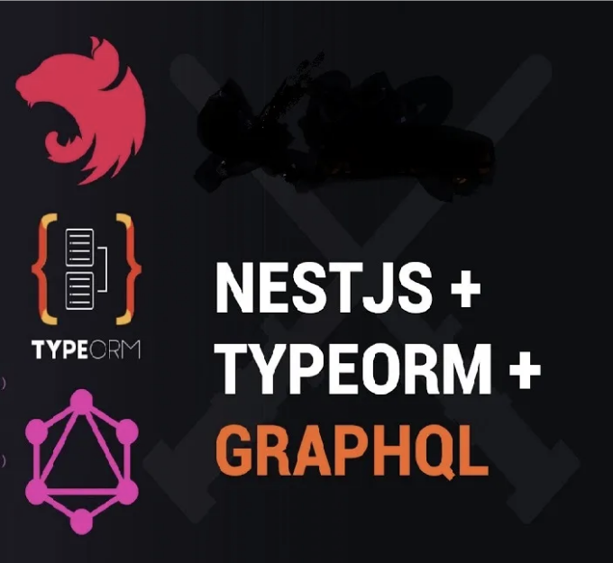

React & GraphQL을 시작해 보겠습니다. 먼저 @apollo/client를 설치해봅시다.

우리는 React 앱을 apollo graphql client로 감쌀 것입니다. 제 Apollo GraphQL 클라이언트는 아래와 같이 보입니다.

```js
import { ApolloProvider, ApolloClient, InMemoryCache } from "@apollo/client";

const apolloGraphQLClient = new ApolloClient({
  uri: process.env.GRAPHQL_URL, // 여러분의 GraphQL API 엔드포인트로 변경해주세요. 저의 경우에는 서버 URL입니다.
  cache: new InMemoryCache(),
});

export default apolloGraphQLClient;
```

<!-- ui-log 수평형 -->

<ins class="adsbygoogle"
      style="display:block"
      data-ad-client="ca-pub-4877378276818686"
      data-ad-slot="9743150776"
      data-ad-format="auto"
      data-full-width-responsive="true"></ins>
<component is="script">
(adsbygoogle = window.adsbygoogle || []).push({});
</component>

app.js 파일이나 부모 구성 요소를 apollo client로 래핑해보세요.

```js
import { ApolloProvider } from "@apollo/client";
import apolloGraphQlClient from "./GraphQL/DataAccessGraphQLClient";

function App(props) {
  return (
    <div>
      <ApolloProvider client={apolloGraphQlClient}>
        <Routes>
          <Route path="/login" element={<Login />} />
          <Route path="/home" element={<AppContent page="workbook" />} />
        </Routes>
      </ApolloProvider>
    </div>
  );
}
export default App;
```

워크스페이스를 가져오고 워크스페이스를 추가하는 쿼리를 작성해봅시다. 워크스페이스는 우리 앱에 있는 엔티티입니다. Queries.js 파일을 만들어 다음 쿼리를 작성해보세요.

```js
export const FETCH_WORKSPACES = gql`
 query fetchWorkSpaces($user_email: String!){ //쿼리에 필요한 입력 매개변수
   fetchWorkSpaces(   //실제 쿼리와 변수들을 포함
  user_email: $user_email
 ) 
 {
   id  // 반환할 필드들
   name
   user_email
   created_date
   updated_date
 }
 }
`;
export const CREATE_WORKSPACE = gql`
  query createWorkspace($workspace: WorkspaceDto!) {
    createWorkspace(workspace: $workspace) {
      id
    }
  }
`;
```

<!-- ui-log 수평형 -->

<ins class="adsbygoogle"
      style="display:block"
      data-ad-client="ca-pub-4877378276818686"
      data-ad-slot="9743150776"
      data-ad-format="auto"
      data-full-width-responsive="true"></ins>
<component is="script">
(adsbygoogle = window.adsbygoogle || []).push({});
</component>

당신의 workspace.js에서는 이 gql에서 데이터를 가져올 것입니다.

```js
import { useQuery } from "@apollo/client";
import { FETCH_WORKSPACES } from "../../GraphQL/Queries";
const WorkSpace = (props) => {
  const { loading, error, data } = useQuery(FETCH_WORKSPACES, {
    variables: {
      user_email: props.userEmail,
    },
  });
  return <div>{loading ? <div>Loading</div> : <WorkSpaceTree myWorkspaces={data} />}</div>;
};
```

또는 이 쿼리를 함수에서 호출하려면

```js
export const fetchWorkspaces= async(user_email)=>{
    const apolloGraphQlClient=(await import('../../GraphQL/DataAccessGraphQLClient.js')).default //이것은 지연로딩입니다. 파일 상단에서도 가져올 수 있습니다.
    const {FETCH_WORKSPACES} = await import("../../GraphQL/Queries") //지연로딩
    let workspacevariables={
        user_email:user_email,
    }
    const { workspaceResponse } = await apolloGraphQlClient.query({ query: CREATE_FOLDER, variables:{workspacevariables });
}
export const createWorkspace = () => async () => {
    try {
        let workspace = {
         id:uuidv4(),
         "name": "New workspace",
         "user_email": "jayant@gmail.com",
         "isParent":false,
         created_date:new Date(),
         updated_date:new Date(),
        }
        const apolloGraphQlClient=(await import('../../GraphQL/DataAccessGraphQLClient.js')).default
        const {CREATE_WORKSPACE} = await import("../../GraphQL/Queries")
        const variables = { workspace };
        const { data } = await apolloGraphQlClient.query({ query: CREATE_WORKSPACE, variables });
    }
    catch (error) {
        console.log("error in creating workspace", error)
    }
}
```

<!-- ui-log 수평형 -->

<ins class="adsbygoogle"
      style="display:block"
      data-ad-client="ca-pub-4877378276818686"
      data-ad-slot="9743150776"
      data-ad-format="auto"
      data-full-width-responsive="true"></ins>
<component is="script">
(adsbygoogle = window.adsbygoogle || []).push({});
</component>

React 부분 코드는 끝났어요. 이제 nestjs 로 넘어가 볼게요.

Postgres 데이터베이스가 있지만 TypeORM을 통해 데이터를 가져오고 업데이트할 거에요. @nestjs/typeorm, @nestjs/apollo, @nestjs/graphql 을 설치해주세요.

그럼 요청 응답 graphql DTO 및 TypeORM 엔티티를 만들어보는 게 시작이에요.

workspace.dto.ts - 이 파일은 워크스페이스를 만들 때 사용할 거에요.

<!-- ui-log 수평형 -->

<ins class="adsbygoogle"
      style="display:block"
      data-ad-client="ca-pub-4877378276818686"
      data-ad-slot="9743150776"
      data-ad-format="auto"
      data-full-width-responsive="true"></ins>
<component is="script">
(adsbygoogle = window.adsbygoogle || []).push({});
</component>

```js
import { ObjectType, Field, InputType } from "@nestjs/graphql";
import { IsBoolean, IsString, IsNotEmpty, IsObject } from "class-validator";
import { GraphQLJSONObject } from "graphql-type-json";
@InputType()
export class WorkspaceDto {
  @Field(() => Date)
  @IsBoolean()
  created_date: Date;
  @Field(() => Date)
  @IsBoolean()
  updated_date: Date;
  @Field(() => String)
  @IsNotEmpty()
  @IsString()
  id: string;
  @Field(() => String)
  @IsNotEmpty()
  @IsString()
  user_email: string;
  @Field(() => String)
  @IsNotEmpty()
  @IsString()
  name: string;
  @Field(() => Boolean, { defaultValue: false })
  @IsBoolean()
  isParent: boolean;
}
```

workspace.response.dto.ts- 응답 유형을 위한 Response 타입

```js
import { ObjectType, Field, InputType } from "@nestjs/graphql";
import { IsBoolean, IsString, IsNotEmpty, IsObject } from "class-validator";
import { GraphQLJSONObject } from "graphql-type-json";

@ObjectType()
export class WorkspaceResponseDto {
  @Field(() => Date)
  @IsBoolean()
  created_date: Date;

  @Field(() => Date)
  @IsBoolean()
  updated_date: Date;

  @Field(() => String)
  @IsNotEmpty()
  @IsString()
  id: string;

  @Field(() => String)
  @IsNotEmpty()
  @IsString()
  user_email: string;

  @Field(() => String)
  @IsNotEmpty()
  @IsString()
  name: string;

  @Field(() => Boolean)
  @IsBoolean()
  isParent: boolean;
}
```

workspace.entity.ts에 대한 TypeORM 및 postgres DB```

<!-- ui-log 수평형 -->

<ins class="adsbygoogle"
      style="display:block"
      data-ad-client="ca-pub-4877378276818686"
      data-ad-slot="9743150776"
      data-ad-format="auto"
      data-full-width-responsive="true"></ins>
<component is="script">
(adsbygoogle = window.adsbygoogle || []).push({});
</component>

```js
import { Entity, PrimaryGeneratedColumn, Column, PrimaryColumn } from "typeorm";

@Entity()
export class workspaces {
  @PrimaryColumn()
  id: string;
  @Column({ type: "timestamp" })
  created_date: Date;
  @Column({ type: "timestamp" })
  updated_date: Date;
  @Column({ nullable: true, default: false })
  isParent: boolean;
  @Column({ nullable: true })
  user_email: string;
  @Column({ nullable: true })
  name: string;
}
```

NestJS에 워크스페이스를 위한 모듈을 생성해야 하며, 쿼리와 뮤테이션을 해결하는 GraphQL 리졸버가 필요합니다. 마지막으로 비즈니스 로직을 다루는 workspace.service.ts 라는 서비스 파일을 만들어야 합니다.

workspace.service.ts

```js
import { Injectable } from '@nestjs/common';
import { InjectRepository } from '@nestjs/typeorm';
import { Repository } from 'typeorm';
import { workspaces } from './workspace.entity';

@Injectable()
export class WorkspaceService {
  private readonly users: any[] = [];

  constructor(
    @InjectRepository(workspaces)
    private readonly workspaceRepository: Repository<workspaces>,
  ) {}

  async fetchWorkspaces(user_email: string): Promise<workspaces[]> {
    try {
      // 내 워크스페이스를 불러오는 중
      const savedWorkspaces = await this.workspaceRepository.find({ where: { user_email } });
      return savedWorkspaces;
    } catch (err) {
      console.error("연결 에러", err);
    }
  }

  async createWorkspace(workspace: workspaces): Promise<any> {
    try {
      const savedWorkspace = await this.workspaceRepository.save(workspace);
      return savedWorkspace;
    } catch (err) {
      console.error("연결 에러", err);
    }
  }

  async deleteWorkspace(workspace_id: string): Promise<any> {
    try {
      const savedWorkspace = await this.workspaceRepository.delete(workspace_id);
      return savedWorkspace;
    } catch (err) {
      console.error("연결 에러", err);
    }
  }
}
```

<!-- ui-log 수평형 -->

<ins class="adsbygoogle"
      style="display:block"
      data-ad-client="ca-pub-4877378276818686"
      data-ad-slot="9743150776"
      data-ad-format="auto"
      data-full-width-responsive="true"></ins>
<component is="script">
(adsbygoogle = window.adsbygoogle || []).push({});
</component>

workspace.resolver.ts

```ts
import { Args, Mutation, Query, Resolver } from "@nestjs/graphql";
import { WorkspaceService } from "./workspace.service";
import { WorkspaceDto } from "./workspace.dto";
import { WorkspaceResponseDto } from "./dto/workspaceresponse.dto";

@Resolver()
export class WorkspaceResolver {
  constructor(private readonly workspaceService: WorkspaceService) {}

  @Query(() => WorkspaceResponseDto)
  async createWorkspace(@Args("workspace") workspace: WorkspaceDto): Promise<WorkspaceResponseDto> {
    var records = this.workspaceService.createWorkspace(workspace);
    return records;
  }

  @Query(() => [WorkspaceResponseDto])
  async fetchWorkSpaces(@Args("user_email") user_email: string): Promise<WorkspaceResponseDto[]> {
    var records = this.workspaceService.fetchWorkspaces(user_email);
    return records;
  }
}
```

workspace.module.ts

```ts
import { WorkspaceService } from "./workspace.service";
import { WorkspaceResolver } from "./workspace.resolver";
import { GraphQLModule } from "@nestjs/graphql";
import { ApolloDriver, ApolloDriverConfig } from "@nestjs/apollo";
import { WorkspaceDto } from "./workspace.dto";
import { TypeOrmModule } from "@nestjs/typeorm";
import { workspaces } from "./workspace.entity";

@Module({
  imports: [
    GraphQLModule.forRoot<ApolloDriverConfig>({
      driver: ApolloDriver,
      autoSchemaFile: "schema.gql", // The output file for the generated schema
    }),
    TypeOrmModule.forFeature([workspaces]),
  ],
  providers: [WorkspaceService, WorkspaceResolver],
  controllers: [],
})
export class WorkspaceModule {}
```

<!-- ui-log 수평형 -->

<ins class="adsbygoogle"
      style="display:block"
      data-ad-client="ca-pub-4877378276818686"
      data-ad-slot="9743150776"
      data-ad-format="auto"
      data-full-width-responsive="true"></ins>
<component is="script">
(adsbygoogle = window.adsbygoogle || []).push({});
</component>

그리고 마지막으로, TypeORM에서 데이터베이스를 등록하고 NestJS의 메인 모듈인 앱에서 이 워크스페이스 모듈을 가져옵니다.

```js
import { TypeOrmModule } from "@nestjs/typeorm";
import { WorkspaceModule } from "./modules/workspace/workspace.module";
import { workspaces } from "./modules/workspace/workspace.entity";

@Module({
  imports: [
    TypeOrmModule.forRoot({
      type: "postgres",
      host: process.env.POSTGRES_HOST,
      port: parseInt(process.env.POSTGRES_PORT) || 26257,
      username: process.env.POSTGRES_USER,
      password: process.env.POSTGRES_PASSWORD,
      database: process.env.POSTGRES_DATABASE,
      ssl: {
        rejectUnauthorized: false, // SSL 인증서 확인 무시 (운영에는 권장하지 않음)
      },
      entities: [workspaces], // 여기에 엔티티 추가
    }),
    WorkspaceModule,
  ],
  controllers: [],
  providers: [],
  exports: [],
})
export class AppModule implements NestModule {
  configure(consumer: MiddlewareConsumer) {
    consumer.apply(CacheControlMiddleware, FrontendMiddleware).forRoutes({ path: "/**", method: RequestMethod.ALL });
  }
}
```

<!-- ui-log 수평형 -->

<ins class="adsbygoogle"
      style="display:block"
      data-ad-client="ca-pub-4877378276818686"
      data-ad-slot="9743150776"
      data-ad-format="auto"
      data-full-width-responsive="true"></ins>
<component is="script">
(adsbygoogle = window.adsbygoogle || []).push({});
</component>
