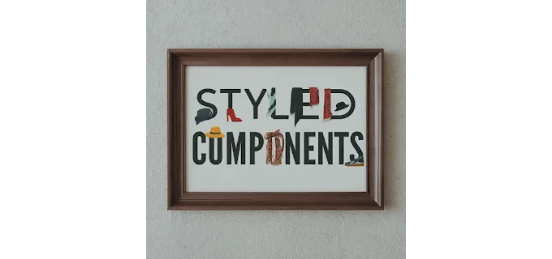

# 소개

React 애플리케이션을 CSS-in-JS 방식으로 스타일링할 때, styled-components는 최고의 선택지로 두드러지게 나타납니다. 이 글에서는 styled-components를 Next 애플리케이션에서 어떻게 활용하는지 안내해 드리겠습니다. 기본적으로 Next는 styled-jsx를 통해 css-in-js를 사용할 수 있는 방법을 제공합니다. 그러나 styled-jsx를 사용하는 것이 CSS를 JSX 내부에 작성해야 하기 때문에 번거로울 수 있다면, styled-components가 적합할 수 있습니다.



# styled-components 설치

<!-- ui-log 수평형 -->

<ins class="adsbygoogle"
      style="display:block"
      data-ad-client="ca-pub-4877378276818686"
      data-ad-slot="9743150776"
      data-ad-format="auto"
      data-full-width-responsive="true"></ins>
<component is="script">
(adsbygoogle = window.adsbygoogle || []).push({});
</component>

```js
npm install styled-components
// 또는
yarn add styled-components
```

예시 사용법:

```js
import styled from 'styled-components'

const Wrapper = styled.div`
  color: red;
  text-align: center;
`

// 입력 매개변수를 가진 컴포넌트
const Wrapper2 = styled.div<{$color?: string}>`
  color: ${props => props.$color};
  text-align: center;
`

export default function Index() {
  return (
    <>
      <Wrapper>데모 1</Wrapper>
      <Wrapper2 $color="green">데모 2</Wrapper2>
    </>
  )
}
```

# 테마 설정 추가하기

<!-- ui-log 수평형 -->

<ins class="adsbygoogle"
      style="display:block"
      data-ad-client="ca-pub-4877378276818686"
      data-ad-slot="9743150776"
      data-ad-format="auto"
      data-full-width-responsive="true"></ins>
<component is="script">
(adsbygoogle = window.adsbygoogle || []).push({});
</component>

ThemeProvider를 사용하여 전체 애플리케이션에 테마를 가져오고 React context를 사용하는 것과 비슷한 방식으로 어디서든 액세스할 수 있습니다.

```js
import { useContext, useMemo } from "react";
import styled, { ThemeContext, ThemeProvider } from "styled-components";

const Wrapper = styled.div`
  color: red;
  text-align: center;
`;

const Wrapper2 = (color: string) => styled.div`
  color: ${color};
  text-align: center;
`;

const theme = {
  colors: {
    primary: "#0070f3",
  },
};

function Display() {
  const themeContext = useContext(ThemeContext); // 테마 컨텍스트 가져오기
  console.log("themeContext", themeContext);
  return (
    <>
      <Wrapper>데모 1</Wrapper>
      <Wrapper2 $color={themeContext?.colors.primary}>데모 2</Wrapper2>
    </>
  );
}

export default function Index() {
  return (
    <ThemeProvider theme={theme}>
      <Display />
    </ThemeProvider>
  );
}
```

## Next 애플리케이션에서 사용하는 방법

만약 Next 애플리케이션에서 사용하고 싶다면, app/layout.tsx 파일에 다음 코드 스니펫을 추가하여 모든 페이지의 레이아웃을 설정하세요.

<!-- ui-log 수평형 -->

<ins class="adsbygoogle"
      style="display:block"
      data-ad-client="ca-pub-4877378276818686"
      data-ad-slot="9743150776"
      data-ad-format="auto"
      data-full-width-responsive="true"></ins>
<component is="script">
(adsbygoogle = window.adsbygoogle || []).push({});
</component>

```js
export default function Index({ children }: { children: JSX.Element }) {
  return <ThemeProvider theme={theme}>{children}</ThemeProvider>;
}
```

이후 각 페이지에서는 테마 컨텍스트를 다음과 같이 가져올 수 있습니다:

```js
"use client";

import { useContext, useMemo } from "react";
import styled, { ThemeContext, ThemeProvider } from "styled-components";

export default function Index() {
  const themeContext = useContext(ThemeContext); // 테마 컨텍스트 가져오기
  return (
    <>
      <Wrapper>데모 1</Wrapper>
      <Wrapper2 $color={themeContext?.colors.primary}>데모 2</Wrapper2>
    </>
  );
}
```

# 결론

<!-- ui-log 수평형 -->

<ins class="adsbygoogle"
      style="display:block"
      data-ad-client="ca-pub-4877378276818686"
      data-ad-slot="9743150776"
      data-ad-format="auto"
      data-full-width-responsive="true"></ins>
<component is="script">
(adsbygoogle = window.adsbygoogle || []).push({});
</component>

그래서 우리는 React/Next에서 styled-components를 성공적으로 설정했습니다. 사용 예제와 ThemeProvider를 사용하여 구성하는 방법을 제공했습니다. 이 기사가 도움이 되기를 바랍니다.

의견을 남기는 데 주저하지 마세요. 앞으로 더 많은 통찰력 있는 콘텐츠를 위해 좋아요, 공유 및 팔로우를 기억해 주세요!

이 콘텐츠가 도움이 되었다면, 블로그에서 원문 기사를 방문해 저자를 지원하고 더 많은 흥미로운 콘텐츠를 탐색해보세요.
