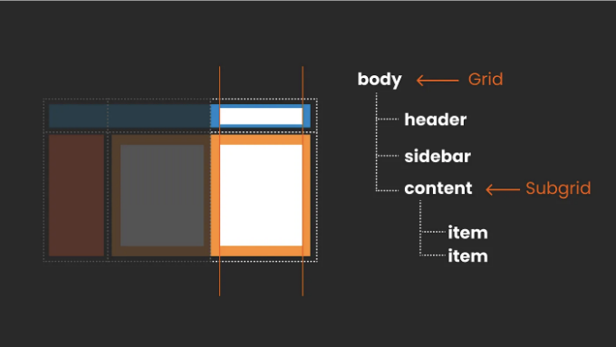

## CSS FOR UI DESIGNER

대부분의 디자이너들은 반응형 디자인에 익숙합니다. 고정된 브레이크포인트를 사용한 열 기반 레이아웃 접근 방식으로 모든 화면 크기를 커버합니다. 그러나 현대 CSS 레이아웃으로 강한 구조를 벗어나서, 다양한 화면 크기에 맞게 신축적이고 동적인 디자인을 만들 수 있습니다.

이 기사는 완벽한 교환 과정에 대한 것이 아닙니다 (여전히 그런 것이 존재해야 하는지 의심스럽습니다) 그러나 서로의 도구와 그들의 제한 사항을 이해하고 대화와 협업을 위한 공통 지점을 찾는 것에 대해 많이 다룹니다.

<!-- ui-log 수평형 -->

<ins class="adsbygoogle"
      style="display:block"
      data-ad-client="ca-pub-4877378276818686"
      data-ad-slot="9743150776"
      data-ad-format="auto"
      data-full-width-responsive="true"></ins>
<component is="script">
(adsbygoogle = window.adsbygoogle || []).push({});
</component>

## 내가 알려주고 싶은 몇 가지:

- 반응형 열 기반 디자인 vs. 현대 CSS 레이아웃
- 디자이너로서 CSS 플렉스박스 이해
- 디자이너로서 CSS 그리드 이해
- 브레이크포인트: 여전히 필요한가요?

# 프레임워크를 사용한 전통적인 열 기반 디자인

우리가 어디서 시작하고 있는지 먼저 이해해 봅시다. UI 디자이너로서, 전통적인 열 그리드 설정에 더 익숙할 것입니다. 이 설정은 열, 거터 및 여백으로 이루어져 있으며 여러분의 요소를 배치하는 곳입니다. 이 그리드는 디자인의 기초 역할을 하며 구조화된 프레임워크를 제공합니다.

<!-- ui-log 수평형 -->

<ins class="adsbygoogle"
      style="display:block"
      data-ad-client="ca-pub-4877378276818686"
      data-ad-slot="9743150776"
      data-ad-format="auto"
      data-full-width-responsive="true"></ins>
<component is="script">
(adsbygoogle = window.adsbygoogle || []).push({});
</component>

## 클래식 그리드 레이아웃에서 브레이크포인트 이해하기

반응형 디자인의 핵심은 CSS 미디어 쿼리에 의해 정의된 브레이크포인트에 있습니다. 화면 크기에 따라 레이아웃을 적응시키기 위해 이러한 브레이크포인트가 필수적입니다. 웹 사이트의 구조는 이러한 미리 정의된 시점에서 동적으로 조정됩니다. 요소들이 재배치되거나 간결한 내비게이션 메뉴가 확장되거나 텍스트 크기가 변경되어 가독성을 향상시킬 수 있습니다. 이 유연성은 디자인이 다양한 디바이스에서 기능적이고 미적으로 매력적으로 유지됨을 보장합니다.

<!-- ui-log 수평형 -->

<ins class="adsbygoogle"
      style="display:block"
      data-ad-client="ca-pub-4877378276818686"
      data-ad-slot="9743150776"
      data-ad-format="auto"
      data-full-width-responsive="true"></ins>
<component is="script">
(adsbygoogle = window.adsbygoogle || []).push({});
</component>

## 프레임워크

이러한 디자인을 구현할 때는 Bootstrap이나 Foundation과 같은 CSS 프레임워크가 인기가 있습니다. 또한 Tailwind라는 것을 들어보았을지도 모릅니다. 이러한 프레임워크들은 사전 디자인된 구성 요소와 그리드 시스템을 제공하여 반응형 웹 레이아웃을 만드는 과정을 간단하게 만들어줍니다.

📍 참고: 요즘에는 많은 프레임워크가 기본으로 Flexbox와/또는 CSS Grid를 사용하여 원래의 엄격한 열 기반 레이아웃보다 더 유연해지고 있습니다.

<!-- ui-log 수평형 -->

<ins class="adsbygoogle"
      style="display:block"
      data-ad-client="ca-pub-4877378276818686"
      data-ad-slot="9743150776"
      data-ad-format="auto"
      data-full-width-responsive="true"></ins>
<component is="script">
(adsbygoogle = window.adsbygoogle || []).push({});
</component>

요약하면: 전통적인 반응형 열 기반 설정에서는 다양한 화면 크기에 대한 디자인 변경이 일련의 고정된 브레이크포인트에 따라 반응하여 구현됩니다. 다시 말해, 뷰포트 크기 변경과 같은 외부 요소에 대한 대응을 고려하는 것을 의미합니다.

# 현대적인 CSS 레이아웃

Flexbox 및 CSS Grid를 사용한 현대적인 CSS 레이아웃은 보다 내적으로 초점을 맞춘 방식, 때로는 본질적 디자인이라고도 불리는 접근 방식을 취할 수 있습니다. 이는 우리의 디자인이 뷰포트 크기뿐만 아니라 콘텐츠 자체와 사용 가능한 공간에도 적응하게 만든다는 것을 의미합니다.

<!-- ui-log 수평형 -->

<ins class="adsbygoogle"
      style="display:block"
      data-ad-client="ca-pub-4877378276818686"
      data-ad-slot="9743150776"
      data-ad-format="auto"
      data-full-width-responsive="true"></ins>
<component is="script">
(adsbygoogle = window.adsbygoogle || []).push({});
</component>

그래서 뷰포트에 의해 정의된 정적 그리드에 항목을 배치하는 대신, 이 내재적 접근법은 공간이 변할 때 콘텐츠의 작동 방식에 더 많은 제어권을 제공합니다. 이는 고정 및 유연한 요소를 결합하여 최소 및 최대 크기를 정의하는 등 세밀한 조정을 위한 충분한 공간을 제공합니다.

이 개념은 디자이너들에게 직관적이기까지 시간이 걸릴 수 있습니다. 왜냐하면 CSS의 기본적인 이해를 얻는 것을 포함하기 때문입니다. 그러니 함께 해봐요!

📍팁: 이 주제에 관한 Jen Simmons의 무료 비디오를 강력하게 추천합니다. Layout Land 채널에 있는 이 비디오들은 매우 잘 설명되어 있어요!

<!-- ui-log 수평형 -->

<ins class="adsbygoogle"
      style="display:block"
      data-ad-client="ca-pub-4877378276818686"
      data-ad-slot="9743150776"
      data-ad-format="auto"
      data-full-width-responsive="true"></ins>
<component is="script">
(adsbygoogle = window.adsbygoogle || []).push({});
</component>

## 어떤 도구를 사용하고 있나요?

여기서 주로 사용하는 CSS 도구는 Flexbox와 CSS Grid입니다. 이 둘은 개별적으로 사용하거나 함께 사용할 수 있습니다. 컴포넌트 및 전체 레이아웃을 설정하는 데 사용할 수 있습니다.

📍팁: 또한, CSS 레이아웃 패밀리의 최신 추가인 컨테이너 쿼리에 대해서도 주목하세요. 그들이 무엇인지와 Figma에서 그들을 계획하는 방법에 대한 내 문서를 쓰었습니다.

# 디자이너로서 CSS Flexbox 이해하기

<!-- ui-log 수평형 -->

<ins class="adsbygoogle"
      style="display:block"
      data-ad-client="ca-pub-4877378276818686"
      data-ad-slot="9743150776"
      data-ad-format="auto"
      data-full-width-responsive="true"></ins>
<component is="script">
(adsbygoogle = window.adsbygoogle || []).push({});
</component>

Flexbox(고유한 이름은 CSS 유연한 박스 레이아웃)을 사용하면 요소를 깔끔하게 정렬하고 정렬을 제어하면서 사용 가능한 공간에 맞게 동작과 크기를 정확하게 조정하여 내용 변화에 대응할 수 있습니다. Flexbox를 사용하여 구성 요소 및 전체 그룹 또는 페이지를 설정할 수 있으며 중첩이 모든 것입니다.

CSS Flexbox는 두 가지 주요 요소와 함께 작동합니다: 부모 컨테이너와 해당 자식 요소입니다.

### 부모 컨테이너(플렉스 컨테이너)

<!-- ui-log 수평형 -->

<ins class="adsbygoogle"
      style="display:block"
      data-ad-client="ca-pub-4877378276818686"
      data-ad-slot="9743150776"
      data-ad-format="auto"
      data-full-width-responsive="true"></ins>
<component is="script">
(adsbygoogle = window.adsbygoogle || []).push({});
</component>

이곳은 `display: flex;`를 적용하는 외부 래퍼입니다. 이 선언은 컨테이너를 플렉스 컨테이너로 바꾸고 직계 자식 요소를 플렉스 아이템으로 만듭니다. 플렉스 컨테이너 내에서는 플렉스 아이템의 방향 (행 또는 열), 랩 방식, 그리고 정렬 방식 (주 축을 따라 정렬) 또는 맞추는 방식 (교차 축을 따라 정렬)을 제어할 수 있습니다. 다시 말해, 부모가 전반적인 규칙을 제어하므로 모든 자식에 동일한 규칙이 설정됩니다.

다음은 진짜 화면을 직접 만져볼 수 있는 Codepen 링크입니다:

## 자식 요소 (플렉스 아이템):

<!-- ui-log 수평형 -->

<ins class="adsbygoogle"
      style="display:block"
      data-ad-client="ca-pub-4877378276818686"
      data-ad-slot="9743150776"
      data-ad-format="auto"
      data-full-width-responsive="true"></ins>
<component is="script">
(adsbygoogle = window.adsbygoogle || []).push({});
</component>

이것들은 유연한 컨테이너 내부의 요소들이에요, 직접적인 자식들이죠. 부모의 전반적인 규칙을 따르지만, 각자의 개인적인 자유도를 갖고 있어요. 우리는 그들의 성장(컨테이너를 채우는 방식), 수축(충분한 공간이 없을 때 사이즈를 줄이는 방식), 기본 크기(커지거나 줄어들기 전의 기본 크기)를 조절할 수 있어요. 또한 일부 더 고급 설정도 있어요, 나머지와 다르게 각 요소를 정렬하는 것과 같은 것들 말이에요.

여기 실제로 사용해볼 수 있는 Codepen이 있어요:

📍팁: 여기서 모든 개념에 대한 매우 단순화된 예제와 함께 제 전체 CSS Codepen 모음을 찾을 수 있어요:

<!-- ui-log 수평형 -->

<ins class="adsbygoogle"
      style="display:block"
      data-ad-client="ca-pub-4877378276818686"
      data-ad-slot="9743150776"
      data-ad-format="auto"
      data-full-width-responsive="true"></ins>
<component is="script">
(adsbygoogle = window.adsbygoogle || []).push({});
</component>

## Flexbox 중첩

따라서 카드와 같이 간단한 설정에서는 이것이 단순한 플렉스박스임을 알 수 있습니다. 카드가 부모이고 그 안에 이미지, 제목 및 텍스트가 있는 세 개의 자식 요소가 모두 한 방향으로 이동하며 서로 같은 거리를 유지합니다. 간단하죠?

하지만 이와 같이 다양한 요소가 그룹화된 다양한 거리, 방향 및 동작을 가진 아래의 네비게이션과 같이 복잡한 디자인의 경우, 우리는 플렉스박스를 중첩해야 합니다. 따라서 각 중첩된 플렉스박스는 직접 부모로부터 일반적인 위치를 받기는 하지만, 동시에 직계 자식들에게 새로운 규칙을 제시합니다. 정말 가족 안에서 하는 것과 비슷하죠.

<!-- ui-log 수평형 -->

<ins class="adsbygoogle"
      style="display:block"
      data-ad-client="ca-pub-4877378276818686"
      data-ad-slot="9743150776"
      data-ad-format="auto"
      data-full-width-responsive="true"></ins>
<component is="script">
(adsbygoogle = window.adsbygoogle || []).push({});
</component>

# Figma의 자동 레이아웃은 Flexbox인가요?

이 말이 익숙하게 들리나요? Figma에서의 자동 레이아웃 사용이나 Penpot의 플렉스 레이아웃 사용과 정확히 같습니다. 왜냐하면 둘 다 기본적으로 Flexbox를 반영하기 때문입니다. 이 연관성은 개발 모드를 탐험하거나 검사 도구를 사용할 때 명백해집니다. 이 주제를 더 깊게 알아보기 위해, Figma의 자동 레이아웃이 Flexbox와 어떻게 일치하는지, 우리가 제약을 만나는 영역 등을 탐구하는 무료 비디오를 만들었습니다.

# 일차원 vs. 이차원 레이아웃

<!-- ui-log 수평형 -->

<ins class="adsbygoogle"
      style="display:block"
      data-ad-client="ca-pub-4877378276818686"
      data-ad-slot="9743150776"
      data-ad-format="auto"
      data-full-width-responsive="true"></ins>
<component is="script">
(adsbygoogle = window.adsbygoogle || []).push({});
</component>

Flexbox는 각 항목을 한 줄에 배치하는 일차원 디자인 방식이라는 것을 이해하는 것이 중요합니다.

이는 많은 경우에 완전히 괜찮지만, 행과 열이 있는 그리드 레이아웃을 제어할 수는 없습니다. 디자인에 그리드와 같은 제어를 원한다면 CSS Grid와 같은 이차원 레이아웃 방식이 필요합니다.

<!-- ui-log 수평형 -->

<ins class="adsbygoogle"
      style="display:block"
      data-ad-client="ca-pub-4877378276818686"
      data-ad-slot="9743150776"
      data-ad-format="auto"
      data-full-width-responsive="true"></ins>
<component is="script">
(adsbygoogle = window.adsbygoogle || []).push({});
</component>

모든 것은 답이 없어요; 무엇을 만들려고 하는지에 따라 다르죠. 그 둘은 함께 사용하면 멋지게 작동해요.

# CSS Grid Layout

CSS 그리드를 좋아해요; 정말 대단하죠. 이걸로는 어떤 것이든 만들어낼 수 있어요. 그렇죠, 정말 뭐든지요 — 겹치기, 서브그리드 정렬, 아무것도 정의하지 않고도 마법처럼 모든 것을 만들어줘요. 진짜 미쳤죠. 하지만 이게 너무 압도적일 수도 있어요, 90%의 경우에 저희는 특별한 아트 레이아웃을 만들고 있진 않거든요 (하지만 절대 가능하죠!!!). CSS 그리드의 멋진 점은 가장 간단한 레이아웃 구조, 예를 들어 클래식한 열 그리드 같은 것을 만들 수 있고, 더 유연한 레이아웃을 만들어내며 문단의 구성과 크기를 다양하게 조절하여 표준 그리드 인식을 넘어 창의적인 디자인으로 발전시킬 수 있다는 점이에요. CSS 그리드가 항상 여러분 곁에 있을거에요.

<!-- ui-log 수평형 -->

<ins class="adsbygoogle"
      style="display:block"
      data-ad-client="ca-pub-4877378276818686"
      data-ad-slot="9743150776"
      data-ad-format="auto"
      data-full-width-responsive="true"></ins>
<component is="script">
(adsbygoogle = window.adsbygoogle || []).push({});
</component>

Flexbox를 수평 또는 수직으로 늘어뜨린 형태의 비즈를 끈에 잘 연결해 둔 것으로 상상해보세요. 그럼 CSS Grid는 비즈를 받침상 안에 넣어 그 안에서 자유롭게 행이나 열로 배치하는 것과 같습니다. 단지 그 안에 있는 구획을 나누는 디바이더를 이동하거나 합칠 수 있는 멋진 벤토 상자 중 하나인 것처럼 보입니다. 심지어 자동으로 확장도 됩니다.

CSS Grid 구조를 조금 더 자세히 이해해 보겠습니다.

<!-- ui-log 수평형 -->

<ins class="adsbygoogle"
      style="display:block"
      data-ad-client="ca-pub-4877378276818686"
      data-ad-slot="9743150776"
      data-ad-format="auto"
      data-full-width-responsive="true"></ins>
<component is="script">
(adsbygoogle = window.adsbygoogle || []).push({});
</component>

## 컬럼 대신 그리드 라인으로 생각하기

UI 디자이너로서, 우리는 보통 레이아웃 그리드를 컬럼이 있는 컨테이너로 생각하고, 그 후에 아이템을 이 컬럼에 맞게 배치합니다. 그러나 CSS 그리드는 약간 다릅니다. 우리는 여전히 컨테이너를 가지고 있지만, 그리드 자체는 그리드 셀을 형성하는 라인으로 구성됩니다. 기본적으로 그리드 아이템은 HTML 순서를 따라 순차적으로 배치됩니다. 그러나 CSS 그리드의 좌표와 같은 라인으로 아이템의 정확한 가로와 세로 위치를 제어할 수 있습니다.

이를 통해 우리는 그리드 영역을 만들 수 있어서 겹쳐지는 효과나 더 복잡한 레이아웃 구조를 구현할 수 있습니다. 게다가, 컨테이너에 여백을 추가하거나 행 사이에 간격을 둘 수도 있습니다.

<!-- ui-log 수평형 -->

<ins class="adsbygoogle"
      style="display:block"
      data-ad-client="ca-pub-4877378276818686"
      data-ad-slot="9743150776"
      data-ad-format="auto"
      data-full-width-responsive="true"></ins>
<component is="script">
(adsbygoogle = window.adsbygoogle || []).push({});
</component>

여기에 Codepen이 있어요! 만약 더 잘 이해하고 싶다면 위치 조정을 해보세요. CSS 그리드에 대해 자세히 설명한 글도 있어요.

## FR 또는 분수 단위

우리의 열과 그리드 셀은 모두 같은 크기 일 필요가 없어요; 우리는 원하는대로 사용자 정의 할 수 있어요. 이는 고정 크기 또는 사용할 수 있는 공간을 나누는 'fr 단위'를 사용하는 것을 포함해요.
fr 단위를 사용하면 사용 가능한 공간을 고르게 분배하거나 비율을 조정할 수 있어요 — 예를 들어, 한 셀에 2 fr을 사용하고 다른 셀에 1 fr을 사용하는 것과 같이요.

<!-- ui-log 수평형 -->

<ins class="adsbygoogle"
      style="display:block"
      data-ad-client="ca-pub-4877378276818686"
      data-ad-slot="9743150776"
      data-ad-format="auto"
      data-full-width-responsive="true"></ins>
<component is="script">
(adsbygoogle = window.adsbygoogle || []).push({});
</component>

크기가 변경되면 모든 것이 잘 맞게 조정됩니다: 고정 요소는 크기를 유지하고 fr 단위는 남은 공간을 적절하게 재분배합니다.

CSS에서 서로 다른 단위들을 사용해볼 수 있는 작은 Codepen이 있어요:

## 명시적 vs. 암시적 그리드

<!-- ui-log 수평형 -->

<ins class="adsbygoogle"
      style="display:block"
      data-ad-client="ca-pub-4877378276818686"
      data-ad-slot="9743150776"
      data-ad-format="auto"
      data-full-width-responsive="true"></ins>
<component is="script">
(adsbygoogle = window.adsbygoogle || []).push({});
</component>

지금까지, 우리는 명시적 그리드에 대해 이야기해 왔어요. 여기서 디자이너로서 우리는 명확하게 행과 열을 정의합니다. 그러나 CSS 그리드는 모든 셀을 정의하지 않을 때도 작동합니다. 브라우저는 콘텐츠를 기반으로 그리드를 자동으로 생성합니다. 이를 암시적 그리드라고하며, 블로그 게시물이나 시간이 지남에 따라 변경되는 제품 목록과 같이 동적이거나 알 수없는 콘텐츠를 다룰 때 특히 유용합니다.

명시적 접근은 UI 디자이너에게 더욱 자연스럽지만, 암시적 접근은 주로 브라우저 내에서 볼 수 있는 것입니다. 따라서, 우리는 UI 소프트웨어 밖에서 생각해야 하며 디자이너와 개발자로서 협업해야 합니다.

## 중첩

<!-- ui-log 수평형 -->

<ins class="adsbygoogle"
      style="display:block"
      data-ad-client="ca-pub-4877378276818686"
      data-ad-slot="9743150776"
      data-ad-format="auto"
      data-full-width-responsive="true"></ins>
<component is="script">
(adsbygoogle = window.adsbygoogle || []).push({});
</component>

CSS Grids를 중첩해서 사용할 수도 있습니다. 예를 들어, 헤더, 사이드바 및 콘텐츠 영역이 포함된 전체적인 레이아웃이 있고 해당 콘텐츠를 더 구조화하려는 경우, 쉽게 또 다른 CSS Grid를 중첩시킬 수 있습니다. 요구 사항에 따라, 이 중첩된 그리드는 암시적일 수도 있고 명시적일 수도 있습니다.

완벽하게 정렬된 디자인을 달성하기 위해 CSS Grid의 서브그리드 기능을 사용하면 레이아웃 전체에 일관된 그리드 구조를 만들 수 있습니다.

<!-- ui-log 수평형 -->

<ins class="adsbygoogle"
      style="display:block"
      data-ad-client="ca-pub-4877378276818686"
      data-ad-slot="9743150776"
      data-ad-format="auto"
      data-full-width-responsive="true"></ins>
<component is="script">
(adsbygoogle = window.adsbygoogle || []).push({});
</component>

## 세상은 너의 굴이야

CSS 그리드 기본사항을 다뤘지만, 정렬, 정당화 및 요소들을 결합하고 중첩하는 방법에는 더 많은 기능이 있습니다. 그래서 깊이 파고드는 것을 즐기세요. 추가로, 더 많은 정보를 얻고 싶다면 이 기사를 강력히 추천합니다: Gridless.design

## 하지만 나는 그냥 간단한 그리드를 원해요!

<!-- ui-log 수평형 -->

<ins class="adsbygoogle"
      style="display:block"
      data-ad-client="ca-pub-4877378276818686"
      data-ad-slot="9743150776"
      data-ad-format="auto"
      data-full-width-responsive="true"></ins>
<component is="script">
(adsbygoogle = window.adsbygoogle || []).push({});
</component>

CSS Grid은 무궁무진한 가능성을 제공하지만, 유지 관리 가능하고 확장 가능한 제품을 만드는 데 중요한 것은 가능한 한 간단하게 유지하는 것입니다. 대부분의 경우에 필요한 것이기 때문이죠. 따라서 많은 프로젝트에서 모두가 동의하는 기본적인 열 그리드에 집중하여야 하는 경우도 많습니다. 이럴 때 CSS Grid의 가장 간단한 설정을 사용할 수 있습니다. 그러나 창의성이 필요한 순간에는 어디로 가야 할지 이제 알게 되었죠.

# Figma에 CSS Grid 기능이 있나요?

Figma에는 표준 열로 제한된 그리드 기능이 제공됩니다. 현재 Figma에는 Flexbox로 해석되는 auto layout이 있지만, CSS Grid를 대표하는 기능이 부족하다는 것은 약간 답답한 것 같습니다. 저는 Figma를 굉장히 좋아하지만 이 측면에서는 좀 쉽지 않다고 느낀다는 점을 인정합니다. Figma에서 이 문제를 어떻게 다룰지에 대한 내 수업을 확인해보세요.

<!-- ui-log 수평형 -->

<ins class="adsbygoogle"
      style="display:block"
      data-ad-client="ca-pub-4877378276818686"
      data-ad-slot="9743150776"
      data-ad-format="auto"
      data-full-width-responsive="true"></ins>
<component is="script">
(adsbygoogle = window.adsbygoogle || []).push({});
</component>

지포트, 무료 UI 디자인 소프트웨어인 Penpot을 살펴보고 새로운 떠오르는 스타를 탐험해볼 수도 있어요. Flex Layout 및 CSS Grid 기능을 제공하며 (곧 출시될 예정입니다). 여기에서 Sneak Preview를 확인할 수 있고, 꽤 인상적이에요! 그리고 무료이기도 하죠!

# CSS Grid와 Flexbox 중에 선택해야 할까요?

CSS Grid와 Flexbox는 CSS 패밀리의 일부로, 서로 원활하게 작동합니다. 대부분의 경우 컴포넌트는 Flexbox를 사용하여 설정되고, CSS Grid는 전반적인 레이아웃을 제어할 것입니다. 그러나 필요한 경우 Flexbox를 전체 페이지에 사용하는 것도 가능합니다. 두 가지를 섞어서 사용할 수도 있고, 때로는 둘 다 잘 작동하고 때로는 한 가지 방법이 더 나은 경우도 있습니다. 사실, 이제는 컴포넌트를 CSS Grid를 사용하여 설정하거나 (저는 개인적으로 이 방식을 좋아합니다) Flexbox를 사용하거나 할 수 있습니다. 뭐든 가능해요. 옳고 그름은 없으며, 특정한 경우에 어떤 것이 더 나은지에 따라, 1차원이나 2차원 레이아웃이 더 잘 작동할지 결정됩니다.

<!-- ui-log 수평형 -->

<ins class="adsbygoogle"
      style="display:block"
      data-ad-client="ca-pub-4877378276818686"
      data-ad-slot="9743150776"
      data-ad-format="auto"
      data-full-width-responsive="true"></ins>
<component is="script">
(adsbygoogle = window.adsbygoogle || []).push({});
</component>

UI 디자이너로서 개발 단계의 세부 결정은 프론트엔드 개발자에게 맡기세요. 당신의 초점은 특정 결정이 왜 내려졌는지 이해하고 현대 CSS의 가능성과 제약을 염두에 두고 디자인하는 데 있습니다. Figma나 Penpot에서 상상한 것이 항상 브라우저로 직접 변환되지는 않을 수 있음을 기억하세요. 당신이 잘못한 게 없어요. 창의적인 과정의 일부일 뿐입니다. 디자인과 개발 간의 협업이 중요합니다!

## 페이지의 표

| 제목 | 설명                     |
| ---- | ------------------------ |
| 내용 | 여기에 내용을 입력하세요 |

<!-- ui-log 수평형 -->

<ins class="adsbygoogle"
      style="display:block"
      data-ad-client="ca-pub-4877378276818686"
      data-ad-slot="9743150776"
      data-ad-format="auto"
      data-full-width-responsive="true"></ins>
<component is="script">
(adsbygoogle = window.adsbygoogle || []).push({});
</component>

"예전 방식은 우리의 반응형 그리드를 설정된 열과 함께 사용하여 디자인이 새 버전으로 '깨지는' 고정된 중단점이 있었습니다. 이러한 중단점에서 그리드 레이아웃 자체가 변경될 수 있으며, 서로 다른 열의 양이나 거터 또는 여백이 변경될 수 있습니다. 또한 항목이 그리드에 어떻게 배치되는지 재배치하거나 특정 항목을 표시하거나 숨길 수도 있습니다. 게다가 햄버거 메뉴가 링크 메뉴로 변경되거나 텍스트 크기가 중단점에 따라 달라질 수도 있습니다.

이 더 엄격한 반응형 레이아웃 접근 방식은 종종 프레임워크를 사용하며, 일반적으로 필수 정보를 제공하는 문서가 함께 제공됩니다. 예를 들어 Bootstrap과 같은 프레임워크를 사용하는 경우, 문서에는 열 수, 거터 너비, 중단점에 대한 세부 정보가 포함됩니다. 따라서 UI 디자이너로서 Figma나 Penpot과 같은 도구에서 쉽게 따라하게 만들 수 있습니다."

<!-- ui-log 수평형 -->

<ins class="adsbygoogle"
      style="display:block"
      data-ad-client="ca-pub-4877378276818686"
      data-ad-slot="9743150776"
      data-ad-format="auto"
      data-full-width-responsive="true"></ins>
<component is="script">
(adsbygoogle = window.adsbygoogle || []).push({});
</component>

## 모던 CSS 및 브레이크포인트

모던 CSS 레이아웃을 사용하면 설계 방법이 직관적으로 개선되어 디자인이 브레이크포인트가 필요 없이 유동적으로 적응할 수 있습니다. 이는 레이아웃이 대부분의 경우에 효과적으로 자동으로 재조직될 수 있다는 것을 의미합니다.

그러나 브레이크포인트를 사용해야 할 때가 여전히 있을 수 있습니다. 일정 크기의 고정된 브레이크포인트에 의존하는 대신 (그렇게 할 수는 있고, 곧 논의할 것입니다), 디자인을 조사하고 더 유연하게 브레이크포인트를 결정할 수 있습니다.

<!-- ui-log 수평형 -->

<ins class="adsbygoogle"
      style="display:block"
      data-ad-client="ca-pub-4877378276818686"
      data-ad-slot="9743150776"
      data-ad-format="auto"
      data-full-width-responsive="true"></ins>
<component is="script">
(adsbygoogle = window.adsbygoogle || []).push({});
</component>

## 모던 CSS 레이아웃에서 브레이크포인트를 추가하고 싶을 수 있습니다:

레이아웃 변경
모던 CSS가 자체적으로 훌륭한 작업을 수행하지만, 그림자 레이아웃 변경, 요소 표시 또는 숨김, 자연 플로우와 다르게 배치하는 등 "급진적" 레이아웃 변경을 위해 브레이크포인트를 설정하고 싶을 수 있습니다.

컴포넌트 레이아웃 변경
한 가지 예는 버거 메뉴에서 링크 메뉴로 네비게이션 변경하는 것일 수 있습니다. 이러한 방식으로, 브레이크포인트를 설정하고 싶은 “달콤한 지점”을 찾아낼 수 있습니다.

<!-- ui-log 수평형 -->

<ins class="adsbygoogle"
      style="display:block"
      data-ad-client="ca-pub-4877378276818686"
      data-ad-slot="9743150776"
      data-ad-format="auto"
      data-full-width-responsive="true"></ins>
<component is="script">
(adsbygoogle = window.adsbygoogle || []).push({});
</component>

📍팁: 이것은 컨테이너 쿼리로 매우 우아하게 해결할 수도 있습니다.

타이포그래피 변경
타이포그래피는 더 복잡한 영역입니다. 간단히 말씀드리자면 여기서도 개별 브레이크포인트를 설정할 수 있지만, 보통 너희의 타입스케일을 위한 고정된 일련의 브레이크포인트로 돌아가는 것이 더 의미가 있습니다. 이 접근 방식은 프로세스를 간소화하여 우리의 타이포그래피가 서로 다른 화면 크기에서 일관되고 가독성이 뛰어난 시스템을 유지하도록 보장합니다. 여기서 다른 접근 방법을 가지고 계신지 궁금합니다!

<!-- ui-log 수평형 -->

<ins class="adsbygoogle"
      style="display:block"
      data-ad-client="ca-pub-4877378276818686"
      data-ad-slot="9743150776"
      data-ad-format="auto"
      data-full-width-responsive="true"></ins>
<component is="script">
(adsbygoogle = window.adsbygoogle || []).push({});
</component>

다른 방법으로 CSS Clamp를 활용하는 방법:
브레이크포인트 외에도 CSS의 clamp() 함수를 이용하여 우리의 타이포그래피가 특정 범위 내에서 유동적으로 확대 및 축소되도록 설정함으로써 민첩하게 대응할 수 있습니다. 이 방법을 사용하면 텍스트 크기가 브레이크포인트와는 독립적으로 일반적인 뷰포트 너비를 고려하여 최소 및 최대값 사이에서 조절됩니다.

그러나 clamp()를 사용하려면 성능과 접근성 문제를 고려하고 더 많은 테스트가 필요하기 때문에 개발팀과의 긴밀한 협력이 필요합니다. 그러므로, 이것은 이해할 가치가 있지만, 구체적인 설정 및 프로젝트에 맞춰져야 합니다.

# 균형 찾기: 디자인 자유와 구조 사이에서

<!-- ui-log 수평형 -->

<ins class="adsbygoogle"
      style="display:block"
      data-ad-client="ca-pub-4877378276818686"
      data-ad-slot="9743150776"
      data-ad-format="auto"
      data-full-width-responsive="true"></ins>
<component is="script">
(adsbygoogle = window.adsbygoogle || []).push({});
</component>

저가 겪은 한 가지 어려움은 CSS 레이아웃이 가진 다양한 가능성과 자유를 조화롭게 이용하는 데 일정한 질서를 부여하는 것이었습니다. 프로젝트와 그 범위를 신중하게 고려하는 것이 매우 중요하다는 것을 깨달았어요.

## 가) 일회성 프로젝트나 섹션을 위한 예술적 디자인

저희가 하나의 특별하고 화려한 아트 페이지를 만들고 있는 건가요? 그럼 아마 CSS 레이아웃의 모든 마법을 발휘하길 원하실 거예요. Jen Simmons의 놀라운 창조적 예시들은 현대 CSS 레이아웃으로 어떤 것을 이룰 수 있는지 보여줍니다. 전통적인 브레이크포인트를 완전히 제쳐 두고 브라우저에 레이아웃을 맡기거나 모든 항목에 대해 각각의 브레이크포인트를 신중하게 고려할 수도 있어요.

기억해 주세요, 이 접근 방식은 전체 웹사이트에 적용되지 않을 수도 있습니다. 홈페이지나 히어로 섹션에서만 사용되는, 그래픽 디자인이 돋보이는 부분일 수도 있습니다.

<!-- ui-log 수평형 -->

<ins class="adsbygoogle"
      style="display:block"
      data-ad-client="ca-pub-4877378276818686"
      data-ad-slot="9743150776"
      data-ad-format="auto"
      data-full-width-responsive="true"></ins>
<component is="script">
(adsbygoogle = window.adsbygoogle || []).push({});
</component>

이 경우에는 그래픽 표현으로 Figma나 Penpot에 일부 확정된 화면을 설정하겠어요. 그리고 아주 숙련된 프론트엔드 개발자(그리고 적절한 예산!)와 긴밀하게 협업하는 것이 필요합니다. 브라우저로 일찍 점프하는 것에 초점을 맞추는게 중요해요; Figma나 Penpot에서 행동을 너무 탄탄히 계획하는 것은 큰 의미가 없어요.

## b) 확장 가능한 디자인과 디자인 시스템에서 유연성과 구조의 균형 유지

유연성은 확장 가능한 제품에 중요하지만, 구조도 중요해요. 현대적인 CSS 레이아웃을 통해 브라우저가 흐름을 지시하도록 함으로써 더 유연한 디자인이 가능하지만, 확장 가능한 디자인을 만들려면 관리하기 쉽게 사물을 유지하기 위해 보다 명확한 규칙을 설정해야 합니다. 구조적 상자 안에 어떤 마법을 넣는다고 생각해보세요—디자인을 단조롭게 만드는 것이 아니라 견고한 기반을 제공하기 위한 것이죠.

Brad Frost의 디자인 시스템에서 그리드를 다루는 방법에 대한 기사는 정말 대단해요. 제 생각에 이 방법은 Figma나 Penpot에서도 (CSS Grid의 부족으로 인한 몇 가지 제한이 있겠지만) CSS에서와 마찬가지로 아주 효과적으로 작동할 수 있어요. 저는 전반적인 레이아웃과 타이포그래피에 대해 일부 고정된 브레이크포인트를 선택하여 일상을 간단하게 유지하는 편입니다. 중요한 것은 필요할 때 언제든 이 시스템을 쉽게 벗어날 수 있다는 것이에요.

<!-- ui-log 수평형 -->

<ins class="adsbygoogle"
      style="display:block"
      data-ad-client="ca-pub-4877378276818686"
      data-ad-slot="9743150776"
      data-ad-format="auto"
      data-full-width-responsive="true"></ins>
<component is="script">
(adsbygoogle = window.adsbygoogle || []).push({});
</component>

나는 Figma에서 이를 다루는 방법에 대해 자세한 강좌를 갖고 있어. 또한 나의 뉴스레터에 가입해서 계속해서 다른 기사들을 받아볼 수 있도록 해줘. 나는 현재 이 주제에 대해 더 많은 아이디어를 탐구하고 있어.

# 디자이너가 코딩 결정을 내릴 필요가 없다는 것에 대해

정말 명확하게 말씀드리겠습니다: 이 기사는 디자이너들이 코딩해야 한다는 것이 아닙니다. CSS로 구현되는 방법에 대한 결정은, 그리고 하지 말아야 하는 것은, 디자이너가 내리는 것이 아니라 항상 프론트엔드 개발자, 이 분야의 전문가에게 달려 있어요! 그래서 우리가 디자인할 때 CSS의 기능과 제한을 이해하고 있다면, 협업과 개발과의 대화에서 훨씬 더 나은 이해와, 무엇보다 중요한 것은, 대화를 할 수 있어요... 그리고 이걸로 놀면 정말 재미있어!

# 그 외에 뭔가가 있다고요? 네, 컨테이너 쿼리(container queries)에 대해요!

<!-- ui-log 수평형 -->

<ins class="adsbygoogle"
      style="display:block"
      data-ad-client="ca-pub-4877378276818686"
      data-ad-slot="9743150776"
      data-ad-format="auto"
      data-full-width-responsive="true"></ins>
<component is="script">
(adsbygoogle = window.adsbygoogle || []).push({});
</component>

언급했듯이, 컨테이너 쿼리에 대해 주목해주세요. 또한 UI 디자이너로써! Figma에서 컨테이너 쿼리를 어떻게 계획할지에 대해 기사를 썼습니다.
