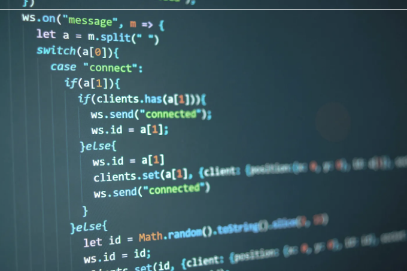

당신의 동료들이 알기 전에 지금 당장 알아야 할 10가지 JavaScript 해킹 방법!



JavaScript는 웹 개발에 꼭 필요한 강력하고 다재다능한 프로그래밍 언어입니다. 숙련된 개발자들은 종종 코드를 최적화하고 성능을 향상시키는 고급 기술을 습득하는 데 어려움을 겪습니다. 이 글에서는 프로그래밍 스킬을 한 단계 끌어올려줄 10가지 고급 JavaScript 트릭을 살펴보겠습니다.

# 1. 구조 분해 할당

<!-- ui-log 수평형 -->
<ins class="adsbygoogle"
  style="display:block"
  data-ad-client="ca-pub-4877378276818686"
  data-ad-slot="9743150776"
  data-ad-format="auto"
  data-full-width-responsive="true"></ins>
<component is="script">
(adsbygoogle = window.adsbygoogle || []).push({});
</component>

할당 해체는 배열이나 객체에서 값을 추출하여 변수에 할당하는 간편한 방법입니다. 코드를 간소화하고 가독성을 향상시킵니다. 배열의 경우 대괄호 표기법을 사용하고, 객체의 경우 중괄호를 사용할 수 있습니다.

```js
// 배열 해체
const [firstItem, secondItem, ...rest] = [1, 2, 3, 4, 5];

// 객체 해체
const { name, age, ...details } = { name: 'Lokesh', age: 25, occupation: 'Developer' };
```

# 2. 전개 구문

전개 구문을 사용하여 배열의 요소나 객체의 속성을 다른 배열이나 객체로 확장할 수 있습니다. 이는 복사본을 만들거나 객체를 병합하고 함수에 여러 인수를 전달하는 데 유용합니다.

<!-- ui-log 수평형 -->
<ins class="adsbygoogle"
  style="display:block"
  data-ad-client="ca-pub-4877378276818686"
  data-ad-slot="9743150776"
  data-ad-format="auto"
  data-full-width-responsive="true"></ins>
<component is="script">
(adsbygoogle = window.adsbygoogle || []).push({});
</component>

```js
// 배열 복사하기
const originalArray = [1, 2, 3];
const newArray = [...originalArray];

// 객체 병합하기
const obj1 = { a: 1, b: 2 };
const obj2 = { c: 3, d: 4 };
const mergedObj = { ...obj1, ...obj2 };
```

# 3. 커링

커링은 여러 인수를 전달받는 함수를 각각 하나의 인수를 받는 함수로 변환하는 함수형 프로그래밍 기술입니다. 이를 통해 코드의 재사용성과 조립이 용이해집니다.

```js
const multiply = (a) => (b) => a * b;
const multiplyByTwo = multiply(2);
const result = multiplyByTwo(5); // 출력: 10
```

<!-- ui-log 수평형 -->
<ins class="adsbygoogle"
  style="display:block"
  data-ad-client="ca-pub-4877378276818686"
  data-ad-slot="9743150776"
  data-ad-format="auto"
  data-full-width-responsive="true"></ins>
<component is="script">
(adsbygoogle = window.adsbygoogle || []).push({});
</component>

# 4. 메모이제이션

메모이제이션은 비싼 함수 호출의 결과를 저장하고 불필요한 계산을 피하는 캐싱 기술입니다. 재귀적이거나 많은 시간이 소요되는 함수의 경우 성능을 크게 향상시킬 수 있습니다.

```js
const memoizedFibonacci = (function () {
  const cache = {};

  return function fib(n) {
    if (n in cache) return cache[n];
    if (n <= 1) return n;

    cache[n] = fib(n - 1) + fib(n - 2);
    return cache[n];
  };
})();
```

# 5. 프로미스와 Async/Await

<!-- ui-log 수평형 -->
<ins class="adsbygoogle"
  style="display:block"
  data-ad-client="ca-pub-4877378276818686"
  data-ad-slot="9743150776"
  data-ad-format="auto"
  data-full-width-responsive="true"></ins>
<component is="script">
(adsbygoogle = window.adsbygoogle || []).push({});
</component>

약속(Promises)과 Async/Await은 비동기 작업을 더 우아하게 처리하고 코드를 더 가독성 있고 유지보수하기 쉽도록 만드는 데 중요합니다. 이들은 콜백 지옥을 피하고 오류 처리를 개선하는 데 도움을 줍니다.

```js
// Promises 사용
function fetchData() {
  return new Promise((resolve, reject) => {
    // 비동기 작업, 예: API에서 데이터 가져오기
    // 작업 결과에 따라 resolve(data) 또는 reject(error)
  });
}

// Async/Await 사용
async function fetchData() {
  try {
    const response = await fetch('https://api.example.com/data');
    const data = await response.json();
    return data;
  } catch (error) {
    console.error('데이터를 가져오는 중 오류 발생:', error);
    throw error;
  }
}
```

# 6. 클로저(Closures)

클로저는 생성된 환경을 기억하는 함수로, 해당 환경에 더 이상 접근할 수 없어도 기억합니다. 클로저는 비공개 변수를 만드는 데 유용하며 동작 캡슐화에 사용됩니다.

<!-- ui-log 수평형 -->
<ins class="adsbygoogle"
  style="display:block"
  data-ad-client="ca-pub-4877378276818686"
  data-ad-slot="9743150776"
  data-ad-format="auto"
  data-full-width-responsive="true"></ins>
<component is="script">
(adsbygoogle = window.adsbygoogle || []).push({});
</component>

```js
function createCounter() {
  let count = 0;
  return function () {
    return ++count;
  };
}

const counter = createCounter();
console.log(counter()); // 결과: 1
console.log(counter()); // 결과: 2
```

# 7. 함수 합성

함수 합성은 두 개 이상의 함수를 결합하여 새로운 함수를 만드는 과정을 말합니다. 이는 코드 재사용을 촉진하고 복잡한 변환을 단계적으로 만들 수 있도록 돕습니다.

```js
const add = (x) => x + 1;
const multiplyByTwo = (x) => x * 2;
const compose = (...fns) => (x) => fns.reduceRight((acc, fn) => fn(acc), x);
const addAndMultiply = compose(multiplyByTwo, add);
console.log(addAndMultiply(3)); // 출력: 8
```

<!-- ui-log 수평형 -->
<ins class="adsbygoogle"
  style="display:block"
  data-ad-client="ca-pub-4877378276818686"
  data-ad-slot="9743150776"
  data-ad-format="auto"
  data-full-width-responsive="true"></ins>
<component is="script">
(adsbygoogle = window.adsbygoogle || []).push({});
</component>

# 8. 프록시

프록시 객체를 사용하면 기본 객체 작업에 대한 사용자 정의 동작을 만들 수 있습니다. 객체 작업을 가로채고 수정할 수 있습니다. 속성에 액세스하거나 메서드를 호출하는 것과 같은 객체 작업을 가로챌 수 있습니다.

```js
const handler = {
  get: (target, prop) => {
    console.log(`속성에 액세스 중: ${prop}`);
    return target[prop];
  },
};

const targetObj = { name: 'Lokesh', age: 25 };
const proxyObj = new Proxy(targetObj, handler);
console.log(proxyObj.name); // 출력: 속성에 액세스 중: name \n Lokesh
```

# 9. 이벤트 위임

<!-- ui-log 수평형 -->
<ins class="adsbygoogle"
  style="display:block"
  data-ad-client="ca-pub-4877378276818686"
  data-ad-slot="9743150776"
  data-ad-format="auto"
  data-full-width-responsive="true"></ins>
<component is="script">
(adsbygoogle = window.adsbygoogle || []).push({});
</component>

이벤트 위임은 여러 개의 자식에 각각 리스너를 부착하는 대신 부모에 단일 이벤트 리스너를 부착하는 기술입니다. 메모리 사용량을 줄이고 특히 대규모 목록이나 동적으로 생성된 콘텐츠의 성능을 향상시킵니다.

```js
document.getElementById('parent').addEventListener('click', function (event) {
  if (event.target.matches('li')) {
    console.log('li 요소를 클릭했습니다!');
  }
});
```

# 10. 웹 워커

웹 워커는 주 스레드와 병행하여 JavaScript 코드를 백그라운드에서 실행할 수 있는 기능입니다. CPU 집약적 작업을 처리하고 UI 멈춤을 방지하며 성능을 향상시키는 데 유용합니다.

<!-- ui-log 수평형 -->
<ins class="adsbygoogle"
  style="display:block"
  data-ad-client="ca-pub-4877378276818686"
  data-ad-slot="9743150776"
  data-ad-format="auto"
  data-full-width-responsive="true"></ins>
<component is="script">
(adsbygoogle = window.adsbygoogle || []).push({});
</component>

```js
// 주 스레드에서
const worker = new Worker('worker.js');
worker.postMessage({ data: '일부 데이터' });

// worker.js 파일에서
self.addEventListener('message', function (event) {
  const data = event.data;
  // 데이터를 사용하여 무거운 계산을 수행
  // 결과를 주 스레드로 다시 전송
  self.postMessage({ result: 계산된결과 });
});
```

이러한 고급 JavaScript 트릭을 숙달함으로써, 숙련된 개발자들은 더 효율적이고 유지보수가 쉬우며 성능이 우수한 솔루션을 만들 수 있습니다. 이러한 기술은 JavaScript 지식을 입증할 뿐만 아니라, 여러분이 우아하고 섬세하게 복잡한 문제를 해결할 수 있도록 도와줍니다. 언어를 계속 탐험하면서, 능숙한 JavaScript 개발자가 되기 위해서는 실습과 실험이 중요하다는 것을 기억하세요. 즐겁게 코딩하세요!```