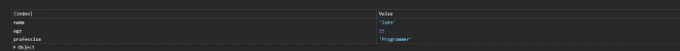

안녕하세요! 이 글에서는 깨끗하고 효율적인 코드를 작성하는 데 알아야 할 18가지 JavaScript 팁과 예제를 공유하겠습니다.

시작해봅시다!🚀

# 화살표 함수

<!-- ui-log 수평형 -->
<ins class="adsbygoogle"
  style="display:block"
  data-ad-client="ca-pub-4877378276818686"
  data-ad-slot="9743150776"
  data-ad-format="auto"
  data-full-width-responsive="true"></ins>
<component is="script">
(adsbygoogle = window.adsbygoogle || []).push({});
</component>

화살표 함수를 사용하여 함수 선언을 간단하게 할 수 있어요.

예를 들면:

```js
function add(a,b){
  return a + b;
}
// 화살표 함수
const add = (a,b) => a + b;
```

# Array.from()

<!-- ui-log 수평형 -->
<ins class="adsbygoogle"
  style="display:block"
  data-ad-client="ca-pub-4877378276818686"
  data-ad-slot="9743150776"
  data-ad-format="auto"
  data-full-width-responsive="true"></ins>
<component is="script">
(adsbygoogle = window.adsbygoogle || []).push({});
</component>

Array.from() 메서드는 모든 반복 가능한 객체를 배열로 변환하는 데 사용할 수 있어요.

```js
const str = "Hello!";
const arr = Array.from(str);
console.log(arr); //Output: ['H', 'e', 'l', 'l', 'o', '!']
```

# console.table()을 사용하여 데이터 표시

콘솔에서 데이터를 조직화하거나 테이블 형식으로 표시하려면 console.table()을 사용할 수 있어요.

<!-- ui-log 수평형 -->
<ins class="adsbygoogle"
  style="display:block"
  data-ad-client="ca-pub-4877378276818686"
  data-ad-slot="9743150776"
  data-ad-format="auto"
  data-full-width-responsive="true"></ins>
<component is="script">
(adsbygoogle = window.adsbygoogle || []).push({});
</component>

```js
const person = {
    name: 'John',
    age: 25,
    profession: 'Programmer'
}
console.table(person);
```

출력:



# const 및 let을 효율적으로 사용하기

<!-- ui-log 수평형 -->
<ins class="adsbygoogle"
  style="display:block"
  data-ad-client="ca-pub-4877378276818686"
  data-ad-slot="9743150776"
  data-ad-format="auto"
  data-full-width-responsive="true"></ins>
<component is="script">
(adsbygoogle = window.adsbygoogle || []).push({});
</component>

변수를 더 잘 정리하려면 재할당되지 않을 변수에는 const를 사용하고, 재할당될 변수에는 let을 사용하세요.

```js
const PI = 3.14;
let timer = 0;
```

# 구조 분해를 사용하여 객체 속성 추출하기

객체에서 속성을 추출할 때 구조 분해를 사용하면 코드의 가독성을 높일 수 있습니다.

<!-- ui-log 수평형 -->
<ins class="adsbygoogle"
  style="display:block"
  data-ad-client="ca-pub-4877378276818686"
  data-ad-slot="9743150776"
  data-ad-format="auto"
  data-full-width-responsive="true"></ins>
<component is="script">
(adsbygoogle = window.adsbygoogle || []).push({});
</component>

```js
const person = {
    name: 'John',
    age: 25,
    profession: 'Programmer'
}

//Instead of this 👇
console.log(person.name);
console.log(person.age);

//Use this👇
const {name, age} = person;
console.log(name);
console.log(age);
```

# 논리 OR 연산자를 사용하여 기본값 설정하기

|| 연산자를 사용하여 기본값을 쉽게 설정할 수 있습니다.

```js
function greet(name) {
  name = name || '사람';
  console.log(`안녕하세요, ${name}님!`);
}
greet(); //출력: 안녕하세요, 사람님!
greet("John"); //출력: 안녕하세요, John님!
```

<!-- ui-log 수평형 -->
<ins class="adsbygoogle"
  style="display:block"
  data-ad-client="ca-pub-4877378276818686"
  data-ad-slot="9743150776"
  data-ad-format="auto"
  data-full-width-responsive="true"></ins>
<component is="script">
(adsbygoogle = window.adsbygoogle || []).push({});
</component>

# 배열 손쉽게 비우기

배열을 간단히 비울 수 있어요. 그냥 length 속성을 사용하면 됩니다.

예를 들면:

```js
let numbers = [1, 2, 3, 4];
numbers.length = 0;
console.log(numbers); //결과: []
```

<!-- ui-log 수평형 -->
<ins class="adsbygoogle"
  style="display:block"
  data-ad-client="ca-pub-4877378276818686"
  data-ad-slot="9743150776"
  data-ad-format="auto"
  data-full-width-responsive="true"></ins>
<component is="script">
(adsbygoogle = window.adsbygoogle || []).push({});
</component>

# JSON.parse()

JSON.parse()을 사용하면 JSON 문자열을 JavaScript 객체로 변환할 수 있어요. 이를 통해 데이터 조작이 원활해집니다.

```js
const jsonStr = '{"name": "John", "age": 25}';
const person = JSON.parse(jsonStr);
console.log(person); 
//결과: {name: 'John', age: 25}
```

# Map() 함수

<!-- ui-log 수평형 -->
<ins class="adsbygoogle"
  style="display:block"
  data-ad-client="ca-pub-4877378276818686"
  data-ad-slot="9743150776"
  data-ad-format="auto"
  data-full-width-responsive="true"></ins>
<component is="script">
(adsbygoogle = window.adsbygoogle || []).push({});
</component>

새로운 배열에서 원본 배열을 수정하지 않고 요소를 변환하는 map() 함수를 사용해보세요.

예를 들어:

```js
const numbers = [1, 2, 3, 4];
const doubled = numbers.map(num => num * 2);

console.log(numbers); //결과: [1, 2, 3, 4]
console.log(doubled); //결과: [2, 4, 6, 8]
```

# Object.seal()

<!-- ui-log 수평형 -->
<ins class="adsbygoogle"
  style="display:block"
  data-ad-client="ca-pub-4877378276818686"
  data-ad-slot="9743150776"
  data-ad-format="auto"
  data-full-width-responsive="true"></ins>
<component is="script">
(adsbygoogle = window.adsbygoogle || []).push({});
</component>

개체에 속성을 추가하거나 제거하는 것을 방지하기 위해 Object.seal() 메서드를 사용할 수 있어요.

```js
const person = {
    name: 'John', 
    age: 25
};
Object.seal(person);
person.profession = "Programmer";
console.log(person); //Output: {name: 'John', age: 25}
```

# Object.freeze()

개체에 대한 변경을 방지하려면 추가, 수정 또는 삭제를 포함한 모든 변경을 방지하기 위해 Object.freeze() 메서드를 사용할 수 있어요.

<!-- ui-log 수평형 -->
<ins class="adsbygoogle"
  style="display:block"
  data-ad-client="ca-pub-4877378276818686"
  data-ad-slot="9743150776"
  data-ad-format="auto"
  data-full-width-responsive="true"></ins>
<component is="script">
(adsbygoogle = window.adsbygoogle || []).push({});
</component>

```js
const person = {
    name: 'John', 
    age: 25
};
Object.freeze(person);
person.name = "Mark";
console.log(person); //Output: {name: 'John', age: 25}
```

# 배열에서 중복 제거하기

Set을 사용하여 배열에서 중복된 요소를 제거할 수 있습니다.

```js
const arrWithDuplicates = [1, 12, 2, 13, 4, 4, 13];
const arrWithoutDuplicates = [...new Set(arrWithDuplicates)];
console.log(arrWithoutDuplicates); 
//Output: [1, 12, 2, 13, 4]
```

<!-- ui-log 수평형 -->
<ins class="adsbygoogle"
  style="display:block"
  data-ad-client="ca-pub-4877378276818686"
  data-ad-slot="9743150776"
  data-ad-format="auto"
  data-full-width-responsive="true"></ins>
<component is="script">
(adsbygoogle = window.adsbygoogle || []).push({});
</component>

# 디스트럭처링을 사용하여 값 교환하기

디스트럭처링을 사용하여 두 변수를 쉽게 교환할 수 있어요.

예를 들어:

```js
let x = 7, y = 13;
[x, y] = [y, x];
console.log(x); //13
```

<!-- ui-log 수평형 -->
<ins class="adsbygoogle"
  style="display:block"
  data-ad-client="ca-pub-4877378276818686"
  data-ad-slot="9743150776"
  data-ad-format="auto"
  data-full-width-responsive="true"></ins>
<component is="script">
(adsbygoogle = window.adsbygoogle || []).push({});
</component>

# Spread Operator

스프레드 연산자를 사용하여 배열을 효율적으로 복사하거나 병합할 수 있어요.

예를 들어:

```js
const arr1 = [1, 2, 3];
const arr2 = [9, 8, 7];

const arr3 = [...arr2];
const mergedArr = [...arr1, ...arr2];

console.log(arr3); //[9, 8, 7]
console.log(mergedArr); //[1, 2, 3, 9, 8, 7]
```


<!-- ui-log 수평형 -->
<ins class="adsbygoogle"
  style="display:block"
  data-ad-client="ca-pub-4877378276818686"
  data-ad-slot="9743150776"
  data-ad-format="auto"
  data-full-width-responsive="true"></ins>
<component is="script">
(adsbygoogle = window.adsbygoogle || []).push({});
</component>

# 템플릿 삽입

템플릿 리터럴을 활용하여 문자열 삽입을 하고 코드의 가독성을 높여보세요.

예를 들어:

```js
const name = 'John';
const message = `Hello, ${name}!`;
```

<!-- ui-log 수평형 -->
<ins class="adsbygoogle"
  style="display:block"
  data-ad-client="ca-pub-4877378276818686"
  data-ad-slot="9743150776"
  data-ad-format="auto"
  data-full-width-responsive="true"></ins>
<component is="script">
(adsbygoogle = window.adsbygoogle || []).push({});
</component>

# 삼항 연산자

삼항 연산자를 사용하면 조건문을 간단하게 작성할 수 있어요.

```js
const age = 20;

//이렇게👇
if(age>=18){
    console.log("운전할 수 있어요");
}else{
    console.log("운전할 수 없어요");
}

//이렇게 사용할 수 있어요👇
age >= 18 ? console.log("운전할 수 있어요") : console.log("운전할 수 없어요");
```

# ==가 아닌 ===를 사용하세요

<!-- ui-log 수평형 -->
<ins class="adsbygoogle"
  style="display:block"
  data-ad-client="ca-pub-4877378276818686"
  data-ad-slot="9743150776"
  data-ad-format="auto"
  data-full-width-responsive="true"></ins>
<component is="script">
(adsbygoogle = window.adsbygoogle || []).push({});
</component>

느슨한 동등성(==) 대신 엄격한 동등성(===)을 사용하여 형 변환 문제를 방지하세요.

```js
const num1 = 5;
const num2 = '5';

// == 대신에 사용
if (num1 == num2) {
  console.log('True');
} else {
  console.log('False');
}

// === 사용
if (num1 === num2) {
  console.log('True');
} else {
  console.log('False');
}
```

# 의미 있는 변수 및 함수 이름 사용

의미 있는 변수 및 함수 이름을 사용하여 코드의 가독성과 유지보수성을 향상시키세요.

<!-- ui-log 수평형 -->
<ins class="adsbygoogle"
  style="display:block"
  data-ad-client="ca-pub-4877378276818686"
  data-ad-slot="9743150776"
  data-ad-format="auto"
  data-full-width-responsive="true"></ins>
<component is="script">
(adsbygoogle = window.adsbygoogle || []).push({});
</component>

```javascript
// 이렇게 변수를 선언하지 마세요
const a = 18;

// 설명적인 이름을 사용하세요
const numberOfTips = 18;
```

오늘은 여기까지 입니다.

도움이 되었길 바라요.

읽어주셔서 감사합니다.

<!-- ui-log 수평형 -->
<ins class="adsbygoogle"
  style="display:block"
  data-ad-client="ca-pub-4877378276818686"
  data-ad-slot="9743150776"
  data-ad-format="auto"
  data-full-width-responsive="true"></ins>
<component is="script">
(adsbygoogle = window.adsbygoogle || []).push({});
</component>


