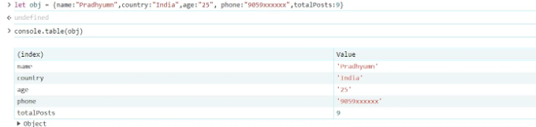
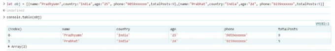
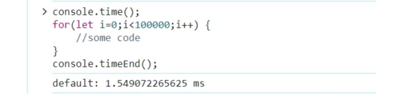
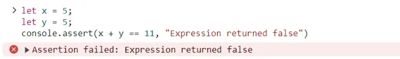
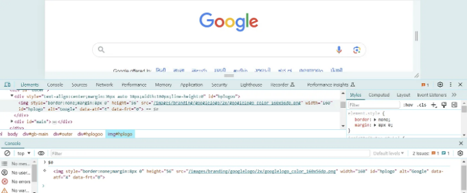
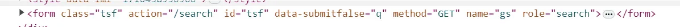

안녕하세요!! 좋은 하루 보내고 계신가요?


웹 개발자로서 콘솔이 얼마나 중요한지 알고 계시죠. 디버깅이든 값을 출력하든 다른 용도에 따라 자주 사용합니다.

console.log(), console.warn(), console.error()를 사용해보셨을 것입니다.

<!-- ui-log 수평형 -->

<ins class="adsbygoogle"
  style="display:block"
  data-ad-client="ca-pub-4877378276818686"
  data-ad-slot="9743150776"
  data-ad-format="auto"
  data-full-width-responsive="true"></ins>
<component is="script">
(adsbygoogle = window.adsbygoogle || []).push({});
</component>

하지만 콘솔이 우리에게 제공하는 멋진 기능 중에서 일할 때를 좀 더 쉽게 만들어주는 것이 뭔지 궁금해 보셨나요? 그렇지 않다면, 이 블로그가 도움이 될 거예요. 코딩 여정 중에 도움이 될 만한 몇 가지 콘솔 트릭을 공유하고 있어요.

시작해봐요!!

- JSON과 배열을 출력하는 더 좋은 방법: console.table()

네, 들었죠. console에는 배열과 객체의 값을 테이블 형식으로 출력해주는 함수가 있어요. 단순히 배열이나 객체를 console.table()에 전달하면 됩니다.

<!-- ui-log 수평형 -->

<ins class="adsbygoogle"
  style="display:block"
  data-ad-client="ca-pub-4877378276818686"
  data-ad-slot="9743150776"
  data-ad-format="auto"
  data-full-width-responsive="true"></ins>
<component is="script">
(adsbygoogle = window.adsbygoogle || []).push({});
</component>



만약 객체 배열이 있다면 출력 결과는 다음과 같이 나올 것입니다



2. 코드 실행 시간을 추적하세요

<!-- ui-log 수평형 -->

<ins class="adsbygoogle"
  style="display:block"
  data-ad-client="ca-pub-4877378276818686"
  data-ad-slot="9743150776"
  data-ad-format="auto"
  data-full-width-responsive="true"></ins>
<component is="script">
(adsbygoogle = window.adsbygoogle || []).push({});
</component>

만약 코드 블록이나 API 호출에 소요된 시간을 확인하고 싶다면, 코드 블록을 다음 두 함수로 둘러싸서 실행 시간을 측정할 수 있습니다.

conosle.time()은 타이머를 시작하고 console.timeEnd()는 소요된 시간을 출력으로 제공합니다.



3. 로그 메시지 그룹화: console.group() 및 console.groupEnd()

<!-- ui-log 수평형 -->

<ins class="adsbygoogle"
  style="display:block"
  data-ad-client="ca-pub-4877378276818686"
  data-ad-slot="9743150776"
  data-ad-format="auto"
  data-full-width-responsive="true"></ins>
<component is="script">
(adsbygoogle = window.adsbygoogle || []).push({});
</component>

콘솔 창에 특정 콘솔 로그를 그룹화하고 싶다면 해당 로그를 console.group()과 console.groupEnd() 사이에 감싸면 됩니다.


4. 더 나은 방법 : console.assert()

이 함수는 어설션(assertion)이 실패할 때만 에러 메시지를 작성하는 데 도움이 됩니다.

<!-- ui-log 수평형 -->

<ins class="adsbygoogle"
  style="display:block"
  data-ad-client="ca-pub-4877378276818686"
  data-ad-slot="9743150776"
  data-ad-format="auto"
  data-full-width-responsive="true"></ins>
<component is="script">
(adsbygoogle = window.adsbygoogle || []).push({});
</component>



5. 간단한 $ 트릭을 사용하여 선택된 HTML 요소 가져오기

HTML 요소를 가져올 때 document.getElementById(id)를 사용하는 것은 매우 일반적입니다. 이제 그렇게 해야 할 필요가 없습니다. 대신 이 간단한 트릭을 사용하여 요소를 가져올 수 있습니다.

가져오려는 요소를 마우스 오른쪽 버튼으로 클릭하고 검사를 선택하십시오.

<!-- ui-log 수평형 -->

<ins class="adsbygoogle"
  style="display:block"
  data-ad-client="ca-pub-4877378276818686"
  data-ad-slot="9743150776"
  data-ad-format="auto"
  data-full-width-responsive="true"></ins>
<component is="script">
(adsbygoogle = window.adsbygoogle || []).push({});
</component>

그리고 콘솔에 $0을 입력하면 해당 요소를 얻을 수 있어요. 변수에도 저장할 수 있어요.



6. $ 연산자를 사용하여 id나 class로 HTML 요소 가져오기

이 것은 이전 것과 유사합니다. id나 class를 사용하여 요소를 가져오고 싶을 때 콘솔에 이 간단한 코드를 작성하여 원하는 요소를 가져올 수 있어요.

<!-- ui-log 수평형 -->

<ins class="adsbygoogle"
  style="display:block"
  data-ad-client="ca-pub-4877378276818686"
  data-ad-slot="9743150776"
  data-ad-format="auto"
  data-full-width-responsive="true"></ins>
<component is="script">
(adsbygoogle = window.adsbygoogle || []).push({});
</component>

```js
$('#id') 또는 $('.className')
```



여기에 "tsf"라는 폼 id가 있습니다. $ 연산자를 사용하여 이 폼 엘리먼트를 가져올 수 있습니다.


<!-- ui-log 수평형 -->

<ins class="adsbygoogle"
  style="display:block"
  data-ad-client="ca-pub-4877378276818686"
  data-ad-slot="9743150776"
  data-ad-format="auto"
  data-full-width-responsive="true"></ins>
<component is="script">
(adsbygoogle = window.adsbygoogle || []).push({});
</component>

감사합니다!! 즐거운 코딩하세요!!

동료 개발자들과 좋아요와 공유해주세요!!
