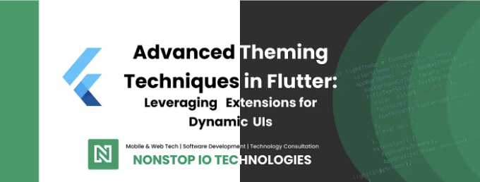
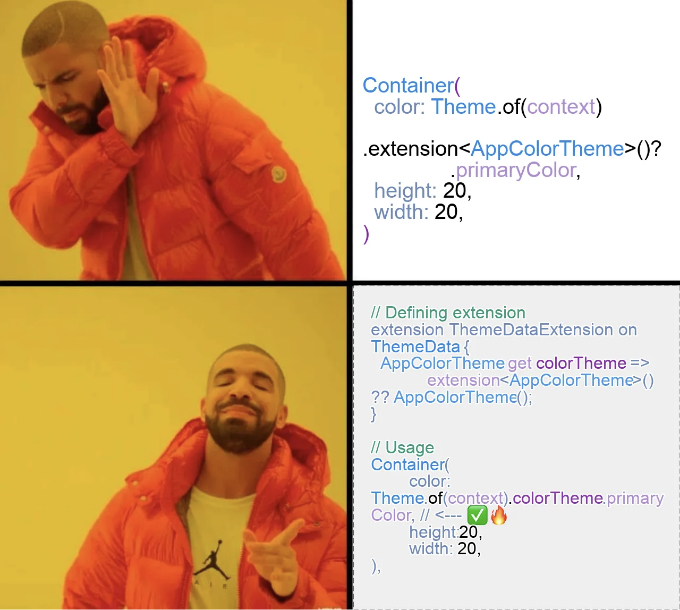
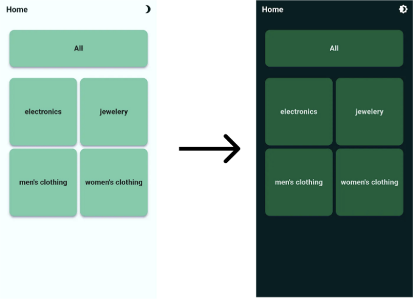

앱을 만들 때 선택하는 테마는 그들에게 독특한 룩을 주고 매끄러운 사용자 경험을 보장하는 데 중요합니다. Flutter의 ThemeData 클래스는 앱 바부터 버튼, 배경 및 텍스트 스타일에 이르기까지 다양한 테마 사용자 정의를 허용합니다. 그러나 때로는 다양한 디자인 요구 사항을 충족하기 위해 더 많은 유연성이 필요합니다. 여기서 테마 확장이 필수적이며 특정 요구 사항에 대한 적응 가능성을 제공합니다.

빠른 링크:

- 플러터에서 기본 ThemeData 사용 관리의 어려움
- 당신의 조건에 맞게 테마를 사용자 정의
- 테마 확장 생성
- 테마 확장을 사용한 라이트 및 다크 모드 구현

<!-- ui-log 수평형 -->
<ins class="adsbygoogle"
  style="display:block"
  data-ad-client="ca-pub-4877378276818686"
  data-ad-slot="9743150776"
  data-ad-format="auto"
  data-full-width-responsive="true"></ins>
<component is="script">
(adsbygoogle = window.adsbygoogle || []).push({});
</component>

# 플러터에서 기본 ThemeData 사용 시 발생하는 도전 과제는 무엇인가요?

플러터의 ThemeData 클래스의 향상된 유연성과 적응성에도 불구하고, Material UI 3의 지원으로 용이해진 것은 있지만, 아직도 특정 제한 사항이 있습니다. 주요 우려사항 중 하나는 ThemeData 내에 다양한 속성이 집약되어 있어 테마를 깔끔하게 구조화하는 과정이 복잡해진다는 것입니다. 이 복잡성은 특히 대규모 프로젝트에서 더욱 부각되며, 다양한 구성 요소 간에 일관된 테마를 관리하고 유지하는 작업이 어려워질 수 있습니다. 결과적으로 개발자들은 프로젝트가 확대되면서 테마를 일관되고 효율적으로 유지할 수 있도록 도와주는 것이 필요할 수 있습니다. 이러한 시나리오는 플러터 생태계 내에서 테마 관리에 더욱 간소화된 접근 방법이 필요함을 강조합니다.

# 나만의 조건으로 테마 사용자 정의하기

테마 확장을 통해 앱의 전반적인 디자인 언어와 완벽하게 통합되는 사용자 정의 테마 구성 요소를 정의할 수 있습니다. 이러한 구성 요소는 앱 내에서 특정 사용 사례를 지원하며 모듈화와 코드 구성을 촉진합니다. 가장 좋은 점은 추가적인 보일러플레이트 코드가 필요하지 않도록 Theme.of(context)를 통해 직접 활용할 수 있다는 것입니다.

<!-- ui-log 수평형 -->
<ins class="adsbygoogle"
  style="display:block"
  data-ad-client="ca-pub-4877378276818686"
  data-ad-slot="9743150776"
  data-ad-format="auto"
  data-full-width-responsive="true"></ins>
<component is="script">
(adsbygoogle = window.adsbygoogle || []).push({});
</component>

# 테마 확장 생성

이 예시에서는 앱의 색깔 구성을 관리하는 사용자 정의 테마 확장인 AppColorTheme을 생성합니다. 이 확장은 기본 ThemeExtension 클래스를 확장하여 사용자 정의 테마 속성을 위한 기초를 제공합니다. 이 클래스를 확장함으로써 copyWith와 lerp 두 가지 중요한 메서드에 액세스할 수 있습니다.

- copyWith: 이 메서드는 사용자 정의 테마 확장의 새 인스턴스를 생성하고 속성을 수정할 수 있게 합니다. 주요 색상과 보조 색상에 대한 선택적 인수를 취하여 필요에 따라 테마의 변형을 쉽게 만들 수 있습니다.
- lerp: 이 메서드는 테마 애니메이션에 사용됩니다. 테마 간 전환 시 색상 값 사이에 부드러운 전환을 가능하게 합니다. 제공된 구현은 기본 예시이지만, 테마 보간의 올바른 처리를 보장합니다.

```js
class AppColorTheme extends ThemeExtension<AppColorTheme> {
  final Color primaryColor;

  final Color secondaryColor;

  AppColorTheme({
    this.primaryColor = Colors.red,
    this.secondaryColor = Colors.pink,
  });

  @override
  ThemeExtension<AppColorTheme> copyWith({
    Color? appPrimaryColor,
    Color? appSecondaryColor,
  }) {
    return AppColorTheme(
      primaryColor: appPrimaryColor ?? primaryColor,
      secondaryColor: appSecondaryColor ?? secondaryColor,
    );
  }

  @override
  ThemeExtension<AppColorTheme> lerp(
    covariant ThemeExtension<AppColorTheme>? other,
    double t,
  ) {
    if (other == null) {
      return this;
    }
    return AppColorTheme();
  }
}
```

<!-- ui-log 수평형 -->
<ins class="adsbygoogle"
  style="display:block"
  data-ad-client="ca-pub-4877378276818686"
  data-ad-slot="9743150776"
  data-ad-format="auto"
  data-full-width-responsive="true"></ins>
<component is="script">
(adsbygoogle = window.adsbygoogle || []).push({});
</component>

자, 이제 우리 앱 색상 테마 확장 기능을 실제 테마 데이터에 통합해 봅시다. 이를 위해 ThemeData 객체의 확장 속성에 AppColorTheme 인스턴스를 추가합니다. 이렇게 하면 사용자 정의 색상을 앱 전반에 걸쳐 사용할 수 있게 됩니다.

```js
// 앱 테마 데이터
const appTheme = ThemeData(
            useMaterial3: true,
            appBarTheme: const AppBarTheme(
              backgroundColor: Colors.transparent,
              elevation: 0,
            ),
            extensions: [
              // 여기에 테마 확장 추가...
              AppColorTheme(),
            ],
          );

// Material 앱 객체
MaterialApp(
          title: 'Flutter Demo',
          theme: appTheme,
        ),
```

전통적인 방법 (덜 안전하고 불편함):
사용자 정의 색상을 사용할 수는 있지만, 이 방법은 널 안전하지 않고 대규모 코드베이스에서 매우 불편합니다. 따라서 이 방법은 결코 사용하지 마세요. 더 나은 방법으로 확장 기능을 사용할 수 있는대안이 있습니다. ⛔

```js
 Container(
        color: Theme.of(context)
                .extension<AppColorTheme>()?.primaryColor,// <--- ⛔
        height:20,
        width: 20,
),
```

<!-- ui-log 수평형 -->
<ins class="adsbygoogle"
  style="display:block"
  data-ad-client="ca-pub-4877378276818686"
  data-ad-slot="9743150776"
  data-ad-format="auto"
  data-full-width-responsive="true"></ins>
<component is="script">
(adsbygoogle = window.adsbygoogle || []).push({});
</component>

추천하는 방법(Null-Safe 및 편리):✅🔥

extension ThemeData을 생성하여 colorTheme이라는 속성을 제공하면 AppColorTheme 인스턴스를 직접 반환합니다. 이에 대한 이점은 다음과 같습니다:

- Null 안전성: 확장 기능은 colorTheme에 대한 널이 아닌 값을 보장합니다.
- 가독성 향상: 구문이 더 깔끔하고 이해하기 쉽게 되며, 특히 대규모 프로젝트에서 유용합니다.

```js
// 확장 정의
extension ThemeDataExtension on ThemeData {
  AppColorTheme get colorTheme => 
            extension<AppColorTheme>() ?? AppColorTheme();
}

// 사용법
Container(
        color: Theme.of(context).colorTheme.primaryColor, // <--- ✅🔥
        height: 20,
        width: 20,
),
```

<!-- ui-log 수평형 -->
<ins class="adsbygoogle"
  style="display:block"
  data-ad-client="ca-pub-4877378276818686"
  data-ad-slot="9743150776"
  data-ad-format="auto"
  data-full-width-responsive="true"></ins>
<component is="script">
(adsbygoogle = window.adsbygoogle || []).push({});
</component>

이 방식은 플러터 애플리케이션에서 코드의 가독성, 유지 관리성, 그리고 널 안전성을 촉진합니다.



# 테마 익스텐션을 활용한 라이트 모드와 다크 모드 구현

앱에서 라이트 모드와 다크 모드를 모두 지원하는 것이 점점 더 중요해지고 있습니다. 테마를 활용하면 다양한 테마를 갖는 앱을 쉽게 개발할 수 있습니다. 이 기사는 ThemeExtension을 활용하여 두 가지 모드를 모두 갖춘 앱을 만드는 방법에 대해 안내해 드립니다.

<!-- ui-log 수평형 -->
<ins class="adsbygoogle"
  style="display:block"
  data-ad-client="ca-pub-4877378276818686"
  data-ad-slot="9743150776"
  data-ad-format="auto"
  data-full-width-responsive="true"></ins>
<component is="script">
(adsbygoogle = window.adsbygoogle || []).push({});
</component>

1. 사용자 정의 확장 프로그램을 위해 밝은 모드(light mode)와 어두운 모드(dark mode) 테마 정의하기

우리는 사용자 정의 확장 프로그램을 통해 밝은 모드(light mode)와 어두운 모드(dark mode)를 위한 테마를 어떻게 정의하는지 설명하겠습니다. 예를 들어, ThemeData 클래스에서 기본적으로 제공되지 않는 shadow 속성을 위한 ThemeExtension을 만들었습니다. 이 경우, 우리는 그림자 유형에 초점을 맞추었지만, 이 접근 방식을 통해 필요에 따라 다양한 변수들을 만들 수 있습니다. 밝은 모드를 적용하려면 addAppShadowTheme()을 간단히 추가하면 되고, 어두운 모드 AppShadowTheme.dark()를 사용할 수 있습니다.

다음은 밝은 모드와 어두운 모드를 위한 BoxShadow 속성을 가진 AppShadowTheme 클래스를 정의하는 예시입니다:

```js
class AppShadowTheme extends ThemeExtension<AppShadowTheme> {
  final BoxShadow primaryShadow;
  // 라이트 모드를 위해 AppShadowTheme() 호출
  AppShadowTheme({
    this.primaryShadow = const BoxShadow(
      color: Color(0xFF6750A4),
      blurRadius: 10,
      spreadRadius: 10,
      offset: Offset(-10, 10),
      blurStyle: BlurStyle.outer,
    ),
  });
  // 다크 모드를 위해 AppShadowTheme.dark() 호출
  factory AppShadowTheme.dark() {
    return AppShadowTheme(
      primaryShadow: const BoxShadow(
      color: Color(0xFF381E72),
      blurRadius: 10,
      spreadRadius: 10,
      offset: Offset(-10, 10),
      blurStyle: BlurStyle.outer,
      ),
    );
  }

  @override
  AppShadowTheme copyWith({
    BoxShadow? primaryShadow,
  }) {
    return AppShadowTheme(
      primaryShadow: primaryShadow ?? this.primaryShadow,
    );
  }

  @override
  ThemeExtension<AppShadowTheme> lerp(
    covariant ThemeExtension<AppShadowTheme>? other,
    double t,
  ) {
    if (other == null) {
      return this;
    }
    return AppShadowTheme();
  }
}
```

<!-- ui-log 수평형 -->
<ins class="adsbygoogle"
  style="display:block"
  data-ad-client="ca-pub-4877378276818686"
  data-ad-slot="9743150776"
  data-ad-format="auto"
  data-full-width-responsive="true"></ins>
<component is="script">
(adsbygoogle = window.adsbygoogle || []).push({});
</component>

게다가, 어떤 모드에 대해 팩토리를 활용하거나 특정 스타일이나 색상을 전달하기 위해 팩토리 메서드를 사용할 수도 있습니다. 다음 예시에서 AppGradientTheme 클래스를 사용한 방법을 보여드리겠습니다. 이 예시는 색 구성표를 기반으로 그라데이션 테마를 사용자 정의하는 방법을 보여줍니다:

```js
class AppGradientTheme extends ThemeExtension<AppGradientTheme> {
  final Gradient backgroundGradient;

  AppGradientTheme({
    required this.backgroundGradient,
  });

  // 여기서는 colorScheme을 전달하여 색상 구성표에서만 색을 사용할 수 있습니다
  factory AppGradientTheme.generate({required ColorScheme colorScheme}) {
    return AppGradientTheme(
      backgroundGradient: LinearGradient(
        stops: const [0.1, 0.2, 0.9, 0.9, 0.95, 1],
        colors: [
          colorScheme.surfaceTint, // <-- 여기
          colorScheme.surfaceTint,
          colorScheme.onInverseSurface,
          colorScheme.onInverseSurface,
          colorScheme.onInverseSurface,
          colorScheme.onInverseSurface,
        ],
        begin: Alignment.bottomLeft,
        end: Alignment.topRight,
      ),
    );
  }

 /// 다른 메서드

}
```

ThemeExtension 내에서 copyWith 메서드를 포함하는 것은 중요합니다. 이를 통해 필요에 따라 값들을 재정의할 수 있어 테마가 다양한 요구 사항에 맞춰 더욱 다재다능하고 적응 가능하도록 할 수 있습니다.

유사한 방식으로 필요에 따라 사용자 정의 ThemeExtension을 원하는 만큼 만들 수 있습니다.

<!-- ui-log 수평형 -->
<ins class="adsbygoogle"
  style="display:block"
  data-ad-client="ca-pub-4877378276818686"
  data-ad-slot="9743150776"
  data-ad-format="auto"
  data-full-width-responsive="true"></ins>
<component is="script">
(adsbygoogle = window.adsbygoogle || []).push({});
</component>

2. 테마 확장 구현

전통적인 방법보다는 확장을 선택하는 것이 매우 권장됩니다. ThemeData을 확장함으로써 그림자와 그라데이션과 같은 테마 사용자 정의를 깔끔하게 캡슐화하여 애플리케이션 전반에서 쉽게 접근할 수 있습니다.

```js
extension ThemeDataExtension on ThemeData {
  AppShadowTheme get appShadowTheme =>
      extension<AppShadowTheme>() ?? AppShadowTheme();

  AppGradientTheme get appGradientTheme =>
      extension<AppGradientTheme>() ??
      AppGradientTheme.generate(colorScheme: colorScheme);
}
```

3. 앱에서 테마 확장 적용

<!-- ui-log 수평형 -->
<ins class="adsbygoogle"
  style="display:block"
  data-ad-client="ca-pub-4877378276818686"
  data-ad-slot="9743150776"
  data-ad-format="auto"
  data-full-width-responsive="true"></ins>
<component is="script">
(adsbygoogle = window.adsbygoogle || []).push({});
</component>

플러터 앱 내에서 테마 확장(extension)을 통합하려면, ThemeData 내에서 초기화해야 합니다. 아래 예시는 AppShadowTheme과 AppGradientTheme을 테마 데이터에 통합하는 방법을 보여줍니다. 이를 통해 밝은(light) 테마와 어두운(dark) 테마를 일관된 방식으로 관리할 수 있습니다.

```js
class AppTheme {
  static ThemeData get lightTheme => ThemeData.light(
        useMaterial3: true,
      ).copyWith(
        colorScheme: lightColorScheme,
        appBarTheme: const AppBarTheme(
          backgroundColor: Colors.transparent,
          elevation: 0,
        ),
        extensions: [
          AppShadowTheme(),
          AppGradientTheme.generate(colorScheme: lightColorScheme),
        ],
      );

  static ThemeData get darkTheme => ThemeData.dark(
        useMaterial3: true,
      ).copyWith(
        colorScheme: darkColorScheme,
        extensions: [
          AppShadowTheme.dark(),
          AppGradientTheme.generate(colorScheme: darkColorScheme),
        ],
      );

  static ColorScheme lightColorScheme = const ColorScheme(
    brightness: Brightness.light,
    primary: Color(0xFF6750A4),
    onInverseSurface: Color(0xFFF4EFF4),
    surfaceTint: Color(0xFF9180c1),
    // 기타 색상들
  );

  static ColorScheme darkColorScheme = const ColorScheme(
    brightness: Brightness.dark,
    primary: Color(0xFFD0BCFF),
    secondary: Color(0xFFCCC2DC),
    onInverseSurface: Color(0xFF313033),
    surfaceTint: Color(0xFFD0BCFF),
    // 기타 색상들
  );
}
```

MaterialApp 내에서 ThemeData를 정의하여 밝은 테마와 어두운 테마 사이를 원활하게 전환할 수 있습니다.

```js
MaterialApp(
          title: 'Flutter Demo',
          theme: AppTheme.lightTheme, // <-- 밝은(light) 테마 값
          darkTheme: AppTheme.darkTheme, // <-- 어두운(dark) 테마 값
     ),
```

<!-- ui-log 수평형 -->
<ins class="adsbygoogle"
  style="display:block"
  data-ad-client="ca-pub-4877378276818686"
  data-ad-slot="9743150776"
  data-ad-format="auto"
  data-full-width-responsive="true"></ins>
<component is="script">
(adsbygoogle = window.adsbygoogle || []).push({});
</component>

4. 위젯에서 테마 활용하기

앱 그레이디언트 테마에서 배경 그라데이션을 포함한 테마 요소를 활용하기 위해 위젯 내에서 Theme 컨텍스트를 사용하여 직접 액세스할 수 있습니다. 이를 통해 앱 전체에서 동적이고 일관된 디자인을 구현할 수 있습니다.

```js
Container(
  decoration: BoxDecoration(
    gradient: Theme.of(context).appGradientTheme.backgroundGradient,
  ),
),
```

5. 시스템 설정에 따라 테마 적응하기

<!-- ui-log 수평형 -->
<ins class="adsbygoogle"
  style="display:block"
  data-ad-client="ca-pub-4877378276818686"
  data-ad-slot="9743150776"
  data-ad-format="auto"
  data-full-width-responsive="true"></ins>
<component is="script">
(adsbygoogle = window.adsbygoogle || []).push({});
</component>

현재 시스템 설정과 일치하는 앱 테마를 사용하려면 MaterialApp 구성 내에 ThemeMode 속성을 통합하세요. 이렇게 하면 앱이 사용자의 시스템 환경설정에 따라 동적으로 기기의 테마(라이트 또는 다크)와 일치합니다.

```js
MaterialApp(
          title: 'Flutter Demo',
          theme: AppTheme.lightTheme, // <-- 라이트 테마 값
          darkTheme: AppTheme.darkTheme, // <-- 다크 테마 값
          themeMode: ThemeMode.system, // <--- 시스템을 테마 모드로 설정
     ),
```

기기의 현재 테마 모드를 확인하고 해당 테마를 적용하려면 다음 방법을 사용하여 시스템의 밝기 설정을 확인할 수 있습니다:

```js
ThemeMode themeMode =  
  MediaQuery.of(context).platformBrightness == Brightness.light
          ? ThemeMode.light
          : ThemeMode.dark;
```

<!-- ui-log 수평형 -->
<ins class="adsbygoogle"
  style="display:block"
  data-ad-client="ca-pub-4877378276818686"
  data-ad-slot="9743150776"
  data-ad-format="auto"
  data-full-width-responsive="true"></ins>
<component is="script">
(adsbygoogle = window.adsbygoogle || []).push({});
</component>

이 방법을 사용하면 응용 프로그램이 사용자의 선호하는 시스템 테마와 완벽하게 통합되어 일관된 사용자 경험을 제공합니다.

수동으로 테마를 변경하는 다양한 방법이 있지만, 이 기사에서는 다루지 않겠습니다.



完整한 예제는 이 GitHub 저장소를 확인해주세요.

<!-- ui-log 수평형 -->
<ins class="adsbygoogle"
  style="display:block"
  data-ad-client="ca-pub-4877378276818686"
  data-ad-slot="9743150776"
  data-ad-format="auto"
  data-full-width-responsive="true"></ins>
<component is="script">
(adsbygoogle = window.adsbygoogle || []).push({});
</component>

결론적으로, Flutter에서 테마를 구현하고 관리하는 것은 ThemeExtensions를 통해 ThemeData를 확장할 수 있는 유연성을 갖추어 앱의 시각적 일관성과 사용자 경험을 크게 향상시킵니다. 라이트 모드와 다크 모드를 위한 테마 확장의 힘을 이용하고 앱 테마를 시스템 설정과 일치시킴으로써, 개발자는 사용자 기호와 공명하는 연속적이고 직관적인 인터페이스를 제공할 수 있습니다. 본 문서는 수동 테마 전환 방법을 깊이 있게 다루지는 않았지만, 제시된 방법은 앱 테마를 동적으로 적응시키는 견고한 기반을 제공합니다. 이러한 접근을 받아들이는 것은 당신의 Flutter 앱 디자인을 한 단계 더 성장시키는 데 그치지 않고, 현대적인 앱 개발 표준에 부합하여 앱이 가능한 한 사용자 친화적이고 심미적으로 뛰어나게 하는 것을 보장합니다.