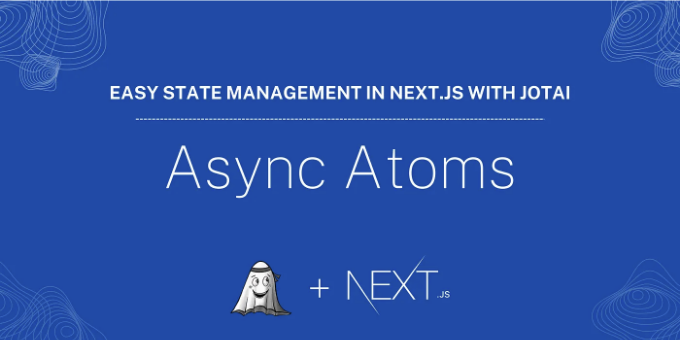

Jotai는 비동기 원자도 지원합니다. 비동기 원자는 비동기적으로 읽고 쓸 수 있는 원자입니다. jotai/utils 모듈의 atom 함수와 loadable 함수를 사용하여 비동기 원자를 만들 수 있습니다. 다음과 같이 비동기 원자를 만들 수 있습니다:

```js
import { atom } from "jotai";
import { loadable } from "jotai/utils";
import { Post } from "./user-atom";
export const postsPaginationAtom = atom({
  start: 0,
  limit: 5,
});

const postsAtom = atom<Promise<Post[]>>(async (get) => {
  // 페이지네이션 변경 시 이 원자가 다시 평가됩니다
  const pagination = get(postsPaginationAtom);
  const response = await fetch(
    `https://jsonplaceholder.typicode.com/posts?_start=${pagination.start}&_limit=${pagination.limit}`
  );
  const data = await response.json();
  return data;
});

export const getPostsAtom = loadable(postsAtom);
```

설명:

<!-- ui-log 수평형 -->
<ins class="adsbygoogle"
  style="display:block"
  data-ad-client="ca-pub-4877378276818686"
  data-ad-slot="9743150776"
  data-ad-format="auto"
  data-full-width-responsive="true"></ins>
<component is="script">
(adsbygoogle = window.adsbygoogle || []).push({});
</component>

- 페이지네이션 정보를 저장하는 postsPaginationAtom 원자를 만듭니다.
- 페이지네이션 정보에 따라 게시물을 가져오는 postsAtom 원자를 만듭니다.
- loadable 함수를 사용하여 getPostsAtom 원자를 만들어 비동기 원자를 읽고 쓸 수 있도록 합니다.

이제 다음과 같이 컴포넌트에서 비동기 원자를 사용할 수 있습니다:

```js
import { useAtom } from "jotai";
import { getPostsAtom } from "@/atoms/posts-atom";

function PostsPage() {
  const [response] = useAtom(getPostsAtom);
  ...
}
```

response 변수의 모양은 다음과 같을 것입니다:

<!-- ui-log 수평형 -->
<ins class="adsbygoogle"
  style="display:block"
  data-ad-client="ca-pub-4877378276818686"
  data-ad-slot="9743150776"
  data-ad-format="auto"
  data-full-width-responsive="true"></ins>
<component is="script">
(adsbygoogle = window.adsbygoogle || []).push({});
</component>

```js
{
    state: 'loading' | 'hasData' | 'hasError',
    data?: any,
    error?: any,
}
```

async atom의 상태에 따라 다른 UI를 렌더링하는 데 state 속성을 사용할 수 있습니다. 예를 들어:

```js
if (response.state === "loading") {
    // 로딩 상태 렌더링
  }  if (response.state === "hasError") {
    // 에러 상태 렌더링
  }  if (response.state === "hasData") {
    // 데이터 상태 렌더링
  }
```

data 속성은 state가 hasData인 경우 데이터를 포함하고, error 속성은 state가 hasError인 경우 오류를 포함합니다. async atom을 사용하는 구성 요소 예제는 다음과 같습니다:```

<!-- ui-log 수평형 -->
<ins class="adsbygoogle"
  style="display:block"
  data-ad-client="ca-pub-4877378276818686"
  data-ad-slot="9743150776"
  data-ad-format="auto"
  data-full-width-responsive="true"></ins>
<component is="script">
(adsbygoogle = window.adsbygoogle || []).push({});
</component>

```js
"사용자 최적화";
import { getPostsAtom } from "@/atoms/async-atom";
import { useAtom } from "jotai";
import React from "react";
import AsyncPostList from "./posts";
import Pagination from "./pagination";
type Props = {};

export default function AsyncAtomPage({}: Props) {
  const [response] = useAtom(getPostsAtom);

  if (response.state === "loading") {
    return <div>로딩 중...</div>;
  }
  if (response.state === "hasError") {
    if (response.error instanceof Error) {
      return <div>{response.error.message}</div>;
    } else {
      return <div>알 수 없는 오류</div>;
    }
  }

  return (
    <div className="flex flex-col items-center space-y-4">
      <AsyncPostList posts={response.data} />
      <Pagination />
    </div>
  );
}
```

페이지이션 구성요소는 다음과 같이 구현할 수 있습니다:

```js
import { postsPaginationAtom } from "@/atoms/async-atom";
import { useAtom } from "jotai";
import React from "react";

type Props = {};

const Pagination = (props: Props) => {
  const [pagination, setPagination] = useAtom(postsPaginationAtom);

  const handleNext = () => {
    setPagination({ ...pagination, start: pagination.start + 1 });
  };

  const handlePrevious = () => {
    setPagination({ ...pagination, start: pagination.start - 1 });
  };

  return (
    <div className="flex flex-row items-center space-x-4 p-2 mb-4">
      <button
        onClick={handlePrevious}
        disabled={pagination.start === 0}
        className="bg-blue-500 hover:bg-blue-700 text-white font-bold py-2 px-4 rounded disabled:opacity-50"
      >
        이전
      </button>
      <span>페이지: {pagination.start + 1}</span>
      <button
        onClick={handleNext}
        className="bg-blue-500 hover:bg-blue-700 text-white font-bold py-2 px-4 rounded"
      >
        다음
      </button>
    </div>
  );
};

export default Pagination;
```

또한, AsyncPostList 구성요소는 다음과 같이 구현할 수 있습니다:

<!-- ui-log 수평형 -->
<ins class="adsbygoogle"
  style="display:block"
  data-ad-client="ca-pub-4877378276818686"
  data-ad-slot="9743150776"
  data-ad-format="auto"
  data-full-width-responsive="true"></ins>
<component is="script">
(adsbygoogle = window.adsbygoogle || []).push({});
</component>

```js
"use client";
import { Post } from "@/atoms/user-atom";
import PostCard from "../post-card";
import Header from "./header";

type Props = {
  posts: Post[];
};

function AsyncPostList({ posts }: Props) {
  return (
    <div className="flex flex-col items-center space-y-4 max-w-2xl">
      <Header />
      {posts.map((post) => (
        <PostCard key={post.id} post={post} />
      ))}
    </div>
  );
}

export default AsyncPostList;
```

Header 컴포넌트는 타이틀과 페이지네이션 제한 드롭다운을 표시하는 데 사용됩니다:

```js
import { postsPaginationAtom } from "@/atoms/async-atom";
import { useAtom } from "jotai";
import React from "react";

type Props = {};

const limits = [5, 10, 15, 20];
export default function Header({}: Props) {
  const [pagination, setPagination] = useAtom(postsPaginationAtom);

  const onLimitChange = (e: React.ChangeEvent<HTMLSelectElement>) => {
    setPagination({ ...pagination, limit: parseInt(e.target.value), start: 0 });
  };

  return (
    <div className="flex flex-row items-center space-x-4 p-2 mb-4 w-full justify-between">
      <h1>Posts</h1>
      <select
        value={pagination.limit}
        onChange={onLimitChange}
        className="font-bold py-2 px-4 rounded border border-gray-300"
      >
        {limits.map((limit) => (
          <option key={limit} value={limit}>
            {limit}
          </option>
        ))}
      </select>
    </div>
  );
}
```

Jotai에서 async atom을 사용하여 데이터를 비동기적으로 가져오고 응용 프로그램의 데이터 상태를 관리할 수 있는 방법입니다.

<!-- ui-log 수평형 -->
<ins class="adsbygoogle"
  style="display:block"
  data-ad-client="ca-pub-4877378276818686"
  data-ad-slot="9743150776"
  data-ad-format="auto"
  data-full-width-responsive="true"></ins>
<component is="script">
(adsbygoogle = window.adsbygoogle || []).push({});
</component>

# 데모

비동기 Atom 예제의 데모입니다:


전체 데모: [https://jotai-example.rasit.me/](https://jotai-example.rasit.me/)

<!-- ui-log 수평형 -->
<ins class="adsbygoogle"
  style="display:block"
  data-ad-client="ca-pub-4877378276818686"
  data-ad-slot="9743150776"
  data-ad-format="auto"
  data-full-width-responsive="true"></ins>
<component is="script">
(adsbygoogle = window.adsbygoogle || []).push({});
</component>

깃허브 저장소: https://github.com/rasitcolakel/next-js-jotai

# 결론

이 글에서는 React를 위한 간단하고 유연한 상태 관리 라이브러리 인 Jotai에 대해 배웠습니다. 우리는 Jotai를 사용하여 atom, 파생된 atom 및 비동기 atom을 만드는 방법을 알아보았습니다. 또한 Next.js 애플리케이션에서 Jotai를 사용하는 방법도 배웠습니다. Jotai는 애플리케이션의 상태를 간단하고 효율적으로 관리하는 데 도움이 되는 강력한 상태 관리 라이브러리입니다. 이 글이 도움이 되었기를 바랍니다. 궁금한 점이 있거나 피드백이 있다면 언제든지 Twitter를 통해 저에게 연락해 주세요. 읽어 주셔서 감사합니다!

# 참고문헌

<!-- ui-log 수평형 -->
<ins class="adsbygoogle"
  style="display:block"
  data-ad-client="ca-pub-4877378276818686"
  data-ad-slot="9743150776"
  data-ad-format="auto"
  data-full-width-responsive="true"></ins>
<component is="script">
(adsbygoogle = window.adsbygoogle || []).push({});
</component>

- Jotai 문서
- TypeScript
- Next.js
- Vercel
- React