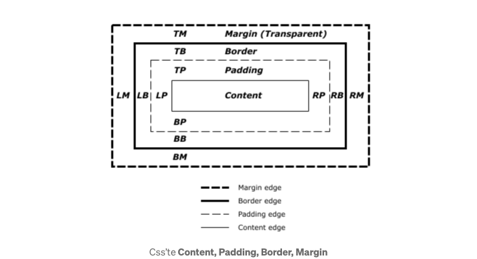

## CSS-2D 디멘션 및 단위

## CSS에서 크기 조절

CSS에서 크기 조절은 HTML 요소의 너비, 높이, 여백 및 기타 디멘션 특성을 정의하는 데 사용됩니다. 요소의 크기를 설정할 때 픽셀(px), 퍼센트(%), em(em) 및 rem(root em)과 같은 단위를 사용할 수 있습니다.

1. 너비와 높이 (width, height):

<!-- ui-log 수평형 -->
<ins class="adsbygoogle"
  style="display:block"
  data-ad-client="ca-pub-4877378276818686"
  data-ad-slot="9743150776"
  data-ad-format="auto"
  data-full-width-responsive="true"></ins>
<component is="script">
(adsbygoogle = window.adsbygoogle || []).push({});
</component>

```css
div {
    width: 200px;
    height: 100px;
}
```

2. 패딩 (Padding):

```css
div {
    padding: 20px;
}
```

3. 테두리 (Border):

<!-- ui-log 수평형 -->
<ins class="adsbygoogle"
  style="display:block"
  data-ad-client="ca-pub-4877378276818686"
  data-ad-slot="9743150776"
  data-ad-format="auto"
  data-full-width-responsive="true"></ins>
<component is="script">
(adsbygoogle = window.adsbygoogle || []).push({});
</component>

```js
div {
    border: 2px 점선 #000;
}
```

4. 마진 (Margin) 설정:

```js
div {
    margin: 10px;
}
```

5. 글꼴 크기 (Font Size):

<!-- ui-log 수평형 -->
<ins class="adsbygoogle"
  style="display:block"
  data-ad-client="ca-pub-4877378276818686"
  data-ad-slot="9743150776"
  data-ad-format="auto"
  data-full-width-responsive="true"></ins>
<component is="script">
(adsbygoogle = window.adsbygoogle || []).push({});
</component>

```css
p {
    font-size: 16px;
}
```



## CSS에서 사이즈 단위

CSS에서 사용되는 사이즈 단위는 HTML 요소의 너비, 높이, 여백 및 기타 사이즈 속성을 지정하는 데 사용됩니다. 아래는 일반적으로 사용되는 몇 가지 사이즈 단위입니다:

<!-- ui-log 수평형 -->
<ins class="adsbygoogle"
  style="display:block"
  data-ad-client="ca-pub-4877378276818686"
  data-ad-slot="9743150776"
  data-ad-format="auto"
  data-full-width-responsive="true"></ins>
<component is="script">
(adsbygoogle = window.adsbygoogle || []).push({});
</component>

1. 픽셀(px):
픽셀은 화면의 가장 작은 점이며 웹 디자인에서 가장 일반적으로 사용되는 크기 단위입니다. 픽셀 단위는 고정된 크기를 제공하며 브라우저에 의해 직접 해석됩니다.

```js
css
 div {
 width: 200px;
 height: 100px;
 padding: 10px;
 }
```

2. 백분율(%):
백분율 단위는 요소의 상위 항목에 대한 상대적 크기를 지정합니다. 예를 들어, div의 너비를 50%로 지정하면 해당 div의 너비가 상위 항목의 절반만큼 됨을 의미합니다.

```js
css
 div {
 width: 50%;
 height: 50%;
 }
```

<!-- ui-log 수평형 -->
<ins class="adsbygoogle"
  style="display:block"
  data-ad-client="ca-pub-4877378276818686"
  data-ad-slot="9743150776"
  data-ad-format="auto"
  data-full-width-responsive="true"></ins>
<component is="script">
(adsbygoogle = window.adsbygoogle || []).push({});
</component>

3. EM (em):
EM 단위는 요소의 글꼴 크기의 배수로 정의됩니다. 예를 들어, 요소의 `font-size` 속성이 16px이면, 1em은 16px이며, 2em은 32px가 될 것입니다.

```js
css
 p {
 font-size: 1.2em;
 margin: 1em;
 }
```

4. REM (root em):
REM 단위는 루트 요소(``html`` 요소)의 글꼴 크기의 배수로 정의됩니다. REM은 브라우저의 기본 글꼴 크기를 사용하며, 특히 반응형 디자인에서 선호됩니다.

```js
css
 p {
 font-size: 1.2rem;
 margin: 1rem;
 }
```

<!-- ui-log 수평형 -->
<ins class="adsbygoogle"
  style="display:block"
  data-ad-client="ca-pub-4877378276818686"
  data-ad-slot="9743150776"
  data-ad-format="auto"
  data-full-width-responsive="true"></ins>
<component is="script">
(adsbygoogle = window.adsbygoogle || []).push({});
</component>

5. 뷰포트 크기 (vw, vh, vmin, vmax):
이 측정 단위는 브라우저 창의 크기에 따라 조절됩니다.
- vw: 뷰포트 너비 (%)
- vh: 뷰포트 높이 (%)
- vmin: 뷰포트의 가장 작은 크기 (%)
- vmax: 뷰포트의 가장 큰 크기 (%)

```css
div {
  width: 50vw; /* 뷰포트 너비의 절반 */
  height: 80vh; /* 뷰포트 높이의 80% */
}
```

이 크기 단위는 웹 페이지의 레이아웃과 디자인을 유연하고 확장 가능하게 만들어주며 브라우저와 장치에 맞추는 데 도움이 됩니다.

- display: inline; 블록 레벨 요소를 태그의 수만큼 공간을 차지하도록 함
- box-sizing: border-box; HTML 요소의 크기를 계산하는 방법을 지정합니다. 이 속성은 요소의 너비와 높이가 내용 상자, 안쪽 여백 및 테두리를 포함한 전체 영역을 나타내도록합니다.