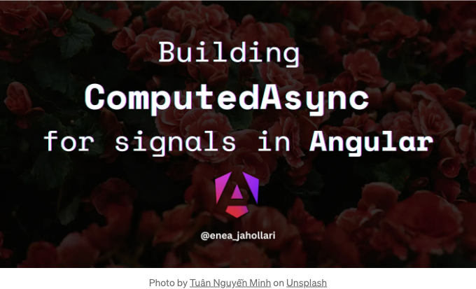

## Angular에서 Signals와 Rxjs를 사용하여 비동기 작업 처리하기



## 약간의 역사

Angular에서 비동기 작업 처리는 항상 Observables의 역할이었습니다. Observables은 비동기 작업을 처리하는 좋은 방법입니다. 그러나 Angular에서 Signals가 도입되면서 모든 사람들이 모든 것에 Signals를 사용하려고 합니다. 하지만 Signals는 비동기 작업을 처리하기 위해 고안된 것이 아닙니다. Signals는 값을 처리하는 데 있어서 이벤트가 아닙니다. 그렇다면 Signals를 사용하여 비동기 작업을 어떻게 처리할까요? 함께 알아봅시다.

<!-- ui-log 수평형 -->
<ins class="adsbygoogle"
  style="display:block"
  data-ad-client="ca-pub-4877378276818686"
  data-ad-slot="9743150776"
  data-ad-format="auto"
  data-full-width-responsive="true"></ins>
<component is="script">
(adsbygoogle = window.adsbygoogle || []).push({});
</component>

## 동기부여

API 호출에 대한 간단한 예제를 사용하겠습니다. API를 호출하고 데이터를 표시하는 컴포넌트가 있다고 가정해 봅시다. API 호출을 하기 위해 `HttpClient`를 사용할 것입니다. `HttpClient`는 우리가 구독하고 데이터를 얻을 수 있는 `Observable`을 반환합니다. Signals를 사용하여 이를 어떻게 처리할 수 있는지 보겠습니다.

```js
export class UserComponent {
  private imagesService = inject(ImagesService);

  user = input.required<User>();

  favoriteImages = signal<string[]>([]);

  constructor() {
    effect(() => {
      this.imagesService.getImages(this.user().favoriteImages).subscribe(images => {
        this.favoriteImages.set(images);
      });
    });
  }
}
```

위 코드를 보시다시피, 내장된 반응성을 사용하기 위해 신호 입력도 사용하고 있습니다.

<!-- ui-log 수평형 -->
<ins class="adsbygoogle"
  style="display:block"
  data-ad-client="ca-pub-4877378276818686"
  data-ad-slot="9743150776"
  data-ad-format="auto"
  data-full-width-responsive="true"></ins>
<component is="script">
(adsbygoogle = window.adsbygoogle || []).push({});
</component>

하지만, 우리는 구독 취소 부분을 다루지 않습니다. 따라서 수동으로 그 부분을 처리해야 합니다. effect 함수에는 매번 실행될 때 호출되는 콜백 함수가 포함되어 있습니다. 이를 사용하여 구독을 취소할 수 있습니다.

다음은 이를 수행하는 방법입니다.

```js
export class UserComponent {
  constructor() {
    // onCleanup은 효과가 실행될 때마다 호출되는 콜백 함수입니다
    effect((onCleanup) => { 
      const sub = this.imagesService.getImages(this.user().favoriteImages).subscribe(images => {
        this.favoriteImages.set(images);
      });
      onCleanup(() => sub.unsubscribe()) // 구독 취소
    });
  }
}
```

요약하면, 위의 코드에서 무슨 일이 일어나는지에 대해요.

<!-- ui-log 수평형 -->
<ins class="adsbygoogle"
  style="display:block"
  data-ad-client="ca-pub-4877378276818686"
  data-ad-slot="9743150776"
  data-ad-format="auto"
  data-full-width-responsive="true"></ins>
<component is="script">
(adsbygoogle = window.adsbygoogle || []).push({});
</component>

- `user` 입력이 변경될 때마다 실행될 효과를 등록합니다.
- 효과는 기본적으로 적어도 한 번 실행되므로 초기 API 호출을 수행합니다.
- `user` 입력이 변경될 때마다 효과가 다시 실행됩니다.
- 효과가 다시 실행될 때마다 onCleanup 함수가 전달된 콜백 함수를 호출합니다.
- 우리의 콜백 함수는 이전 구독을 해지합니다. (따라서 RxJS의 'switchMap' 연산자처럼 동작합니다)
- API 호출이 완료되면 `favoriteImages` 신호의 값이 설정됩니다.

## 문제

위 예시에서 시도하고 있는 것은 사용자 `favoriteImages` ID에 기반한 파생 상태를 갖는 것입니다. 그래서 효과를 사용하는 것이 이 작업을 하는 간단한 방법이 아닐 수 있습니다. 또는 우리가 구독을 해지하는 것을 잊어버릴 수 있습니다.

다른 해결책으로 `toObservable` 도우미 함수를 사용하는 것이 있습니다.

<!-- ui-log 수평형 -->
<ins class="adsbygoogle"
  style="display:block"
  data-ad-client="ca-pub-4877378276818686"
  data-ad-slot="9743150776"
  data-ad-format="auto"
  data-full-width-responsive="true"></ins>
<component is="script">
(adsbygoogle = window.adsbygoogle || []).push({});
</component>

```js
export class UserComponent {
  private imagesService = inject(ImagesService);

  user = input.required<User>();

  favoriteImages = toSignal(toObservable(this.user).pipe(
    switchMap(user => this.imagesService.getImages(user.favoriteImages))
  ), { initialValue: [] });
}
```

이 방법은 더 나은 해결책이지만 완벽하지는 않아요. 다른 입력 항목을 추가해야 하는 경우에는 어떻게 해야 할까요? API 호출에 포함해야 한다면 `combineLatest` 연산자를 사용해야 합니다.

```js
export class UserComponent {
  private imagesService = inject(ImagesService);

  user = input.required<User>();
  otherInput = input.required<string>();

  favoriteImages = toSignal(combineLatest([
    toObservable(this.user),
    toObservable(this.otherInput)
  ]).pipe(
    switchMap(([user, otherInput]) => this.imagesService.getImages(user.favoriteImages, otherInput))
  ), { initialValue: [] });
}
```

이렇게 되면 코드가 빠르게 복잡해지죠! 점점 더 많은 rxjs 연산자가 포함되면서 `toObservable`와 `toSignal`을 모든 곳에 사용해야 해요.

<!-- ui-log 수평형 -->
<ins class="adsbygoogle"
  style="display:block"
  data-ad-client="ca-pub-4877378276818686"
  data-ad-slot="9743150776"
  data-ad-format="auto"
  data-full-width-responsive="true"></ins>
<component is="script">
(adsbygoogle = window.adsbygoogle || []).push({});
</component>

할 수 있어요!

# ComputedAsync 빌드하기

우리는 `computedAsync` 함수가 `computed` 함수처럼 동작하되 비동기 작업을 처리해야 한다는 것을 원합니다. 기본적으로 비동기 작업의 값을 가진 신호를 반환해야 합니다.

```js
favoriteImages = computedAsync(() => 
  this.imagesService.getImages(this.user().favoriteImages)
);
```

<!-- ui-log 수평형 -->
<ins class="adsbygoogle"
  style="display:block"
  data-ad-client="ca-pub-4877378276818686"
  data-ad-slot="9743150776"
  data-ad-format="auto"
  data-full-width-responsive="true"></ins>
<component is="script">
(adsbygoogle = window.adsbygoogle || []).push({});
</component>

우리는 observable(또는 promise)을 반환하고, `computedAsync` 함수가 해당 구독 및 구독 해지를 처리하도록 하고 싶어요.

## 콜백 함수 처리

개발자가 observable이나 promise를 전달하거나 일반 값만 전달할 수 있도록 하고 싶어요. 따라서 모든 경우를 처리해야 해요.

다음은 가능한 경우들입니다:

<!-- ui-log 수평형 -->
<ins class="adsbygoogle"
  style="display:block"
  data-ad-client="ca-pub-4877378276818686"
  data-ad-slot="9743150776"
  data-ad-format="auto"
  data-full-width-responsive="true"></ins>
<component is="script">
(adsbygoogle = window.adsbygoogle || []).push({});
</component>

```js
유형 ComputationResult<T> = Promise<T> | Observable<T> | T | undefined;
```

콜백 함수를 받아들이고 Signal을 반환하고 싶습니다. 따라서, `ComputationResult<T>`를 반환할 콜백 함수를 받아들일 필요가 있습니다.

```js
export function computedAsync<T>(
    computation: () => ComputationResult<T>
): Signal<T> {
  // ...
}
```

## 현재 값과 결과 처리하기
<!-- ui-log 수평형 -->
<ins class="adsbygoogle"
  style="display:block"
  data-ad-client="ca-pub-4877378276818686"
  data-ad-slot="9743150776"
  data-ad-format="auto"
  data-full-width-responsive="true"></ins>
<component is="script">
(adsbygoogle = window.adsbygoogle || []).push({});
</component>

현재 값 처리와 계산 결과 반환을 해야 합니다. 현재 값 처리에는 `WritableSignal`을 사용하고, 계산 결과를 반환하기 위해 계산된 시그널을 사용할 수 있습니다.

```js
export function computedAsync<T>(
    computation: () => ComputationResult<T>
): Signal<T> {
  const sourceValue = signal<T | undefined>(undefined);
  return computed(() => sourceValue()!);
}
```

## 계산 처리하기

계산에는 시그널이 포함되므로 시그널 변경을 감시하는 유일한 방법인 `effect`를 사용해 계산을 처리해야 합니다.

<!-- ui-log 수평형 -->
<ins class="adsbygoogle"
  style="display:block"
  data-ad-client="ca-pub-4877378276818686"
  data-ad-slot="9743150776"
  data-ad-format="auto"
  data-full-width-responsive="true"></ins>
<component is="script">
(adsbygoogle = window.adsbygoogle || []).push({});
</component>

```js
import { isObservable } from 'rxjs';

export function computedAsync<T>(
    computation: () => ComputationResult<T>
): Signal<T> {
  const sourceValue = signal<T | undefined>(undefined);

  effect(() => {
    const value = computation(); // 계산 결과를 저장

    // 값이 observable이거나 promise 또는 일반 값인 경우 처리
    if (isObservable(value) || isPromise(value)) {
      // TODO: observable 및 promise 처리
    } else {
      // TODO: 일반 값 처리
    }
  });

  return computed(() => sourceValue()!);
}

// 값이 promise인지 확인하는 도우미 함수
function isPromise<T>(value: any): value is Promise<T> {
 return value && typeof value.then === 'function';
}
```

그러나 `effect`는 `DestroyRef` 토큰에 의존하므로 주입 컨텍스트에 있어야 하거나 주입기를 전달해야 합니다. 이 부분을 처리해보겠습니다.

## 주입 컨텍스트 처리

`ngxtension` 라이브러리에 포함된 Chau Tran이 만든 `assertInjector` 도우미 함수를 사용하겠습니다.

<!-- ui-log 수평형 -->
<ins class="adsbygoogle"
  style="display:block"
  data-ad-client="ca-pub-4877378276818686"
  data-ad-slot="9743150776"
  data-ad-format="auto"
  data-full-width-responsive="true"></ins>
<component is="script">
(adsbygoogle = window.adsbygoogle || []).push({});
</component>

`assertInjector` 함수는 인젝터가 제공되었는지 확인하고, 제공되지 않았다면 오류를 발생시킵니다. 세 번째 인수에는 인젝션 컨텍스트에서 호출될 콜백 함수를 전달할 수 있습니다.

`ComputedAsyncOptions` 인터페이스를 만들어봅시다. 이 인터페이스는 인젝터와 동일한 함수를 포함하는 `computed` 함수와 동일한 함수를 포함할 것입니다.

```js
interface ComputedAsyncOptions<T> extends CreateComputedOptions<T> {
  injector?: Injector;
}
```

이제 `assertInjector` 함수를 사용할 수 있습니다.

<!-- ui-log 수평형 -->
<ins class="adsbygoogle"
  style="display:block"
  data-ad-client="ca-pub-4877378276818686"
  data-ad-slot="9743150776"
  data-ad-format="auto"
  data-full-width-responsive="true"></ins>
<component is="script">
(adsbygoogle = window.adsbygoogle || []).push({});
</component>

```js
export function computedAsync<T>(
    computation: () => ComputationResult<T>,
    options?: ComputedAsyncOptions<T>
): Signal<T> {
  return assertInjector(computedAsync, options?.injector, () => {
    // 여기서는 effect 및 inject 함수를 안전하게 사용할 수 있습니다. 왜냐하면 주입 컨텍스트 안에 있기 때문입니다.
     effect(() => { /* ...  */ }, { injector: options?.injector });
  });
}
```

## 구독 처리

현재 값 처리를 위해 `sourceValue` 시그널이 있는 것처럼, 구독 처리를 위해 `sourceEvent$` 옵저버블이 필요합니다. 구독을 처리하기 위해 `Subject`를 사용할 것입니다.

`sourceEvent$`의 값은 promise 또는 observable이어야 합니다.

<!-- ui-log 수평형 -->
<ins class="adsbygoogle"
  style="display:block"
  data-ad-client="ca-pub-4877378276818686"
  data-ad-slot="9743150776"
  data-ad-format="auto"
  data-full-width-responsive="true"></ins>
<component is="script">
(adsbygoogle = window.adsbygoogle || []).push({});
</component>

```js
const sourceEvent$ = new Subject<Promise<T> | Observable<T>>();
```

`sourceEvent$`를 구독하고 `sourceValue` 신호의 값을 설정합시다.

또한 우리는 observable을 펼쳐야하기 때문에 조심해야 합니다. 왜냐하면 우리는 `sourceEvent$`에 observable 또는 promise를 전달할 것이기 때문입니다.

그래서 observable을 펼치기 위해 `switchMap` 연산자를 사용하겠습니다.

<!-- ui-log 수평형 -->
<ins class="adsbygoogle"
  style="display:block"
  data-ad-client="ca-pub-4877378276818686"
  data-ad-slot="9743150776"
  data-ad-format="auto"
  data-full-width-responsive="true"></ins>
<component is="script">
(adsbygoogle = window.adsbygoogle || []).push({});
</component>

```js
const sourceResult = sourceEvent$
    .pipe(switchMap(s$ => s$))
    .subscribe({
        // source$가 값을 방출할 때 sourceValue 시그널의 값을 설정합니다
        next: (value) => sourceValue.set(value),
        error: (error) => {
            // 참고: 오류는 사용자에 의해 처리되어야 합니다 (catchError 또는 .catch()를 사용함)
            sourceValue.set(error);
        }
    });
``` 

`switchMap(s$ => s$)`를 `switchAll()` 연산자로 대체할 수 있습니다.

Petrus Nguyễn Thái Học와 Lucas Garcia에게 그것을 지적해 줘서 감사합니다.

```js
const sourceResult = sourceEvent$
    .pipe(switchAll())
    .subscribe();
```

<!-- ui-log 수평형 -->
<ins class="adsbygoogle"
  style="display:block"
  data-ad-client="ca-pub-4877378276818686"
  data-ad-slot="9743150776"
  data-ad-format="auto"
  data-full-width-responsive="true"></ins>
<component is="script">
(adsbygoogle = window.adsbygoogle || []).push({});
</component>

## 구독 정리하기

우리는 `sourceEvent$` observable을 구독했기 때문에 구독을 해제해야 합니다. 이를 처리하기 위해 `DestroyRef` 토큰을 사용할 수 있습니다. `DestroyRef`는 `onDestroy` 메서드를 가지고 있어서, 우리가 구성요소가 파괴될 때 해당 콜백 함수를 호출하게 됩니다.

```js
export function computedAsync<T>(
    computation: () => ComputationResult<T>,
    options?: ComputedAsyncOptions<T>
): Signal<T> {
  return assertInjector(computedAsync, options?.injector, () => {
    const destroyRef = inject(DestroyRef);

    const sourceEvent$ = new Subject<Promise<T> | Observable<T>>();

    effect(() => { /* ... */ });

    const sourceResult = source$.subscribe(/* ... */);

    destroyRef.onDestroy(() => {
      sourceResultSubcription.unsubscribe();
    });
  });
}
```

여기까지입니다! 값 얻기 위해 구독하고, 구성요소가 파괴될 때 구독을 해제합니다.

<!-- ui-log 수평형 -->
<ins class="adsbygoogle"
  style="display:block"
  data-ad-client="ca-pub-4877378276818686"
  data-ad-slot="9743150776"
  data-ad-format="auto"
  data-full-width-responsive="true"></ins>
<component is="script">
(adsbygoogle = window.adsbygoogle || []).push({});
</component>

## 계산된 Observable 또는 Promise 다루기

현재 `computedAsync` 함수는 다음과 같습니다:

```js
export function computedAsync<T>(
    computation: () => ComputationResult<T>,
    options?: ComputedAsyncOptions<T>
): Signal<T> {
  return assertInjector(computedAsync, options?.injector, () => {
    const destroyRef = inject(DestroyRef);

    const sourceValue = signal<T | undefined>(undefined);

    const sourceEvent$ = new Subject<Promise<T> | Observable<T>>();

    effect(() => {
        const value = computation(); // 연산 결과 저장

        // 결과가 Observable이거나 Promise 또는 일반 값이면 처리
        if (isObservable(value) || isPromise(value)) {
            // TODO: Observable 및 Promise 처리
        } else {
            // TODO: 일반 값 처리
        }
    });

    const sourceResult = sourceEvent$
        .pipe(switchAll())
        .subscribe({
            next: (value) => sourceValue.set(value),
            error: (error) => sourceValue.set(error)
        });

    destroyRef.onDestroy(() => {
      sourceResultSubcription.unsubscribe();
    });

    return computed(() => sourceValue()!);
  });
}
```

위 코드의 TODO를 처리해봅시다.

<!-- ui-log 수평형 -->
<ins class="adsbygoogle"
  style="display:block"
  data-ad-client="ca-pub-4877378276818686"
  data-ad-slot="9743150776"
  data-ad-format="auto"
  data-full-width-responsive="true"></ins>
<component is="script">
(adsbygoogle = window.adsbygoogle || []).push({});
</component>

먼저 일반 값 케이스를 처리해 봅시다. `sourceValue` 시그널의 값을 설정하면 됩니다.

```js
effect(() => {
  const value = computation(); // 계산 결과를 저장합니다.

  // 결과가 observable이거나 promise이거나 일반 값인 경우를 처리합니다.
  if (isObservable(value) || isPromise(value)) {
      // TODO: observable 및 promise 처리
  } else {
      sourceValue.set(value);
  }
});
```

이것은 오류를 발생시킬 것입니다. 왜냐하면 효과 내에서 시그널의 값을 설정하기 전에, 효과를 위해 먼저 활성화해야하기 때문입니다.

```js
effect(() => {
    // ...
}, { allowSignalWrites: true }) // 시그널 쓰기 허용
```

<!-- ui-log 수평형 -->
<ins class="adsbygoogle"
  style="display:block"
  data-ad-client="ca-pub-4877378276818686"
  data-ad-slot="9743150776"
  data-ad-format="auto"
  data-full-width-responsive="true"></ins>
<component is="script">
(adsbygoogle = window.adsbygoogle || []).push({});
</component>

하지만, 이 문제를 해결할 또 다른 방법이 있습니다. 우리는 `untracked` 함수를 사용하여 시그널의 값을 설정할 수 있습니다. 여기서 효과를 활성화하지 않고 값만 설정하는 거죠 (이는 사실상 위의 코드와 동일한 작업을 합니다). 이 속임수에 대해 더 읽어보세요.

이렇게 사용해 봅시다.

```js
untracked(() => sourceValue.set(value));
```

Observable 및 promise 케이스를 처리해 봅시다. 시그널에서 값 설정과 마찬가지로, 우리는 `sourceEvent$` observable로 `next`를 해주어야 합니다.

<!-- ui-log 수평형 -->
<ins class="adsbygoogle"
  style="display:block"
  data-ad-client="ca-pub-4877378276818686"
  data-ad-slot="9743150776"
  data-ad-format="auto"
  data-full-width-responsive="true"></ins>
<component is="script">
(adsbygoogle = window.adsbygoogle || []).push({});
</component>

```js
효과(() => {
    const value = 계산(); // 계산 결과를 저장합니다.

    // 값이 observable이거나 promise 또는 일반 값인 경우 결과를 처리합니다.
    if (isObservable(value) || isPromise(value)) {
        sourceEvent$.next(value);
    } else {
        untracked(() => sourceValue.set(value));
    }
});
```

그냥 이대로 두면 몇 가지 문제가 발생할 수 있어요. 어떤 문제가 발생하는지 예시를 살펴보세요:

```js
export class UserComponent {
  private imagesService = inject(ImagesService);
  user = input.required<User>();

  someValue = signal<string>('');

  favoriteImages = computedAsync(() => {
    return this.imagesService.getImages(this.user().favoriteImages).pipe(
       tap(() => this.someValue.set('some value'))
    );
  });
}
```

<!-- ui-log 수평형 -->
<ins class="adsbygoogle"
  style="display:block"
  data-ad-client="ca-pub-4877378276818686"
  data-ad-slot="9743150776"
  data-ad-format="auto"
  data-full-width-responsive="true"></ins>
<component is="script">
(adsbygoogle = window.adsbygoogle || []).push({});
</component>

`someValue` 시그널은 계산 내부에서 설정될 것이지만, 우리의 계산은 이펙트 내에 있습니다. 다시 말해, 우리는 이펙트 내부에서 시그널의 값을 설정하고 있습니다. 이것은 에러를 발생시킬 것입니다. 그래서 `sourceEvent$.next()`를 추적하지 않아도 되게끔 해야 합니다.

```js
effect(() => {
    const value = computation(); // 계산 결과 저장

    // 값이 옵저버블이거나 프로미스이거나 일반 값인 경우 결과 처리
    if (isObservable(value) || isPromise(value)) {
        untracked(() => sourceEvent$.next(value));
    } else {
        untracked(() => sourceValue.set(value));
    }
});
```

이제 우리의 `computedAsync` 함수가 완성되었어요 🎉!

## 초기 값

<!-- ui-log 수평형 -->
<ins class="adsbygoogle"
  style="display:block"
  data-ad-client="ca-pub-4877378276818686"
  data-ad-slot="9743150776"
  data-ad-format="auto"
  data-full-width-responsive="true"></ins>
<component is="script">
(adsbygoogle = window.adsbygoogle || []).push({});
</component>

기본적으로 `sourceValue` 시그널의 초기 값은 `undefined`입니다. 그러나 `computedAsync` 함수에 초기 값 전달할 수 있어요.

```js
인터페이스 ComputedAsyncOptions<T>은 CreateComputedOptions<T>을 확장하며 다음 기본값이 있습니다.
 initialValue?: T;
 injector?: Injector;
}

export function computedAsync<T>(
    computation: () => ComputationResult<T>,
    options?: ComputedAsyncOptions<T>
): Signal<T> {
  return assertInjector(computedAsync, options?.injector, () => {
    // ...
    const sourceValue = signal<T | undefined>(options?.initialValue ?? undefined);
    // ...
  });
}
```

이제 `computedAsync` 함수에 초기 값을 전달할 수 있어요.

```js
export class UserComponent {
  private imagesService = inject(ImagesService);
  user = input.required<User>();

  favoriteImages = computedAsync(() => {
    return this.imagesService.getImages(this.user().favoriteImages);
  }, { initialValue: [] });
}
```

<!-- ui-log 수평형 -->
<ins class="adsbygoogle"
  style="display:block"
  data-ad-client="ca-pub-4877378276818686"
  data-ad-slot="9743150776"
  data-ad-format="auto"
  data-full-width-responsive="true"></ins>
<component is="script">
(adsbygoogle = window.adsbygoogle || []).push({});
</component>

## 레이스 조건 처리하기 (동작)

현재는 구독을 처리하기 위해 `switchAll` 연산자만 사용하고 있어 이전 호출을 취소합니다. 그러나 개발자들은 다른 동작을 원할 수 있고, 이를 위해 `computedAsync` 함수에 `behavior` 옵션을 추가할 수 있습니다.

```js
type ComputedAsyncBehavior = 'switch' | 'merge' | 'concat' | 'exhaust';

interface ComputedAsyncOptions<T> extends CreateComputedOptions<T> {
 initialValue?: T;
 injector?: Injector;
 behavior?: ComputedAsyncBehavior;
}
```

`behavior` 옵션을 사용하여 구독을 처리할 수 있습니다.

<!-- ui-log 수평형 -->
<ins class="adsbygoogle"
  style="display:block"
  data-ad-client="ca-pub-4877378276818686"
  data-ad-slot="9743150776"
  data-ad-format="auto"
  data-full-width-responsive="true"></ins>
<component is="script">
(adsbygoogle = window.adsbygoogle || []).push({});
</component>

`behavior` 옵션에 따라 연산자를 처리할 `createFlattenObservable` 함수를 만들어 봅시다.

```js
function createFlattenObservable<T>(
 source: Subject<Promise<T> | Observable<T>>,
 behavior: ComputedAsyncBehavior,
): Observable<T> {
 const KEY_OPERATOR_MAP = {
  merge: mergeAll,
  concat: concatAll,
  exhaust: exhaustAll,
  switch: switchAll,
 };

 return source.pipe(KEY_OPERATOR_MAP[behavior]());
}
```

이제 `createFlattenObservable` 함수를 사용하여 구독을 처리할 수 있습니다.

```js
const source$: Observable<T> = createFlattenObservable(
    sourceEvent$,
    options?.behavior ?? 'switch',
);
```

<!-- ui-log 수평형 -->
<ins class="adsbygoogle"
  style="display:block"
  data-ad-client="ca-pub-4877378276818686"
  data-ad-slot="9743150776"
  data-ad-format="auto"
  data-full-width-responsive="true"></ins>
<component is="script">
(adsbygoogle = window.adsbygoogle || []).push({});
</component>

기본적으로 `switch` 동작을 사용하지만 다른 동작을 전달할 수 있습니다.

```js
export class UserComponent {
  private imagesService = inject(ImagesService);
  user = input.required<User>();

  favoriteImages = computedAsync(() => 
    this.imagesService.getImages(this.user().favoriteImages), 
    { initialValue: [], behavior: 'merge' }
  );
}
```

rxjs 연산자도 Promise를 지원하므로 `sourceEvent$`에 Promise를 전달할 수 있고, 옵저버블을 다루는 방식과 마찬가지로 처리할 것입니다.

```js
export class UserComponent {
  private imagesService = inject(ImagesService);
  user = input.required<User>();

  favoriteImages = computedAsync(() => 
    fetch(`https://localhost/api/images/${this.user().favoriteImages}`).then(res => res.json()), 
    { initialValue: [], behavior: 'merge' }
  );
}
```

<!-- ui-log 수평형 -->
<ins class="adsbygoogle"
  style="display:block"
  data-ad-client="ca-pub-4877378276818686"
  data-ad-slot="9743150776"
  data-ad-format="auto"
  data-full-width-responsive="true"></ins>
<component is="script">
(adsbygoogle = window.adsbygoogle || []).push({});
</component>

## 계산에서 이전 값을 어떻게 사용할까요?

효과 내부에서는 `sourceValue` 신호에서 현재 값을 가져올 수 있습니다. 그러나 효과 내에서 신호를 읽으면 의존성으로 등록됩니다. 따라서 먼저 추적을 해제한 다음 `computation` 함수로 전달할 수 있습니다.

```js
effect(() => {
    const currentSourceValue = untracked(() => sourceValue());
    const value = computation(currentSourceValue); // 계산 결과 저장
    // ...  
}); 
```

이렇게하면 계산에서 이전 값을 사용할 수 있습니다.

<!-- ui-log 수평형 -->
<ins class="adsbygoogle"
  style="display:block"
  data-ad-client="ca-pub-4877378276818686"
  data-ad-slot="9743150776"
  data-ad-format="auto"
  data-full-width-responsive="true"></ins>
<component is="script">
(adsbygoogle = window.adsbygoogle || []).push({});
</component>

```js
export class UserComponent {
  private imagesService = inject(ImagesService);
  user = input.required<User>();

  favoriteImages = computedAsync((previousFavoriteImages) => {
      if (previousFavoriteImages) { /* do something */ }
      return this.imagesService.getImages(this.user().favoriteImages);
  }, 
  { initialValue: [], behavior: 'merge' });
}
```

# ngxtension에서 computedAsync 사용하기

`computedAsync` 함수는 `ngxtension` 라이브러리에서 사용할 수 있습니다.

```js
npm install ngxtension
# 또는
yarn add ngxtension
```  

<!-- ui-log 수평형 -->
<ins class="adsbygoogle"
  style="display:block"
  data-ad-client="ca-pub-4877378276818686"
  data-ad-slot="9743150776"
  data-ad-format="auto"
  data-full-width-responsive="true"></ins>
<component is="script">
(adsbygoogle = window.adsbygoogle || []).push({});
</component>

그럼, 'ngxtension' 라이브러리에서 해당 모듈을 가져와서 사용할 수 있어요.

```js
import { computedAsync } from 'ngxtension/computed-async';
```

그리고 이렇게 사용할 수 있어요:

```js
export class UserComponent {
  private imagesService = inject(ImagesService);
  user = input.required<User>();

  favoriteImages = computedAsync(() => 
    this.imagesService.getImages(this.user().favoriteImages), 
    { initialValue: [] }
  );
}
```

<!-- ui-log 수평형 -->
<ins class="adsbygoogle"
  style="display:block"
  data-ad-client="ca-pub-4877378276818686"
  data-ad-slot="9743150776"
  data-ad-format="auto"
  data-full-width-responsive="true"></ins>
<component is="script">
(adsbygoogle = window.adsbygoogle || []).push({});
</component>

