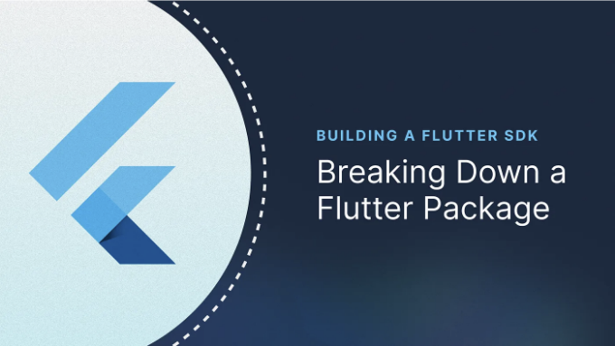
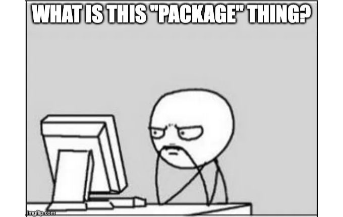

## 모든 측면에 대해 Flutter 패키지에 대해 배워보고, 직접 만들어 보세요



# 배경

내 의견으로는, 일반적으로 플러터를 위한 패키지를 작성하는 것이 다른 앱 개발 프레임워크보다 쉽습니다. 만약 이미 플러터에서 앱 개발을 알고 있다면, 패키지를 만드는 데 필요한 구체적인 지식이 크게 필요하지 않습니다. 다른 프레임워크에서는 패키지가 다른 구조를 가지고 있고, 여러 배포 방법이 있기 때문에 패키지/라이브러리를 만들기 시작하는 것이 훨씬 어렵습니다.

<!-- ui-log 수평형 -->
<ins class="adsbygoogle"
  style="display:block"
  data-ad-client="ca-pub-4877378276818686"
  data-ad-slot="9743150776"
  data-ad-format="auto"
  data-full-width-responsive="true"></ins>
<component is="script">
(adsbygoogle = window.adsbygoogle || []).push({});
</component>

우리의 플러터 팀이 첫 제품인 Stream Chat (나중에 Stream Video도 추가됨)을 위한 SDK를 만들기 시작했을 때, 이 SDK는 우리 백엔드 API를 쉽게 사용할 수 있도록 하는 간단한 패키지로 시작했습니다. 그러나 시간이 흐를수록 저희는 UI 컴포넌트, UI 빌더, 오프라인 저장, 국제화 등 더 많은 기능을 추가하기 시작했습니다. 작성 시점에서, Flutter Chat SDK에는 서로 다른 기능을 가능하게 하는 다섯 가지 패키지가 포함되어 있습니다. 저희는 SDK를 여러 번 반복하고 다양한 아키텍처, 상태 관리, 프로젝트 구조 등을 시도해 보았습니다.

우리는 플러터에서 SDK를 만드는 데 얻은 경험이 다소 독특하다는 것을 깨달았습니다. 많은 콘텐츠가 플러터의 각 부분을 다루고 있지만, SDK를 제작하는 사람은 적어서 그 노하우는 회사의 노션 페이지에서 잊혀지거나 프로젝트를 이끄는 사람들의 머릿속에 남게 됩니다. 이 기사들이 여러분이 상대적으로 쉽게 플러터에서 SDK를 만들 수 있도록 도와줄 것을 기대합니다. 왜냐하면 우리는 어떤 것들은 어렵게 배울 필요가 없다고 믿기 때문입니다.

# 소개

SDK를 하나 이상의 플러터 패키지로 정의하며, 보통은 플러터 앱에 서비스를 통합하는 데 도움을 주기 위한 공통 목표를 달성하기 위해 함께 작동할 수 있는 Flutter 패키지 집합으로 정의합니다. 그러나 완전한 SDK를 관리하는 방법을 이해하기 전에, Flutter 패키지의 각 부분과 파일의 역할은 모든 개발자에게 중요한 지식입니다.

<!-- ui-log 수평형 -->
<ins class="adsbygoogle"
  style="display:block"
  data-ad-client="ca-pub-4877378276818686"
  data-ad-slot="9743150776"
  data-ad-format="auto"
  data-full-width-responsive="true"></ins>
<component is="script">
(adsbygoogle = window.adsbygoogle || []).push({});
</component>

이 기사는 파일에 있는 내용(또는 이상적으로 추가되어야 하는 파일)을 통해 Flutter 패키지의 모든 측면을 다룹니다. 주로 Stream Chat Flutter SDK를 주요 예시로 사용하며 대부분의 코드 조각은 해당 SDK에서 출처를 얻었습니다.

# Flutter 패키지란 무엇인가요?



Flutter 패키지는 플러터 앱에 기능과 기능을 추가하는 미리 구축된 코드 모음입니다. 이러한 패키지는 건축 블록처럼 작용하여 기존 코드를 재사용하도록 허용함으로써 모든 것을 처음부터 작성하는 대신 시간과 노력을 절약합니다. 이러한 패키지에는 위젯, 라이브러리, 유틸리티, 에셋 등이 포함될 수 있으며, 개발자는 이러한 패키지를 쉽게 플러터 프로젝트에 통합할 수 있습니다.

<!-- ui-log 수평형 -->
<ins class="adsbygoogle"
  style="display:block"
  data-ad-client="ca-pub-4877378276818686"
  data-ad-slot="9743150776"
  data-ad-format="auto"
  data-full-width-responsive="true"></ins>
<component is="script">
(adsbygoogle = window.adsbygoogle || []).push({});
</component>

플러터에서 '패키지(packages)'와 '플러그인(plugins)' 간에도 차이가 있습니다. 패키지는 주로 순수한 Dart 코드 집합을 가리키는 반면, 플러그인은 내부에 네이티브 코드를 포함하는 패키지를 가리킵니다. 이 시리즈에서 "패키지"라는 단어는 특별히 언급되지 않는 한 패키지와 플러그인을 모두 포함한다는 점을 참고해 주세요.

패키지는 pubspec.yaml 파일(나중에 제시됨)의 dependencies 섹션을 통해 앱에 추가될 수 있습니다:

```js
dependencies:
 
    stream_chat_flutter: ^7.0.0
```

# Flutter 패키지 vs. Flutter 앱

<!-- ui-log 수평형 -->
<ins class="adsbygoogle"
  style="display:block"
  data-ad-client="ca-pub-4877378276818686"
  data-ad-slot="9743150776"
  data-ad-format="auto"
  data-full-width-responsive="true"></ins>
<component is="script">
(adsbygoogle = window.adsbygoogle || []).push({});
</component>

플러터 패키지와 앱의 최종 사용 목적은 분명히 다릅니다. 전자는 기능을 추가하는 재사용 가능한 코드를 의도하며, 후자는 어떤 플랫폼에도 컴파일할 수 있는 완전한 애플리케이션입니다. 그러나 앱과 패키지의 스타터 프로젝트는 유사하며 거의 동일합니다. 두 가지 모두 동일한 파일 세트를 가지고 있습니다: 선언을위한 pubspec.yaml, 코드를위한 lib 폴더, 테스트 폴더 등입니다. 주요한 차이점은 이러한 파일과 폴더가 같아도 파일의 사용이 다르다는 것입니다.

# 파일 이해하기

패키지에 있는 개별 파일을 살펴보고 그 용도를 이해해 봅시다.

```dart
{패키지_이름}.dart
```

<!-- ui-log 수평형 -->
<ins class="adsbygoogle"
  style="display:block"
  data-ad-client="ca-pub-4877378276818686"
  data-ad-slot="9743150776"
  data-ad-format="auto"
  data-full-width-responsive="true"></ins>
<component is="script">
(adsbygoogle = window.adsbygoogle || []).push({});
</component>

일반적인 앱에서는 main.dart 파일이 main() 함수를 통해 앱의 진입점을 가지고 있습니다. 모든 앱 실행은 이 함수에서 시작되며, 모든 Flutter 앱에서 필수적입니다. 패키지가 독립적으로 실행을 시작할 필요가 없기 때문에 main() 진입점을 가질 필요가 없습니다. 그러나 패키지는 lib 폴더의 루트에 해당 패키지 이름과 동일한 중심 파일을 포함합니다. 그러므로 stream_chat 패키지에는 lib 내부에 stream_chat.dart 파일이 있습니다. 그렇다면, 이 중심 파일의 목적은 무엇일까요?

패키지에는 기능을 수행하는 데 필요한 여러 클래스와 파일이 포함되어 있습니다. 그러나 이러한 클래스와 메서드 중 일부는 노출될 필요가 없을 수도 있습니다. 때로는 특별히 숨겨야 할 필요도 있습니다. 중심 파일의 주요 목적은 패키지의 어떤 파일이 앱에 노출될지를 정의하는 것입니다. 또한 해당 파일에서 가져오는 다른 패키지를 노출할 수 있습니다.

가상의 계산기 패키지인 hypothetical calculator package에 대한 이 패키지 구조를 가정해 봅시다: simple_calc

```bash
lib/
├─ simple_calc.dart
├─ calculator.dart
├─ utils/
│  ├─ math_utils.dart
├─ models/
│  ├─ number_model.dart
```

<!-- ui-log 수평형 -->
<ins class="adsbygoogle"
  style="display:block"
  data-ad-client="ca-pub-4877378276818686"
  data-ad-slot="9743150776"
  data-ad-format="auto"
  data-full-width-responsive="true"></ins>
<component is="script">
(adsbygoogle = window.adsbygoogle || []).push({});
</component>

이 구조에서 simple_calc.dart 파일은 이전에 언급한 중심 파일입니다. 계산기 클래스와 number_model.dart를 노출하고 싶을 수 있지만 math_utils.dart는 노출하고 싶지 않을 수 있습니다. 파일을 앱에 노출하기 위해 export 키워드를 사용합니다.

이를 위해 simple_calc.dart 파일은 다음과 같이 보일 것입니다:

```js
export 'calculator.dart';
export 'models/number_model.dart';
```

노출시키고 싶지 않은 것이 없다면 특별히 숨길 필요는 없습니다. 노출하고 싶지 않은 파일은 기본적으로 숨겨집니다. 특정 사항만 표시하거나 숨기려면 show 및 hide 키워드를 사용할 수 있습니다. 예를 들어, calculator.dart 파일에서 calculator 클래스만 표시하고 number_model.dart에서 ImaginaryNumber 클래스를 숨기려고 한다고 가정해 봅시다.

<!-- ui-log 수평형 -->
<ins class="adsbygoogle"
  style="display:block"
  data-ad-client="ca-pub-4877378276818686"
  data-ad-slot="9743150776"
  data-ad-format="auto"
  data-full-width-responsive="true"></ins>
<component is="script">
(adsbygoogle = window.adsbygoogle || []).push({});
</component>

제가 언급한 시나리오를 다음과 같이 작성할 수 있습니다:

```dart
export 'calculator.dart' show Calculator;
export 'models/number_model.dart' hide ImaginaryNumber;
```

참고할 점은 패키지를 생성할 때 일반적인 규약은 lib 폴더 내에 src 폴더를 추가하는 것인데, 이 src 폴더에 중앙 파일을 제외한 모든 파일을 포함시킵니다. 이를 통해 중앙 파일과 패키지의 소스 코드를 분리할 수 있습니다.

동일한 파일을 포함한 새로운 구조는 다음과 같습니다:

<!-- ui-log 수평형 -->
<ins class="adsbygoogle"
  style="display:block"
  data-ad-client="ca-pub-4877378276818686"
  data-ad-slot="9743150776"
  data-ad-format="auto"
  data-full-width-responsive="true"></ins>
<component is="script">
(adsbygoogle = window.adsbygoogle || []).push({});
</component>

```js
lib/
├─ simple_calc.dart
├─ src/
│  ├─ calculator.dart
│  ├─ utils/
│  │  ├─ math_utils.dart
│  ├─ models/
│  │  ├─ number_model.dart
```

# pubspec.yaml

일반적으로 앱의 pubspec.yaml 파일은 프로젝트에 대한 메타데이터와 가져온 종속성을 결합한 것입니다. 패키지의 pubspec.yaml은 앱의 것과 유사하지만 앱의 것과 다른 메타데이터를 가지고 있으며 일부 종속성에 대한 추가 제한이 있습니다.

이 파일은 YAML 파일이므로 패키지에 대한 다양한 속성을 포함합니다. 파일에 설정할 수 있는 일부 속성을 살펴보겠습니다. 이것이 모두를 다 포함한 목록은 아닙니다. 그러나 이것은 패키지를 만들 때 사용되는 주요 속성 중 일부입니다.
```

<!-- ui-log 수평형 -->
<ins class="adsbygoogle"
  style="display:block"
  data-ad-client="ca-pub-4877378276818686"
  data-ad-slot="9743150776"
  data-ad-format="auto"
  data-full-width-responsive="true"></ins>
<component is="script">
(adsbygoogle = window.adsbygoogle || []).push({});
</component>

이름: 패키지의 이름을 정의합니다. 이 이름은 패키지가 pub.dev에 게시될 때 표시됩니다.

```yaml
name: stream_chat
```

버전: 패키지의 버전을 정의합니다. Flutter는 일반적인 버전 번호("1.0.0"), 패치된 버전("1.0.0+2"), 또는 프리릴리스로 출시될 수 있는 다른 태그("2.0.0-beta.1" 또는 "2.0.0-dev.1")와 같이 다양한 버전 시스템을 허용합니다.

```yaml
version: 8.0.0
# 또는 version: 8.0.0+1
# 또는 version: 8.0.0-beta.1
```

<!-- ui-log 수평형 -->
<ins class="adsbygoogle"
  style="display:block"
  data-ad-client="ca-pub-4877378276818686"
  data-ad-slot="9743150776"
  data-ad-format="auto"
  data-full-width-responsive="true"></ins>
<component is="script">
(adsbygoogle = window.adsbygoogle || []).push({});
</component>

설명: Stream Chat을 위한 공식 Dart 클라이언트입니다. 채팅 애플리케이션을 구축하는 데 사용할 수 있는 서비스입니다.

저장소: 저장소 필드는 필수가 아닌 부분으로, 패키지의 소스 코드 저장소 URL을 포함합니다. 패키지를 pub.dev에 게시하기로 결정한 경우, 메인 페이지에 저장소 URL이 표시됩니다. 필수는 아니지만 패키지의 원본을 이해하는 데 사용자들을 돕기 위해 저장소나 홈페이지 중 하나 이상을 제공할 것을 권장합니다.

저장소: <https://github.com/GetStream/stream-chat-flutter>

<!-- ui-log 수평형 -->
<ins class="adsbygoogle"
  style="display:block"
  data-ad-client="ca-pub-4877378276818686"
  data-ad-slot="9743150776"
  data-ad-format="auto"
  data-full-width-responsive="true"></ins>
<component is="script">
(adsbygoogle = window.adsbygoogle || []).push({});
</component>

homepage: 이 URL은 패키지의 웹사이트로 연결되어야 합니다. 호스팅된 패키지의 경우, 이 URL은 패키지의 메인 페이지에서 접근할 수 있습니다.

```md
homepage: <https://github.com/GetStream/stream-chat-flutter>
```

issue_tracker: 선택 사항인 issue_tracker 필드는 패키지의 이슈 트래커로 연결되는 URL이어야 합니다. 기존 버그를 확인하거나 새로운 이슈를 제출하는 데 도움이 됩니다. issue_tracker가 없지만 저장소가 존재하고 GitHub을 가리키는 경우, pub.dev 사이트는 저장소의 이슈 페이지를 이슈 트래커로 사용합니다.

```md
issue_tracker: <https://github.com/GetStream/stream-chat-flutter/issues>
```

<!-- ui-log 수평형 -->
<ins class="adsbygoogle"
  style="display:block"
  data-ad-client="ca-pub-4877378276818686"
  data-ad-slot="9743150776"
  data-ad-format="auto"
  data-full-width-responsive="true"></ins>
<component is="script">
(adsbygoogle = window.adsbygoogle || []).push({});
</component>

**도큐먼트:** 일부 패키지는 프라이머리 홈페이지 및 pub.dev에서 생성된 API 참조와 구분된 독립적인 도큐먼트를 호스팅할 전용 사이트를 갖고 있습니다. 패키지에 보충 도큐먼트가 포함되어 있다면 해당 URL을 포함하는 도큐먼트 필드를 추가하세요. Pub은 패키지의 메인 페이지에 이 도큐먼트에 대한 링크를 표시합니다.

**토픽:** 패키지를 게시할 때, pub.dev는 자동으로 지원하는 플랫폼을 식별합니다. 이 목록이 잘못된 경우, platforms 속성을 명시적으로 사용하여 지원하는 플랫폼을 지정하세요. 예를 들어, 다음 platforms 항목은 pub.dev가 Android, iOS, Linux, macOS, Web 및 Windows를 지원하는 패키지로 목록에 표시하도록 합니다:

```js
platforms:
    android:
    ios:
    linux:
    macos:
    web:
    windows:
```

**publish_to:** 기본적으로 패키지는 pub.dev에 발행됩니다. publish_to를 사용하여 패키지를 다른 사용자 정의 서버에 발행하거나 전혀 발행하지 않도록 설정할 수 있습니다.

<!-- ui-log 수평형 -->
<ins class="adsbygoogle"
  style="display:block"
  data-ad-client="ca-pub-4877378276818686"
  data-ad-slot="9743150776"
  data-ad-format="auto"
  data-full-width-responsive="true"></ins>
<component is="script">
(adsbygoogle = window.adsbygoogle || []).push({});
</component>

```js
publish_to: 없음
```

만약 자신의 서버에 발행하고 싶다면, 더 많은 정보를 얻기 위해 Flutter 문서의 이 게시물을 확인해보세요.

# 라이센스

라이센스 파일은 이 패키지의 코드가 어떻게 배포되고 다른 사람이 사용할 수 있는지에 대한 라이센싱 조건을 개요로 설명하는 중요한 구성 요소입니다. 라이선싱은 오픈 소스 소프트웨어 개발에서 중요한데, 이를 통해 코드가 어떻게 개발자와 기관에 의해 활용, 수정 및 배포될 수 있는지가 정의됩니다.

<!-- ui-log 수평형 -->
<ins class="adsbygoogle"
  style="display:block"
  data-ad-client="ca-pub-4877378276818686"
  data-ad-slot="9743150776"
  data-ad-format="auto"
  data-full-width-responsive="true"></ins>
<component is="script">
(adsbygoogle = window.adsbygoogle || []).push({});
</component>

플러터 패키지에서 가장 흔히 사용되는 몇 가지 라이센스가 있습니다:

- MIT 라이센스: 이는 가장 관대한 라이센스 중 하나입니다. 사용자들은 소프트웨어/소스의 사본에 원저작권과 라이센스 공지를 포함하면서 코드에 대해 거의 모든 작업을 수행할 수 있습니다.
- Apache 라이센스: 다른 관대한 라이센스인 Apache 라이센스는 특정 조건 하에 코드를 사용, 수정 및 배포할 수 있도록 합니다. 또한 기여자로부터 사용자들에게 특허 권리를 명시적으로 부여합니다.
- BSD 라이센스: MIT 라이센스와 마찬가지로 BSD 라이센스도 다양한 용도에 사용할 수 있는 관대한 라이센스이지만 재배포에 대한 약간 다른 조건이 있습니다.
- GPL (GNU General Public License): 이는 파생물 작업이 동일한 조건으로 라이센스가 부여되어야 하는 copyleft 라이센스입니다. GPL-2.0 및 GPL-3.0과 같이 다양한 버전이 있으며 각각에 특정 조항이 있습니다.
- LGPL (GNU Lesser General Public License): GPL과 유사하지만 LGPL은 라이브러리 링킹 요구사항이 덜 엄격한 copyleft 라이센스입니다.

자신만의 사용자 정의 라이센스를 만들어 코드 일부를 소유권이 있는지 유료인지 결정할 수도 있습니다.

# README.md

<!-- ui-log 수평형 -->
<ins class="adsbygoogle"
  style="display:block"
  data-ad-client="ca-pub-4877378276818686"
  data-ad-slot="9743150776"
  data-ad-format="auto"
  data-full-width-responsive="true"></ins>
<component is="script">
(adsbygoogle = window.adsbygoogle || []).push({});
</component>

플러터 패키지의 README.md 파일은 해당 패키지를 사용하고자 하는 개발자들에게 문서화 및 정보를 제공하는 주요 소스입니다. 일반적으로 패키지에 대한 중요 세부 정보, 기능, 설치 지침, 사용 예제 및 기타 유용한 정보를 포함하고 있습니다.

README는 패키지를 판단할 때 개발자들이 읽는 유일한 파일인 경우가 많기 때문에, 패키지가 수행할 수 있는 실제 예제와 잠재적 사용자들에게 매력적인 기능을 포함하는 것이 중요합니다.

# CHANGELOG.md

CHANGELOG.md 파일은 플러터 프로젝트에서 프로젝트에 대한 모든 변경 사항 및 업데이트 내역을 시간 순으로 기록하는 역사적인 기록으로 작용합니다. 이 파일을 통해 사용자들은 새로운 기능이나 개선 사항, 버그 수정, 주요 변경 사항 및 일반적인 버전 업데이트에 대해 정보를 알 수 있습니다.

<!-- ui-log 수평형 -->
<ins class="adsbygoogle"
  style="display:block"
  data-ad-client="ca-pub-4877378276818686"
  data-ad-slot="9743150776"
  data-ad-format="auto"
  data-full-width-responsive="true"></ins>
<component is="script">
(adsbygoogle = window.adsbygoogle || []).push({});
</component>

여기에 몇 가지 변경 내역 예시가 있습니다:

## 8.0.0-beta.2

- `photo_manager` 종속성을 `^3.0.0-dev.5`로 업데이트하였습니다.
- `stream_chat_flutter_core` 종속성을 [`8.0.0-beta.2`](<https://pub.dev/packages/stream_chat_flutter_core/changelog>)로 업데이트하였습니다.

## 8.0.0-beta.1

- 지원하는 최소 `SDK` 버전을 Flutter 3.16/Dart 3.2로 업데이트하였습니다.
- `photo_manager` 종속성을 `^3.0.0-dev.4`로 업데이트하였습니다.

# CONTRIBUTING.md

pub.dev에 게시된 대부분의 Flutter 패키지는 오픈 소스 프로젝트입니다. 모든 오픈 소스 프로젝트와 마찬가지로, 이들은 프로젝트를 계속 유지하기 위해 커뮤니티 기여에 의존합니다. 따라서 잠재적인 기여자들은 리포지토리에 대해 더 많은 정보를 알아야 합니다. 패키지 구조에 대한 정보, 코드 실행 및 테스트에 필요한 단계 등이 포함되어야 합니다. 모든 규칙, 프로세스, 린터 설정 등은 기여자들 사이에 공유되어야 합니다.

<!-- ui-log 수평형 -->
<ins class="adsbygoogle"
  style="display:block"
  data-ad-client="ca-pub-4877378276818686"
  data-ad-slot="9743150776"
  data-ad-format="auto"
  data-full-width-responsive="true"></ins>
<component is="script">
(adsbygoogle = window.adsbygoogle || []).push({});
</component>

또한, 오픈 소스 프로젝트가 많은 기여자를 받게되면, 각 기여자에게 동일한 요청을 하는 것이 지루해질 수 있습니다: 문서 작성, 테스트, 작동 세부 정보 등. 모든 기여자는 패키지 소유자가 회사인 경우 동의서에 서명해야 할 수도 있습니다.

이러한 시나리오를 더 쉽게 처리하기 위해 대부분의 대형 패키지는 CONTRIBUTING.md(이가 누구를 위한 것인지 명확하다면 아무 이름으로 지정할 수 있음)라는 문서를 리포지토리에 추가합니다. 여기에는 모든 언급된 세부 정보가 명시되어 있습니다.

다음은 Stream의 [CONTRIBUTING.md](`http://CONTRIBUTING.md`) 파일에서 스니펫입니다:

```js
Stream의 Flutter 리포지토리에 오신 것을 환영합니다. 
우리의 코드베이스에 기여해 주셔서 감사합니다 🎉.

본 문서는 Stream과 우리 패키지에 기여하는 데 필요한 지침 세트를 개요화하고 있습니다. 
대부분 이는 지침이며 고정된 규칙 집합은 아닙니다. 
최선의 판단을 발휘하고 이 문서에 변경 제안을 자유롭게 하십시오.

...
```

<!-- ui-log 수평형 -->
<ins class="adsbygoogle"
  style="display:block"
  data-ad-client="ca-pub-4877378276818686"
  data-ad-slot="9743150776"
  data-ad-format="auto"
  data-full-width-responsive="true"></ins>
<component is="script">
(adsbygoogle = window.adsbygoogle || []).push({});
</component>

해당 파일 전체를 보려면 [여기](링크)를 클릭하세요.

# Flutter 패키지 발행하기

Flutter 패키지 내에서 기능을 구현하는 작업이 완료되면 발행할 시간입니다.


<!-- ui-log 수평형 -->
<ins class="adsbygoogle"
  style="display:block"
  data-ad-client="ca-pub-4877378276818686"
  data-ad-slot="9743150776"
  data-ad-format="auto"
  data-full-width-responsive="true"></ins>
<component is="script">
(adsbygoogle = window.adsbygoogle || []).push({});
</component>

게시하기 전에 확인해야 할 몇 가지 단계가 있습니다. 저희와 패브가 추천하는 몇 가지 단계는 다음과 같습니다:

- 코드를 pubspec 형식 지정기(dart format)로 포맷하십시오.
- 패키지에 문제가 있는지 확인하고 분석하기 위해 pana 명령을 실행하십시오.
- 처음 업로드하는 경우 라이선스 파일을 설정하고, 최신 변경 사항이 반영된 CHANGELOG.md 및 pubspec.yaml 인지 확인해 주세요.

Flutter 패키지를 게시하려면 패키지에서 다음 명령을 실행하면 됩니다:

```js
flutter pub publish
```

<!-- ui-log 수평형 -->
<ins class="adsbygoogle"
  style="display:block"
  data-ad-client="ca-pub-4877378276818686"
  data-ad-slot="9743150776"
  data-ad-format="auto"
  data-full-width-responsive="true"></ins>
<component is="script">
(adsbygoogle = window.adsbygoogle || []).push({});
</component>

하지만 그 전에, 게시를 시도하기 전에 `--dry-run` 플래그를 추가하여 시험해 보는 것을 권장합니다:

```js
flutter pub publish --dry-run
```

pub.dev에 게시하지 않고 패키지를 사용할 수도 있습니다 - GitHub에서 패키지를 가져와서 사용할 수 있습니다. 아래와 같이 하면 됩니다:

```js
dependencies:
    packageA:
      git:
        url: <https://github.com/flutter/packageA.git>
```

<!-- ui-log 수평형 -->
<ins class="adsbygoogle"
  style="display:block"
  data-ad-client="ca-pub-4877378276818686"
  data-ad-slot="9743150776"
  data-ad-format="auto"
  data-full-width-responsive="true"></ins>
<component is="script">
(adsbygoogle = window.adsbygoogle || []).push({});
</component>

최신 커밋들은 이 방식으로 끌어올릴 수 있지만, 이 방법을 사용하면 버전 관리가 어려워질 수 있습니다.

또한 SSH를 사용하여 개인 저장소에서 패키지를 사용하고 전혀 공개하지 않을 수도 있습니다:

```js
의존성:
    packageA:
      git:
        url: git@github.com:flutter/packageA.git
```

# 결론

<!-- ui-log 수평형 -->
<ins class="adsbygoogle"
  style="display:block"
  data-ad-client="ca-pub-4877378276818686"
  data-ad-slot="9743150776"
  data-ad-format="auto"
  data-full-width-responsive="true"></ins>
<component is="script">
(adsbygoogle = window.adsbygoogle || []).push({});
</component>

플러터 패키지를 개발하는 것은 다른 앱에 서비스를 쉽게 통합할 수 있도록 함으로써 귀하의 서비스의 채택률을 높이는 쉬운 방법일 수 있습니다. 개인 개발자인 경우, 패키지를 통해 코드 일부를 내보내어 전 세계의 개발자들이 귀하가 경험한 고난을 겪지 않도록 도울 수도 있습니다. 이 패키지에서는 패키지가 무엇을 의미하는지부터 구조, 포함하는 내용 및 게시 방법까지 모든 면을 탐구했습니다.

시리즈의 다음 기사에서는 아키텍처, 상태 관리, 테마 설정 등 SDK의 더 복잡한 측면을 탐구할 것입니다. 현재는 플러터 패키지에 무엇이 포함되어 있는지에 대한 통찰력을 제공하고 SDK를 구축하는 것을 조금 쉽게 만들었기를 바랍니다.

# 추가 자료

- Dart 패키지 문서: https://dart.dev/guides/packages
- Flutter 패키지 및 플러그인: https://docs.flutter.dev/packages-and-plugins/developing-packages
- Stream Chat Flutter 리포지토리: https://github.com/GetStream/stream-chat-flutter
- Stream Video Flutter 리포지토리: https://github.com/GetStream/stream-video-flutter