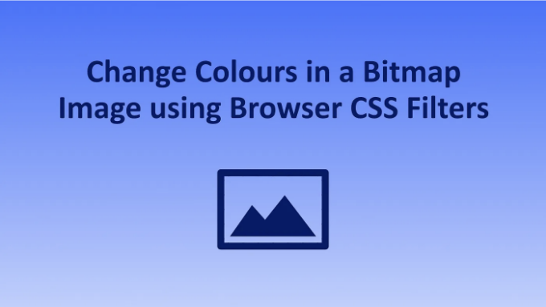
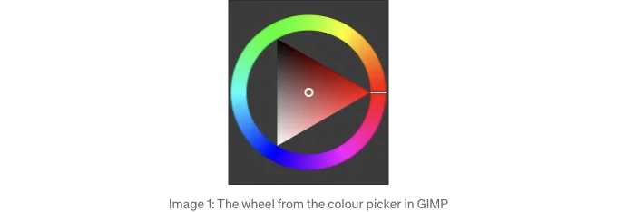
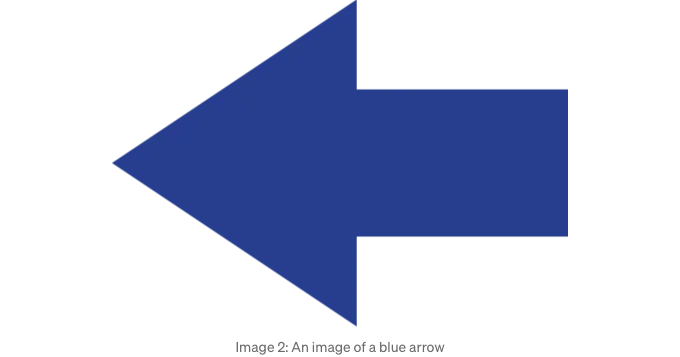
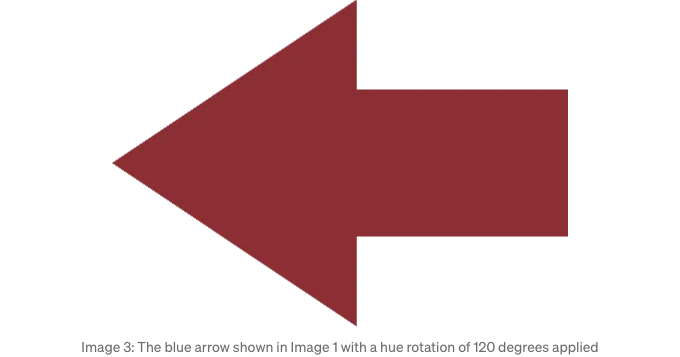
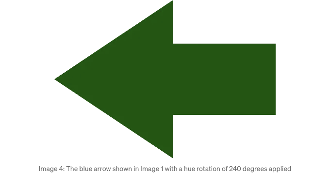

지난 주에는 우리가 이미지를 실시간으로 그레이스케일 버전으로 만드는 방법에 대해 살펴보았어요. 이미지에 다른 맛을 줄 수도 있고, 마우스 오버 효과를 만들고 싶을 수도 있어요. 어떤 경우든, 이미지의 여러 버전을 만들고 관리해야 하는 번거로움을 덜기 위해 CSS를 사용할 수 있어요.

우리가 최근에 살펴본 테마화는 같은 이미지의 다른 버전이 필요한 분야입니다. 여러 테마가 있고 각각의 아이콘을 각기 다른 색상으로 설정하고 싶을 수도 있어요. 하지만, 이에는 몇 가지 주의할 점이 있어요. 이번 뉴스레터가 너무 길어지는 것을 피하기 위해, 그 부분은 다음 기회에 다루도록 할게요.

# 색 이론에 대한 높은 수준의 탐구

<!-- ui-log 수평형 -->
<ins class="adsbygoogle"
  style="display:block"
  data-ad-client="ca-pub-4877378276818686"
  data-ad-slot="9743150776"
  data-ad-format="auto"
  data-full-width-responsive="true"></ins>
<component is="script">
(adsbygoogle = window.adsbygoogle || []).push({});
</component>

우리는 색을 여러 가지 방법으로 표현할 수 있어요. CSS에서 흔히 사용되는 형식 중 하나는 16진수 코드예요. 예를 들면, #6495ed 이렇게 말이죠. 여기서 첫 두 글자(64)는 색상의 빨간색 양을 나타내고, 그 다음 두 글자(95)는 녹색, 마지막 두 글자(ed)는 파란색을 나타내요. 다시 말해, 우리는 순수한 빨강, 녹색, 파랑의 강도를 이용해서 색을 설명해요.

하지만 색을 모델링하는 방법은 다양해요. 어떤 모델들에서는 색조(기본 색조, 예를 들면 오렌지, 파랑 등)를 직접 참조하기도 해요. 이미지 1은 GIMP의 색상 바퀴를 보여주며, 이런 원리가 어떻게 작동하는지 알려줘요. 바깥쪽 고리를 보면, 우리는 회전 각도를 참조해서 필요한 모든 색을 지정할 수 있다는 것을 알 수 있어요. 빨강은 0에, 녹색은 120에, 파랑은 240에 위치해요. (검정, 흰색, 그리고 사이의 회색은 특수한 경우이며 다른 매개변수를 통해 이루어질 수 있어요).



# 색조 변경하기

<!-- ui-log 수평형 -->
<ins class="adsbygoogle"
  style="display:block"
  data-ad-client="ca-pub-4877378276818686"
  data-ad-slot="9743150776"
  data-ad-format="auto"
  data-full-width-responsive="true"></ins>
<component is="script">
(adsbygoogle = window.adsbygoogle || []).push({});
</component>

우리 앱에 이미지를 다른 색상으로 설정하고 싶을 때 한 가지 방법은 CSS hue-rotate 필터를 사용하는 것입니다. 회전 각도를 지정함으로써 이미지의 모든 색상을 지정된 양만큼 오프셋시킬 수 있습니다.

예를 들어, 이미지 2는 파란색 화살표를 보여줍니다. 이것을 빨간색 버전으로 바꾸고 싶다고 가정해봅시다. 이미지 1을 보면 파란색이 외부 링의 7시 위치에 있음을 알 수 있습니다. 우리는 이것을 빨간색으로 바꾸고 싶고, 빨간색은 외부 링 주위로 시계 반대 방향(120도)으로 세분의 1에 해당하는 3시 위치에 있습니다. 이 정보를 바탕으로 120도 회전을 적용할 수 있습니다:

```js
filter: hue-rotate(120deg)
```

이 결과는 이미지 3에서 확인할 수 있습니다.

<!-- ui-log 수평형 -->
<ins class="adsbygoogle"
  style="display:block"
  data-ad-client="ca-pub-4877378276818686"
  data-ad-slot="9743150776"
  data-ad-format="auto"
  data-full-width-responsive="true"></ins>
<component is="script">
(adsbygoogle = window.adsbygoogle || []).push({});
</component>





항상 회전 오프셋의 각도는 이미지 1의 색조 원 내에서 시계 반대 방향으로 이동된다는 점을 염두에 두세요. 예를 들어 원래 파란 화살표를 초록색으로 만들고 싶다고 가정해 봅시다. 초록색은 빨간색에서 원을 따라 추가로 1/3을 이동한 곳에 위치합니다. 120도를 더하면 총 오프셋은 240도가 됩니다. 다음 CSS는 이미지 4에 표시된 결과를 생성할 것입니다.

```js
filter: hue-rotate(240deg)
```

<!-- ui-log 수평형 -->
<ins class="adsbygoogle"
  style="display:block"
  data-ad-client="ca-pub-4877378276818686"
  data-ad-slot="9743150776"
  data-ad-format="auto"
  data-full-width-responsive="true"></ins>
<component is="script">
(adsbygoogle = window.adsbygoogle || []).push({});
</component>



# 요약

실시간으로 이미지 내의 색상을 변경하기 위해 CSS를 사용할 수 있습니다. 이는 여러 가지 아이콘 비트맵 버전을 관리하는 데 별도의 파일을 관리할 필요 없이 가질 수 있음을 의미합니다.

일부 색상 모델은 360도에 걸쳐 기본 색조를 분배합니다. hue-rotate CSS 필터를 사용하면 지정된 양만큼 이미지 내의 색상을 변경할 수 있습니다. 신중한 사용으로, 테마링과 같은 영역에서 이를 활용할 수 있습니다 - 아이콘의 서로 다른 색상 버전을 갖게 될 것이지만 별도의 파일을 관리하는 번거로움 없이 할 수 있습니다.

<!-- ui-log 수평형 -->
<ins class="adsbygoogle"
  style="display:block"
  data-ad-client="ca-pub-4877378276818686"
  data-ad-slot="9743150776"
  data-ad-format="auto"
  data-full-width-responsive="true"></ins>
<component is="script">
(adsbygoogle = window.adsbygoogle || []).push({});
</component>
