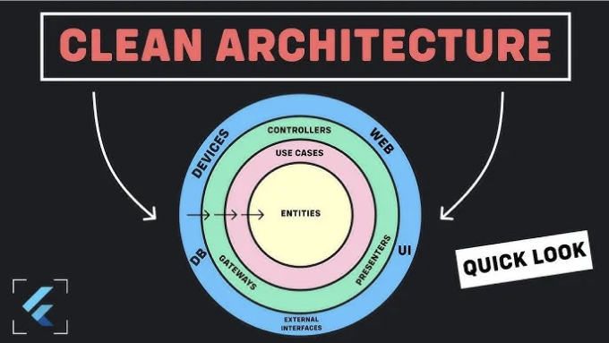

클린 아키텍처는 로버트 C. 마틴에 의해 소개된 소프트웨어 디자인 패러다임으로, 코드베이스를 명확한 의존성과 책임을 갖는 구별된 레이어로 구성하여 유지보수 가능하고 확장 가능한 소프트웨어를 만들기 위해 노력합니다. 이 철학은 관심 분리(SoC), 의존성 역전 및 단일 책임 원칙을 바탕으로 합니다.

모바일 앱 개발의 동적 세계에서 강력하고 유지보수가 쉽며 확장 가능한 애플리케이션을 만드는 것은 지속적인 목표입니다. 사용자 친화적인 UI 툴킷과 반응형 프레임워크로 유명한 Flutter는 시각적으로 매력적인 크로스 플랫폼 앱을 구축하는 데 인기가 있습니다. Flutter 프로젝트가 더 복잡해지면 장기적인 성공과 관리 용이성을 위해 구조화된 아키텍처가 중요해집니다.

이 글에서는 플러터에서 클린 아키텍처에 대해 자세히 살펴보고, 그 원칙과 개발 프로세스에 미치는 영향을 살펴볼 것입니다. 핵심 엔티티부터 플러터 UI와 상호 작용하는 레이어까지, 클린 아키텍처가 유지보수성, 테스트 가능성 및 유연성을 촉진하는 방법을 알아볼 것입니다 — 모든 플러터 프로젝트의 성공에 있어 중요한 요소들이죠.

<!-- ui-log 수평형 -->
<ins class="adsbygoogle"
  style="display:block"
  data-ad-client="ca-pub-4877378276818686"
  data-ad-slot="9743150776"
  data-ad-format="auto"
  data-full-width-responsive="true"></ins>
<component is="script">
(adsbygoogle = window.adsbygoogle || []).push({});
</component>


그래서 클린 아키텍처로 들어가는 여정에서 자리에 허리띠를 매고, 코드가 잘 조합된 심포니가 되어 각 구성 요소가 조화롭게 역할을 하는 곳인 플러터의 세계로 여행을 떠나봐요. 시간에 견딜 수 있는 앱을 만들어내며 🚀🔥

# MVVM이란 무엇인가요?

MVVM은 Model-View-ViewModel의 약자로, 소프트웨어 개발에서 흔히 사용되는 디자인 패턴으로, 특히 사용자 인터페이스(UI) 개발 분야에서 널리 사용됩니다. MVVM은 종종 데이터 바인딩을 지원하는 프레임워크와 관련이 있으며, UI의 변경 사항이 자동으로 기저 데이터를 업데이트하고 그 반대도 자동 업데이트하는 곳과 연관되어 있습니다.

<!-- ui-log 수평형 -->
<ins class="adsbygoogle"
  style="display:block"
  data-ad-client="ca-pub-4877378276818686"
  data-ad-slot="9743150776"
  data-ad-format="auto"
  data-full-width-responsive="true"></ins>
<component is="script">
(adsbygoogle = window.adsbygoogle || []).push({});
</component>

플러터(Flutter)에서 MVVM은 네이티브 데이터 바인딩을 지원하는 다른 프레임워크들처럼 엄격하게 정의되지는 않습니다. 그러나 개발자들은 주로 MVVM 원칙을 채택하여 코드를 구조화하여 관심을 분리하고 표현 로직을 격리시키며 유지보수성을 촉진합니다.

다음은 플러터에서 MVVM 원칙을 구현하는 실용적인 가이드입니다:

## • 모델(Model)

모델(Model)은 애플리케이션의 데이터와 비즈니스 로직을 나타냅니다. 데이터를 관리하고 응용 프로그램의 일관성과 무결성을 보장하는 역할을 합니다. MVVM의 맥락에서 모델(Model)은 사용자 인터페이스와 독립적이며 여러 프레젠테이션 계층에서 재사용할 수 있도록 설계됩니다.

<!-- ui-log 수평형 -->
<ins class="adsbygoogle"
  style="display:block"
  data-ad-client="ca-pub-4877378276818686"
  data-ad-slot="9743150776"
  data-ad-format="auto"
  data-full-width-responsive="true"></ins>
<component is="script">
(adsbygoogle = window.adsbygoogle || []).push({});
</component>

플러터(Flutter)에서 모델은 일반적으로 애플리케이션의 데이터 및 비즈니스 로직을 나타내는 Dart 클래스나 객체로 구성됩니다. 이러한 클래스는 애플리케이션의 상태와 기능을 캡슐화하며, UI와 직접 상호 작용하지 않습니다.

예시

```js
class User {
  String name;
  int age;

  User({required this.name, required this.age});
}
```

## • 뷰

<!-- ui-log 수평형 -->
<ins class="adsbygoogle"
  style="display:block"
  data-ad-client="ca-pub-4877378276818686"
  data-ad-slot="9743150776"
  data-ad-format="auto"
  data-full-width-responsive="true"></ins>
<component is="script">
(adsbygoogle = window.adsbygoogle || []).push({});
</component>

데이터를 사용자에게 제시하고 사용자 상호작용을 캡처하는 뷰가 있습니다. 사용자와 상호 작용하는 사용자 인터페이스입니다. MVVM에서 뷰는 매우 가벼워야하며 주로 정보를 표시하는 데 관심이 있습니다. 뷰모델의 변경 사항을 관찰하고 UI를 그에 맞게 업데이트합니다.

Flutter에서 뷰는 위젯으로 나타낼 수 있습니다. 위젯은 UI 요소를 렌더링하고 사용자 상호작용을 캡처하는 데 책임이 있습니다. UI 구성 요소에서 로직을 최소화하여 위젯을 가능한 "덤" 으로 유지하십시오.

```dart
class UserView extends StatelessWidget {
  final User user;

  UserView({required this.user});

  @override
  Widget build(BuildContext context) {
    return ListTile(
      title: Text(user.name),
      subtitle: Text('Age: ${user.age}'),
    );
  }
}
```

## • ViewModel

<!-- ui-log 수평형 -->
<ins class="adsbygoogle"
  style="display:block"
  data-ad-client="ca-pub-4877378276818686"
  data-ad-slot="9743150776"
  data-ad-format="auto"
  data-full-width-responsive="true"></ins>
<component is="script">
(adsbygoogle = window.adsbygoogle || []).push({});
</component>

뷰모델은 모델과 뷰 사이의 중재자 역할을 합니다. 프레젠테이션 로직을 포함하며, 뷰가 바인딩할 수 있는 데이터와 명령을 노출합니다. 뷰모델은 UI와 독립적으로 테스트할 수 있도록 설계되어 있습니다. 또한 종종 뷰의 상태를 캡슐화하고 사용자 입력 및 상호작용을 처리합니다.

플러터에는 기본적인 뷰모델이 없지만, Dart 클래스를 생성하여 뷰모델 역할을 할 수 있습니다. 뷰모델은 프레젠테이션 로직을 포함하고 데이터 변환을 처리하며, UI가 데이터와 상호작용할 수 있는 깔끔한 API를 제공합니다.

예시

```dart
import 'dart:async';

class UserViewModel {
  final StreamController<User> _userController = StreamController<User>();
  Stream<User> get userStream => _userController.stream;

  // 비즈니스 로직과 데이터 변환
  void updateUserAge(User user, int newAge) {
    final updatedUser = User(name: user.name, age: newAge);
    _userController.add(updatedUser);
  }

  // 메모리 누수를 피하기 위해 컨트롤러를 해제합니다.
  void dispose() {
    _userController.close();
  }
}
```

<!-- ui-log 수평형 -->
<ins class="adsbygoogle"
  style="display:block"
  data-ad-client="ca-pub-4877378276818686"
  data-ad-slot="9743150776"
  data-ad-format="auto"
  data-full-width-responsive="true"></ins>
<component is="script">
(adsbygoogle = window.adsbygoogle || []).push({});
</component>

## 뷰와 뷰모델 연결하기

Flutter 애플리케이션에서는 Provider, Riverpod 또는 간단한 StatefulWidget과 같은 상태 관리 솔루션을 사용하여 뷰와 뷰모델을 연결할 수 있습니다. 이러한 솔루션은 상태를 관리하고 데이터가 변경될 때 UI에 알림을 제공하는 데 도움이 됩니다.

Provider를 사용한 예제:

```js
class UserPage extends StatelessWidget {
  @override
  Widget build(BuildContext context) {
    final userViewModel = Provider.of<UserViewModel>(context);

    return StreamBuilder<User>(
      stream: userViewModel.userStream,
      builder: (context, snapshot) {
        if (snapshot.hasData) {
          return UserView(user: snapshot.data!);
        } else {
          return CircularProgressIndicator();
        }
      },
    );
  }
}
```

<!-- ui-log 수평형 -->
<ins class="adsbygoogle"
  style="display:block"
  data-ad-client="ca-pub-4877378276818686"
  data-ad-slot="9743150776"
  data-ad-format="auto"
  data-full-width-responsive="true"></ins>
<component is="script">
(adsbygoogle = window.adsbygoogle || []).push({});
</component>

# 플러터에서 클린 아키텍처에 대한 깊은 설명

클린 아키텍처는 응용 프로그램의 다른 구성 요소를 모듈로 분리하여 각각에 명확한 목적을 부여하는 방식을 제공합니다. 클린 아키텍처의 주요 아이디어는 응용 프로그램을 프레젠테이션 레이어, 도메인 레이어 및 데이터 레이어로 세 가지 주요 레이어로 분리하는 것입니다.

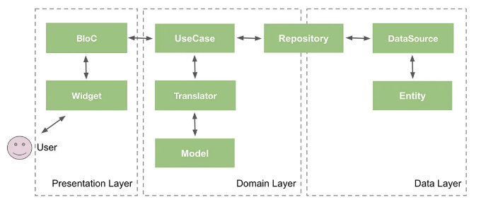

MVVM의 View 레이어는 Flutter 클리어 아키텍처에서 프레젠테이션 레이어를 나타내며, ViewModel은 도메인 레이어를 나타내고, 모델 레이어는 데이터 레이어를 나타냅니다.

<!-- ui-log 수평형 -->
<ins class="adsbygoogle"
  style="display:block"
  data-ad-client="ca-pub-4877378276818686"
  data-ad-slot="9743150776"
  data-ad-format="auto"
  data-full-width-responsive="true"></ins>
<component is="script">
(adsbygoogle = window.adsbygoogle || []).push({});
</component>

프로젝트 폴더 구조는 다음과 같이 될 것입니다:

features 폴더에는 인증, 프로필 등 앱의 모든 기능이 포함될 것이며, 애플리케이션의 각 기능은 이전 세 레이어(프레젠테이션, 도메인, 데이터)를 기반으로 구축됩니다. 예를 들어, 로그인 유스케이스 기능은 다음과 같은 폴더를 포함할 것입니다:


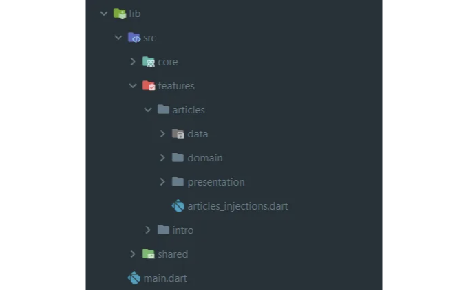

<!-- ui-log 수평형 -->
<ins class="adsbygoogle"
  style="display:block"
  data-ad-client="ca-pub-4877378276818686"
  data-ad-slot="9743150776"
  data-ad-format="auto"
  data-full-width-responsive="true"></ins>
<component is="script">
(adsbygoogle = window.adsbygoogle || []).push({});
</component>

핵심 폴더는 utils, routes, network, services, validators 및 styles와 같은 주요 구성 요소를 포함하는 기본 모듈입니다. 그 내용은 개발자가 코드 청결성을 향상시키고 빌드의 필요에 맞게 조정할 수 있도록 설계되었습니다. 이로써 코드를 간단하고 모듈화되며 유지 보수하기 쉬운 구조로 유지할 수 있습니다.

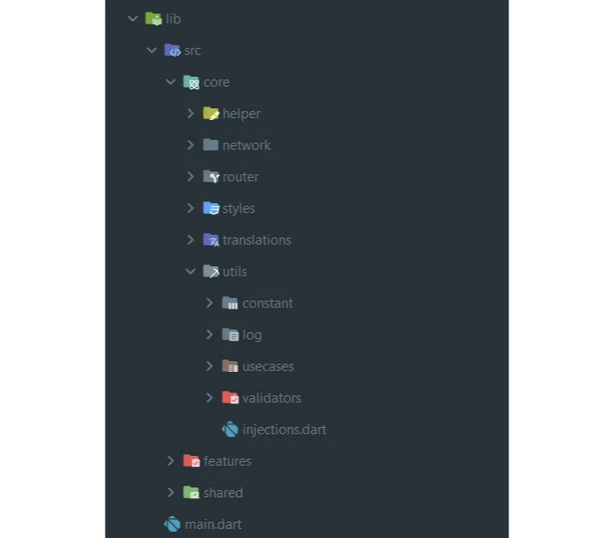

Injection 파일에는 모든 주입 방법이 포함되어 있으며, main.dart에서 호출됩니다.

```js
final sl = GetIt.instance;

Future<void> initInjections() async {
  await initSharedPrefsInjections();
  await initAppInjections();
  await initDioInjections();
  await initArticlesInjections();
}
```

<!-- ui-log 수평형 -->
<ins class="adsbygoogle"
  style="display:block"
  data-ad-client="ca-pub-4877378276818686"
  data-ad-slot="9743150776"
  data-ad-format="auto"
  data-full-width-responsive="true"></ins>
<component is="script">
(adsbygoogle = window.adsbygoogle || []).push({});
</component>

나중에 initArticlesInjections에 대해 알아볼 거야.

그리고 main.dart 파일에서 호출해:

```js
// 모든 종속성 주입
await initInjections();

runApp(DevicePreview(
  builder: (context) {
    return const App();
  },
  enabled: false,
));
```

마지막으로 shared 폴더는 우리 애플리케이션의 일반적인 기능을 위한 피처 폴더와 비슷하지만, 결제 기능, 공유 페이지, 공유 위젯 등이 들어 있어.

<!-- ui-log 수평형 -->
<ins class="adsbygoogle"
  style="display:block"
  data-ad-client="ca-pub-4877378276818686"
  data-ad-slot="9743150776"
  data-ad-format="auto"
  data-full-width-responsive="true"></ins>
<component is="script">
(adsbygoogle = window.adsbygoogle || []).push({});
</component>

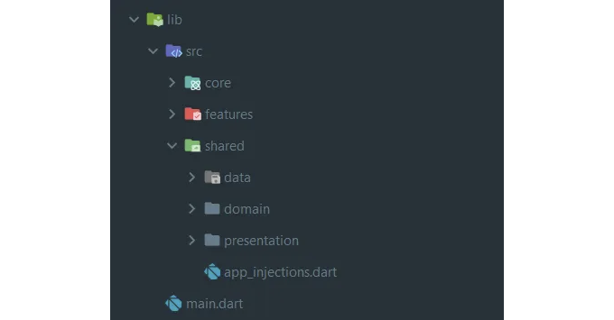

Clean Architecture layers로 시작해 보죠.

# 1- 프레젠테이션 레이어

## 책임

<!-- ui-log 수평형 -->
<ins class="adsbygoogle"
  style="display:block"
  data-ad-client="ca-pub-4877378276818686"
  data-ad-slot="9743150776"
  data-ad-format="auto"
  data-full-width-responsive="true"></ins>
<component is="script">
(adsbygoogle = window.adsbygoogle || []).push({});
</component>

프레젠테이션 레이어는 가장 바깥쪽 레이어로 사용자에게 정보를 표시하고 사용자 상호작용을 캡처하는 역할을 담당합니다. UI(사용자 인터페이스)와 관련된 모든 구성 요소를 포함하며 위젯, 화면 및 프레젠터/컨트롤러(상태 관리)를 포함합니다.

## 구성 요소

- 화면(Screen): 기능 화면을 나타냅니다.
- 위젯 및 UI 구성 요소: 애플리케이션의 시각적 요소를 나타냅니다.
- 매니저/컨트롤러: UI 구성 요소와 상호작용하는 프레젠테이션 로직을 포함합니다. 사용자 입력을 받고, 도메인 레이어의 Use Case와 통신하며 UI를 업데이트합니다.

## 예시

<!-- ui-log 수평형 -->
<ins class="adsbygoogle"
  style="display:block"
  data-ad-client="ca-pub-4877378276818686"
  data-ad-slot="9743150776"
  data-ad-format="auto"
  data-full-width-responsive="true"></ins>
<component is="script">
(adsbygoogle = window.adsbygoogle || []).push({});
</component>


# 2- Domain Layer

## 책임

도메인 레이어는 비즈니스 로직 또는 유즈 케이스 레이어로도 알려져 있으며, 응용프로그램의 핵심 비즈니스 규칙과 로직을 포함하고 있습니다. 이 레이어는 특정 프레임워크와 독립적인 필수 기능을 캡슐화하여 소프트웨어 시스템의 핵심을 대변합니다.

<!-- ui-log 수평형 -->
<ins class="adsbygoogle"
  style="display:block"
  data-ad-client="ca-pub-4877378276818686"
  data-ad-slot="9743150776"
  data-ad-format="auto"
  data-full-width-responsive="true"></ins>
<component is="script">
(adsbygoogle = window.adsbygoogle || []).push({});
</component>

## 구성 요소

- Entities: 기본 비즈니스 객체나 개념을 나타냅니다.
- Use Cases: 응용 프로그램별 비즈니스 규칙을 포함하고 엔티티 간 데이터 흐름을 조정합니다. 특정 작업이나 작업을 실행하는 데 책임이 있습니다.
- 비즈니스 규칙 및 로직(저장소): 응용 프로그램 도메인에 중요한 핵심 기능입니다.

## 예시

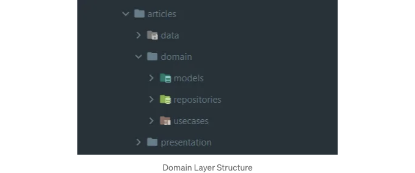

<!-- ui-log 수평형 -->
<ins class="adsbygoogle"
  style="display:block"
  data-ad-client="ca-pub-4877378276818686"
  data-ad-slot="9743150776"
  data-ad-format="auto"
  data-full-width-responsive="true"></ins>
<component is="script">
(adsbygoogle = window.adsbygoogle || []).push({});
</component>

# 3- 데이터 계층

## 책임

데이터 계층은 데이터베이스, 네트워크 서비스 또는 저장소와 같은 외부 데이터 소스와 상호 작용하는 기능을 담당합니다. 데이터의 저장 및 검색을 처리합니다.

## 구성요소

<!-- ui-log 수평형 -->
<ins class="adsbygoogle"
  style="display:block"
  data-ad-client="ca-pub-4877378276818686"
  data-ad-slot="9743150776"
  data-ad-format="auto"
  data-full-width-responsive="true"></ins>
<component is="script">
(adsbygoogle = window.adsbygoogle || []).push({});
</component>

- Repositories 또는 Gateways: 데이터에 액세스하고 저장하는 방식을 정의하는 추상 인터페이스입니다.
- Data Models: 외부 데이터 원본에 저장된 데이터 구조를 나타냅니다.
- Data Sources: 데이터베이스, API 또는 다른 외부 서비스와 상호 작용하는 저장소의 구현체입니다.

시스템을 이 계층적인 방식으로 구성하는 주요 이점은 관심사의 분리, 모듈성 및 테스트 용이성을 촉진한다는 것입니다. 각 계층에는 명확한 책임이 있으며 한 계층에 대한 변경 사항은 다른 계층에 영향을 미치지 않아야 합니다. 이 구조적인 스타일은 시간이 지남에 따라 유연성과 적응성을 제공합니다.

## 예시


<!-- ui-log 수평형 -->
<ins class="adsbygoogle"
  style="display:block"
  data-ad-client="ca-pub-4877378276818686"
  data-ad-slot="9743150776"
  data-ad-format="auto"
  data-full-width-responsive="true"></ins>
<component is="script">
(adsbygoogle = window.adsbygoogle || []).push({});
</component>

# 프로젝트 예시


저희는 뉴욕 타임스 뉴스 앱을 개발 중이에요. 뉴스 수집과 필터링이 가능해요. BloC를 상태 관리에 사용하고, Dio를 API 호출에 사용하며, json_serializable를 사용하여 json 응답을 모델로 파싱하여 반응성이 뛰어나고 원활한 사용자 경험을 제공하려고 해요.

먼저 [계정 만들기](https://developer.nytimes.com/get-started)를 클릭해서 데브 포털로 이동하고, 앱을 생성하고 API 키를 가져오는 단계를 따라가세요.

<!-- ui-log 수평형 -->
<ins class="adsbygoogle"
  style="display:block"
  data-ad-client="ca-pub-4877378276818686"
  data-ad-slot="9743150776"
  data-ad-format="auto"
  data-full-width-responsive="true"></ins>
<component is="script">
(adsbygoogle = window.adsbygoogle || []).push({});
</component>

1. 계정에 로그인하고 Apps를 클릭하세요

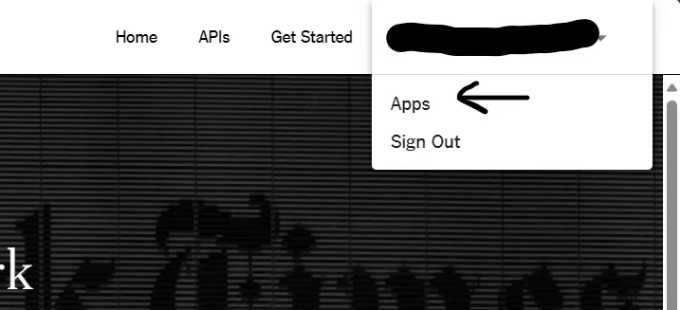

2. 페이지 오른쪽 상단의 New App을 클릭하세요


<!-- ui-log 수평형 -->
<ins class="adsbygoogle"
  style="display:block"
  data-ad-client="ca-pub-4877378276818686"
  data-ad-slot="9743150776"
  data-ad-format="auto"
  data-full-width-responsive="true"></ins>
<component is="script">
(adsbygoogle = window.adsbygoogle || []).push({});
</component>

3. 앱 이름을 입력해주세요


4. 가장 인기 있는 API 옵션을 활성화해주세요


<!-- ui-log 수평형 -->
<ins class="adsbygoogle"
  style="display:block"
  data-ad-client="ca-pub-4877378276818686"
  data-ad-slot="9743150776"
  data-ad-format="auto"
  data-full-width-responsive="true"></ins>
<component is="script">
(adsbygoogle = window.adsbygoogle || []).push({});
</component>

API 키 생성 과정 중 문제가 발생하면 테스트 목적으로 이 키를 활용할 수 있습니다 'nF2WTVC6ES9SnxES3o0BzPnijV1RMDHl'. 그러나 보안을 확보하고 최상의 관행을 준수하기 위해 제품 또는 계속되는 개발을 위해 새 키를 생성하는 것이 좋습니다.

작업할 기본 API URL: http://api.nytimes.com/svc/mostpopular/v2/mostviewed/

기사 API: http://api.nytimes.com/svc/mostpopular/v2/mostviewed/all-sections/period.json?api-key=nF2WTVC6ES9SnxES3o0BzPnijV1RMDHl

기간 값: 1, 7, 30.

<!-- ui-log 수평형 -->
<ins class="adsbygoogle"
  style="display:block"
  data-ad-client="ca-pub-4877378276818686"
  data-ad-slot="9743150776"
  data-ad-format="auto"
  data-full-width-responsive="true"></ins>
<component is="script">
(adsbygoogle = window.adsbygoogle || []).push({});
</component>

예시: http://api.nytimes.com/svc/mostpopular/v2/mostviewed/all-sections/1.json?api-key=nF2WTVC6ES9SnxES3o0BzPnijV1RMDHl

GitHub에서 전체 예시를 찾을 수 있습니다. 이 프로젝트에서는 다음을 사용했습니다:

- **get_it | Dart Package (pub.dev)**: DI(의존성 주입)를 위한 패키지로, Flutter에서 서비스 로케이터 패턴을 제공합니다. 이 패키지는 의존성 관리에 간단하면서도 강력한 해결책을 제공합니다. 소프트웨어 개발에서 서비스 로케이터는 객체가 의존성 또는 서비스를 어떻게 구성했는지 알 필요 없이 의존성을 찾아서 얻을 수 있는 디자인 패턴입니다.

<!-- ui-log 수평형 -->
<ins class="adsbygoogle"
  style="display:block"
  data-ad-client="ca-pub-4877378276818686"
  data-ad-slot="9743150776"
  data-ad-format="auto"
  data-full-width-responsive="true"></ins>
<component is="script">
(adsbygoogle = window.adsbygoogle || []).push({});
</component>

많은 기능을 가지고 있어요. 그 중에서도 registerSingleton이 가장 중요한 기능 중 하나에요. registerSingleton을 사용하면 특정 클래스의 인스턴스가 한 개만 생성되고 필요할 때 의존성을 지연로드할 수 있어요.

## json_serializable | Dart Package (pub.dev)

fromJson 및 toJson 메서드를 생성할 수 있어요.

## flutter_bloc | Flutter Package (pub.dev)

<!-- ui-log 수평형 -->
<ins class="adsbygoogle"
  style="display:block"
  data-ad-client="ca-pub-4877378276818686"
  data-ad-slot="9743150776"
  data-ad-format="auto"
  data-full-width-responsive="true"></ins>
<component is="script">
(adsbygoogle = window.adsbygoogle || []).push({});
</component>

데이터 소스에서 오는 데이터를 관리하는 상태 관리와 처리

## dartz | Dart 패키지 (pub.dev)

이는 clean architecture를 수행하고 오류를 따로 처리하고자 할 때 매우 적합한 Flutter 또는 Dart 패키지입니다.

Either 타입은 두 가지 서로 다른 유형의 값을 나타내기 위해 설계된 다목적 구조로, 특정 유형의 값을 성공을 나타내거나 다른 유형의 값으로 실패를 표시할 수 있습니다. 이 구조는 구조화되고 형식 안전한 방식으로 오류를 관리하는 데 유용하며, 주어진 맥락 내에서 성공적인 결과와 잠재적인 실패를 처리하는 명확하고 표현적인 방법을 제공합니다.

<!-- ui-log 수평형 -->
<ins class="adsbygoogle"
  style="display:block"
  data-ad-client="ca-pub-4877378276818686"
  data-ad-slot="9743150776"
  data-ad-format="auto"
  data-full-width-responsive="true"></ins>
<component is="script">
(adsbygoogle = window.adsbygoogle || []).push({});
</component>

그럼 시작해볼까요? 새로운 Flutter 프로젝트를 만들고, pubspec.yaml 파일의 dependencies 및 dev_ependencies에 중요한 패키지를 추가해 보겠습니다:

```yaml
dependencies:
  flutter:
    sdk: flutter

  # Api에서 데이터 가져오기
  dio: ^5.4.0

  # BloC 상태 관리
  flutter_bloc: ^8.1.3

  # Json 어노테이션
  json_annotation: ^4.8.1

  # Dart에서 객체 비교 가능하게 하기
  equatable: ^2.0.5

  # 데이터 소스에서 성공/오류 상태 처리
  dartz: ^0.10.1

dev_dependencies:
  flutter_test:
    sdk: flutter
  build_runner: ^2.4.7
  json_serializable: ^6.7.1
```

Domain 레이어부터 시작하겠습니다. 먼저, json api 응답을 모델로 구문 분석하기 위해 모델을 생성해야 합니다.

## 모델 (Models)

<!-- ui-log 수평형 -->
<ins class="adsbygoogle"
  style="display:block"
  data-ad-client="ca-pub-4877378276818686"
  data-ad-slot="9743150776"
  data-ad-format="auto"
  data-full-width-responsive="true"></ins>
<component is="script">
(adsbygoogle = window.adsbygoogle || []).push({});
</component>

도메인 레이어인 모델 작업을 시작합니다. Api에서 가져온 article Json에 대한 모델을 생성하겠습니다. 이것이 우리 Api의 응답입니다:

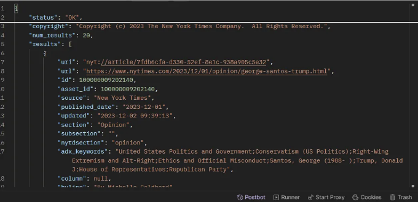

이제 상기 응답에 해당하는 모델을 만들어 나가겠습니다.

article_model.dart

<!-- ui-log 수평형 -->
<ins class="adsbygoogle"
  style="display:block"
  data-ad-client="ca-pub-4877378276818686"
  data-ad-slot="9743150776"
  data-ad-format="auto"
  data-full-width-responsive="true"></ins>
<component is="script">
(adsbygoogle = window.adsbygoogle || []).push({});
</component>

표 태그를 Markdown 형식으로 변경해주세요.

<!-- ui-log 수평형 -->
<ins class="adsbygoogle"
  style="display:block"
  data-ad-client="ca-pub-4877378276818686"
  data-ad-slot="9743150776"
  data-ad-format="auto"
  data-full-width-responsive="true"></ins>
<component is="script">
(adsbygoogle = window.adsbygoogle || []).push({});
</component>

```dart
part 'media_meta_data_model.g.dart';

@JsonSerializable(fieldRename: FieldRename.snake)
class MediaMetaDataModel {
  String? url;
  String? format;
  int? height;
  int? width;

  MediaMetaDataModel({this.url, this.format, this.height, this.width});

  factory MediaMetaDataModel.fromJson(json) =>
      _$MediaMetaDataModelFromJson(json);

  toJson() => _$MediaMetaDataModelToJson(this);

  static List<MediaMetaDataModel> fromJsonList(List json) {
    return json.map((e) => MediaMetaDataModel.fromJson(e)).toList();
  }
}
```

그리고 기사 API를 위한 필수 매개변수를 생성합니다:

articles_params.dart

```dart
class ArticlesParams {
  ArticlesParams({
    required this.period,
  });

  late final int period;

  ArticlesParams.fromJson(Map<String, dynamic> json) {
    period = json['period'];
  }

  Map<String, dynamic> toJson() {
    final _data = <String, dynamic>{};
    _data['period'] = period;
    return _data;
  }
}
```

<!-- ui-log 수평형 -->
<ins class="adsbygoogle"
  style="display:block"
  data-ad-client="ca-pub-4877378276818686"
  data-ad-slot="9743150776"
  data-ad-format="auto"
  data-full-width-responsive="true"></ins>
<component is="script">
(adsbygoogle = window.adsbygoogle || []).push({});
</component>

프로젝트의 모델 폴더 구조는 이렇게 될 거에요:


## API

이제 모델 파일을 만든 후에, 데이터 레이어인 데이터 소스로 넘어가서 API를 생성하겠습니다. 이 API는 기사 데이터를 가져오는 역할을 할 거에요.

<!-- ui-log 수평형 -->
<ins class="adsbygoogle"
  style="display:block"
  data-ad-client="ca-pub-4877378276818686"
  data-ad-slot="9743150776"
  data-ad-format="auto"
  data-full-width-responsive="true"></ins>
<component is="script">
(adsbygoogle = window.adsbygoogle || []).push({});
</component>

먼저, 추상 클래스를 만들어 API에서 데이터를 가져오는 메서드를 정의할 것입니다.

absract_article_api.dart

```dart
import 'package:articles_app/articles/data/models/article_model.dart';

abstract class AbstractArticleApi {
  // 모든 기사 가져오기
  Future<List<ArticleModel>> getArticles();
}
```

우리는 추상 클래스를 구현하여 API에서 데이터를 검색하는 논리를 통합할 것입니다.

<!-- ui-log 수평형 -->
<ins class="adsbygoogle"
  style="display:block"
  data-ad-client="ca-pub-4877378276818686"
  data-ad-slot="9743150776"
  data-ad-format="auto"
  data-full-width-responsive="true"></ins>
<component is="script">
(adsbygoogle = window.adsbygoogle || []).push({});
</component>

article_impl_api.dart

```dart
class ArticlesImplApi extends AbstractArticleApi {
  final Dio dio;


  ArticlesImplApi(this.dio);

  // Articles Method
  @override
  Future<ApiResponse<List<ArticleModel>>> getArticles(
      NyTimesArticlesParams params) async {
    try {
      final result = (await dio.get(
        getArticlePath(params.period),
      ));
      if (result.data == null)
        throw ServerException("Unknown Error", result.statusCode);

      return ApiResponse.fromJson<List<ArticleModel>>(
          result.data, ArticleModel.fromJsonList);
    } on DioError catch (e) {
        throw ServerException(handleDioError(e), e.response?.statusCode);
    } on ServerException {
      rethrow;
    } catch (e) {
      throw ServerException(e.toString(), null);
    }
  }
}
```

그런 다음 데이터 소스 폴더는 다음과 같을 것입니다:


<!-- ui-log 수평형 -->
<ins class="adsbygoogle"
  style="display:block"
  data-ad-client="ca-pub-4877378276818686"
  data-ad-slot="9743150776"
  data-ad-format="auto"
  data-full-width-responsive="true"></ins>
<component is="script">
(adsbygoogle = window.adsbygoogle || []).push({});
</component>

데이터 레이어에서 모델 및 데이터 소스를 만든 후에는 애플리케이션 도메인에 중요한 핵심 기능을 달성하기 위해 리포지토리 인터페이스와 그 구현을 만들어야 합니다.

리포지토리는 데이터 레이어와 연결을 설정하며 데이터를 검색하고 내부 로직을 처리하는 데이터 소스 함수를 통해 연결을 설정합니다. 이러한 이유로 리포지토리는 생성자에서 articlesApi 인스턴스를 사용하여 articles Api를 호출합니다.

## 리포지토리

이제 도메인 레이어 - domain/repositories 폴더 안에 있는 dart 파일 abstract_articles_repository.dart를 만듭니다:

<!-- ui-log 수평형 -->
<ins class="adsbygoogle"
  style="display:block"
  data-ad-client="ca-pub-4877378276818686"
  data-ad-slot="9743150776"
  data-ad-format="auto"
  data-full-width-responsive="true"></ins>
<component is="script">
(adsbygoogle = window.adsbygoogle || []).push({});
</component>

```js
abstract class AbstractArticlesRepository {
  // 뉴욕 타임스 기사 가져오기
  Future<Either<Failure, List<ArticleModel>>> getNyTimesArticles(
      NyTimesArticlesParams params);
}
```

다음으로, 위에 언급된 추상 클래스를 구현하기 위해 데이터/리포지토리 디렉토리로 이동하세요.

```js
class ArticlesRepositoryImpl extends AbstractArticlesRepository {
  final ArticlesImplApi articlesApi;

  ArticlesRepositoryImpl(
    this.articlesApi,
  );

  // 뉴욕 타임스 기사 가져오기
  @override
  Future<Either<Failure, List<ArticleModel>>> getNyTimesArticles(
      NyTimesArticlesParams params) async {
    try {
      final result = await articlesApi.getArticles(params);
      return Right(result.results ?? []);
    } on ServerException catch (e) {
      return Left(ServerFailure(e.message, e.statusCode));
    }
  }
}
```

우리는 데이터 레이어를 통해 API로부터 기사 데이터를 가져오기 위해 사용되는 articlesApi 변수를 소개합니다.

<!-- ui-log 수평형 -->
<ins class="adsbygoogle"
  style="display:block"
  data-ad-client="ca-pub-4877378276818686"
  data-ad-slot="9743150776"
  data-ad-format="auto"
  data-full-width-responsive="true"></ins>
<component is="script">
(adsbygoogle = window.adsbygoogle || []).push({});
</component>

그러면 리포지토리 파일이 다음과 같이 구성될 것입니다:

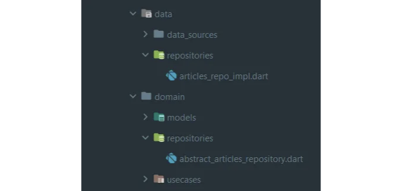

## Use-Cases

리포지토리 레이어를 성공적으로 구축한 후, 다음 단계는 유스케이스 파일을 생성하는 것입니다. 이러한 유스케이스는 애플리케이션별 비즈니스 로직을 캡슐화하고 조율하여, 프레젠테이션 레이어와 리포지토리 간을 연결하는 다리 역할을 수행합니다. 이를 통해 깔끔하고 모듈식 아키텍처를 유지할 수 있습니다.

<!-- ui-log 수평형 -->
<ins class="adsbygoogle"
  style="display:block"
  data-ad-client="ca-pub-4877378276818686"
  data-ad-slot="9743150776"
  data-ad-format="auto"
  data-full-width-responsive="true"></ins>
<component is="script">
(adsbygoogle = window.adsbygoogle || []).push({});
</component>

각 사용 사례는 특정 작업이나 작업을 실행하도록 지시되어 있으며, 각 새 기능마다 코드를 중복해서 작성할 필요 없이 다양한 기능에 걸쳐 사용할 수 있는 재사용 가능한 솔루션을 제공합니다.

도메인/usecases 폴더에 articles_usecase.dart라는 Dart 파일을 만듭니다:

```dart
class ArticlesUseCase extends UseCase<List<ArticleModel>, ArticlesParams> {
  final AbstractArticlesRepository repository;

  ArticlesUseCase(this.repository);

  @override
  Future<Either<Failure, List<ArticleModel>>> call(
      ArticlesParams params) async {
    final result = await repository.getArticles(params);
    return result.fold((l) {
      return Left(l);
    }, (r) async {
      return Right(r);
    });
  }
}
```

축하합니다! 이제 데이터 및 도메인 레이어를 생성하는 작업을 마쳤습니다. 🎉🎉

<!-- ui-log 수평형 -->
<ins class="adsbygoogle"
  style="display:block"
  data-ad-client="ca-pub-4877378276818686"
  data-ad-slot="9743150776"
  data-ad-format="auto"
  data-full-width-responsive="true"></ins>
<component is="script">
(adsbygoogle = window.adsbygoogle || []).push({});
</component>

지금까지 중요한 모델을 파싱하고 json 응답을 사용하는 도메인 레이어를 만들었습니다. 추가로 데이터 레이어를 통해 얻은 데이터를 처리하는 repository를 구현했습니다.

이제 사용자 인터페이스를 구축하기 위해 프리젠테이션 레이어로 넘어갈 수 있습니다. 이를 통해 사용자는 컨트롤러나 매니저를 통해 데이터와 상호 작용할 수 있습니다.

## 프리젠테이션

이 레이어에서는 사용 사례를 통해 기사 데이터를 호출하는 데 책임이 있는 페이지와 위젯을 만듭니다. 이 레이어는 응용 프로그램의 기본 로직과 상호 작용하는 사용 사례에 캡슐화된 사용자 인터페이스의 역할을 합니다.

<!-- ui-log 수평형 -->
<ins class="adsbygoogle"
  style="display:block"
  data-ad-client="ca-pub-4877378276818686"
  data-ad-slot="9743150776"
  data-ad-format="auto"
  data-full-width-responsive="true"></ins>
<component is="script">
(adsbygoogle = window.adsbygoogle || []).push({});
</component>

기사 폴더 안에 article_injection.dart 파일을 생성합니다. 이 파일은 api, repository, usecases에 대한 모든 기능 의존성 주입을 포함하고 있습니다.

```js
import 'package:ny_times_app/src/core/network/dio_network.dart';
import 'package:ny_times_app/src/core/utils/injections.dart';
import 'package:ny_times_app/src/features/articles/data/data_sources/remote/articles_impl_api.dart';
import 'data/data_sources/local/articles_shared_prefs.dart';
import 'data/repositories/articles_repo_impl.dart';
import 'domain/usecases/articles_usecase.dart';

initArticlesInjections() {
  sl.registerSingleton(ArticlesImplApi(DioNetwork.appAPI));
  sl.registerSingleton(ArticlesSharedPrefs(sl()));
  sl.registerSingleton(ArticlesUseCase(sl()));
  sl.registerSingleton(ArticlesRepositoryImpl(sl()));
}
```

그런 다음 위의 클래스를 호출하여 아무 클래스든 호출할 수 있습니다:

```js
getIt.registerSingleton(ArticlesUseCase(sl()));
```

<!-- ui-log 수평형 -->
<ins class="adsbygoogle"
  style="display:block"
  data-ad-client="ca-pub-4877378276818686"
  data-ad-slot="9743150776"
  data-ad-format="auto"
  data-full-width-responsive="true"></ins>
<component is="script">
(adsbygoogle = window.adsbygoogle || []).push({});
</component>

이제 presentation/blok에서 ArticlesBloc이라는 블록을 만들어주세요:

```js
part of 'articles_bloc.dart';

abstract class ArticlesEvent {
  const ArticlesEvent();
}

// 기사 가져오기 이벤트
class OnGettingArticlesEvent extends ArticlesEvent {
  final int period;
  final bool withLoading;

  OnGettingArticlesEvent(this.period, {this.withLoading = true});
}
```

articles_state.dart

```js
part of 'articles_bloc.dart';

abstract class ArticlesState {
  const ArticlesState();
}

class NyTimesInitial extends ArticlesState {}

// --------------------기사 가져오기 상태 시작-------------------- //

// 기사 가져오는 중 상태
class LoadingGetArticlesState extends ArticlesState {}

// 기사 가져오기 오류 상태
class ErrorGetArticlesState extends ArticlesState {
  final String errorMsg;

  ErrorGetArticlesState(this.errorMsg);
}

// 기사 가져오기 성공 상태
class SuccessGetArticlesState extends ArticlesState {
  final List<ArticleModel> articles;

  SuccessGetArticlesState(this.articles);
}

// --------------------기사 가져오기 상태 끝-------------------- //
```

<!-- ui-log 수평형 -->
<ins class="adsbygoogle"
  style="display:block"
  data-ad-client="ca-pub-4877378276818686"
  data-ad-slot="9743150776"
  data-ad-format="auto"
  data-full-width-responsive="true"></ins>
<component is="script">
(adsbygoogle = window.adsbygoogle || []).push({});
</component>

아티클 블록.dart

```js
import 'package:bloc/bloc.dart';
import 'package:ny_times_app/src/core/network/error/failures.dart';
import 'package:ny_times_app/src/core/util/constant/app_constants.dart';
import 'package:ny_times_app/src/features/articles/domain/models/article_model.dart';
import 'package:ny_times_app/src/features/articles/domain/models/articles_params.dart';
import 'package:ny_times_app/src/features/articles/domain/usecases/articles_usecase.dart';

part 'articles_event.dart';

part 'articles_state.dart';

class ArticlesBloc extends Bloc<ArticlesEvent, ArticlesState> {
  final ArticlesUseCase articlesUseCase;

  // Article 리스트
  ArticlesBloc({required this.articlesUseCase})
      : super(LoadingGetArticlesState()) {
    on<OnGettingArticlesEvent>(_onGettingArticlesEvent);
  }

  // 아티클 가져오기 이벤트
  _onGettingArticlesEvent(
      OnGettingArticlesEvent event, Emitter<ArticlesState> emitter) async {
    if (event.withLoading) {
      emitter(LoadingGetArticlesState());
    }

    final result = await articlesUseCase.call(
      ArticlesParams(
        period: event.period,
      ),
    );
    result.fold((l) {
       emitter(ErrorGetArticlesState(l.errorMessage));
    }, (r) {
       emitter(SuccessGetArticlesState(r));
    });
  }

}
```

와우! 사용자 작업을 캡쳐하는 블록을 설정했어요. 아티클 유스케이스를 호출하고, 이것은 데이터를 가져오기 위해 저장소 레이어와 통신합니다. 그 후 저장소 레이어는 데이터 소스를 통해 데이터 레이어와 연결하여 정보를 검색해옵니다.

그러면 bloc 폴더는 이렇게 될 거예요:

<!-- ui-log 수평형 -->
<ins class="adsbygoogle"
  style="display:block"
  data-ad-client="ca-pub-4877378276818686"
  data-ad-slot="9743150776"
  data-ad-format="auto"
  data-full-width-responsive="true"></ins>
<component is="script">
(adsbygoogle = window.adsbygoogle || []).push({});
</component>


UI에 대해, 우리는 블록을 통해 기사 목록 페이지를 만들고 기사를 호출할 것입니다.

프레젠테이션/페이지에서 'ArticlesPage'라는 페이지를 만들어 사용자 인터페이스 구성 요소로 사용하겠습니다. 이 페이지는 기사 데이터를 표시하고 상호작용하는 데 책임이 있을 것입니다.

```js
import 'package:flutter/material.dart';
import 'package:flutter_bloc/flutter_bloc.dart';
import 'package:ny_times_app/src/core/common_feature/presentation/pages/background_page.dart';
import 'package:ny_times_app/src/core/common_feature/presentation/widgets/app_loader.dart';
import 'package:ny_times_app/src/core/common_feature/presentation/widgets/reload_widget.dart';
import 'package:ny_times_app/src/core/translations/l10n.dart';
import 'package:ny_times_app/src/core/util/helper.dart';
import 'package:ny_times_app/src/core/util/injections.dart';
import 'package:ny_times_app/src/features/articles/domain/models/article_model.dart';
import 'package:ny_times_app/src/features/articles/domain/usecases/articles_usecase.dart';
import 'package:ny_times_app/src/features/articles/presentation/bloc/articles_bloc.dart';
import 'package:ny_times_app/src/features/articles/presentation/widgets/article_card_widget.dart';

class ArticlesPage extends StatefulWidget {
  const ArticlesPage({Key? key}) : super(key: key);

  @override
  State<ArticlesPage> createState() => _ArticlesPageState();
}

class _ArticlesPageState extends State<ArticlesPage> {
  ArticlesBloc _bloc = ArticlesBloc(articlesUseCase: sl<ArticlesUseCase>());
  List<ArticleModel> nyTimesArticles = [];

  // 기간
  int selectedPeriod = 1;

  @override
  void initState() {
    // 뉴욕 타임즈 기사 가져오는 이벤트 호출
    callArticles();
    super.initState();
  }

  @override
  Widget build(BuildContext context) {
    return BackgroundPage(
      withDrawer: true,
      child: Column(
        children: [
          // 여백
          SizedBox(
            height: Helper.getVerticalSpace(),
          ),

          // 기사 목록
          Expanded(
            child: BlocConsumer<ArticlesBloc, ArticlesState>(
              bloc: _bloc,
              listener: (context, state) {
                if (state is SuccessGetArticlesState) {
                  nyTimesArticles.clear();
                  nyTimesArticles = state.articles;
                }
              },
              builder: (context, state) {
                if (state is LoadingGetArticlesState) {
                  return const AppLoader();
                } else if (state is ErrorGetArticlesState) {
                  return ReloadWidget.error(
                    content: state.errorMsg,
                    onPressed: () {
                      callArticles();
                    },
                  );
                }

                // 데이터가 없는지 확인
                if (nyTimesArticles.isEmpty) {
                  return ReloadWidget.empty(content: S.of(context).no_data);
                }

                return ListView.builder(
                  itemCount: nyTimesArticles.length,
                  itemBuilder: (context, index) {
                    return ArticleCardWidget(
                      nyTimesModel: nyTimesArticles[index],
                    );
                  },
                );
              },
            ),
          )
        ],
      ),
    );
  }

  // 기사 호출
  callArticles({bool withLoading = true}) {
    _bloc.add(
      OnGettingArticlesEvent(
        selectedPeriod,
        withLoading: withLoading,
      ),
    );
  }
}
```

<!-- ui-log 수평형 -->
<ins class="adsbygoogle"
  style="display:block"
  data-ad-client="ca-pub-4877378276818686"
  data-ad-slot="9743150776"
  data-ad-format="auto"
  data-full-width-responsive="true"></ins>
<component is="script">
(adsbygoogle = window.adsbygoogle || []).push({});
</component>

ArticleBloc 클래스는 ArticleUseCase 인스턴스를 가져오기 때문에 get_it 인젝터에서 싱글톤 ArticlesUseCase 클래스에 액세스할 수 있습니다:

```js
ArticlesBloc _bloc = ArticlesBloc(articlesUseCase: sl<ArticlesUseCase>());
```

이것을 의존성 주입이라고 합니다; 이는 각 레이어에 대한 단위 테스트를 수행하려고 할 때 모의 인스턴스를 제공하는 데 유용합니다. 이를 통해 효율적인 테스트를 보장하고 애플리케이션의 서로 다른 부분의 기능을 독립적으로 확인할 수 있습니다.

총결 구조는 다음과 같습니다:

<!-- ui-log 수평형 -->
<ins class="adsbygoogle"
  style="display:block"
  data-ad-client="ca-pub-4877378276818686"
  data-ad-slot="9743150776"
  data-ad-format="auto"
  data-full-width-responsive="true"></ins>
<component is="script">
(adsbygoogle = window.adsbygoogle || []).push({});
</component>

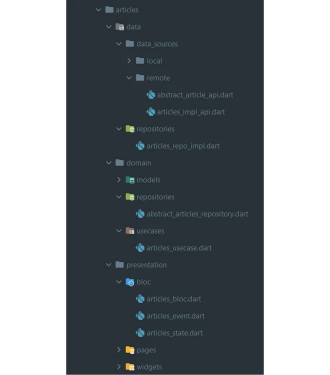

## 아래 그림에 이전 코드 흐름이 나와 있습니다:

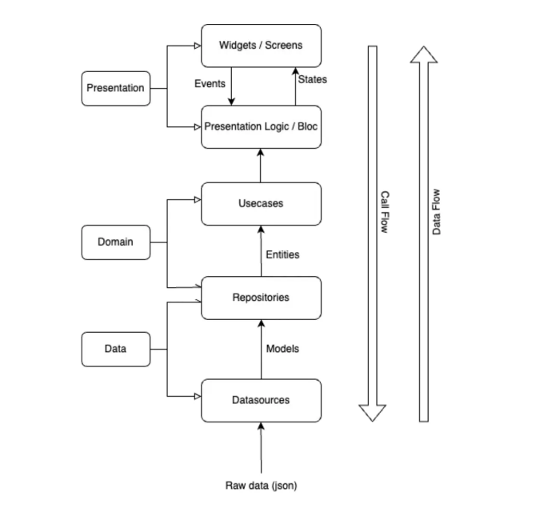

축하합니다! 클린 아키텍처를 사용하여 기사 앱을 만들었습니다 🚀

<!-- ui-log 수평형 -->
<ins class="adsbygoogle"
  style="display:block"
  data-ad-client="ca-pub-4877378276818686"
  data-ad-slot="9743150776"
  data-ad-format="auto"
  data-full-width-responsive="true"></ins>
<component is="script">
(adsbygoogle = window.adsbygoogle || []).push({});
</component>

플러터의 Clean Architecture는 애플리케이션에 많은 이점을 제공할 수 있지만, 그 적합성은 애플리케이션의 크기와 복잡성을 포함한 다양한 요소에 따라 다릅니다. 아래는 몇 가지 고려해야 할 사항입니다:

학습 곡선: Clean Architecture는 추가적인 개념과 레이어를 소개하는데, 특히 아키텍처에 익숙하지 않은 개발자들에게는 더 가파른 학습 곡선으로 느껴질 수 있습니다.

복잡성 부담: 매우 간단한 앱의 경우, Clean Architecture에 의해 도입된 추가 레이어와 추상화가 불필요한 복잡성으로 인식될 수 있습니다.

개발 속도: 처음에는 개발자들이 Clean Architecture 구조에 적응하며 개발이 더 느릴 수 있습니다.

<!-- ui-log 수평형 -->
<ins class="adsbygoogle"
  style="display:block"
  data-ad-client="ca-pub-4877378276818686"
  data-ad-slot="9743150776"
  data-ad-format="auto"
  data-full-width-responsive="true"></ins>
<component is="script">
(adsbygoogle = window.adsbygoogle || []).push({});
</component>

작고 간단한 Flutter 앱의 경우, 빠른 개발을 중시하는 MVC와 같은 간단한 아키텍처나 프레임워크도 고려해 볼 수 있습니다. 깔끔한 아키텍처는 대부분 더 크고 복잡한 애플리케이션에서 더 유익합니다.

요약하면, 깔끔한 아키텍처는 플러터 앱에 잘 맞을 수 있으며, 특히 앱이 성장을 예상하거나 유지 보수 및 테스트 용이성이 요구될 때 유용할 수 있습니다. 그러나 깔끔한 아키텍처의 장점을 프로젝트의 특정 요구사항과 제약사항과 균형을 맞추는 것이 중요합니다.

향후 글에서는 단위 테스트의 중요성에 대해 탐구하고, 그 구현이 유익한 시나리오를 식별하는 것에 대해 논의할 것입니다. 이 프로젝트에 단위 테스트를 통합하는 방법을 살펴보고, 견고하고 신뢰할 수 있는 코드베이스를 보장하겠습니다.

이제 기초가 마련되었으니, 보다 전문적인 구조로 깔끔하고 테스트할 수 있으며, 확장 가능한 프로젝트를 구축할 수 있습니다. 이 체계적인 아키텍처는 미래 개발의 용이성과 코드 유지 보수를 높일 것입니다 🎉😎

<!-- ui-log 수평형 -->
<ins class="adsbygoogle"
  style="display:block"
  data-ad-client="ca-pub-4877378276818686"
  data-ad-slot="9743150776"
  data-ad-format="auto"
  data-full-width-responsive="true"></ins>
<component is="script">
(adsbygoogle = window.adsbygoogle || []).push({});
</component>

Github에서 전체 프로젝트 기능 및 코드를 확인할 수 있어요 — 소스 코드. 검색 기능, UI 사용자 정의, 단위 테스트와 같은 추가 코드가 포함되어 있어요.

이 기사를 읽어주셔서 감사합니다. 유용하게 사용하시길 바라요. 궁금한 점이 있으면 언제든지 저에게 연락해주세요.

질문이 있으면 LinkedIn 계정으로 연락해 주세요.