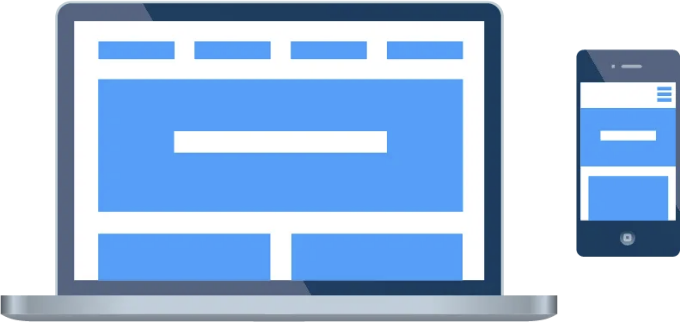

리액트, 앵귤러, 뷰 등은 중요하지 않아요. 프로젝트의 시작점에서는 매우 깔끔한 CSS 파일이 있습니다. 하루하루가 지남에 따라 프로젝트가 커지면 CSS 파일도 프로젝트보다 빨리 성장합니다. 그래서 프론트엔드 개발자들은 CSS를 작성할 때 주의해야 합니다. 프로젝트가 작더라도 개발자는 대부분 프로젝트를 유지보수하게 됩니다. CSS 부분은 프로젝트의 얼굴을 대표하기 때문에 개발자들은 이를 깔끔하고 유지보수 가능하며 재사용 가능하며 확장 가능하게 유지해야 합니다. 깨끗한 CSS를 작성하는 데 도움이 되는 몇 가지 작성 방법론이 있습니다.

시작해 봅시다.

## 객체 지향 CSS (OOCSS):

<!-- ui-log 수평형 -->
<ins class="adsbygoogle"
  style="display:block"
  data-ad-client="ca-pub-4877378276818686"
  data-ad-slot="9743150776"
  data-ad-format="auto"
  data-full-width-responsive="true"></ins>
<component is="script">
(adsbygoogle = window.adsbygoogle || []).push({});
</component>

OOCSS는 수천 개의 페이지에 대한 확장 가능한 CSS를 위한 네이밍 방법론입니다. 주로 2가지 원칙이 있습니다.

### 1. 컨테이너와 내용 분리

이 원칙은 스타일을 2 부분으로 나눕니다. 레이아웃 스타일과 디자인 스타일입니다.

레이아웃 스타일은 너비, 높이, 여백 등에 사용됩니다.

<!-- ui-log 수평형 -->
<ins class="adsbygoogle"
  style="display:block"
  data-ad-client="ca-pub-4877378276818686"
  data-ad-slot="9743150776"
  data-ad-format="auto"
  data-full-width-responsive="true"></ins>
<component is="script">
(adsbygoogle = window.adsbygoogle || []).push({});
</component>

디자인 스타일은 테두리, 색상, 글꼴 등을 위한 것입니다.

주요 아이디어는 여러 구성 요소로 나누어 재사용성을 극대화하는 것입니다.

이 원칙에 대한 예시

```js
.block-position{
   margin: 8px;
   padding: 4px;
},
.block-header{
   color: #4e4e4d;
   border: 1px;
   border-radius: 4px;
   background-color: #e3e3e3;
}
.block-body{
   color: #e3e3e3;
   background-color: #4e4e4e;
}
```

<!-- ui-log 수평형 -->
<ins class="adsbygoogle"
  style="display:block"
  data-ad-client="ca-pub-4877378276818686"
  data-ad-slot="9743150776"
  data-ad-format="auto"
  data-full-width-responsive="true"></ins>
<component is="script">
(adsbygoogle = window.adsbygoogle || []).push({});
</component>

이 예시에서는 여백 및 안쪽 여백이 다른 클래스에 있고, 색상 및 테두리 값은 다른 클래스에 있습니다. HTML 부분에서 다음과 같이 작성합니다.

```html
<div class="block-position block-header">헤더 블록</div>
<div class="block-position block-body">바디 블록</div>
```

## 2. 컨테이너와 컨텐츠를 분리하세요

OOCSS 위키에 따르면 이는 "위치에 의존적인 스타일을 드물게 사용해야 한다"를 의미합니다.
최대한 자식-부모 관계를 피해야 합니다.

<!-- ui-log 수평형 -->
<ins class="adsbygoogle"
  style="display:block"
  data-ad-client="ca-pub-4877378276818686"
  data-ad-slot="9743150776"
  data-ad-format="auto"
  data-full-width-responsive="true"></ins>
<component is="script">
(adsbygoogle = window.adsbygoogle || []).push({});
</component>

이 원칙에 대한 예시

```js
h1.header-color {
  color: #d5e0e0;
}

h1 {
  color: #5cd1d1;
}
```

```js
<div class="block-position block-header">
  <h1 class="header-color">헤더 블록</h1>
</div>
<div class="block-position block-body">
  <h1>본문 블록</h1>
</div>
```

이 예시에서는 헤더 색상을 여러 번 사용할 수 있습니다. 만약 h1 태그에 header-color 클래스가 없으면 동일하게 보입니다. 반면에 header-color 클래스는 block-header 외부에서도 사용할 수 있습니다.

<!-- ui-log 수평형 -->
<ins class="adsbygoogle"
  style="display:block"
  data-ad-client="ca-pub-4877378276818686"
  data-ad-slot="9743150776"
  data-ad-format="auto"
  data-full-width-responsive="true"></ins>
<component is="script">
(adsbygoogle = window.adsbygoogle || []).push({});
</component>

또한 OOCSS GitHub 위키 페이지를 확인해보세요 😊

[OOCSS 위키 페이지](https://github.com/stubbornella/oocss/wiki)

## 블록 요소 수정자 (BEM):

첫 번째 질문은, 왜 이 원칙을 BEM이라고 부르게 되었을까요? 🤔

<!-- ui-log 수평형 -->
<ins class="adsbygoogle"
  style="display:block"
  data-ad-client="ca-pub-4877378276818686"
  data-ad-slot="9743150776"
  data-ad-format="auto"
  data-full-width-responsive="true"></ins>
<component is="script">
(adsbygoogle = window.adsbygoogle || []).push({});
</component>

BEM 방법론에서는 웹 페이지의 주요 구조 구성 요소를 블록이라고 합니다.

만약 페이지를 왼쪽, 가운데, 오른쪽 세 부분으로 나누면 다음과 같습니다.

예시는 아래와 같습니다.

```js
<div class="left-side">
   <span class="left-side__url-text">
      자세한 내용을 원하시면
      <a class="left-side__url" href="www.examplelink.com">
      여기를 클릭해주세요.
      </a>
   </span>
</div>

<div class="center">
   <span class="center__form">
      이름:
      <input class="center__field" />
   </span>
</div>

<div class="right-side">
   <input class="right-side__submit-button" type="submit">제출</input>
</div>
```

<!-- ui-log 수평형 -->
<ins class="adsbygoogle"
  style="display:block"
  data-ad-client="ca-pub-4877378276818686"
  data-ad-slot="9743150776"
  data-ad-format="auto"
  data-full-width-responsive="true"></ins>
<component is="script">
(adsbygoogle = window.adsbygoogle || []).push({});
</component>

더 많은 정보를 원하시면 공식 BEM 웹사이트를 확인해주세요.

## CSS용 확장 가능하고 모듈화된 아키텍처 (SMACSS):

이 방법론은 모든 CSS 코드를 5가지 다른 파일로 나누는 것을 제안합니다.

Base, Layout, Module, State, Theme.

<!-- ui-log 수평형 -->
<ins class="adsbygoogle"
  style="display:block"
  data-ad-client="ca-pub-4877378276818686"
  data-ad-slot="9743150776"
  data-ad-format="auto"
  data-full-width-responsive="true"></ins>
<component is="script">
(adsbygoogle = window.adsbygoogle || []).push({});
</component>

베이스: p, h1, span, div와 같은 기본 HTML 태그입니다.

레이아웃: 헤더, 본문, 네비게이션과 같은 특별한 컨테이너입니다.

모듈: 리스트, 콘텐츠, 메뉴와 같은 재사용 가능한 부분입니다.

상태: 요소의 활성, 활성화, 숨겨진 상태입니다.

<!-- ui-log 수평형 -->
<ins class="adsbygoogle"
  style="display:block"
  data-ad-client="ca-pub-4877378276818686"
  data-ad-slot="9743150776"
  data-ad-format="auto"
  data-full-width-responsive="true"></ins>
<component is="script">
(adsbygoogle = window.adsbygoogle || []).push({});
</component>

테마: 모든 요소 스타일은 여기에 있습니다.

SMACSS에는 권장되는 네이밍 규칙이 있습니다.

레이아웃 클래스의 경우, -l 접두사를 추가합니다.

모듈의 경우, 접두사 없이 직접 모듈 이름을 사용합니다. 예: .contact-form

<!-- ui-log 수평형 -->
<ins class="adsbygoogle"
  style="display:block"
  data-ad-client="ca-pub-4877378276818686"
  data-ad-slot="9743150776"
  data-ad-format="auto"
  data-full-width-responsive="true"></ins>
<component is="script">
(adsbygoogle = window.adsbygoogle || []).push({});
</component>

State에 대해서, 접두사로 -is를 사용하실 수 있습니다. 예를 들어 is-hidden 또는 is-tab-active 같이요.

결론

CSS 작성 방법론에는 총 3가지가 있습니다. 이 세 가지 방법론을 동시에 하나의 프로젝트에서 사용하거나 필요에 맞는 하나를 선택하여 사용할 수 있습니다. 이러한 방법론은 간결하고 유지보수가 용이하며 확장 가능한 CSS를 개발하기 위해 고안되었습니다. 또한 Less, Sass, SCSS와 같은 CSS 전처리기에도 이 방법론을 적용할 수 있습니다.

<!-- ui-log 수평형 -->
<ins class="adsbygoogle"
  style="display:block"
  data-ad-client="ca-pub-4877378276818686"
  data-ad-slot="9743150776"
  data-ad-format="auto"
  data-full-width-responsive="true"></ins>
<component is="script">
(adsbygoogle = window.adsbygoogle || []).push({});
</component>

행복한 코딩하세요!