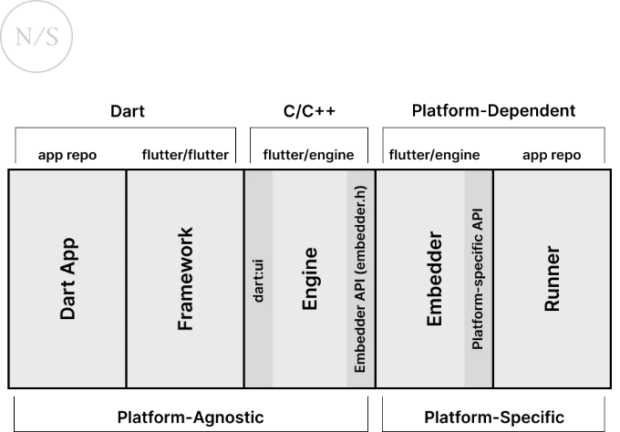
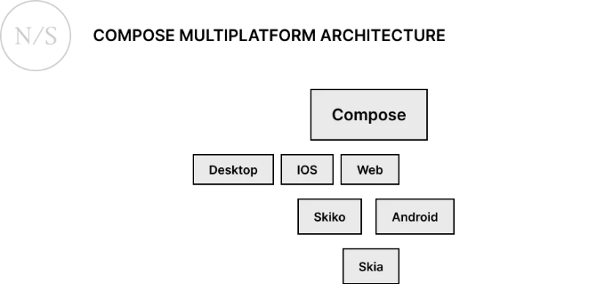
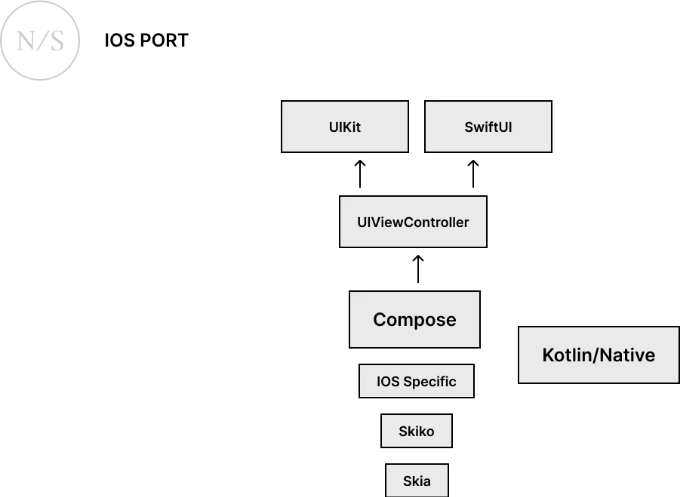
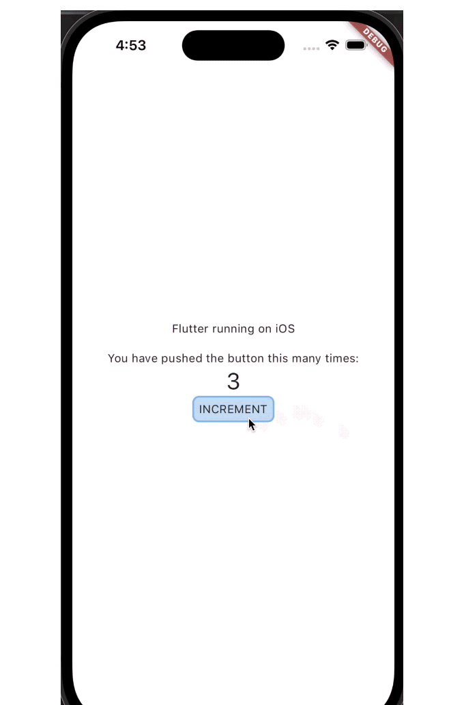
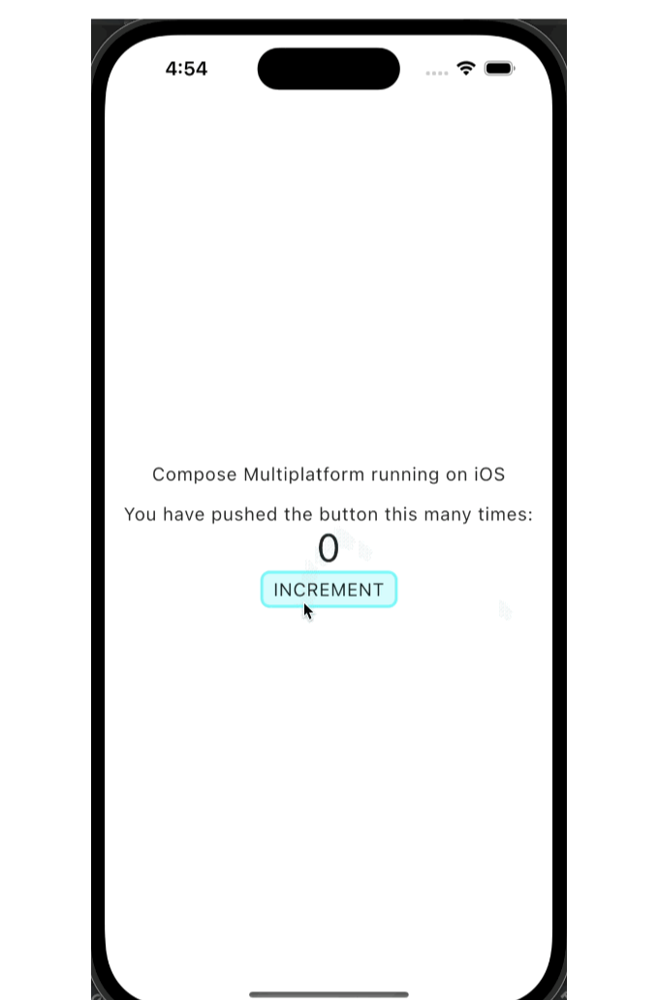
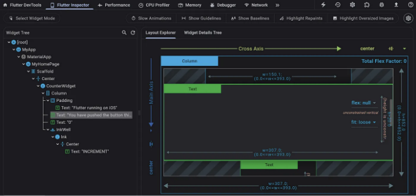
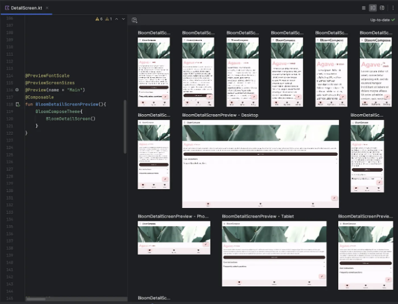
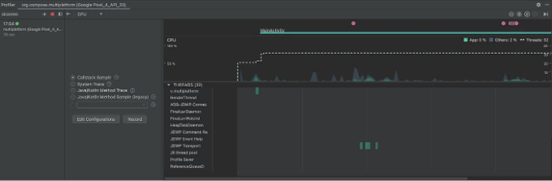
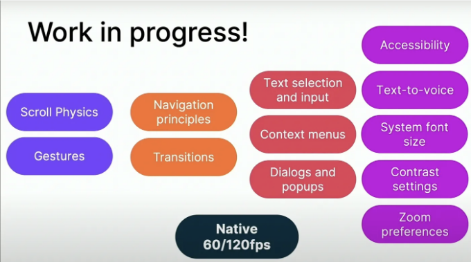

안녕하세요! 저는 Artem이라고 합니다. 안드로이드와 플러터를 사용하여 8년간의 모바일 개발 경험을 가진 뉴소프트(Newsoft)의 시니어 모바일 개발자입니다.

오늘은 크로스 플랫폼 개발을 위한 Compose Multiplatform을 살펴보고 구글의 다른 유명한 프레임워크인 플러터와 비교해보겠습니다. 그전에, 이 기술들에 익숙하지 않은 사람들을 위해 간단한 개요부터 시작하겠습니다.

플러터는 구글이 개발한 크로스 플랫폼 개발을 위한 프레임워크로, 안정 버전이 2018년에 출시되었습니다. iOS, 안드로이드, 웹, 윈도우, 리눅스, 맥용 개발을 지원하며, 프로그래밍 언어로는 구글의 내부 개발 언어인 다트를 사용합니다 (이에 대해 나중에 더 자세히 설명하겠습니다).

Compose Multiplatform은 또 다른 크로스 플랫폼 개발을 위한 프레임워크입니다. UI 프레임워크가 구글에 의해 개발되었지만, 프로그래밍 언어인 코틀린(Kotlin) 및 크로스 플랫폼 부분(KMP)은 젯브레인즈(JetBrains)가 개발했습니다. Android, iOS (알파), 윈도우, 맥OS, 리눅스, 웹 (실험적)과 같은 플랫폼을 지원합니다.

<!-- ui-log 수평형 -->
<ins class="adsbygoogle"
  style="display:block"
  data-ad-client="ca-pub-4877378276818686"
  data-ad-slot="9743150776"
  data-ad-format="auto"
  data-full-width-responsive="true"></ins>
<component is="script">
(adsbygoogle = window.adsbygoogle || []).push({});
</component>

이 두 가지 전혀 다른 그러나 매우 유사한 기술의 다양한 측면을 비교하고 각 카테고리의 우승자를 선정해 봅시다. 평가 및 카테고리는 주관적이며 전혀 과학적이 아니지만 흥미로울 것입니다. 또한, 이 형식은 가장 흔한 모바일 개발에 초점을 맞춥니다.

시작해봅시다!

## 1 설정

플러터(Flutter)와 Compose Multiplatform 모두에 대한 잘 쓰여진 설정 가이드가 있습니다. 이러한 기술 각각에 대해 주요 IDE는 안드로이드 스튜디오(Android Studio)입니다. Flutter의 경우, 플러터 플러그인을 설치해야 합니다. iOS의 경우 — Xcode가 필요합니다. 두 경우 모두 문제가 없었습니다. 그러나 Compose Multiplatform 설정 가이드에는 최신 버전의 Xcode가 작동하지 않을 수 있고 오래된 버전 중 하나를 설치해야 한다는 내용이 있습니다. 제 경우에는 Xcode 15에서도 문제가 없었습니다.

<!-- ui-log 수평형 -->
<ins class="adsbygoogle"
  style="display:block"
  data-ad-client="ca-pub-4877378276818686"
  data-ad-slot="9743150776"
  data-ad-format="auto"
  data-full-width-responsive="true"></ins>
<component is="script">
(adsbygoogle = window.adsbygoogle || []).push({});
</component>

여기서 비겁한 게임입니다:

Flutter — 1  
Compose Multiplatform — 1

## 2 Framework 아키텍처

Flutter

<!-- ui-log 수평형 -->
<ins class="adsbygoogle"
  style="display:block"
  data-ad-client="ca-pub-4877378276818686"
  data-ad-slot="9743150776"
  data-ad-format="auto"
  data-full-width-responsive="true"></ins>
<component is="script">
(adsbygoogle = window.adsbygoogle || []).push({});
</component>

플러터의 핵심은 C/C++로 개발된 Engine입니다. 이 엔진은 그래픽을 그리는 것(아이폰에서는 Impeller 및 안드로이드 프리뷰에서는 Skia)과 I/O 작업, Dart 런타임, 컴파일 도구 체인 등을 담당합니다.

Flutter Engine은 Dart 코드와 함께 애플리케이션에 패키지되며, 크기를 증가시킵니다(Android의 경우 약 3-4MB, iOS의 경우 10MB). 릴리스 버전은 AOT 컴파일을 사용하며, 디버그 버전은 핫 리로드와 디버거 작업을 가능하게 하는 Dart VM을 사용합니다. 디버그 버전은 JIT 컴파일을 사용합니다.



<!-- ui-log 수평형 -->
<ins class="adsbygoogle"
  style="display:block"
  data-ad-client="ca-pub-4877378276818686"
  data-ad-slot="9743150776"
  data-ad-format="auto"
  data-full-width-responsive="true"></ins>
<component is="script">
(adsbygoogle = window.adsbygoogle || []).push({});
</component>

Compose Multiplatform은 구글의 Jetpack Compose와 JetBrains의 KMP를 기반으로 합니다.

일반 Compose와의 주요 차이점은 추가된 KMP 타겟과 관련 변경사항입니다. 이러한 차이로 인해 Kotlin 코드를 교차 플랫폼으로 작성할 수 있을 뿐만 아니라 다양한 플랫폼에서 Compose UI를 사용할 수 있습니다.

플러터와 마찬가지로, Compose Multiplatform은 안드로이드에서 Skia를 사용하여 렌더링하고, 다른 플랫폼에서는 Skiko를 사용합니다 (Kotlin용 Skia).



<!-- ui-log 수평형 -->
<ins class="adsbygoogle"
  style="display:block"
  data-ad-client="ca-pub-4877378276818686"
  data-ad-slot="9743150776"
  data-ad-format="auto"
  data-full-width-responsive="true"></ins>
<component is="script">
(adsbygoogle = window.adsbygoogle || []).push({});
</component>



결론:

몇 가지 사항을 기억해 두어야 합니다:

플러터와 Compose Multiplatform의 공통점은 두 프레임워크 모두 React Native와 달리 플랫폼 네이티브 위젯을 사용하지 않는다는 것입니다. 각각의 경우, 프레임워크는 Skia 또는 유사한 도구를 사용하여 동일하게 모든 컴포넌트를 처음부터 독립적으로 그립니다. 이 부분은 장점으로 생각됩니다.

<!-- ui-log 수평형 -->
<ins class="adsbygoogle"
  style="display:block"
  data-ad-client="ca-pub-4877378276818686"
  data-ad-slot="9743150776"
  data-ad-format="auto"
  data-full-width-responsive="true"></ins>
<component is="script">
(adsbygoogle = window.adsbygoogle || []).push({});
</component>

거축 자체도 애플리케이션 개발에 직접적인 영향을 미칠 수 있다는 점에서 고려할 가치가 있습니다. Flutter로 모든 것이 간단해요. Dart로 코드를 작성하고 지원하는 플랫폼에서 작동합니다. 필요한 경우 플랫폼별 코드를 작성하여 채널을 통해 Dart에 연결하거나 커뮤니티에서 준비한 플러그인을 사용할 수 있어요.

Compose Multiplatform을 사용하면 약간 더 복잡해요. 여기서는 Kotlin Multiplatform을 사용해요. Compose Multiplatform에 대해 처음 듣는 사람들에게는 안드로이드 앱을 그대로 다시 작성하고 Compose에서 실행시키면 iOS에서도 원활히 실행되는 마법같은 기술인 것처럼 오해하기 쉬울 수 있어요.

하지만 그것이 완전히 사실은 아니며, 처리해야 할 제약 사항이 몇 가지 있어요.

프로젝트 구조를 변경하는 것 외에도 코드와 종속성을 리뷰해야 해요. 안드로이드나 자바 패키지에 의존하는 코드는 안드로이드 전용으로 유지하면 작동할 뿐이며, 이것이 바로 크로스 플랫폼 응용 프로그램에서 원하는 것은 아닌 것 같아요.

<!-- ui-log 수평형 -->
<ins class="adsbygoogle"
  style="display:block"
  data-ad-client="ca-pub-4877378276818686"
  data-ad-slot="9743150776"
  data-ad-format="auto"
  data-full-width-responsive="true"></ins>
<component is="script">
(adsbygoogle = window.adsbygoogle || []).push({});
</component>

세 번째로, 서드 파티 라이브러리에도 동일한 제한이 적용됩니다. 라이브러리에 대해 더 자세히 나중에 다루겠습니다.

이 부분에서는 저는 플러터를 선호합니다. 현재 Compose Multiplatform의 상황은 이상적이지 않으며 초보자에게 어려울 수 있습니다.

- 플러터: 2
- Compose Multiplatform: 1

### 3. 서드 파티 라이브러리

<!-- ui-log 수평형 -->
<ins class="adsbygoogle"
  style="display:block"
  data-ad-client="ca-pub-4877378276818686"
  data-ad-slot="9743150776"
  data-ad-format="auto"
  data-full-width-responsive="true"></ins>
<component is="script">
(adsbygoogle = window.adsbygoogle || []).push({});
</component>

플러터

플러터에 대한 좋은 웹 사이트인 pub.dev가 있습니다. 이 사이트에는 플러터와 다트를 위한 다양한 라이브러리(패키지)가 많이 있습니다. 여기서는 플러터 팀이 추천하는 인기 패키지를 볼 수 있을 뿐 아니라 편리한 검색 기능도 있습니다. 게다가, 플러터 커뮤니티는 매우 활발하며 어떤 필요에도 대응하는 라이브러리를 찾을 수 있습니다.

또한, Firebase 통합을 위한 구글의 공식 패키지도 있습니다.

Compose Multiplatform

<!-- ui-log 수평형 -->
<ins class="adsbygoogle"
  style="display:block"
  data-ad-client="ca-pub-4877378276818686"
  data-ad-slot="9743150776"
  data-ad-format="auto"
  data-full-width-responsive="true"></ins>
<component is="script">
(adsbygoogle = window.adsbygoogle || []).push({});
</component>

구글에서 제공하는 많은 라이브러리들이 (아마도 모두) 작동하지 않을 것이니, 거의 모든 것에 대해 예전처럼 제3자 라이브러리를 사용해야 할 것입니다. 예를 들어, 내비게이션, 뷰 모델, 룸과 같은 기능을 구성하는 것들은 지원되지 않습니다. 
그러나 동시에, Multiplatform에서 Koin, Kodein, Realm, SQLDelight와 같은 인기 있는 라이브러리들을 사용할 수 있습니다.

게다가, 내비게이션 및 MVVM/MVI를 위한 KMP 호환 라이브러리도 있습니다. 문제는 "architecture" 섹션에서 언급된 제한 사항 때문에 안드로이드나 자바용으로 작성된 많은 라이브러리들이 작동하지 않을 것입니다. 물론, 프로젝트를 처음부터 개발하고 있는 경우에 이 문제가 그리 눈에 띄지 않을 것이며, 바로 적절한 라이브러리를 선택할 수 있을 것입니다. pub.dev와 같은 것은 없지만, KMP와 함께 작동하는 라이브러리 목록이 있는 깃헙 페이지가 있습니다.

플러터의 승리.

플러터 - 3
Compose Multiplatform - 1

<!-- ui-log 수평형 -->
<ins class="adsbygoogle"
  style="display:block"
  data-ad-client="ca-pub-4877378276818686"
  data-ad-slot="9743150776"
  data-ad-format="auto"
  data-full-width-responsive="true"></ins>
<component is="script">
(adsbygoogle = window.adsbygoogle || []).push({});
</component>

# 4 프로그래밍 언어

플러터: 다트

다트는 구글의 내부 개발 언어로, 자바스크립트 대안으로 개발된 것입니다. 초기 버전은 강력한 타이핑을 갖고 있지 않았습니다. 현대의 다트는 선택적으로 강력한 타이핑 시스템과 널 안전 지원을 갖고 있습니다. 이 언어는 객체 지향 및 함수형 프로그래밍을 지원합니다.

2023년에는 인터페이스 클래스, 베이스 클래스, 파이널 클래스 및 시크릿 클래스 변경자를 추가한 Dart 3 업데이트가 출시되었습니다. 비동기 프로그래밍을 위해 async/await 메커니즘이 있고, 반응형 프로그래밍을 위해 스트림과 rxdart 라이브러리가 있습니다. 일반적으로 이 언어는 나쁘지 않으며, Java와 유사하지만 일부 기능이 있습니다. Kotlin만큼 간결하지는 않고, 보다 복잡한 구문을 갖고 있으며, 데이터 클래스와 같은 작고 중요한 기능을 갖고 있지 않습니다.

<!-- ui-log 수평형 -->
<ins class="adsbygoogle"
  style="display:block"
  data-ad-client="ca-pub-4877378276818686"
  data-ad-slot="9743150776"
  data-ad-format="auto"
  data-full-width-responsive="true"></ins>
<component is="script">
(adsbygoogle = window.adsbygoogle || []).push({});
</component>

다음은 간단한 클래스와 널 가능성에 대한 예제입니다 (이 클래스는 equals, hashCode 및 toString을 구현하지 않았기 때문에 라이브러리를 사용해야 합니다. 예를 들어 이거나 이것):

```js
abstract interface class Named {
  String get name;
}

final class Person implements Named {
  final String firstName;
  final String lastName;

  Person({required this.firstName, required this.lastName});

  @override
  String get name => '$firstName $lastName';
}

void checkPersonName() {
  Person? person = Person(firstName: 'Tobey', lastName: 'Maguire');
  debugPrint(person.name);
  person = null;
  debugPrint(person?.name);
}
```

Compose Multiplatform: Kotlin

코틀린은 JetBrains에서 개발되었습니다. 처음에는 Java의 대체 언어로 만들어졌습니다. 현재 코틀린은 Android의 주요 프로그래밍 언어이며, JVM 바이트 코드뿐만 아니라 네이티브 이진 파일이나 JavaScript로도 컴파일할 수 있습니다. 강력한 타이핑을 지원하며, 널 안전성을 갖추고, 객체 지향 및 함수형 프로그래밍을 지원하며, Java 및 Objective-C와 상호 운용성을 갖추고 있습니다. 비동기 프로그래밍에는 코루틴 메커니즘이 있으며, 반응형 프로그래밍에는 Flow가 있습니다.

<!-- ui-log 수평형 -->
<ins class="adsbygoogle"
  style="display:block"
  data-ad-client="ca-pub-4877378276818686"
  data-ad-slot="9743150776"
  data-ad-format="auto"
  data-full-width-responsive="true"></ins>
<component is="script">
(adsbygoogle = window.adsbygoogle || []).push({});
</component>

코틀린은 많은 좋은 구문 단축과 매우 간결한 구문을 가지고 있어요.

코틀린 코드 예제를 살펴보면 다트 코드와 거의 같은 일을 하는 것을 볼 수 있어요. 여기에도 equals, hashCode 및 toString이 자동으로 생성되는 데이터 클래스가 있습니다.

```js
interface Named {
    val name: String
}

data class Person(val firstName: String, val lastName: String) : Named {
    override val name: String
        get() = "$firstName $lastName"
}

fun checkPersonName() {
    var person: Person? = Person(firstName = "Tobey", lastName = "Maguire")
    println(person?.name)
    person = null
    println(person?.name)
}
```

결론:

<!-- ui-log 수평형 -->
<ins class="adsbygoogle"
  style="display:block"
  data-ad-client="ca-pub-4877378276818686"
  data-ad-slot="9743150776"
  data-ad-format="auto"
  data-full-width-responsive="true"></ins>
<component is="script">
(adsbygoogle = window.adsbygoogle || []).push({});
</component>

두 언어 모두 편리하고 배우기 쉽며 다양한 현대 기능을 갖추고 있어요.

하지만 제 개인적인 경험을 고려하면, Kotlin으로 프로그래밍하는 게 Dart보다 더 즐겁다고 느껴요. Dart는 깔끔한 코드를 작성할 수 있는 도구를 제공하고, 비동기 및 반응형 프로그래밍을 기본적으로 지원하지만, 일부 해결책이 낯설어 보이고 문법이 때때로 Kotlin과 비교했을 때 다소 서툴러 보여요.

Flutter — 3
Compose Multiplatform — 2

# 5 UI 프레임워크

<!-- ui-log 수평형 -->
<ins class="adsbygoogle"
  style="display:block"
  data-ad-client="ca-pub-4877378276818686"
  data-ad-slot="9743150776"
  data-ad-format="auto"
  data-full-width-responsive="true"></ins>
<component is="script">
(adsbygoogle = window.adsbygoogle || []).push({});
</component>

두 프레임워크 모두 Declarative UI 패러다임을 따릅니다. 물론 세부사항과 차이점이 많이 있어서 이에 대한 별도의 기사를 쉽게 쓸 수 있습니다. 여기서는 UI를 구축하는 데 사용할 기본 구성 요소를 살펴보겠습니다. 이를 통해 일반적으로 프레임워크를 다루는 것에 대한 대략적인 아이디어를 얻을 수 있습니다.

Flutter에서는 위젯을 사용하고, Compose에서는 composable function을 사용합니다.

버튼을 클릭하여 변경할 수 있는 내부 상태를 가진 간단한 위젯을 구현해 보겠습니다.

<!-- ui-log 수평형 -->
<ins class="adsbygoogle"
  style="display:block"
  data-ad-client="ca-pub-4877378276818686"
  data-ad-slot="9743150776"
  data-ad-format="auto"
  data-full-width-responsive="true"></ins>
<component is="script">
(adsbygoogle = window.adsbygoogle || []).push({});
</component>

플러터는 Stateless와 Stateful 위젯을 별도의 클래스로 구분합니다. Stateful 위젯의 경우에는 위젯 자체와 State 클래스 두 개를 구현해야 합니다:

```js
class CounterWidget extends StatefulWidget {
  final Color backgroundColor;
  final Color borderColor;

  const CounterWidget({
    super.key,
    required this.backgroundColor,
    required this.borderColor,
  });

  @override
  State<CounterWidget> createState() => _CounterWidgetState();
}
```

```js
class _CounterWidgetState extends State<CounterWidget> {
  int _counter = 0;

  @override
  Widget build(BuildContext context) {
    return Column(
      mainAxisAlignment: MainAxisAlignment.center,
      children: <Widget>[
        const Padding(
          padding: EdgeInsets.only(bottom: 16),
          child: Text('Flutter running on iOS'),
        ),
        const Text(
          'You have pushed the button this many times:',
        ),
        Text(
          '$_counter',
          style: Theme.of(context).textTheme.headlineMedium,
        ),
        InkWell(
          customBorder: RoundedRectangleBorder(
            borderRadius: BorderRadius.circular(8),
          ),
          onTap: () {
            setState(() {
              _counter++;
            });
          },
          child: Ink(
            width: 100,
            height: 32,
            decoration: BoxDecoration(
                color: widget.backgroundColor,
                border: Border.all(color: widget.borderColor, width: 2.0),
                borderRadius: BorderRadius.circular(8)),
            child: const Center(child: Text('INCREMENT')),
          ),
        )
      ],
    );
  }
}
```

여기 몇 가지 언급할 사항이 있습니다:

<!-- ui-log 수평형 -->
<ins class="adsbygoogle"
  style="display:block"
  data-ad-client="ca-pub-4877378276818686"
  data-ad-slot="9743150776"
  data-ad-format="auto"
  data-full-width-responsive="true"></ins>
<component is="script">
(adsbygoogle = window.adsbygoogle || []).push({});
</component>

매개변수는 State 클래스 생성자를 통해 전달할 수 있지만 필수는 아닙니다. 또한 Widget 클래스의 필드는 widget 필드를 통해 접근할 수 있습니다.

또한 UI 작업을 할 때, 위젯은 여러 가지 기본적인 작업에 사용됩니다.

패딩을 추가하고 싶으세요? Padding 위젯이 필요합니다. 클릭할 수 있는 요소로 만들고 싶으세요? InkWell + Ink로 감싸세요 (이 조합은 물결 효과를 제공합니다) 또는 GestureDetector. BoxDecoration은 둥근 모서리가 있는 테두리를 추가하는 데 사용됩니다. 카운터 값 자체는 CounterWidgetState 클래스에 있으며 setState 메서드를 사용하여 변경할 수 있습니다. 이는 상태 자체를 변경하고 다시 build 메서드를 호출합니다.

결과:

<!-- ui-log 수평형 -->
<ins class="adsbygoogle"
  style="display:block"
  data-ad-client="ca-pub-4877378276818686"
  data-ad-slot="9743150776"
  data-ad-format="auto"
  data-full-width-responsive="true"></ins>
<component is="script">
(adsbygoogle = window.adsbygoogle || []).push({});
</component>



# Composable functions

Compose Multiplatform distinguishes between stateful and stateless concepts as well. In both cases, we use a function annotated with `@Composable`. The main difference lies in whether we retain the state using the `remember` function or not.

```kotlin
@Composable
fun Counter(backgroundColor: Color, borderColor: Color) {
    var counter by remember { mutableStateOf(0) }

    Column(
        modifier = Modifier.fillMaxSize(),
        horizontalAlignment = Alignment.CenterHorizontally,
        verticalArrangement = Arrangement.Center,
    ) {
        Text(
            modifier = Modifier.padding(bottom = 16.dp),
            text = "Compose Multiplatform running on iOS"
        )
        Text(
            text = "You have pushed the button this many times:"
        )
        Text(
            "$counter", style = MaterialTheme.typography.h4
        )
        val shape = RoundedCornerShape(8.dp)

        Box(
            contentAlignment = Alignment.Center,
            modifier = Modifier.size(width = 120.dp, height = 32.dp)
                .border(width = 2.0.dp, color = borderColor, shape = shape)
                .background(color = backgroundColor, shape = shape)
                .clip(shape = shape)
                .clickable {
                    counter++
                }
        ) {
            Text("INCREMENT")
        }
    }
}
```

<!-- ui-log 수평형 -->
<ins class="adsbygoogle"
  style="display:block"
  data-ad-client="ca-pub-4877378276818686"
  data-ad-slot="9743150776"
  data-ad-format="auto"
  data-full-width-responsive="true"></ins>
<component is="script">
(adsbygoogle = window.adsbygoogle || []).push({});
</component>

이 코드는 플러터 코드와 동일한 위젯을 구현합니다. 몇 가지 주요 차이점이 있습니다.

저희는 Composable 함수 하나로 작업하고 있으며, 이를 상태를 가지게 하려면 문자열 하나만 있으면 됩니다.

```js
var counter by remember { mutableStateOf(0) }
```

다음으로, 우리는 카운터를 일반 필드처럼 처리하고, 값이 업데이트되면 해당 부분의 UI가 다시 그려집니다. 변경 가능한 객체를 기억해야 하는 것은 불변 객체만이어야 하는데, 가변 객체의 수정은 재구성으로 이어지지 않습니다. 위젯 구조는 플러터와 매우 유사하지만 여기서는 몇 가지를 위젯 단위로 달리하는 대신에 수정자(Modifier)를 사용하여 일부가 구현됩니다. Modifier.padding, Modifier.clickable에 주목해주세요. 테두리도 Modifier.border를 사용하여 구현되었습니다.

<!-- ui-log 수평형 -->
<ins class="adsbygoogle"
  style="display:block"
  data-ad-client="ca-pub-4877378276818686"
  data-ad-slot="9743150776"
  data-ad-format="auto"
  data-full-width-responsive="true"></ins>
<component is="script">
(adsbygoogle = window.adsbygoogle || []).push({});
</component>

결과:



결론:

구현 코드가 상당히 다르지만, 두 프레임워크 모두 유사한 철학을 공유합니다. 네, 플러터에서 더 많은 코드를 작성해야 하지만 그 이유는 프레임워크 자체가 아닌 Dart 언어에 부분적으로 있습니다.

<!-- ui-log 수평형 -->
<ins class="adsbygoogle"
  style="display:block"
  data-ad-client="ca-pub-4877378276818686"
  data-ad-slot="9743150776"
  data-ad-format="auto"
  data-full-width-responsive="true"></ins>
<component is="script">
(adsbygoogle = window.adsbygoogle || []).push({});
</component>

둘 다 사용하기 쉬운 현대적인 선언형 UI 프레임워크이며, 무승부입니다.

- Flutter — 4
- Compose Multiplatform — 3

## 6 플랫폼과의 통신

크로스 플랫폼 개발에서는 언젠가 플랫폼의 네이티브 API와 어떠한 방식으로든 통신해야 할 필요가 있습니다. Compose Multiplatform와 Flutter이 이를 제공하는 방법에 대해 알아봅시다.

<!-- ui-log 수평형 -->
<ins class="adsbygoogle"
  style="display:block"
  data-ad-client="ca-pub-4877378276818686"
  data-ad-slot="9743150776"
  data-ad-format="auto"
  data-full-width-responsive="true"></ins>
<component is="script">
(adsbygoogle = window.adsbygoogle || []).push({});
</component>

# 플러터

플러터에는 플랫폼 채널 메커니즘이 있어서 네이티브 코드(Swift 또는 Kotlin)와의 사이에 기본 데이터 유형을 교환할 수 있습니다.

이 메커니즘은 UI를 차단하지 않도록 비동기적으로 작동합니다.

플러터에 채널을 추가하세요:

<!-- ui-log 수평형 -->
<ins class="adsbygoogle"
  style="display:block"
  data-ad-client="ca-pub-4877378276818686"
  data-ad-slot="9743150776"
  data-ad-format="auto"
  data-full-width-responsive="true"></ins>
<component is="script">
(adsbygoogle = window.adsbygoogle || []).push({});
</component>

```js
const platform = MethodChannel('samples.flutter.dev/platform');

Future<void> _getPlatform() async {
  final platformName = await platform.invokeMethod<String>('getPlatform') ?? '';
  setState(() {
    _platformName = platformName;
  });
}
```

안드로이드:

```js
class MainActivity: FlutterActivity() {
    override fun configureFlutterEngine(flutterEngine: FlutterEngine) {
        super.configureFlutterEngine(flutterEngine)
        MethodChannel(
            flutterEngine.dartExecutor.binaryMessenger,
            "samples.flutter.dev/platform"
        ).setMethodCallHandler { call, result ->
            if (call.method == "getPlatform") {
                result.success(getPlatform())
            } else {
                result.notImplemented()
            }
        }
    }

    private fun getPlatform(): String {
        return "Android ${android.os.Build.VERSION.SDK_INT}"
    }
}
```

iOS:

<!-- ui-log 수평형 -->
<ins class="adsbygoogle"
  style="display:block"
  data-ad-client="ca-pub-4877378276818686"
  data-ad-slot="9743150776"
  data-ad-format="auto"
  data-full-width-responsive="true"></ins>
<component is="script">
(adsbygoogle = window.adsbygoogle || []).push({});
</component>

```swift
@UIApplicationMain
@objc class AppDelegate: FlutterAppDelegate {
  override func application(
    _ application: UIApplication,
    didFinishLaunchingWithOptions launchOptions: [UIApplication.LaunchOptionsKey: Any]?
  ) -> Bool {
      
  let controller : FlutterViewController = window?.rootViewController as! FlutterViewController
      
      let platformChannel = FlutterMethodChannel(name: "samples.flutter.dev/platform",
                                                binaryMessenger: controller.binaryMessenger)
      platformChannel.setMethodCallHandler({
        (call: FlutterMethodCall, result: @escaping FlutterResult) -> Void in
          guard call.method == "getPlatform" else {
              result(FlutterMethodNotImplemented)
              return
            }
            self.getPlatform(result: result)
      })
      
    GeneratedPluginRegistrant.register(with: self)
    return super.application(application, didFinishLaunchingWithOptions: launchOptions)
  }
    
  private func getPlatform(result: FlutterResult) {
    let platform = UIDevice.current.systemName + " " + UIDevice.current.systemVersion
      result(platform)
  }
}
```

이 방식은 간단하고 잘 동작하지만 보시다시피 세 가지 다른 언어로 코드를 작성해야 합니다.

또한, Flutter는 네이티브 iOS 및 Android 뷰를 포함할 수 있는 기능을 제공합니다. 그리고 그 반대도 가능하며, 기존의 네이티브 iOS 및 Android 프로젝트에 Flutter를 포함시킬 수 있습니다.

네이티브 코드나 네이티브 위젯을 다루어야 하는 경우, 이미 공식 또는 비공식 라이브러리가 생성되어 있는 경우가 많으므로 주목할 가치가 있습니다.```

<!-- ui-log 수평형 -->
<ins class="adsbygoogle"
  style="display:block"
  data-ad-client="ca-pub-4877378276818686"
  data-ad-slot="9743150776"
  data-ad-format="auto"
  data-full-width-responsive="true"></ins>
<component is="script">
(adsbygoogle = window.adsbygoogle || []).push({});
</component>

예를 들어, Google 지도와 함께 작업하는 Flutter 위젯이나 로컬 알림을 처리하는 라이브러리가 있습니다.

Compose Multiplatform

여기서 주요 장점은 Kotlin을 사용하여 네이티브 API와 통신할 수 있다는 것입니다. KMP는 사용하기 쉬운 expect / actual 메커니즘을 제공합니다.

예를 들어, 공통 모듈에 expect 클래스를 생성합니다:

<!-- ui-log 수평형 -->
<ins class="adsbygoogle"
  style="display:block"
  data-ad-client="ca-pub-4877378276818686"
  data-ad-slot="9743150776"
  data-ad-format="auto"
  data-full-width-responsive="true"></ins>
<component is="script">
(adsbygoogle = window.adsbygoogle || []).push({});
</component>

```js
// KMP Class Definition
expect class Platform() {
    val name: String
}
```

iOS 모듈에서 사용하는 실제 클래스:

```js
// iOS
actual class Platform actual constructor() {
    actual val name: String =
        UIDevice.currentDevice.systemName() + " " + UIDevice.currentDevice.systemVersion
}
```

Android 모듈에서 사용하는 실제 클래스:```

<!-- ui-log 수평형 -->
<ins class="adsbygoogle"
  style="display:block"
  data-ad-client="ca-pub-4877378276818686"
  data-ad-slot="9743150776"
  data-ad-format="auto"
  data-full-width-responsive="true"></ins>
<component is="script">
(adsbygoogle = window.adsbygoogle || []).push({});
</component>

```js
// Android
실제 클래스 Platform의 실제 생성자() {
    실제 val name: String = "Android ${android.os.Build.VERSION.SDK_INT}"
}
```

이게 다야, 이제 Platform 클래스를 일반 클래스처럼 사용할 수 있습니다. 플랫폼에 따라 특정 구현이 자동으로 선택됩니다.

objective-C와의 상호 운용도 있습니다.

네이티브 위젯과 함께 Compose 위젯을 사용하는 것에 대해선 다음과 같습니다.```

<!-- ui-log 수평형 -->
<ins class="adsbygoogle"
  style="display:block"
  data-ad-client="ca-pub-4877378276818686"
  data-ad-slot="9743150776"
  data-ad-format="auto"
  data-full-width-responsive="true"></ins>
<component is="script">
(adsbygoogle = window.adsbygoogle || []).push({});
</component>

안드로이드 - 젯팩 콤포즈와 콤포즈 멀티플랫폼의 대부분 위젯은 동일합니다. 모든 것이 여기서 간단해요. 안드로이드 특정 코드가 있는 곳만 수정하면 됩니다. 예를 들어, 리소스에 액세스하기 위해 모코 라이브러리를 사용할 수 있습니다.

콤포즈 멀티플랫폼은 UIKit과 SwiftUI와도 호환됩니다.

요약:

콤포즈는 이기고, 코틀린 멀티플랫폼의 힘으로 한 가지 프로그래밍 언어를 사용하여 네이티브 API와 통신할 수 있습니다.

<!-- ui-log 수평형 -->
<ins class="adsbygoogle"
  style="display:block"
  data-ad-client="ca-pub-4877378276818686"
  data-ad-slot="9743150776"
  data-ad-format="auto"
  data-full-width-responsive="true"></ins>
<component is="script">
(adsbygoogle = window.adsbygoogle || []).push({});
</component>

플러터 - 4
Compose Multiplatform - 4

## 7 Tooling

플러터

UI 작업

<!-- ui-log 수평형 -->
<ins class="adsbygoogle"
  style="display:block"
  data-ad-client="ca-pub-4877378276818686"
  data-ad-slot="9743150776"
  data-ad-format="auto"
  data-full-width-responsive="true"></ins>
<component is="script">
(adsbygoogle = window.adsbygoogle || []).push({});
</component>

미리보기 기능이 없으므로 코드를 변경한 후 에뮬레이터를 참조해야 합니다. 이 문제는 Flutter가 빠르고 잘 작동하는 핫 리로드를 보유하고 있어 부분적으로 보상받을 수 있습니다. 위젯을 변경하고 파일을 저장하면 즉시 에뮬레이터에 반영됩니다.

성능 분석

Flutter 개발 도구라는 매우 편리한 도구가 있습니다. 이 도구는 UI 구조, 네트워크 호출 및 애플리케이션 성능을 보여줍니다. 브라우저에서 실행되므로 VS Code를 사용하고 싶다면 쉽게 변경할 수 있습니다.



<!-- ui-log 수평형 -->
<ins class="adsbygoogle"
  style="display:block"
  data-ad-client="ca-pub-4877378276818686"
  data-ad-slot="9743150776"
  data-ad-format="auto"
  data-full-width-responsive="true"></ins>
<component is="script">
(adsbygoogle = window.adsbygoogle || []).push({});
</component>

디버거

디버거가 있고 작동은 합니다. 하지만 작동이 정말 어설픈 경우가 많죠. 연결하는 데 시간이 오래 걸리거나 크래시가 발생하거나 무작위로 줄을 건너뛰거나 이전에 삭제한 중단점에서 멈출 수 있습니다. 어플리케이션이 잘 작동한다면 디버거를 연결하면 간혹 간단히 멈추거나 크래시할 수 있습니다.

디버거를 연결하는 것보다 가능한 한 많은 로그를 추가하는 것이 더 쉬울 때가 많습니다.

Compose Multiplatform

<!-- ui-log 수평형 -->
<ins class="adsbygoogle"
  style="display:block"
  data-ad-client="ca-pub-4877378276818686"
  data-ad-slot="9743150776"
  data-ad-format="auto"
  data-full-width-responsive="true"></ins>
<component is="script">
(adsbygoogle = window.adsbygoogle || []).push({});
</component>

UI 작업 중

Jetpack Compose에는 매우 멋진 기능이 있습니다 - @Preview 어노테이션입니다. 이를 사용하면 IDE에서 다른 화면에서 위젯이 어떻게 보이는지 즉시 확인할 수 있습니다.



그러나 @Preview는 Compose Multiplatform과 함께 작동하지 않으며 Android 모듈의 composable 함수에만 추가할 수 있습니다. 이론적으로 코드 공유 모듈에 적합한 함수를 두고 Android 모듈에서 @Preview 어노테이션을 사용하여 간단한 래퍼를 추가할 수 있지만 현재 이 접근 방식에 문제가 있습니다.

<!-- ui-log 수평형 -->
<ins class="adsbygoogle"
  style="display:block"
  data-ad-client="ca-pub-4877378276818686"
  data-ad-slot="9743150776"
  data-ad-format="auto"
  data-full-width-responsive="true"></ins>
<component is="script">
(adsbygoogle = window.adsbygoogle || []).push({});
</component>

아마 핫 리로드를 해보면 도움이 될지도 모르겠어요.

하지만 안타깝게도 안드로이드에서는 어느 정도 작동하지만 사실 액티비티를 다시 시작해야 합니다. iOS에서는 이런 가능성이 없어서 매번 애플리케이션을 재조립하고 다시 시작해야 합니다.

디버거는 iOS와 안드로이드에서 작동하지만 큰 프로젝트에서는 테스트하지 않았습니다.

안드로이드에서는 프로파일러가 안드로이드 스튜디오에서 작동합니다.

<!-- ui-log 수평형 -->
<ins class="adsbygoogle"
  style="display:block"
  data-ad-client="ca-pub-4877378276818686"
  data-ad-slot="9743150776"
  data-ad-format="auto"
  data-full-width-responsive="true"></ins>
<component is="script">
(adsbygoogle = window.adsbygoogle || []).push({});
</component>

xcode instruments는 iOS에서 작동해야 합니다. 저는 연결을 할 수 없었지만, 발표 중에 모든 것이 잘 해결되었습니다.



결론:

지금은 Flutter에서 개발하는 것이 조금 더 편리하지만, 결국 Compose Multiplatform을 선호하게 될 수도 있습니다.

<!-- ui-log 수평형 -->
<ins class="adsbygoogle"
  style="display:block"
  data-ad-client="ca-pub-4877378276818686"
  data-ad-slot="9743150776"
  data-ad-format="auto"
  data-full-width-responsive="true"></ins>
<component is="script">
(adsbygoogle = window.adsbygoogle || []).push({});
</component>

# 플러터 — 5
컴포즈 멀티플랫폼 — 4

## 8 성숙도

플러터 1.0은 2018년에 처음 등장했습니다. 이 시간 동안 두 프레임워크 모두 안정화되고 새로운 기능을 갖추었으며 이제 대규모 제품 애플리케이션에서 사용할 수 있는 것으로 권장됩니다. 이 페이지에는 성공 사례들이 있습니다. 또한 문제나 질문에 항상 도움을 주는 큰 커뮤니티와 다양한 써드파티 라이브러리가 있습니다.

저는 컴포즈 멀티플랫폼을 사용하는 것을 즐겼습니다. 컴포즈와 코틀린을 좋아하기 때문입니다. 그러나 모바일 크로스 플랫폼 개발에는 아직 충분히 성숙해지지 않았다는 점에 동의해야 합니다. 개발자들이 솔직하게 이야기하는 것을 듣습니다.

<!-- ui-log 수평형 -->
<ins class="adsbygoogle"
  style="display:block"
  data-ad-client="ca-pub-4877378276818686"
  data-ad-slot="9743150776"
  data-ad-format="auto"
  data-full-width-responsive="true"></ins>
<component is="script">
(adsbygoogle = window.adsbygoogle || []).push({});
</component>

2023년 5월 발표에서 스크린샷을 공유해 드립니다:



여기서 Flutter에 한 점이 주어졌어요.

Flutter — 6
Compose Multiplatform — 4

<!-- ui-log 수평형 -->
<ins class="adsbygoogle"
  style="display:block"
  data-ad-client="ca-pub-4877378276818686"
  data-ad-slot="9743150776"
  data-ad-format="auto"
  data-full-width-responsive="true"></ins>
<component is="script">
(adsbygoogle = window.adsbygoogle || []).push({});
</component>

# 9 최종 결과

Flutter — 6
Compose Multiplatform — 4

Flutter에는 단점이 있지만, 모바일 크로스 플랫폼 개발에 자신감 있게 선택할 수 있는 성숙하고 사용할 준비가 된 기술입니다.

Compose Multiplatform은 매우 유망한 기술이며, Google은 이미 Jetpack을 위한 Compose Multiplatform 지원에 대해 작업 중입니다. 몇 년 뒤에는 Flutter의 강력한 경쟁 상대가 될 수도 있습니다. 놀랍게도 둘 다 Google에 의해 부분적으로 또는 완전히 개발되었음에도 불구하고요. 혹시 Google 제품 묘지에 새로운 참가자가 생길지도 모르겠네요.

<!-- ui-log 수평형 -->
<ins class="adsbygoogle"
  style="display:block"
  data-ad-client="ca-pub-4877378276818686"
  data-ad-slot="9743150776"
  data-ad-format="auto"
  data-full-width-responsive="true"></ins>
<component is="script">
(adsbygoogle = window.adsbygoogle || []).push({});
</component>

하지만 지금은 실험이나 개인 프로젝트에만 Compose Multiplatform을 사용하고 있어요.