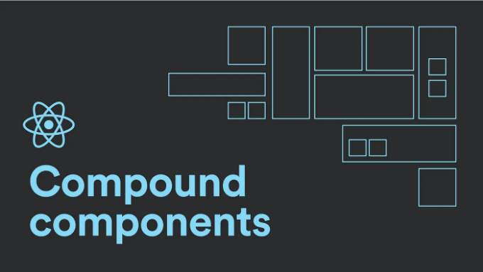
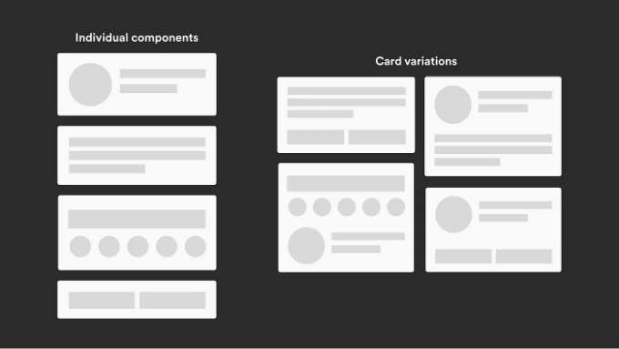

## 문제

리액트 컴포넌트를 보신 적이 있을 거예요. 거기에는 많은 프롭들이 전달되는데, 대부분의 경우 그 프롭들은 부울 플래그입니다. 이러한 플래그들은 컴포넌트의 특정 부분을 다른 방식으로 조건부로 표시하거나 때로는 그 부분을 렌더 트리에서 완전히 제거하는 데 도움이 됩니다. 그러나 이 방법은 확장이 어려운 악몽입니다. 이 컴포넌트는 이제 "일회성" 조건 블록에 개방되어 있습니다.


<!-- ui-log 수평형 -->
<ins class="adsbygoogle"
  style="display:block"
  data-ad-client="ca-pub-4877378276818686"
  data-ad-slot="9743150776"
  data-ad-format="auto"
  data-full-width-responsive="true"></ins>
<component is="script">
(adsbygoogle = window.adsbygoogle || []).push({});
</component>

예를 들어, 이 카드에서 소셜 액션 버튼의 위치를 간단히 전환하려면 구성 요소 자체에 몇 가지 논리를 추가해야 합니다. 그러나 이것이 매우 특수한 시나리오이며, 앱의 나머지 부분은 카드의 원래 구조를 사용할 것을 알고 있습니다. 하지만 이 시나리오를 처리해야 하기 때문에 구성 요소에 추가적인 논리를 추가해야 합니다. 이제 많은 이러한 플래그가 있는 큰 구성 요소를 상상해 보세요. 깨닫기도 전에 구성 요소가 이미 비대하고 이해하기 어려워지고 있습니다. 이 문제의 해결책은 매우 간단합니다.

## 복합 컴포넌트 패턴



재사용 가능한 컴포넌트 모음을 구축하고 편리하게 기반으로 원하는 곳에 배치합니다. 심지어 특정 부분을 원하지 않는다면, 논리를 추가하지 않고 삭제만 하면 됩니다. 이는 개발자 관점에서 많은 유연성을 가져다 주며, 이제 구성 요소를 확장하는 것이 훨씬 쉬워집니다.

<!-- ui-log 수평형 -->
<ins class="adsbygoogle"
  style="display:block"
  data-ad-client="ca-pub-4877378276818686"
  data-ad-slot="9743150776"
  data-ad-format="auto"
  data-full-width-responsive="true"></ins>
<component is="script">
(adsbygoogle = window.adsbygoogle || []).push({});
</component>

두 개 이상의 구성 요소가 함께 작업하여 작업을 수행하는 아이디어입니다.

## 이 패턴을 사용한 UI 카드 예제

이 예제의 전체 코드 기반은 아래 링크에 있습니다. 시각적으로 배우는 사람이라면 YouTube 비디오도 있으니 확인해보세요.

```js
import React from 'react'
import { twMerge } from 'tailwind-merge';

//각 구성 요소를 위한 tailwind 클래스
const cardClasses = 'bg-white min-w-[320px]  rounded-lg flex flex-col items-center justify-center p-5';
const headerClasses = 'flex justify-between w-full mb-2';
const nameClasses = 'text-2xl font-bold text-center text-gray-800';
const roleClasses = 'text-md font-medium text-center text-gray-800';
const socialsClasses = 'flex items-center justify-center gap-4 my-4';
const socialButtonClasses = 'text-xl text-gray-400';
const actionsClasses = 'flex items-center justify-center w-full gap-2 mt-2'

//개별 구성 요소
const actionButtonClasses = (type) => twMerge('border-2 px-2 py-1.5 rounded text-sm font-bold w-full', type === 'primary' ? 'bg-sky-700 text-white' : 'text-gray-400 bg-white');
const Card = ({ children }) => <div className={cardClasses}> {children} </div>
const Header = ({ children }) => <div className={headerClasses}> {children} </div>
const Image = ({ src, alt }) => 
const Name = ({ children }) => <h1 className={nameClasses}>{children}</h1>
const Role = ({ children }) => <h3 className={roleClasses}>{children}</h3>
const Socials = ({ children }) => <div className={socialsClasses}> {children} </div>
const SocialButton = ({ children }) => <button className={socialButtonClasses}> {children} </button>
const Actions = ({ children }) => <div className={actionsClasses}> {children} </div>
const HeaderButton = ({ children, onClick }) =>
    <button className='text-gray-400' onClick={onClick}>
        {children}
    </button>
const ActionButton = ({ children, type, onClick }) =>
    <button className={actionButtonClasses(type)} onClick={onClick}>
        {children}
    </button>
export {
    Card, Header, ActionButton, Actions, HeaderButton, Image, Name, Role, SocialButton, Socials,
}
```

<!-- ui-log 수평형 -->
<ins class="adsbygoogle"
  style="display:block"
  data-ad-client="ca-pub-4877378276818686"
  data-ad-slot="9743150776"
  data-ad-format="auto"
  data-full-width-responsive="true"></ins>
<component is="script">
(adsbygoogle = window.adsbygoogle || []).push({});
</component>

이 패턴을 사용하여 카드 구성 요소가 어떻게 보이는지 알아봤어요. 여기서, 저는 모든 컴포넌트를 children prop으로 개별적으로 생성해요. 태그 사이에 전달하는 내용은 해당 태그의 자식으로 계산돼요. div 태그를 사용하고 그 안에 h1 태그와 p 태그가 있다면, 이 div 태그의 자식으로 카운트돼요.

이 children prop을 활용하면 사용자가 구성 요소 안에 무엇을 렌더링하고 어떻게 하는지에 대한 완전한 제어 권한을 부여해요.

또한, 여기서는 이쁘게 보이도록 몇 가지 tailwind 클래스를 사용했어요. 아래 링크된 코드베이스에서 모든 것을 복사할 수 있어요.

App 파일 내부에서 이러한 모든 컴포넌트를 가져와서 필요에 따라 구조화할 거에요. 사용 사례에 따라 컴포넌트를 구성할 수 있어요. 이동하거나 컴포넌트에서 간단히 제거하고 추가 로직이 없어도 모두 예상대로 작동할 거에요. 최대한 유연하게 사용할 수 있어요.

<!-- ui-log 수평형 -->
<ins class="adsbygoogle"
  style="display:block"
  data-ad-client="ca-pub-4877378276818686"
  data-ad-slot="9743150776"
  data-ad-format="auto"
  data-full-width-responsive="true"></ins>
<component is="script">
(adsbygoogle = window.adsbygoogle || []).push({});
</component>

```js
<Card>
  <Image src={'https://images.unsplash.com/photo-1592334873219-42ca023e48ce?q=80&w=1000&auto=format&fit=crop&ixlib=rb-4.0.3&ixid=M3wxMjA3fDB8MHxjb2xsZWN0aW9uLXBhZ2V8M3w3NjA4Mjc3NHx8ZW58MHx8fHx8'} alt={'프로필 이미지'} />
  <div className='mt-4 mb-2'>
    <Name>John Doe</Name>
    <Role>UX 전문가</Role>
  </div>
  <Socials>
    <SocialButton><IoLogoInstagram /></SocialButton>
    <SocialButton><IoLogoLinkedin /></SocialButton>
    <SocialButton><IoLogoTwitter /></SocialButton>
    <SocialButton><IoLogoYoutube /></SocialButton>
  </Socials>
</Card>
```

## 이 예제를 사용하여 탭 구성 요소

탭 구성 요소를 사용할 때, 현재 활성 탭을 추적하기 위한 상태 변수가 필요합니다. 상태를 프롭스로 전달할 수 있지만 때로는 깊게 중첩된 구성 요소가 있을 수 있고, 각 구성 요소로 프롭을 전달하는 것은 그저 지저분합니다. 대신 컨텍스트를 사용할 것입니다.

그러니 첫 번째로, 주요 탭 컨테이너를 구성해 봅시다.```

<!-- ui-log 수평형 -->
<ins class="adsbygoogle"
  style="display:block"
  data-ad-client="ca-pub-4877378276818686"
  data-ad-slot="9743150776"
  data-ad-format="auto"
  data-full-width-responsive="true"></ins>
<component is="script">
(adsbygoogle = window.adsbygoogle || []).push({});
</component>

```js
const TabsContext = createContext();
const Tabs = ({ children }) => {
    const [activeTab, setActiveTab] = useState(0);
    const changeTab = (tab) => setActiveTab(tab);
    return (
        <TabsContext.Provider value={ activeTab, changeTab }>
            <div className="w-[600px] rounded shadow-xl">{children}</div>
        </TabsContext.Provider>
    )
}
```

이 컴포넌트는 주로 활성 탭 상태와 활성 탭을 변경할 수 있는 함수를 노출하는 래퍼 역할을 합니다. 컨텍스트 제공자는 래퍼 역할을 합니다. 이제 이 컨테이너 내의 모든 자식 요소가 useContext 훅을 사용하여 activeTab 및 setter 함수에 액세스할 수 있습니다.

그런 다음 탭 컴포넌트를 추가해보겠습니다. 이 버튼은 섹션 간전환을 돕는 버튼입니다.

```js
const Tab = ({ index, children }) => {
    const { activeTab, changeTab } = useContext(TabsContext);
    return (
        <div onClick={() => changeTab(index)} className={twMerge("py-2 transition tracking-wide text-center w-full bg-gray-200 cursor-pointer px-2 font-black text-gray-600", index === activeTab && 'bg-sky-700 text-gray-100')} >
            {children}
        </div>
    )
}
```

<!-- ui-log 수평형 -->
<ins class="adsbygoogle"
  style="display:block"
  data-ad-client="ca-pub-4877378276818686"
  data-ad-slot="9743150776"
  data-ad-format="auto"
  data-full-width-responsive="true"></ins>
<component is="script">
(adsbygoogle = window.adsbygoogle || []).push({});
</component>

해당 버튼을 클릭하면 컨텍스트에서 changeTab을 호출하여 activeTab 상태를 변경합니다. 이 상태를 사용하는 다른 컴포넌트는 다시 렌더링됩니다.

마지막으로, 실제 탭 섹션입니다. 컨텍스트에서 activeTab을 기반으로 특정 탭 섹션을 표시합니다.

```js
const TabPanel = ({ index, children }) => {
    const { activeTab } = useContext(TabsContext);
    return index === activeTab ? (
        <div className="bg-gray-100 flex justify-center items-center p-10 text-md font-bold tracking-wide text-gray-300">
            {children}
        </div>
    ) : null
}
```

最後로, 모두 내보내기를 실행합니다.

<!-- ui-log 수평형 -->
<ins class="adsbygoogle"
  style="display:block"
  data-ad-client="ca-pub-4877378276818686"
  data-ad-slot="9743150776"
  data-ad-format="auto"
  data-full-width-responsive="true"></ins>
<component is="script">
(adsbygoogle = window.adsbygoogle || []).push({});
</component>

```js
export { Tabs, Tab, TabPanel };
```

다른 제3자 라이브러리를 주목해보시면, 때로는 그들이 이러한 이른바 복합 컴포넌트를 내보내는 방식이 약간 다를 수 있습니다. radix UI의 hover card를 열어보면, 주요 컨테이너 안에 HoverCard.Trigger 및 HoverCard.Content가 있음을 알 수 있습니다. JavaScript에서 함수는 본질적으로 객체이므로, 우리 컴포넌트에서도 동일한 패턴을 적용할 수 있습니다. 직접 내보내는 대신, 주 탭 컨테이너를 기본 내보내기로 지정하고, 다른 하위 컴포넌트를 이 컨테이너에 추가할 것입니다. 여기에 대단한 내용은 없고, 그저 다른 내보내는 방식뿐입니다.

```js
Tabs.Tab = Tab;
Tabs.TabPanel = TabPanel;
export default Tabs;
```

이제 App 파일 내에서 우리 모든 탭 컴포넌트를 가져와 필요한 대로 사용해 봅시다.```

<!-- ui-log 수평형 -->
<ins class="adsbygoogle"
  style="display:block"
  data-ad-client="ca-pub-4877378276818686"
  data-ad-slot="9743150776"
  data-ad-format="auto"
  data-full-width-responsive="true"></ins>
<component is="script">
(adsbygoogle = window.adsbygoogle || []).push({});
</component>

```js
<Tabs>
  <div className='flex'>
    <Tabs.Tab index={0}>탭 1</Tabs.Tab >
    <Tabs.Tab index={1}>탭 2</Tabs.Tab >
    <Tabs.Tab index={2}>탭 3</Tabs.Tab >
  </div>
  <Tabs.TabPanel index={0}>탭패널 1</Tabs.TabPanel>
  <Tabs.TabPanel index={1}>탭패널 2</Tabs.TabPanel>
  <Tabs.TabPanel index={2}>탭패널 3</Tabs.TabPanel>
</Tabs>
```

## 결론

그래서 이것이 복합 구성 요소 패턴에 대한 간단한 개요였습니다. 이 방법을 사용하면 기존 컴포넌트를 구축하는 전통적인 방법보다 훨씬 더 유연하고 확장 가능한 견고한 디자인 시스템을 구축할 수 있습니다. 이 패턴을 사용하여 사용자 지정 모달 컴포넌트나 아코디언 컴포넌트를 구축하여 어떤 이점이 있는지 살펴보세요.

Github 링크: https://github.com/AkileshRao/compound-components
Youtube 링크: https://www.youtube.com/watch?v=PPOKvugfi98

<!-- ui-log 수평형 -->
<ins class="adsbygoogle"
  style="display:block"
  data-ad-client="ca-pub-4877378276818686"
  data-ad-slot="9743150776"
  data-ad-format="auto"
  data-full-width-responsive="true"></ins>
<component is="script">
(adsbygoogle = window.adsbygoogle || []).push({});
</component>

