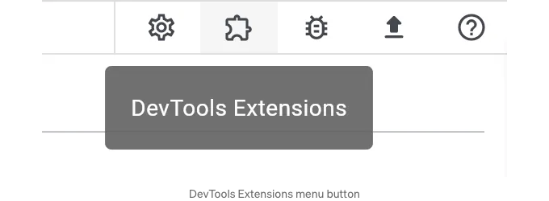

## Dart 및 Flutter DevTools에서 사용자 정의 도구를 만드는 가이드

Dart와 Flutter를 위한 개발 도구를 만들어 보고 싶었지만 어디서부터 시작해야 할 지 모르셨나요? 아니면 실행 중인 Dart 또는 Flutter 애플리케이션과의 연결을 설정하여 디버깅 데이터에 액세스하는 작업을 모두 하고 싶지 않았나요? 그렇다면, 개발 도구를 만들었어도 어떻게 배포하거나 사용자가 쉽게 액세스할 수 있게 할지 고민하셨나요? 당신을 위한 좋은 소식이 있어요: 이제 이러한 장벽 없이 개발 도구를 만들 수 있습니다.

새로운 Dart & Flutter DevTools 확장 프레임워크를 사용하면 기존 DevTools 도구 모음과 밀접하게 통합된 개발 도구를 쉽게 만들 수 있습니다. 확장 프로그램은 Flutter 웹을 사용하여 구축되며, DevTools에서 기존 프레임워크 및 유틸리티를 활용하여 개발 도구 작성 경험을 간소화합니다.


<!-- ui-log 수평형 -->
<ins class="adsbygoogle"
  style="display:block"
  data-ad-client="ca-pub-4877378276818686"
  data-ad-slot="9743150776"
  data-ad-format="auto"
  data-full-width-responsive="true"></ins>
<component is="script">
(adsbygoogle = window.adsbygoogle || []).push({});
</component>

# DevTools 확장 기능은 어떻게 작동하나요?

확장 기능은 pub 패키지의 일부로 제공됩니다. 기존의 pub 패키지에 DevTools 확장 기능을 추가할 수도 있고, DevTools 확장 기능만을 제공하는 새로운 패키지를 만들 수도 있습니다. 이 두 시나리오 모두에서 사용자는 DevTools에서 해당 확장 기능을 보기 위해 해당 DevTools 확장 기능을 제공하는 패키지에 종속성을 명시해야 합니다.

예를 들어, 패키지:foo가 있는 경우를 상상해봅시다. 이 패키지는 DevTools 확장 기능을 제공합니다. 사용자가 앱에서 패키지:foo에 의존성을 가지면, 이 패키지가 제공하는 DevTools 확장 기능에 자동으로 액세스할 수 있습니다. 이 사용자가 DevTools를 사용하여 앱을 디버깅할 때, 패키지:foo에 의해 제공되는 개발자 도구가 포함된 새로운 "Foo" 탭을 볼 수 있습니다.


<!-- ui-log 수평형 -->
<ins class="adsbygoogle"
  style="display:block"
  data-ad-client="ca-pub-4877378276818686"
  data-ad-slot="9743150776"
  data-ad-format="auto"
  data-full-width-responsive="true"></ins>
<component is="script">
(adsbygoogle = window.adsbygoogle || []).push({});
</component>

기존 패키지에 DevTools 확장 기능을 추가한 패키지의 몇 가지 예는 package:provider, package:patrol, 그리고 package:drift입니다.

# DevTools 확장 기능 작성하기: 단계별 가이드

## 시작하기 전에

필요한 것들:

<!-- ui-log 수평형 -->
<ins class="adsbygoogle"
  style="display:block"
  data-ad-client="ca-pub-4877378276818686"
  data-ad-slot="9743150776"
  data-ad-format="auto"
  data-full-width-responsive="true"></ins>
<component is="script">
(adsbygoogle = window.adsbygoogle || []).push({});
</component>

- Flutter SDK `= 3.17.0–0.0.pre & Dart SDK `= 3.2.
- DevTools 확장 프로그램을 추가할 Pub 패키지(기존 또는 신규).

## 단계 1: 패키지 계층구조 설정

### 독립형 확장 프로그램

기존 Dart 패키지에 DevTools 확장 프로그램을 추가하는 경우, 다음 단계인 "확장 프로그램 구성"으로 이동하십시오.

<!-- ui-log 수평형 -->
<ins class="adsbygoogle"
  style="display:block"
  data-ad-client="ca-pub-4877378276818686"
  data-ad-slot="9743150776"
  data-ad-format="auto"
  data-full-width-responsive="true"></ins>
<component is="script">
(adsbygoogle = window.adsbygoogle || []).push({});
</component>

독립적인 DevTools 확장 프로그램을 새 패키지로 만들고 있다면(기존 패키지의 일부가 아닌 경우), 해당 확장 프로그램을 발행할 패키지와 동일한 패키지에서 확장 프로그램을 빌드할 수 있습니다. 확장 프로그램은 Flutter 웹 앱으로 빌드되어야 하므로 다음과 같은 플러터 생성 템플릿을 사용할 수 있습니다:

```js
flutter create --template app --platforms web my_new_tool
```

이제 my_new_tool 패키지를 사용하여 다음 단계에서 확장 프로그램을 구성할 수 있습니다.

## 확장 프로그램 구성

<!-- ui-log 수평형 -->
<ins class="adsbygoogle"
  style="display:block"
  data-ad-client="ca-pub-4877378276818686"
  data-ad-slot="9743150776"
  data-ad-format="auto"
  data-full-width-responsive="true"></ins>
<component is="script">
(adsbygoogle = window.adsbygoogle || []).push({});
</component>

DevTools 확장 기능을 제공할 Dart 패키지에는 사용자에게 제공될 최상위 확장 디렉터리를 추가해주세요:

```js
foo/
  extension/
  lib/
  ...
```

확장 디렉터리 아래에 다음 구조를 생성해주세요 (정확히 아래와 같이):

```js
extension/
  devtools/
    build/
    config.yaml
```

<!-- ui-log 수평형 -->
<ins class="adsbygoogle"
  style="display:block"
  data-ad-client="ca-pub-4877378276818686"
  data-ad-slot="9743150776"
  data-ad-format="auto"
  data-full-width-responsive="true"></ins>
<component is="script">
(adsbygoogle = window.adsbygoogle || []).push({});
</component>

config.yaml 파일에는 DevTools가 확장 프로그램을 로드하는 데 필요한 메타데이터가 포함되어 있어야 합니다:

```js
name: foo
version: 0.0.1
issueTracker: <link_to_your_issue_tracker.com>
materialIconCodePoint: '0xe0b1'
```

위의 config.yaml 파일 콘텐츠를 복사하여 방금 만든 패키지의 config.yaml 파일에 붙여넣으세요. 각 키에 대해 패키지에 적합한 값을 채워넣으세요.

- name: 이 DevTools 확장 프로그램이 속한 패키지 이름. 이 필드의 값은 확장 프로그램 페이지 제목 표시줄에 사용됩니다. [필수]
- version: DevTools 확장 프로그램의 버전. 이 버전 번호는 새로운 기능을 출시할 때마다 진화해야 합니다. 이 필드의 값은 확장 프로그램 페이지 제목 표시줄에 사용됩니다. [필수]
- issueTracker: 문제 추적기의 URL. 사용자가 DevTools UI에서 "문제 신고" 링크를 클릭하면 이 URL로 이동됩니다. [필수]

<!-- ui-log 수평형 -->
<ins class="adsbygoogle"
  style="display:block"
  data-ad-client="ca-pub-4877378276818686"
  data-ad-slot="9743150776"
  data-ad-format="auto"
  data-full-width-responsive="true"></ins>
<component is="script">
(adsbygoogle = window.adsbygoogle || []).push({});
</component>


- materialIconCodePoint: material/icons.dart에서 아이콘의 코드포인트 값을 나타냅니다. 이 아이콘은 상위 수준의 DevTools 탭 막대에 확장 프로그램 탭에 사용됩니다. [필수]


config.yaml 사양에 대한 가장 최신 문서는 extension_config_spec.md를 참조하십시오.

<!-- ui-log 수평형 -->
<ins class="adsbygoogle"
  style="display:block"
  data-ad-client="ca-pub-4877378276818686"
  data-ad-slot="9743150776"
  data-ad-format="auto"
  data-full-width-responsive="true"></ins>
<component is="script">
(adsbygoogle = window.adsbygoogle || []).push({});
</component>

자 이제 확장 프로그램을 만들 차례에요.

## 단계 2: DevTools 확장 프로그램 만들기

DevTools 확장 프로그램은 Flutter 웹 앱으로 작성해야 합니다. 이는 DevTools가 확장 프로그램을 iFrame으로 포함하여 DevTools에서 동적으로 표시하기 때문입니다.

### 확장 프로그램 소스 코드를 넣을 위치

<!-- ui-log 수평형 -->
<ins class="adsbygoogle"
  style="display:block"
  data-ad-client="ca-pub-4877378276818686"
  data-ad-slot="9743150776"
  data-ad-format="auto"
  data-full-width-responsive="true"></ins>
<component is="script">
(adsbygoogle = window.adsbygoogle || []).push({});
</component>

DevTools를로드하려면 확장 프로그램의 사전 컴파일 된 출력 만 Pub 패키지와 함께 배달해야합니다.

독립형 확장 프로그램

기존 Pub 패키지의 일부로서 배포되지 않는 확장 프로그램 (스탠드얼론 확장 프로그램)의 경우, 확장 프로그램이 함께 제공되는 동일한 패키지에 소스 코드를 포함하는 것이 허용됩니다. 이것은 개발을 단순화하고 사용자가 패키지에 대한 dev_dependency로 종속성을 추가할 것이므로 패키지의 크기가 사용자의 앱 크기에 영향을 미치지 않을 것입니다.

```js
my_new_tool
  extension/
    devtools/
      build/
        ...  # lib/ 아래의 Flutter 웹 앱 사전 컴파일 된 출력
      config.yaml
  lib/  # 확장 프로그램의 소스 코드
    src/
      ...
```

<!-- ui-log 수평형 -->
<ins class="adsbygoogle"
  style="display:block"
  data-ad-client="ca-pub-4877378276818686"
  data-ad-slot="9743150776"
  data-ad-format="auto"
  data-full-width-responsive="true"></ins>
<component is="script">
(adsbygoogle = window.adsbygoogle || []).push({});
</component>

기존 패키지의 일부인 확장 기능

패키지 크기를 작게 유지하기 위해 DevTools 확장 기능을 기존 pub 패키지 외부에서 개발하는 것을 권장합니다. 다음과 같은 패키지 구조를 권장합니다:

```js
foo/  # 이전에는 pub 패키지의 루트 디렉터리
  packages/
    foo/  # 귀하의 pub 패키지
      extension/
        devtools/
          build/
            ...  # foo_devtools_extension의 사전 컴파일 된 출력
          config.yaml
    foo_devtools_extension/ # 확장 프로그램의 소스 코드
```

## 확장 프로그램 웹앱 만들기

<!-- ui-log 수평형 -->
<ins class="adsbygoogle"
  style="display:block"
  data-ad-client="ca-pub-4877378276818686"
  data-ad-slot="9743150776"
  data-ad-format="auto"
  data-full-width-responsive="true"></ins>
<component is="script">
(adsbygoogle = window.adsbygoogle || []).push({});
</component>

- 플러터 웹 앱을 만드세요

확장 프로그램 소스 코드가 위치할 디렉토리에서 다음 명령을 실행하여 Flutter 웹 앱을 생성하세요. `your_package_name`_devtools_extension으로 대체해주세요:

```js
flutter create --template app --platforms web foo_devtools_extension
```

2. 플러터 웹 앱에 devtools_extensions 종속성을 추가하세요.

<!-- ui-log 수평형 -->
<ins class="adsbygoogle"
  style="display:block"
  data-ad-client="ca-pub-4877378276818686"
  data-ad-slot="9743150776"
  data-ad-format="auto"
  data-full-width-responsive="true"></ins>
<component is="script">
(adsbygoogle = window.adsbygoogle || []).push({});
</component>

foo_devtools_extension/pubspec.yaml 파일에 다음을 추가해주세요:

```yaml
devtools_extensions: ^0.0.14
```

3. Flutter 웹 앱의 루트에 DevToolsExtension 위젯을 추가해주세요.

foo_devtools_extension/lib/main.dart 파일에 다음을 추가해주세요:

<!-- ui-log 수평형 -->
<ins class="adsbygoogle"
  style="display:block"
  data-ad-client="ca-pub-4877378276818686"
  data-ad-slot="9743150776"
  data-ad-format="auto"
  data-full-width-responsive="true"></ins>
<component is="script">
(adsbygoogle = window.adsbygoogle || []).push({});
</component>

```dart
import 'package:devtools_extensions/devtools_extensions.dart';
import 'package:flutter/material.dart';

void main() {
  runApp(const FooDevToolsExtension());
}

class FooDevToolsExtension extends StatelessWidget {
  const FooDevToolsExtension({Key key}) : super(key: key);

  @override
  Widget build(BuildContext context) {
    return const DevToolsExtension(
      child: Placeholder(), // 여기에 확장 프로그램을 빌드하세요
    );
  }
}
```

DevToolsExtension 위젯은 DevTools와 상호작용하는 데 필요한 모든 확장 초기화를 자동으로 수행합니다. 확장 웹 앱의 어디에서나 다음 글로벌 변수에 액세스할 수 있습니다:

- extensionManager: DevTools 또는 확장 프레임워크와 상호작용하는 매니저
- serviceManager: 연결된 VM 서비스와 상호작용하는 매니저(있는 경우)
- dtdManager: Dart Tooling Daemon과 상호작용하는 매니저(있는 경우)

## 도우미 패키지 활용하기```

<!-- ui-log 수평형 -->
<ins class="adsbygoogle"
  style="display:block"
  data-ad-client="ca-pub-4877378276818686"
  data-ad-slot="9743150776"
  data-ad-format="auto"
  data-full-width-responsive="true"></ins>
<component is="script">
(adsbygoogle = window.adsbygoogle || []).push({});
</component>

패키지 "devtools_app_shared"를 사용하여 서비스 매니저, 일반 위젯, DevTools 테마, 유틸리티 등에 액세스하세요. "devtools_app_shared/example"을 참조하여 샘플 사용법을 확인하세요.

# 단계 3: DevTools 확장 프로그램 디버그하기

DevTools 확장 프로그램을 개발하고 유지 관리할 때는 확장 프로그램의 Flutter 웹 앱을 실행, 디버그 및 테스트해야 합니다. 이를 위해 여러 가지 옵션이 있으며, 아래에서 설명드리겠습니다.

## 옵션 A: 시뮬레이션된 DevTools 환경 사용 (개발에 권장)

<!-- ui-log 수평형 -->
<ins class="adsbygoogle"
  style="display:block"
  data-ad-client="ca-pub-4877378276818686"
  data-ad-slot="9743150776"
  data-ad-format="auto"
  data-full-width-responsive="true"></ins>
<component is="script">
(adsbygoogle = window.adsbygoogle || []).push({});
</component>

디버깅 목적으로는 "시뮬레이션된 DevTools 환경"을 사용하는 것이 좋습니다. 이것은 임베디드 iFrame으로 개발하지 않고도 확장 프로그램을 빌드할 수 있는 시뮬레이션된 환경입니다. 이 방법으로 확장 프로그램을 실행하면 DevTools와의 연결을 시뮬레이션하는 환경으로 확장 프로그램을 래핑합니다. 또한 핫 리스타트 및 빠른 개발 주기에 접근할 수 있습니다.


- 당신의 DevTools 확장 프로그램.
- DevTools 확장 프로그램이 상호 작용할 테스트 앱을 위한 VM 서비스 URI. 이 앱은 확장 프로그램의 상위 패키지(package:foo 예제에서)에 종속되어야 합니다.
- DevTools에서 사용자가 트리거할 수 있는 작업을 수행하는 버튼.
- 확장 프로그램과 DevTools 간에 전송될 메시지를 보여주는 로그.

시뮬레이션된 환경은 use_simulated_environment 환경 매개변수로 활성화됩니다. 이 플래그가 활성화된 상태로 확장 프로그램 웹 앱을 실행하려면 VS code의 launch.json 파일에 구성을 추가하세요.

<!-- ui-log 수평형 -->
<ins class="adsbygoogle"
  style="display:block"
  data-ad-client="ca-pub-4877378276818686"
  data-ad-slot="9743150776"
  data-ad-format="auto"
  data-full-width-responsive="true"></ins>
<component is="script">
(adsbygoogle = window.adsbygoogle || []).push({});
</component>

```js
{
    ...
    "configurations": [
        ...
        {
            "name": "foo_devtools_extension + 시뮬레이션 환경",
            "cwd": "packages/foo_devtools_extension",
            "request": "launch",
            "type": "dart",
            "args": [
                "--dart-define=use_simulated_environment=true"
            ],
        },
    ]
}
```

또는 추가된 플래그와 함께 명령줄에서 앱을 실행할 수 있습니다:

```js
flutter run -d chrome - dart-define=use_simulated_environment=true
```

## 옵션 B: 실제 DevTools 환경 사용하기

<!-- ui-log 수평형 -->
<ins class="adsbygoogle"
  style="display:block"
  data-ad-client="ca-pub-4877378276818686"
  data-ad-slot="9743150776"
  data-ad-format="auto"
  data-full-width-responsive="true"></ins>
<component is="script">
(adsbygoogle = window.adsbygoogle || []).push({});
</component>

확장 기능을 개발하여 실제 DevTools 환경에서 변경 사항을 테스트할 준비가 되면 다음 단계를 수행해야 합니다:

1. Flutter 웹 앱을 빌드하고 your_extension_web_app/build/web 디렉토리에서 빌드된 에셋을 부모 패키지의 확장 디렉토리로 복사합니다(your_pub_package/extension/devtools/build). 이를 수행하려면 package:devtools_extensions에서 build_and_copy 명령을 사용하십시오:

```js
cd your_extension_web_app;
flutter pub get;
dart run devtools_extensions build_and_copy --source=. --dest=path/to/your_pub_package/extension/devtools
```

확장 기능이 DevTools에 로드되도록 올바르게 설정되었는지 확인하려면 package:devtools_extensions에서 validate 명령을 실행하십시오. --package 인자는 해당 기능이 게시될 Dart 패키지의 루트를 가리켜야 합니다.

<!-- ui-log 수평형 -->
<ins class="adsbygoogle"
  style="display:block"
  data-ad-client="ca-pub-4877378276818686"
  data-ad-slot="9743150776"
  data-ad-format="auto"
  data-full-width-responsive="true"></ins>
<component is="script">
(adsbygoogle = window.adsbygoogle || []).push({});
</component>

```js
cd your_extension_web_app;
flutter pub get;
dart run devtools_extensions validate --package=path/to/your_pub_package
```

2. 당신의 패키지에 의존하는 테스트 애플리케이션을 준비하고 실행하세요. 테스트 애플리케이션의 pubspec.yaml 파일에서 패키지에 대한 의존성을 로컬 패키지 소스 코드를 가리키는 경로 의존성으로 변경해야 합니다. 이 작업을 완료한 후에는 테스트 앱에서 flutter pub get을 실행하고 애플리케이션을 실행하세요.

3. DevTools를 시작하세요. 방금 실행한 테스트 애플리케이션으로부터 시작된 DevTools 인스턴스를 열어보세요. DevTools는 명령줄에 출력된 URL이나 테스트 앱을 실행한 IDE에서 DevTools를 열 수 있습니다. 선택적으로 명령줄에서 dart devtools를 실행할 수도 있습니다.

4. 테스트 앱과 DevTools를 연결하세요. 그렇지 않은 경우 DevTools로 연결해야 하며, DevTools 앱 바에 당신의 확장 기능을위한 탭이 표시될 것입니다. 당신의 확장 기능의 활성화 또는 비활성화 상태는 DevTools에 의해 관리됩니다. 확장 기능-활성 상태는 화면 우측 상단의 작업 버튼에서 제공되는 DevTools의 "확장 기능(Extensions)" 메뉴에서 확인할 수 있습니다. 

<!-- ui-log 수평형 -->
<ins class="adsbygoogle"
  style="display:block"
  data-ad-client="ca-pub-4877378276818686"
  data-ad-slot="9743150776"
  data-ad-format="auto"
  data-full-width-responsive="true"></ins>
<component is="script">
(adsbygoogle = window.adsbygoogle || []).push({});
</component>




# 단계 4: DevTools 확장 기능을 포함하여 패키지 게시

패키지가 사용자에게 DevTools 확장 기능을 제공하려면 예상된 내용이 your_pub_package/extension/devtools/ 디렉토리에 포함되어야 합니다(위의 설정 지침 참조).

<!-- ui-log 수평형 -->
<ins class="adsbygoogle"
  style="display:block"
  data-ad-client="ca-pub-4877378276818686"
  data-ad-slot="9743150776"
  data-ad-format="auto"
  data-full-width-responsive="true"></ins>
<component is="script">
(adsbygoogle = window.adsbygoogle || []).push({});
</component>

- "your_pub_package/extension/devtools/config.yaml" 파일이 존재하고 위의 사양에 맞게 구성되어 있는지 확인해주세요.
- 패키지:devtools_extensions에서 제공하는 build_and_copy 명령을 사용하여 확장 기능을 빌드하고 출력물을 extension/devtools 디렉토리로 복사하세요:

```js
cd your_extension_web_app;
flutter pub get;
dart run devtools_extensions build_and_copy --source=. --dest=path/to/your_pub_package/extension/devtools
```

그런 다음 패키지를 pub.dev에 발행하세요: flutter pub publish. pub publish를 실행할 때, config.yaml 파일과 필요한 내용을 갖춘 빌드 디렉토리가 없는 경우 경고가 표시됩니다.

패키지를 발행하는 추가 안내는 패키지:devtools_extensions 발행 가이드를 참조해주세요.

<!-- ui-log 수평형 -->
<ins class="adsbygoogle"
  style="display:block"
  data-ad-client="ca-pub-4877378276818686"
  data-ad-slot="9743150776"
  data-ad-format="auto"
  data-full-width-responsive="true"></ins>
<component is="script">
(adsbygoogle = window.adsbygoogle || []).push({});
</component>

# 결론

그걸로 끝이에요! 이제 사용자가 당신의 패키지의 최신 버전에 의존할 때, 자동으로 DevTools 확장 프로그램에서 제공하는 도구에 액세스할 수 있게 됩니다. 이 기능은 막 나온 것이라서, 여러분의 피드백을 고대하고 있어요.
