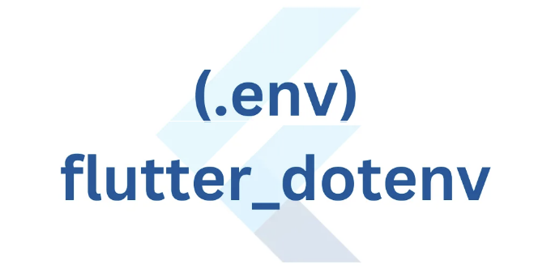

flutter_dotenv은 플러터 애플리케이션에서 .env 파일로부터 환경 변수를 로드할 수 있게 해주는 플러터 패키지입니다. 환경 변수는 API 키, 데이터베이스 자격 증명 또는 기타 민감한 데이터와 같은 구성 정보를 보유하는 키-값 쌍입니다. .env 파일을 사용하면 민감한 정보를 코드베이스와 분리하여 서로 다른 환경(개발, 스테이징, 프로덕션 등)에 대한 다양한 구성을 쉽게 관리할 수 있습니다.

flutter_dotenv를 사용하는 방법에 대한 간단한 소개입니다:

- pubspec.yaml 파일에 flutter_dotenv 패키지를 추가하세요:

<!-- ui-log 수평형 -->
<ins class="adsbygoogle"
  style="display:block"
  data-ad-client="ca-pub-4877378276818686"
  data-ad-slot="9743150776"
  data-ad-format="auto"
  data-full-width-responsive="true"></ins>
<component is="script">
(adsbygoogle = window.adsbygoogle || []).push({});
</component>

```yaml
dependencies:
  flutter_dotenv: ^3.1.0
```

2. 해당 패키지를 가져오려면 flutter pub get을 실행합니다.

3. Flutter 프로젝트의 루트 디렉토리에 .env 파일을 생성합니다. 이 파일에 환경 변수를 KEY=VALUE 형식으로 저장하시면 됩니다. 예를 들면:

```yaml
API_KEY=여기에_당신의_앱_키를_입력하세요
```

<!-- ui-log 수평형 -->
<ins class="adsbygoogle"
  style="display:block"
  data-ad-client="ca-pub-4877378276818686"
  data-ad-slot="9743150776"
  data-ad-format="auto"
  data-full-width-responsive="true"></ins>
<component is="script">
(adsbygoogle = window.adsbygoogle || []).push({});
</component>

4. pubspec.yaml 파일에 .env 파일을 assets에 추가해주세요:

```bash
assets:
    - .env
```

5. Dart 파일에서 flutter_dotenv 패키지를 import 해주세요:

```bash
import 'package:flutter_dotenv/flutter_dotenv.dart';
```

<!-- ui-log 수평형 -->
<ins class="adsbygoogle"
  style="display:block"
  data-ad-client="ca-pub-4877378276818686"
  data-ad-slot="9743150776"
  data-ad-format="auto"
  data-full-width-responsive="true"></ins>
<component is="script">
(adsbygoogle = window.adsbygoogle || []).push({});
</component>

6. .env 파일에서 환경 변수를 로드하세요:

```js
void main() async {
  await dotenv.load();
  runApp(MyApp());
}
```

dotenv.load() 함수는 .env 파일에서 환경 변수를 로드하고 dotenv.env 객체를 통해 이들에 접근할 수 있게 합니다.

7. dotenv.env 객체를 사용하여 코드에서 환경 변수에 액세스하세요:

<!-- ui-log 수평형 -->
<ins class="adsbygoogle"
  style="display:block"
  data-ad-client="ca-pub-4877378276818686"
  data-ad-slot="9743150776"
  data-ad-format="auto"
  data-full-width-responsive="true"></ins>
<component is="script">
(adsbygoogle = window.adsbygoogle || []).push({});
</component>

```js
String apiKey = dotenv.env['API_KEY']!;
```

.env 파일에 제공된 키를 사용하여 환경 변수의 값을 액세스할 수 있습니다. 환경 변수를 찾을 수 없거나 비어있는 경우 기본값을 제공하거나 적절히 처리할 수 있습니다.

flutter_dotenv을 사용하면 민감한 정보를 코드베이스와 분리하고 다양한 구성을 쉽게 관리하며 민감한 데이터가 버전 제어 시스템에서 노출되지 않도록 할 수 있습니다.