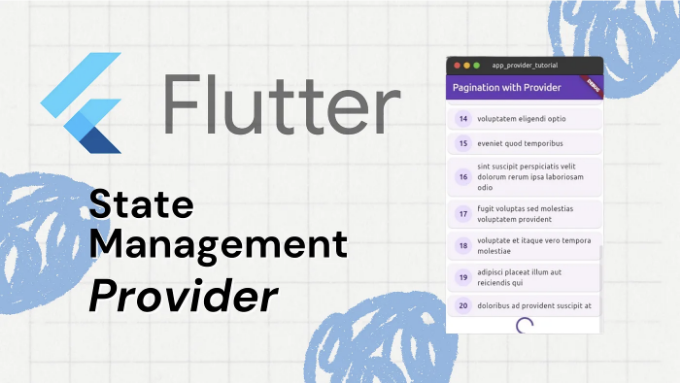

소개

현대 앱 개발에서는 대량의 데이터 세트를 다룰 때 데이터 처리 효율이 매우 중요합니다. Flutter는 강력한 프레임워크를 통해 데이터를 효과적으로 처리할 수 있는 다양한 상태 관리 솔루션을 제공합니다. 그 중에서도 Provider는 간편성과 확장성으로 눈에 띕니다. 이 글에서는 Flutter에서 Provider를 사용하여 API 데이터를 효율적으로 처리하기 위해 페이지네이션을 구현하는 방법을 살펴보겠습니다.

페이지네이션 이해하기

<!-- ui-log 수평형 -->
<ins class="adsbygoogle"
  style="display:block"
  data-ad-client="ca-pub-4877378276818686"
  data-ad-slot="9743150776"
  data-ad-format="auto"
  data-full-width-responsive="true"></ins>
<component is="script">
(adsbygoogle = window.adsbygoogle || []).push({});
</component>

페이지네이션은 대규모 데이터 집합을 작은 관리 가능한 청크로 분할하여 성능과 사용자 경험을 향상시키는 기술입니다. 한꺼번에 모든 데이터를 불러오는 대신, 페이지네이션은 일반적으로 스크롤링이나 버튼 클릭과 같은 사용자 상호작용에 응답하여 데이터를 점진적으로 가져옵니다.

프로젝트 설정하기

구현에 들어가기 전에, Flutter 프로젝트를 설정하고 필요한 종속성을 설치해 보겠습니다. 시스템에 Flutter SDK가 설치되어 있는지 확인해주세요.

```js
flutter create pagination-simple-provider
cd pagination-simple-provider
```

<!-- ui-log 수평형 -->
<ins class="adsbygoogle"
  style="display:block"
  data-ad-client="ca-pub-4877378276818686"
  data-ad-slot="9743150776"
  data-ad-format="auto"
  data-full-width-responsive="true"></ins>
<component is="script">
(adsbygoogle = window.adsbygoogle || []).push({});
</component>

다음으로, `pubspec.yaml` 파일에 필요한 종속성을 추가해주세요:

```yaml
dependencies:
  flutter:
    sdk: flutter
  cupertino_icons: ^1.0.6
  provider: ^6.1.2
  http: ^1.2.1
```

의존성을 설치하려면 `flutter pub get` 명령어를 실행해주세요.

Provider를 이용한 페이지네이션 구현

<!-- ui-log 수평형 -->
<ins class="adsbygoogle"
  style="display:block"
  data-ad-client="ca-pub-4877378276818686"
  data-ad-slot="9743150776"
  data-ad-format="auto"
  data-full-width-responsive="true"></ins>
<component is="script">
(adsbygoogle = window.adsbygoogle || []).push({});
</component>

우리의 페이지네이션 구현을 위한 상태 관리 설정을 이해하는 것으로 시작해봅시다. home_state.dart 파일에서 HomeState 클래스를 정의합니다:

```js
enum HomeStatus { initial, success, error }

class HomeState<T> {
  final HomeStatus status;
  final List<T> contacts;
  final bool hasReachedMax;

  const HomeState({
    this.status = HomeStatus.initial,
    this.contacts = const [],
    this.hasReachedMax = false,
  });

  HomeState<T> copyWith({
    HomeStatus? status,
    List<T>? contacts,
    bool? hasReachedMax,
  }) {
    return HomeState(
      status: status ?? this.status,
      contacts: contacts ?? this.contacts,
      hasReachedMax: hasReachedMax ?? this.hasReachedMax,
    );
  }
}
```

HomeState 클래스는 홈 화면의 상태를 캡슐화합니다. 다음 세 가지 주요 속성을 포함합니다:

- status: HomeStatus enum에 정의된 데이터 검색의 현재 상태를 나타냅니다.
- contacts: 데이터 항목의 목록을 저장하며, 이 경우 연락처와 같은 연락처를 parameterized by type T로 제공하여 저장되는 데이터 유형에 대한 유연성을 제공합니다.
- hasReachedMax: 데이터의 최대 제한이 도달되었는지를 나타냅니다.

<!-- ui-log 수평형 -->
<ins class="adsbygoogle"
  style="display:block"
  data-ad-client="ca-pub-4877378276818686"
  data-ad-slot="9743150776"
  data-ad-format="auto"
  data-full-width-responsive="true"></ins>
<component is="script">
(adsbygoogle = window.adsbygoogle || []).push({});
</component>

생성자는 상태를 초기값으로 설정하며, status는 초기값으로 설정되어 있고, contacts는 빈 목록으로 설정되며, hasReachedMax는 기본적으로 false로 설정됩니다. copyWith 메서드는 속성을 선택적으로 업데이트하여 HomeState의 새 인스턴스를 만드는 데 사용됩니다.

플러터(Flutter)에서 HomePage 클래스는 응용 프로그램의 주 화면을 나타냅니다. 이 클래스는 UI 요소를 표시하고 사용자 상호작용을 처리하는 역할을 담당합니다.

```dart
class HomePage extends StatefulWidget {
  const HomePage({Key key}) : super(key: key);

  @override
  State<HomePage> createState() => _HomePageState();
}

class _HomePageState extends State<HomePage> {
  final _scrollController = ScrollController();

  @override
  void initState() {
    super.initState();
    _scrollController.addListener(_onScroll);
  }

  @override
  void dispose() {
    _scrollController
      ..removeListener(_onScroll)
      ..dispose();
    super.dispose();
  }

  void _onScroll() {
    if (_isBottom) {
      context.read<HomeProvider>().getContacts();
    }
  }

  bool get _isBottom {
    if (!_scrollController.hasClients) return false;
    final maxScroll = _scrollController.position.maxScrollExtent;
    final currentScroll = _scrollController.offset;
    return currentScroll >= (maxScroll * 0.99);
  }

  @override
  Widget build(BuildContext context) {
    // UI 구현
  }
}
```

HomePage 클래스는 StatefulWidget으로 정의되어 있으며, 홈 페이지의 상태를 관리하고 UI를 구성하는 로직을 포함하고 있습니다. 주요 요소에 대한 자세한 설명은 다음과 같습니다:

<!-- ui-log 수평형 -->
<ins class="adsbygoogle"
  style="display:block"
  data-ad-client="ca-pub-4877378276818686"
  data-ad-slot="9743150776"
  data-ad-format="auto"
  data-full-width-responsive="true"></ins>
<component is="script">
(adsbygoogle = window.adsbygoogle || []).push({});
</component>

스크롤 컨트롤러:

- 스크롤 동작을 관리하기 위해 ScrollController 인스턴스가 생성됩니다.
- initState 메서드에서 스크롤 컨트롤러를 초기화하고 스크롤 이벤트를 수신 대기하도록 설정합니다.
- dispose 메서드에서 위젯 트리에서 해당 위젯이 제거될 때 리소스를 해제하기 위해 스크롤 컨트롤러가 해제됩니다.

스크롤 이벤트 처리:

- 사용자가 페이지를 스크롤할 때 _onScroll 메서드가 호출됩니다.
- 사용자가 페이지의 맨 아래로 스크롤했을 경우 (_isBottom), HomeManager의 getContacts 메서드가 호출되어 추가 데이터를 가져옵니다.

<!-- ui-log 수평형 -->
<ins class="adsbygoogle"
  style="display:block"
  data-ad-client="ca-pub-4877378276818686"
  data-ad-slot="9743150776"
  data-ad-format="auto"
  data-full-width-responsive="true"></ins>
<component is="script">
(adsbygoogle = window.adsbygoogle || []).push({});
</component>

도움말 메소드:

- _isBottom은 사용자가 페이지 하단으로 스크롤했는지를 확인하는 도우미 메소드입니다.

```js
return Scaffold(
      // 앱바 구현
      body: Consumer<HomeProvider>(
        builder: (context, state, child) {
          if (state.homeState.status == HomeStatus.initial) {
            return const Center(child: CircularProgressIndicator());
          }
          if (state.homeState.status == HomeStatus.error) {
            return const Center(child: Text("게시물을 가져오는 데 실패했습니다"));
          }
          if (state.homeState.status == HomeStatus.success) {
            if (state.homeState.contacts.isEmpty) {
              return const Center(child: Text("게시물이 없습니다"));
            }
            return ListView.builder(
              controller: _scrollController,
              itemCount: state.homeState.hasReachedMax
                  ? state.homeState.contacts.length
                  : state.homeState.contacts.length + 1,
              itemBuilder: (context, index) {
                return index >= state.homeState.contacts.length
                    ? const Center(
                        child: CircularProgressIndicator(),
                      )
                    : Card(
                        child: ListTile(
                          leading: CircleAvatar(
                            child: Text(
                                state.homeState.contacts[index].id.toString()),
                          ),
                          title: Text(state.homeState.contacts[index].title),
                        ),
                      );
              },
            );
          }
          return const Center(child: CircularProgressIndicator());
        },
      ),
    );
```

구체적으로는 provider 패키지에서 Consumer 위젯을 활용하여 HomeProvider 상태의 변화를 감지하고 UI를 다시 구축합니다.

<!-- ui-log 수평형 -->
<ins class="adsbygoogle"
  style="display:block"
  data-ad-client="ca-pub-4877378276818686"
  data-ad-slot="9743150776"
  data-ad-format="auto"
  data-full-width-responsive="true"></ins>
<component is="script">
(adsbygoogle = window.adsbygoogle || []).push({});
</component>

이니셜 상태

- HomeProvider 내의 HomeState 상태가 초기 상태인지 확인합니다.
- 상태가 초기 상태인 경우, 데이터를 가져오는 중임을 나타내는 화면 중앙에 배치된 CircularProgressIndicator 위젯을 반환합니다.

에러 상태

- HomeState의 상태가 오류 상태인지 확인합니다.
- 상태가 오류 상태인 경우, 데이터를 가져오는 동안 오류가 발생했음을 나타내는 "게시물을 가져오는 데 실패했습니다" 메시지가 화면 중앙에 있는 Text 위젯으로 반환됩니다.

<!-- ui-log 수평형 -->
<ins class="adsbygoogle"
  style="display:block"
  data-ad-client="ca-pub-4877378276818686"
  data-ad-slot="9743150776"
  data-ad-format="auto"
  data-full-width-responsive="true"></ins>
<component is="script">
(adsbygoogle = window.adsbygoogle || []).push({});
</component>

성공 상태

- 상태가 성공이고 표시할 게시물이 있는 경우, ListView.builder 위젯을 반환합니다.
- ListView.builder는 연락처 리스트의 길이에 기반하여 위젯 목록을 동적으로 생성합니다.
- 사용자가 목록 끝까지 스크롤하면(인덱스`= state.homeState.contacts.length`), 데이터가 더 가져와지고 있다는 의미로 중앙에 CircularProgressIndicator 위젯이 표시됩니다.
- 그 외의 경우, 각 게시물에 대해 Card 위젯을 구성하며, 게시물의 ID와 제목을 각각 CircleAvatar와 Text 위젯을 사용하여 표시합니다.

```js
class HomeProvider with ChangeNotifier {
  final _postLimit = 20;

  var homeState = const HomeState<Post>();

  Future<void> getContacts() async {
    // 연락처 목록을 가져오는 구현
  }

  // api 데이터 가져오기
  Future<List<Post>> _fetchPosts([int startIndex = 0]) async {
    // http 클라이언트를 사용하여 api 데이터를 가져오는 구현
  }
}
```

- HomeProvider 클래스는 ChangeNotifier로 정의되어 있어 상태가 변경될 때 청취자(일반적으로 UI 구성 요소)에게 알릴 수 있습니다.
- 가져올 게시물의 최대 수를 나타내는 _postLimit 상수가 있습니다.
- homeState 변수는 홈 화면의 현재 상태를 유지합니다. 초기에는 비어 있는 상태(HomeStatus.initial)로 설정되어 있으며, 연락처가 없고 최대 제한에 도달하지 않습니다.

<!-- ui-log 수평형 -->
<ins class="adsbygoogle"
  style="display:block"
  data-ad-client="ca-pub-4877378276818686"
  data-ad-slot="9743150776"
  data-ad-format="auto"
  data-full-width-responsive="true"></ins>
<component is="script">
(adsbygoogle = window.adsbygoogle || []).push({});
</component>

```js
Future<void> getContacts() async {
  try {
    if (homeState.status == HomeStatus.initial) {
      final posts = await _fetchPosts();
      homeState = homeState.copyWith(
        status: HomeStatus.success,
        contacts: posts,
        hasReachedMax: posts.length < _postLimit,
      );
    } else {
      final posts = await _fetchPosts(homeState.contacts.length);
      homeState = homeState.copyWith(
        status: HomeStatus.success,
        contacts: List.of(homeState.contacts)..addAll(posts),
        hasReachedMax: posts.length < _postLimit,
      );
    }

    notifyListeners();
  } catch (e) {
    homeState = homeState.copyWith(
      status: HomeStatus.error,
    );
    notifyListeners();
  }
}
```

- getContacts 메서드는 데이터를 가져오는 역할을 합니다. 이 메서드는 비동기적으로 작동하여 데이터를 가져올 때 메인 UI 스레드를 차단하지 않습니다.
- 이 메서드 내부에서는 homeState의 현재 상태를 확인합니다. 초기 상태인 경우, _fetchPosts를 사용하여 초기 데이터를 가져와 homeState를 업데이트합니다. 그렇지 않은 경우, 현재 연락처 목록을 기반으로 추가 데이터를 가져옵니다.
- homeState를 업데이트한 후, notifyListeners()를 사용하여 상태 변경을 청취자에게 알립니다.

```js
Future<List<Post>> _fetchPosts([int startIndex = 0]) async {
  await Future.delayed(const Duration(seconds: 1));
  final response = await client.get(
    Uri.https(
      'jsonplaceholder.typicode.com',
      '/posts',
      <String, String>{'_start': '$startIndex', '_limit': '$_postLimit'},
    ),
  );
  if (response.statusCode == 200) {
    final body = json.decode(response.body) as List;
    return body
        .map((dynamic json) => Post.fromJson(json as Map<String, dynamic>))
        .toList();
  }
  throw Exception('error fetching posts');
}
```

- _fetchPosts 메서드는 API에서 게시물을 가져오기 위해 HTTP 요청을 수행하는 비공개 메서드입니다.
- 응답 상태 코드가 200인 경우 (성공을 나타냄), 응답 본문을 JSON에서 게시물 목록으로 디코딩합니다.
- 그런 다음 각 JSON 객체를 Post.fromJson을 사용하여 Post 객체로 매핑합니다.```

<!-- ui-log 수평형 -->
<ins class="adsbygoogle"
  style="display:block"
  data-ad-client="ca-pub-4877378276818686"
  data-ad-slot="9743150776"
  data-ad-format="auto"
  data-full-width-responsive="true"></ins>
<component is="script">
(adsbygoogle = window.adsbygoogle || []).push({});
</component>

요약하면, HomeProvider 클래스는 홈 화면과 관련된 데이터를 가져오고 관리하는 로직을 캡슐화합니다. 이 클래스는 ChangeNotifier 패턴을 사용하여 상태 변화 시 해당 리스너(UI 구성 요소)에게 알림을 보내어 반응형 UI 업데이트를 가능하게 합니다.

어플리케이션을 실행하기 전에 메인 함수 내에서 클래스와 프로바이더를 설정하는 것이 중요합니다. 이렇게 함으로써 어플리케이션을 원활하게 실행하고 충돌이나 버그 없는 경험을 제공할 수 있습니다.

```js
return MaterialApp(
  home: ChangeNotifierProvider(
    create: (context) => HomeProvider()..getContacts(),
    child: const HomePage(),
  ),
);
```

ChangeNotifierProvider의 create 매개변수는 HomeProvider 클래스를 인스턴스화하고 즉시 초기 데이터를 가져 오기 위해 그 getContacts() 메서드를 호출하는 데 사용됩니다. 이 create 매개변수는 제공된 클래스(여기서는 HomeProvider)의 인스턴스를 반환하는 함수를 기대합니다.

<!-- ui-log 수평형 -->
<ins class="adsbygoogle"
  style="display:block"
  data-ad-client="ca-pub-4877378276818686"
  data-ad-slot="9743150776"
  data-ad-format="auto"
  data-full-width-responsive="true"></ins>
<component is="script">
(adsbygoogle = window.adsbygoogle || []).push({});
</component>

자 이제 앱을 시험해봄으로써 우리가 구현한 것을 확인해 보겠습니다.


결론

페이지네이션을 채택함으로써 개발자들은 다음과 같은 이점을 얻을 수 있습니다:

<!-- ui-log 수평형 -->
<ins class="adsbygoogle"
  style="display:block"
  data-ad-client="ca-pub-4877378276818686"
  data-ad-slot="9743150776"
  data-ad-format="auto"
  data-full-width-responsive="true"></ins>
<component is="script">
(adsbygoogle = window.adsbygoogle || []).push({});
</component>

- 성능 향상: 페이지네이션을 통해 데이터를 작은 청크로 가져와 표시함으로써 앱과 서버에 가해지는 부하를 줄여 응답 시간을 빠르게 하고 사용자 상호작용을 더 부드럽게 만들 수 있습니다.
- 사용자 경험 향상: 데이터를 관리 가능한 페이지로 분할함으로써 사용자가 콘텐츠를 더 쉽게 탐색할 수 있게 되어 정보 과부하를 방지하고 더 즐거운 탐색 경험을 제공할 수 있습니다.
- 유지보수 간단화: 데이터 검색 및 표시 로직을 작은 모듈화된 구성 요소로 분리하여 코드를 이해하고 유지보수하고 디버깅하기 쉽게 하여 종합적으로 프로젝트의 확장성에 기여합니다.

그러나 잠재적인 단점을 고려하는 것도 중요합니다:

- 복잡성: 페이지네이션을 구현하기 위해서는 페이지 상태와 내비게이션을 관리하는 추가 로직이 필요할 수 있습니다. 특히 큰 프로젝트에서는 복잡성이 증가할 수 있습니다.
- 서버 측 요구 사항: 페이지네이션은 데이터를 효율적으로 검색하기 위해 서버 측 지원을 필요로 합니다. 백엔드 API가 페이지별 요청을 처리할 수 있는지 확인해야 합니다.

마지막으로, Flutter 애플리케이션에서 API 데이터를 관리하기 위한 Provider를 사용한 페이지네이션은 많은 이점을 제공하지만, 개발자는 잠재적인 복잡성과 백엔드 요구 사항과 대조해야 합니다. 애플리케이션의 요구 사항을 신중하게 고려하고 Flutter의 유연성을 활용하여 사용자에게 효율적이고 사용하기 쉬운 경험을 제공할 수 있습니다. 즐거운 코딩 되세요!

<!-- ui-log 수평형 -->
<ins class="adsbygoogle"
  style="display:block"
  data-ad-client="ca-pub-4877378276818686"
  data-ad-slot="9743150776"
  data-ad-format="auto"
  data-full-width-responsive="true"></ins>
<component is="script">
(adsbygoogle = window.adsbygoogle || []).push({});
</component>

