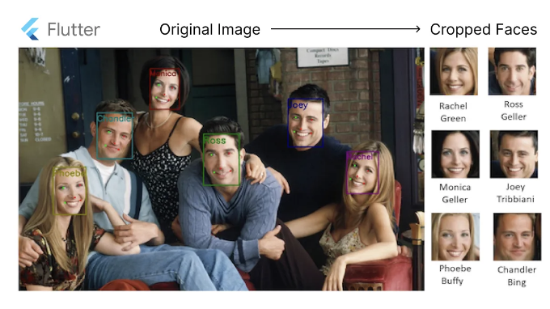

소개:
Flutter 앱 개발에서 이미지에서 잘라낸 얼굴을 부드러운 UI 성능을 유지하면서 효율적으로 표시하는 것은 계산 집약적인 작업인 이미지 자르기와 같은 작업이 포함된 경우에는 어려울 수 있습니다. 그러나 추가 계산 오버헤드 없이 자른 얼굴을 즉시 표시할 수 있는 해결책이 있습니다. 이 기사에서는 Flutter를 사용하여 이를 달성하기 위한 메모리 및 성능 최적화 접근 방식을 살펴보겠습니다.

해결책 개요:
기존에는 Flutter에서 이미지 자르기는 계산 집약적인 작업을 포함하여 주 스레드에서 실행될 때 UI 지터를 유발할 수 있는 작업입니다. 이미지 자르기 작업을 별도의 고립체에서 실행하면 이 문제를 어느 정도 완화할 수 있지만 여전히 처리 시간이 소요됩니다. 게다가 많은 경우, 자른 얼굴을 표시하는 것은 프론트엔드 특정 요구 사항이며, 자른 이미지를 백엔드로 보내는 필요성을 제거합니다.

이러한 도전에 대처하기 위해 추가 계산 오버헤드 없이 이미지에서 효과적으로 자른 얼굴을 표시하기 위해 Flutter의 능력을 활용하는 솔루션을 구현할 것입니다.

<!-- ui-log 수평형 -->
<ins class="adsbygoogle"
  style="display:block"
  data-ad-client="ca-pub-4877378276818686"
  data-ad-slot="9743150776"
  data-ad-format="auto"
  data-full-width-responsive="true"></ins>
<component is="script">
(adsbygoogle = window.adsbygoogle || []).push({});
</component>

### 단계 1: 원본 이미지에서 ui.Image 객체 가져오기

우리는 도우미 함수 `ImageUtils.getUiImage()`를 만들어 시작합니다. 이 함수는 네트워크 URL이나 로컬 파일 경로에서 원본 이미지로부터 `ui.Image` 객체를 비동기적으로 가져옵니다. 이 함수는 Flutter의 `ImageProvider`와 `Completer`를 활용하여 이미지 데이터를 효율적으로 가져옵니다.

```js
class ImageUtils {
  static Future<ui.Image> getUiImage({
    String? imageUrl,
    String? imagePath,
  }) async {
    Completer<ImageInfo> completer = Completer();
    ImageProvider? img;
    if (imageUrl != null) {
      img = NetworkImage(imageUrl);
    } else if (imagePath != null) {
      img = FileImage(File(imagePath));
    }
    img
        ?.resolve(const ImageConfiguration())
        .addListener(ImageStreamListener((ImageInfo info, bool _) {
      completer.complete(info);
    }));
    ImageInfo imageInfo = await completer.future;
    return imageInfo.image;
  }
}
```

### 단계 2: CustomPainter를 사용한 얼굴 이미지 그리기

다음으로 `FaceImagePainter` 클래스를 정의합니다. 이 클래스는 `CustomPainter`를 확장합니다. 이 사용자 지정 페인터는 원본 `ui.Image` 객체와 감지된 얼굴 영역을 나타내는 `Rect`를 가져옵니다. `paint()` 메서드 내에서 우리는 캔버스에 크롭된 얼굴을 그려서 불필요한 계산을 최소화합니다.

```js
class FaceImagePainter extends CustomPainter {
  ui.Image resImage;

  Rect rectCrop;

  FaceImagePainter(this.resImage, this.rectCrop);

  @override
  void paint(Canvas canvas, Size size) {
    final Rect rect = Offset.zero & size;
    final Size imageSize =
        Size(resImage.width.toDouble(), resImage.height.toDouble());
    FittedSizes sizes = applyBoxFit(BoxFit.cover, imageSize, size);

    Rect inputSubRect = rectCrop;
    final Rect outputSubRect =
        Alignment.center.inscribe(sizes.destination, rect);

    final paint = Paint()
      ..color = Colors.white
      ..style = PaintingStyle.fill
      ..strokeWidth = 4;
    canvas.drawRect(rect, paint);

    canvas.drawImageRect(resImage, inputSubRect, outputSubRect, Paint());
  }

  @override
  bool shouldRepaint(CustomPainter oldDelegate) {
    return false;
  }
}
```

<!-- ui-log 수평형 -->
<ins class="adsbygoogle"
  style="display:block"
  data-ad-client="ca-pub-4877378276818686"
  data-ad-slot="9743150776"
  data-ad-format="auto"
  data-full-width-responsive="true"></ins>
<component is="script">
(adsbygoogle = window.adsbygoogle || []).push({});
</component>

3단계: 얼굴 크로퍼 위젯 만들기
마지막으로 `FaceCropperWidget`을 만들어보겠습니다. 이 위젯은 잘라낸 얼굴을 효율적으로 표시하는 메모리 및 성능 효율적인 위젯으로, 잘라낸 얼굴을 추가 계산 없이 즉시 렌더링하는 데 필요한 로직을 캡슐화합니다. 이 위젯은 이전에 정의된 도우미 함수와 사용자 정의 페인터를 활용하여 잘라낸 얼굴을 추가 계산을 기다리지 않고 즉시 렌더링합니다.

```js
class FaceCropperWidget extends StatelessWidget {
  final String? imagePath;
  final String? imageUrl;
  final Rect faceRect;
  final double? width;
  final double? height;
  final BoxShape? shape;
  const FaceCropperWidget({
    super.key,
    this.imagePath,
    this.imageUrl,
    required this.faceRect,
    this.width,
    this.height,
    this.shape,
  });

  @override
  Widget build(BuildContext context) {
    return Container(
      clipBehavior: Clip.hardEdge,
      width: width,
      height: height,
      decoration: BoxDecoration(
        shape: shape ?? BoxShape.rectangle,
      ),
      alignment: Alignment.center,
      child: FutureBuilder(
        future: ImageUtils.getUiImage(
          imageUrl: imageUrl,
          imagePath: imagePath,
        ),
        builder: (context, snapshot) {
          if (snapshot.connectionState == ConnectionState.done &&
              snapshot.data != null) {
            // If the Future is complete, display the preview.
            return paintImage(snapshot.data!);
          } else {
            // Otherwise, display a loading indicator.
            return const CircularProgressIndicator();
          }
        },
      ),
    );
  }

  Widget paintImage(ui.Image image) {
    return CustomPaint(
      painter: FaceImagePainter(
        image,
        faceRect,
      ),
      child: SizedBox(
        width: faceRect.width,
        height: faceRect.height,
      ),
    );
  }
}
```

결론:
이 접근 방식을 따르면 Flutter 개발자들은 이미지에서 잘라낸 얼굴을 효과적으로 표시할 수 있으며 추가 계산 부담이 없습니다. 이 솔루션은 UI 성능을 향상시키는 데 그치지 않고, 특히 실시간 얼굴 감지 및 표시 기능이 필요한 애플리케이션에서 사용자 경험을 좀 더 원할하게 제공합니다. 이러한 최적화된 기술을 통합함으로써 Flutter 애플리케이션의 반응 성능과 효율성을 크게 향상시킬 수 있으며, 최종 사용자에게 더 부드러운 상호 작용을 보장합니다.