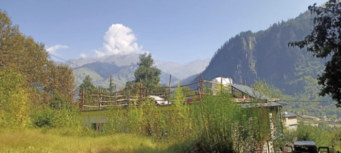

미디어 캡처 장치: 비디오 카메라, 마이크, 및 화면 캡처 기능과 같은 미디어 캡처 장치는 실시간 커뮤니케이션 경험을 용이하게 하는 데 중요합니다. WebRTC는 이러한 장치에 접근하기 위한 API를 제공합니다.

I. 비디오 카메라와 마이크: 카메라와 마이크로부터 비디오 및 오디오 스트림을 캡처하는 경우, 개발자는 navigator.mediaDevices.getUserMedia() 함수를 활용합니다. 이 API는 사용자에게 디바이스 접근 허가를 요청하고 애플리케이션에 해당하는 미디어 스트림 접근을 제공합니다.

```js
navigator.mediaDevices.getUserMedia({ video: true, audio: true })
  .then(function(stream) {
    // 스트림 다루기, 예를 들어 비디오 요소에 표시
    var videoElement = document.getElementById('video');
    videoElement.srcObject = stream;
  })
  .catch(function(error) {
    console.log('미디어 장치 접근 오류: ' + error.message);
  });
```

<!-- ui-log 수평형 -->
<ins class="adsbygoogle"
  style="display:block"
  data-ad-client="ca-pub-4877378276818686"
  data-ad-slot="9743150776"
  data-ad-format="auto"
  data-full-width-responsive="true"></ins>
<component is="script">
(adsbygoogle = window.adsbygoogle || []).push({});
</component>

II. 화면 캡처: 카메라와 마이크에 추가로 WebRTC를 사용하면 발표나 원격 지원과 같은 활동을 위해 화면 콘텐츠를 캡처할 수 있습니다. navigator.mediaDevices.getDisplayMedia() 함수가 이를 위해 사용됩니다.

```js
navigator.mediaDevices.getDisplayMedia({ video: true })
  .then(function(stream) {
    // 화면 스트림 처리
  })
  .catch(function(error) {
    console.log('화면 캡처에 오류가 발생했습니다: ' + error.message);
  });
```

1. P2P 연결: WebRTC는 직접 피어 투 피어 연결을 용이하게 하는데, 이를 통해 브라우저 간에 중개없이 통신할 수 있습니다. RTCPeerConnection 인터페이스는 이러한 연결을 설정하고 관리하는 핵심 역할을 합니다.

I. RTCPeerConnection 인터페이스: 이 인터페이스는 WebRTC 세션에서 두 피어 간의 연결을 설정하고 제어하는 역할을 합니다. 개발자는 이를 사용하여 세션 매개변수 협상, 미디어 스트림 교환, 암호화 및 대역폭 관리를 포함한 통신 프로세스의 다양한 측면을 관리합니다.

<!-- ui-log 수평형 -->
<ins class="adsbygoogle"
  style="display:block"
  data-ad-client="ca-pub-4877378276818686"
  data-ad-slot="9743150776"
  data-ad-format="auto"
  data-full-width-responsive="true"></ins>
<component is="script">
(adsbygoogle = window.adsbygoogle || []).push({});
</component>

```js
// 새로운 RTCPeerConnection을 만듭니다
var peerConnection = new RTCPeerConnection();

// 로컬 스트림을 피어 연결에 추가합니다
peerConnection.addStream(localStream);

// ICE 후보 및 협상 필요 이벤트 핸들러 설정
peerConnection.onicecandidate = function(event) {
  if (event.candidate) {
    // ICE 후보를 원격 피어에게 보냅니다
  }
};

peerConnection.onnegotiationneeded = function() {
  // 협상 프로세스 시작
  peerConnection.createOffer()
    .then(function(offer) {
      return peerConnection.setLocalDescription(offer);
    })
    .then(function() {
      // 제안을 원격 피어에게 보냅니다
    })
    .catch(function(error) {
      console.log('제안 생성 중 오류 발생: ' + error.message);
    });
};
```

II. 시그널링: WebRTC에서 피어 간 연결을 설정하는 과정은 시그널링을 포함합니다. 시그널링은 통신 세션을 시작하고 관리하기 위해 필요한 메타데이터를 교환하는 것을 포함합니다. 이 메타데이터에는 세션 설명 프로토콜(SDP) 정보와 ICE 후보가 포함됩니다.

WebRTC 문서에서 제공한 예제에서는 시그널링을 WebSocket 서버를 사용하여 시뮬레이션합니다. WebSocket 서버는 세션 설명 제안 및 응답을 교환하기 위한 시그널링 채널 역할을 합니다.

```js
// 원격 피어에게 SDP 제안을 보냅니다
// 피어 연결 설정 중 사용될 비동기 통신 채널을 설정합니다
const signalingChannel = new SignalingChannel(remoteClientId);
signalingChannel.addEventListener('message', message => {
    // 원격 클라이언트로부터 새로운 메시지 수신
});

// 원격 클라이언트에게 비동기 메시지를 보냅니다
signalingChannel.send('안녕하세요!');
```

<!-- ui-log 수평형 -->
<ins class="adsbygoogle"
  style="display:block"
  data-ad-client="ca-pub-4877378276818686"
  data-ad-slot="9743150776"
  data-ad-format="auto"
  data-full-width-responsive="true"></ins>
<component is="script">
(adsbygoogle = window.adsbygoogle || []).push({});
</component>

III. RTCConfiguration: RTCConfiguration은 ICE 서버 및 미디어 제한과 같은 WebRTC 설정을 구성하는 데 사용되는 JavaScript 객체입니다. 이러한 설정은 WebRTC가 피어 간 연결을 설정하고 유지하는 방법을 결정합니다.

```js
var configuration = {
    iceServers: [
        { urls: 'stun:stun.example.org' },
        { urls: 'turn:turn.example.org', username: 'user', credential: 'password' }
    ]
};

var peerConnection = new RTCPeerConnection(configuration);
```

IV. ICE Candidates: ICE(Interactive Connectivity Establishment) Candidates는 WebRTC에 의해 발견된 네트워크 엔드포인트로, 피어 간의 직접 통신 경로를 설정하기 위해 교환되는 후보자입니다.

```js
// 로컬 RTCPeerConnection에서 로컬 ICE 후보를 수신
peerConnection.addEventListener('icecandidate', event => {
    if (event.candidate) {
        signalingChannel.send({'new-ice-candidate': event.candidate});
    }
});

// 원격 ICE 후보를 수신하고 로컬 RTCPeerConnection에 추가
signalingChannel.addEventListener('message', async message => {
    if (message.iceCandidate) {
        try {
            await peerConnection.addIceCandidate(message.iceCandidate);
        } catch (e) {
            console.error('수신한 ICE 후보 추가 중 오류 발생', e);
        }
    }
});
```

<!-- ui-log 수평형 -->
<ins class="adsbygoogle"
  style="display:block"
  data-ad-client="ca-pub-4877378276818686"
  data-ad-slot="9743150776"
  data-ad-format="auto"
  data-full-width-responsive="true"></ins>
<component is="script">
(adsbygoogle = window.adsbygoogle || []).push({});
</component>

V: Trickle ICE: ICE 후보가 수집될 때마다 교환되어 모든 후보가 수집된 후에 교환될 때보다 연결 설정 프로세스가 빨라질 수 있는 기술입니다.

```js
// 로컬 RTCPeerConnection에서 로컬 ICE 후보를 청취합니다
peerConnection.addEventListener('icecandidate', event => {
    if (event.candidate) {
        signalingChannel.send({'new-ice-candidate': event.candidate});
    }
});

// 원격 ICE 후보를 청취하고 로컬 RTCPeerConnection에 추가합니다
signalingChannel.addEventListener('message', async message => {
    if (message.iceCandidate) {
        try {
            await peerConnection.addIceCandidate(message.iceCandidate);
        } catch (e) {
            console.error('수신된 ICE 후보 추가 중 오류 발생', e);
        }
    }
});
```

VI: 연결 설정 완료: ICE 후보가 교환되고 연결성 확인이 성공하면 WebRTC 연결이 설정되어 동료 간 실시간 통신이 가능해집니다.

```js
// 로컬 RTCPeerConnection의 connectionstatechange를 청취합니다
peerConnection.addEventListener('connectionstatechange', event => {
    if (peerConnection.connectionState === 'connected') {
        // 동료들이 연결되었습니다!
    }
});
```

<!-- ui-log 수평형 -->
<ins class="adsbygoogle"
  style="display:block"
  data-ad-client="ca-pub-4877378276818686"
  data-ad-slot="9743150776"
  data-ad-format="auto"
  data-full-width-responsive="true"></ins>
<component is="script">
(adsbygoogle = window.adsbygoogle || []).push({});
</component>

다음 기사 주제:

- 웹RTC에서 원격 스트림 탐색: 웹RTC 세션에서 원격 피어로부터 수신된 미디어 스트림을 다루고 표시하는 방법을 이해합니다.
- 웹RTC 애플리케이션에서 데이터 채널 활용: 피어 간 양방향 데이터 교환을 위한 데이터 채널의 생성, 구성 및 사용에 대해 탐구합니다.

다음 기사에서 이러한 주제를 다루면 독자들은 원격 스트림과 데이터 채널을 웹RTC 애플리케이션에 통합하는 방법에 대해 더 깊이 이해할 수 있으며, 실시간 통신 경험의 풍부함과 다양성을 향상시킬 수 있습니다.