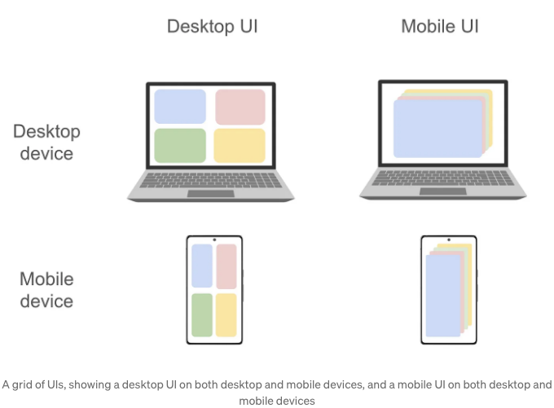
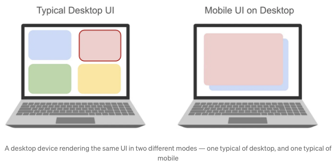

Google Earth이 모바일 및 웹 클라이언트를 Flutter로 다시 작성하기로 결정할 때, 그들은 사용자가 행성을 자유롭게 탐험할 수 있도록 하기를 원했습니다. 그들은 각 사용자가 소유한 장치에서 어떻게든 행성을 탐험할 수 있도록 제공하고 싶었습니다. 이는 어느 정도로 오래 동안 사실이었습니다. 결국 Google Earth는 기존의 웹, 데스크톱, 안드로이드 및 iOS 클라이언트를 보유하고 있었기 때문입니다. 그러나 이번 재작성은 데스크톱을 제외한 모든 대상을 다룰 것이며, 기존 사용 사례의 초과 지원 뿐만 아니라 Earth 팀이 탐색할 열정적인 새로운 적응 아이디어를 지원해야 했습니다.

Google Earth의 미래 기술 스택 탐색 작업은 기존 클라이언트 개발을 느리게 만든 친숙한 마찰 원인에 크게 영향을 받았습니다. 구글 어스는 새로운 기능에 대한 개발 속도와 웹, 안드로이드, iOS 세 고유한 코드베이스 간의 기능 동등성 유지 사이에서 선택해야 했습니다. 다행히 UI의 중심 - 화면 중앙의 온전한 청량한 파란 점 - 은 C++ 엔진에 의해 제공되어 이미 Google Earth 일부 기능에 대한 통합된 경험을 제공했습니다. 그러나 나머지 UI 크롬과 메뉴는 각 코드베이스 별로 구현되었습니다. 이는 모든 플랫폼 선택이 UI 개발 프로세스를 전환할 뿐만 아니라 안드로이드, iOS 및 웹의 거대한 레거시 엔진과 통합해야 한다는 것을 의미했습니다.

Flutter를 사용하는 결정적인 요인은 두 가지였습니다. 첫째, 기존의 Google Earth 엔진과의 통합이 method 채널을 이용하여 간단한 작업임이 입증되었습니다. 둘째, Google Earth는 코드베이스를 단순화하는 것뿐만 아니라 UI를 완전히 새롭게 구상하길 원했습니다. 주요한 UI 개편은 이미 재작성의 일부이며, Google Earth는 기존 앱을 수정하는 대신 새로운 Flutter 앱을 작성하기로 선택했습니다. 이로 인해 작업이 복잡해졌지만, 팀은 깔끔한 전환과 적응성에 집중하기로 했습니다. 결과적으로 Google Earth 팀은 Flutter를 사용하여 세 플랫폼에서 UI를 구현했습니다.

# 적응성 정의하기

<!-- ui-log 수평형 -->
<ins class="adsbygoogle"
  style="display:block"
  data-ad-client="ca-pub-4877378276818686"
  data-ad-slot="9743150776"
  data-ad-format="auto"
  data-full-width-responsive="true"></ins>
<component is="script">
(adsbygoogle = window.adsbygoogle || []).push({});
</component>

그래서 Google Earth 팀은 UI 적응성의 한계를 뛰어넘기 위한 모험을 떠났습니다. 다양한 사용자 여정에 맞춘 UI를 만드는 데 대한 선행 기술은 스마트폰 등장 초기부터 존재하였고, 대부분의 웹사이트가 작은 화면을 위해 재검토가 필요하다는 사실을 깨닫게 했습니다. 브라우저 API 및 CSS 패턴이 등장하여 화면 해상도를 인식하는 웹사이트를 구축하는데 사용되었고, 이러한 아이디어들은 그 후 계속해서 주목을 받고 있습니다. Flutter 초기 단계에서부터 개발자들은 폰 화면이 다양할 것이라는 사실을 알고 앱의 UI를 화면 해상도에 따라 다르게 만들었습니다. 그 화면 해상도가 변경되어도 — 사용자가 폰을 회전시키거나 브라우저 창의 크기를 조절한 경우와 같이 — 앱의 UI는 응답할 것입니다. Flutter에서는 수년 전 웹에서와 마찬가지로 반응형 UI가 사용자 경험을 개선했습니다.

이에 대해 궁금해하실 수도 있습니다. 반응형 UI와 적응형 UI 사이에는 무슨 차이가 있는 것일까요? 간단히 말하면, 반응형 UI는 사용 가능한 픽셀의 양과 종횡비의 변경에 적응하지만, 적응형 UI는 그 외의 모든 것에 적응합니다. 반응형 UI는 화면 부동산 세부 사항에 따라 개별 UI 요소를 확대 또는 축소할 수 있지만, 적응형 UI는 앱의 탐색을 어디에 렌더링해야 하는지, 목록 보기가 별도의 세부보기로 이동해야 하는지 또는 목록 자체와 함께 옆에 표시되어야 하는지와 같은 더 기본적인 질문에 대답합니다. 또한 사용자의 연결된 주변 장치가 탭 대상 및 호버 상태와 같은 것들에 어떻게 영향을 미쳤는지에 대해서도 대답합니다.

웹 사이트용 반응형 CSS를 작성한 경험이 있는 사람이라면, 심지어 간단한 UI도 까다로운 예외 상황이 발생할 수 있다고 말할 것입니다. 그리고 명확하게 말하자면, 이는 CSS의 잘못이 아닙니다; 문제의 영역은 그 상태가 매우 미세하고 거의 아날로그일 정도로 섬세합니다. 그렇다면, 장치 형태 요소 및 연결된 주변 장치와 같은 여러 추가 변수를 고려할 때, UI 개발자는 무엇을 기대해야 할까요? 당연히 복잡성이 증가할 것을 예상해야 합니다.

그 모든 것이 Google Earth 팀을 놀라게 한 초기 프로토 타입의 동작에서 정점에 이르렀습니다. 이들은 초기 빌드로 재미있는 시간을 보내던 중 구글 어스 엔지니어가 데스크톱 웹 브라우저를 매우 좁은 폭으로 축소했다. 갑자기, 사이드 탐색 바와 더 작은 터치 대상과 같은 전형적인 데스크톱 특성들이 모바일 특성인 하단 탐색 바와 더 큰, 손으로 누르기 쉬운 버튼으로 대체되었습니다. 그들의 놀라움은 잠깐이었고 — 결국, 그들이 앱에 요청한 것이 바로 그것이었기 때문이었습니다. Google Earth 팀은 이제 깊이 있는 질문을 다루어야 했습니다 — 사용자들이 이것을 원할까?

<!-- ui-log 수평형 -->
<ins class="adsbygoogle"
  style="display:block"
  data-ad-client="ca-pub-4877378276818686"
  data-ad-slot="9743150776"
  data-ad-format="auto"
  data-full-width-responsive="true"></ins>
<component is="script">
(adsbygoogle = window.adsbygoogle || []).push({});
</component>

Google Earth 팀이 차트를 그려낼 미지의 땅이었습니다.

# 왜 적응성이 중요한가요?

일부 사람들에게는 다음 내용이 메타 질문을 던집니다: 처음부터 이 모든 것에 신경 쓰는 이유가 무엇인가요? 반응형 UI가 대부분의 사용자를 만족시킬텐데 ROI는 충분한가요?

이것들은 좋은 질문들이지만, 이들은 플러터에 대한 망설임을 부추기지 않아야 합니다. 플러터와 같은 크로스 플랫폼 UI 프레임워크를 사용하는 것은 적응형 UI 염려 사항을 도입하는 게 아니라 적응형 UI 솔루션을 개방합니다. 그 이상으로, 여기 적응형 UI가 정말 중요하다고 나타내는 두 가지 고려 사항이 있습니다:

<!-- ui-log 수평형 -->
<ins class="adsbygoogle"
  style="display:block"
  data-ad-client="ca-pub-4877378276818686"
  data-ad-slot="9743150776"
  data-ad-format="auto"
  data-full-width-responsive="true"></ins>
<component is="script">
(adsbygoogle = window.adsbygoogle || []).push({});
</component>

- 화면 해상도는 예전과 같은 의미를 갖지 않습니다. 데스크톱 브라우저는 낮은 DPI 설정을 가질 수 있으며, 단순한 중단점 확인은 이를 모바일 환경과 혼동시킬 수 있습니다. 고 DPI를 가진 폰들은 가로 방향으로 사용 시 오래된 태블릿(또는 심지어 데스크톱!) 중단점으로 오해될 수 있고, 접히는 장치는 앱을 전체 화면으로 표시하거나 여러 앱 간에 화면 공간을 분할하는 방식으로 번갈아가며 전환함으로써 특정 중단점을 횡적으로 움직이는 사용자에게 당혹스러운 차이를 줄 수 있습니다.
- Read 및 Edit 경험을 가진 텍스트 작성 앱과 같은 창작 대 소비 모드가 구분되는 앱들은 모바일에서 심각한 문제가 발생할 수 있습니다. 스마트폰 및 태블릿에 대해 모바일 퍼스트이므로 소비 중심 경험을 제공하면 태블릿, 블루투스 키보드 및 마우스를 사용하는 고급 사용자의 가능성이 크게 제한됩니다.

# 적응성을 제공하는 것

Google Earth 팀은 최종적으로 출시된 앱에 이르기까지 실험, 사용자 조사 및 반복의 긴 여정을 걸어왔습니다. 그러나 최종적으로 그들의 문제 공간은 세 가지 고수준 질문으로 요약됩니다:

- 앱은 초기 UI 전략을 어떻게 결정해야 하는가?
- 앱은 어떻게하고 언제 UI 전략을 변경해야 하는가?
- Google Earth 팀은 이러한 논리를 깔끔하게 구현할 수 있는가?

<!-- ui-log 수평형 -->
<ins class="adsbygoogle"
  style="display:block"
  data-ad-client="ca-pub-4877378276818686"
  data-ad-slot="9743150776"
  data-ad-format="auto"
  data-full-width-responsive="true"></ins>
<component is="script">
(adsbygoogle = window.adsbygoogle || []).push({});
</component>

# 초기 UI 전략 결정하기

어스 팀의 초기 가정 중 하나는 "터치스크린을 갖춘 크롬북과 연결된 블루투스 키보드를 사용하는 태블릿 사이에는 차이가 없다"는 것이었습니다. 그리고 그들의 UI는 두 장치 간에 구별하지 않아야 한다는 것이었습니다. 이 아이디어는 처음에 합당한 이유로 보였지만, 테스트를 견뎌내지 못했고, 결국 어스 팀은 이 접근 방식의 한계를 점점 깨달게 되었습니다. 높은 해상도 태블릿을 가로 모드로 사용하여 앱을 실행하는 경우, 사용자는 이전에 사용된 반응형 UI 규칙을 따라 데스크톱 UI 범위 내의 픽셀 해상도로 남게 될 수 있습니다. 그 사용자가 같은 태블릿을 세로 모드로 회전시키면, 태블릿에 할당된 픽셀 해상도 범위로 이동하게 되며, 구글 어스는 어려운 선택을 해야 합니다. 동적 옵션은 데스크톱 UI에서 모바일 UI로 극적으로 재구성하는 것일 것이고, 정적 옵션은 아무것도 하지 않고 데스크톱 UI를 압축하여 새로운 제약 사항 내에서 맞출 것입니다. 이러한 옵션 중 어느 것도 만족스럽지 않았고, 이 모든 것은 터치스크린이 달린 크롬북과 키보드가 있는 태블릿 사이에 차이가 있다는 것을 의미했습니다.

결국 어스 팀은 간단한 규칙에 합의했습니다: 스마트폰과 태블릿에는 모바일 경험을 제공하고 데스크톱에는 데스크톱 경험을 제공합니다. 이게 실망스러워 보일 수도 있지만, 그렇지만 다음 질문에 몇 가지 흥미로운 부분을 밀어주기 때문에 그렇습니다. - UI의 초기 전략이 언제 변경되어야 하는가?

# 사용자 세션 내에서 UI 전략 업데이트하기

<!-- ui-log 수평형 -->
<ins class="adsbygoogle"
  style="display:block"
  data-ad-client="ca-pub-4877378276818686"
  data-ad-slot="9743150776"
  data-ad-format="auto"
  data-full-width-responsive="true"></ins>
<component is="script">
(adsbygoogle = window.adsbygoogle || []).push({});
</component>

지구 팀의 UI 변경에 대한 첫 번째 전략은 기존의 반응형 UI 규칙에 불과했습니다. 최소 임계값 아래의 모든 해상도에서는 모바일 UI를 표시하고, 그 다음 몇 백의 가능한 너비에서는 태블릿 UI(있는 경우)를 표시하며, 마지막으로 그 이외의 모든 것에서 데스크톱 UI를 표시하는 것이었습니다. 그리고 가장 중요한 점은 어떤 이유로든 UI가 해당 임계값을 넘어설 때 앱을 다시 렌더링한다는 것이었습니다. 물론, 이 규칙 세트의 어색함으로 구글 어스는 극도의 적응성 여정을 시작하게 되었고, 따라서 팀이 이 접근 방식을 포기한 것은 놀랍지 않습니다.

두 번째 가능성은 스타디아에서 온 것인데, 스타디아는 플러터 모바일 앱이 성공적인 다른 구글 팀이었습니다. (당연히 스타디아는 제품으로는 살아남지 못했지만, 모바일 앱에서의 기능 부족 때문은 아니었습니다!) 스타디아의 접근 방식은 마지막으로 터치된 입력을 기반으로 적응형 UI 결정을 내리는 것이었습니다. 컴퓨터의 커서를 드래그하거나 키를 누르면, 스타디아는 데스크톱 UI 모드로 전환됩니다. 반면에 연결된 콘솔 컨트롤러의 조이스틱을 기울이면, 스타디아는 콘솔 UI 모드로 전환됩니다. 그러나 이 방식은 스타디아에게는 합리적이었지만, 구글 어스에는 적합하지 않은 것으로 입증되었습니다. 간단한 경우에도 이 전 입력을 눌렀다는 전략이 제외되었습니다: 태블릿 사용자가 지도를 확대하려고 핀치한 다음 Bluetooth 키보드로 돌아가서 콘텐츠 입력을 완료하는 경우입니다. 사용자는 해당 간단한 상호작용 동안 두 번의 이례적인 UI 전환을 원치 않을 것이므로, 사용자의 가장 최근 입력으로 인해 구글 어스의 UI가 모바일에서 데스크톱으로 변경되거나 그 반대로는 할 수 없었습니다.

결국, 구글 어스 팀은 매우 간단한 두 번째 규칙에 합의했습니다: 세션 내에서 일관성 유지하고 사용자의 명시적인 허가 없이 초기 UI 스타일을 변경하지 말아야 한다는 것이었습니다. 앞서 탐구한 바와 같이, 구글 어스는 스마트폰과 태블릿에서 모바일 우선 UI를 보여주고, 데스크톱에서는 데스크톱 우선 UI를 보여주며, 사용자가 설정 패널에서 변경을 요청하지 않는 한 이것을 변경하지 않도록 하였습니다.

<!-- ui-log 수평형 -->
<ins class="adsbygoogle"
  style="display:block"
  data-ad-client="ca-pub-4877378276818686"
  data-ad-slot="9743150776"
  data-ad-format="auto"
  data-full-width-responsive="true"></ins>
<component is="script">
(adsbygoogle = window.adsbygoogle || []).push({});
</component>

세션 내에서 UI 일관성은 Google Earth에 큰 도움이 되었지만, 이것만으로는 충분하지 않습니다. 커서 호버 효과와 같은 데스크톱 환경의 UI 특성은 휴대폰에서는 동등한 것이 없기 때문에 재구상해야 합니다. 터치 스크린 노트북을 태블릿처럼 다루는 사용자가, 모바일에 적합한 대안으로 중요한 호버 효과를 대체하지 못한 앱의 결함으로 완전히 막힐 수 있습니다. 이 깨달음은 이중 문제와 해결책을 시사했습니다. Google Earth의 UI는 사용자 요청 시에 모바일과 데스크톱 환경을 원활하게 전환할 뿐만 아니라, 종합 전략과 관계없이 각 컨트롤은 터치에 친화적인 형태와 마우스에 친화적인 형태 둘 다 가져야 했습니다.

마지막으로, Google Earth는 자신들이 무엇을 만들고 있는지 알고 있었습니다. 모든 연구와 반복 끝에 구현에 관한 질문만 남았는데, 그것은 다음과 같습니다:

- 두 가지 근본적으로 다른 UI 사이의 전환을 관리하는 방법, 그리고
- 비표준적인 주변기기를 지원하기 위한 개별 컨트롤을 만드는 방법

# 여러 UI 관리

<!-- ui-log 수평형 -->
<ins class="adsbygoogle"
  style="display:block"
  data-ad-client="ca-pub-4877378276818686"
  data-ad-slot="9743150776"
  data-ad-format="auto"
  data-full-width-responsive="true"></ins>
<component is="script">
(adsbygoogle = window.adsbygoogle || []).push({});
</component>

가장 간단히 말하면, 어떤 플러터 앱이 두 가지 다른 환경 사이를 원활하게 전환하려면 다음 줄을 위젯의 빌드 메소드 어딘가에 넣는 것만으로 충분합니다:

```js
child: mode == Mode.desktop ? DesktopUI() : MobileUI()
```

그러나 이 전략(구글 어스가 사용하는 것)은 완전히 실현하기 위해 다른 곳에서 추가 작업을 필요로 합니다. 문제는 — 처음에는 불분명했지만 — 어떤 애플리케이션 상태가 Stateful 위젯 안에 저장될 때 발생하는데, 그 `mode` 변수를 전환하는 것은 완전히 위젯 트리를 대체하고 모든 State 객체와 그들이 보유한 모든 정보를 파괴하기 때문입니다. 이 문제는 두 가지 층으로 나뉩니다.

첫 번째 층을 상상해 보면, 데스크톱에는 여러 패널이 있는 화면이 있고 모바일에서는 이러한 패널을 탭 바 경험으로 재구성합니다. 모바일 사용자는 활성 탭이 있겠지만, 데스크톱에는 그와 동일한 개념이 없습니다. StatefulWidget 안에 활성 탭 인덱스를 저장하는 것(플러터에서 이디오매틱한 결정!)은 항상 모바일 사용자의 위치를 기본 탭으로 재설정하게 만들어 데스크톱 UI를 왔다갔다 할 때마다. 이 문제에 대한 해결책은 기본 응용 프로그램 상태 — 문자열, 정수 등 — 를 StatefulWidgets에서 빼내어 상태 관리 클래스에 넣는 것입니다. 이렇게 하면 위젯 트리에서 어떤 광기가 중요한 값들을 재설정할 수 없게 됩니다.

<!-- ui-log 수평형 -->
<ins class="adsbygoogle"
  style="display:block"
  data-ad-client="ca-pub-4877378276818686"
  data-ad-slot="9743150776"
  data-ad-format="auto"
  data-full-width-responsive="true"></ins>
<component is="script">
(adsbygoogle = window.adsbygoogle || []).push({});
</component>

문제의 두 번째 층은 위젯 트리에서 쉽게 추출되지 않는 애플리케이션 상태에 온다. 예를 들어 TextEditingControllers 또는 ScrollControllers와 같은 것입니다. 상황은 이런 식으로 보입니다: TextField가 있는 ListTile이 있고 사용자가 마우스나 터치스크린을 터치할 때마다 그 ListTile을 사용자의 최신 페리페럴에 맞게 다시 만듭니다. 개입이 없다면, 이것은 Flutter가 이전 TextField를 포함하는 Widget 및 Element 트리의 전체 부분을 파괴하고 사용자의 작업을 보관하는 컨트롤러를 가져갈 수 있기 때문에 문제가 될 수 있습니다. 여기서 이러한 것들을 기본형(primitives)으로 취급하려 할지도 모릅니다(TextEditingControllers를 문자열로, ScrollControllers를 숫자로 변환); 하지만 컨트롤러들은 이런 방식으로 쉽게 직렬화할 수 없는 정도로 매우 복잡합니다(커서 위치 및 텍스트 선택 같은 것들).

이 문제를 해결하기 위해 구글 어스는 GlobalKeys를 사용하여 새로운 레이아웃 이후에 매우 범위가 넓은 위젯들을 "재부모화"합니다. 다음의 AdaptableTextInput 위젯은 해당 TextField 및 TextEditingController에 꽉 끼어있습니다. UI 변경되는 재구축 시에 동일한 GlobalKey를 AdaptableTextInput 위젯에 제공하면 TextEditingController가 계속 유지되어 사용자의 작업이 보존됩니다.

```js
class AdaptableTextInput extends StatefulWidget {

  // 일관된 GlobalKey를 여기에 제공하세요!
  const AdaptableTextInput({super.key, required this.mode});

  final Mode mode;

  @override
  State<AdaptableTextInput> createState() => _AdaptableTextInputState();
}

class _AdaptableTextInputState extends State<AdaptableTextInput> {

  final _controller = TextEditingController();
  final String helpText = '이 텍스트 입력을 설명합니다!';

  @override
  Widget build(BuildContext context) {
    if (widget.mode == Mode.desktop) {
      return Tooltip(
        showOnHover: helpText,
        child: TextField(controller: _controller),
      );
    } else if (widget.mode == Mode.mobile) {
      return Column(
        children: <Widget>[
          TextField(controller: _controller),
          Text(helpText);
        ],
      );
    } 
  }
}
```

# 네이게이션

<!-- ui-log 수평형 -->
<ins class="adsbygoogle"
  style="display:block"
  data-ad-client="ca-pub-4877378276818686"
  data-ad-slot="9743150776"
  data-ad-format="auto"
  data-full-width-responsive="true"></ins>
<component is="script">
(adsbygoogle = window.adsbygoogle || []).push({});
</component>

내비게이션 스택 및 앱의 뒤로가기 버튼도 특별한 주의를 요구합니다. 여러 패널을 동시에 표시하는 데스크톱 UI의 위 예제를 계속해서 생각해보면, 이제 그 패널들을 스택 모양의 UI로 표현하는 보조 모바일 UI를 상상해보세요. 앞뒤로 이동하는 네비게이션이 함께 있습니다. 데스크톱이 모바일 UI를 사용하거나 휴대폰이 데스크톱 UI를 사용할 수 있는 영향은 Google Earth가 추구한 큰 적응성 아이디어 중 하나였습니다.



데스크톱 UI 사용자가 빨간 패널에 있을 때 모바일 UI로 전환할 때, 뒤로가기 버튼이 자동으로 연결되지 않습니다. 왜냐하면 네비게이션 스택이 재설정되기 때문입니다. 이는 데스크톱 UI가 모바일 UI에서만 필요하다는 기술적인 추가 정보를 고려해야 함을 의미합니다. 왜냐하면 언제든지 모바일 UI가 대체할 수 있기 때문입니다.



<!-- ui-log 수평형 -->
<ins class="adsbygoogle"
  style="display:block"
  data-ad-client="ca-pub-4877378276818686"
  data-ad-slot="9743150776"
  data-ad-format="auto"
  data-full-width-responsive="true"></ins>
<component is="script">
(adsbygoogle = window.adsbygoogle || []).push({});
</component>

다행히도, GoRouter의 선언형 라우팅 API를 활용할 수 있어요. 두 개의 별도 라우팅 선언을 생성하고 사용자가 UI 모드를 토글할 때 적합한 경로로 전환하세요. 이 상황에서 데스크톱 UI가 사용자의 마지막 활동을 빨간 패널로 추적하고, 모바일 UI를 활성화하는 요청이 들어오면 `mobileRouter.go('home/blue/red')`를 호출하여 합성 이력을 가진 탐색 스택을 만들어 사용자가 뒤로 버튼을 눌러 빨간 화면을 벗어날 수 있어요.

```js
final desktopRouter = GoRouter(
  routes: [
    GoRoute(
      path: '/home',
      builder: (context, state) => FourPanels(),
    ),
  ],
);

final mobileRouter = GoRouter(
  routes: [
    // 각 패널에 대한 한 경로, 사용자가 중첩된 패널 중 하나에 도착할 때 백 버튼을 설정하도록 구성
    GoRoute(
      path: '/home/blue',
      builder: (context, state) => BluePanel(),
      routes: [
        GoRoute(
          path: 'red',
          builder: (context, state) => RedPanel(),
          routes: [
            GoRoute(
              path: 'green',
              builder: (context, state) => GreenPanel(),
              routes: [
                GoRoute(
                  path: 'yellow',
                  builder: (context, state) => YellowPanel(),
                ),
              ],
            ),
          ],
        ),
      ],
    ),
  ],
);
```

Google Earth와 같이 매우 적응형인 UI의 경우, 오직 하나의 특정 UI만 렌더링되지만 모든 가능한 시나리오를 항상 적용 중인 것으로 다루는 구현이 필요해요. 이는 앱이 항상 완전히 제어할 수 있는 리소스에서 상태를 완전히 재구성할 수 있어야 하므로 중요한 정보를 보유하는 State 객체를 유지하기 위해 GlobalKey를 가지고 있거나 상태 관리 클래스에 모든 관련 세부 정보를 저장하고 있는 경우 등에 해당해요.

# 사용자 입력에 대한 적응력

<!-- ui-log 수평형 -->
<ins class="adsbygoogle"
  style="display:block"
  data-ad-client="ca-pub-4877378276818686"
  data-ad-slot="9743150776"
  data-ad-format="auto"
  data-full-width-responsive="true"></ins>
<component is="script">
(adsbygoogle = window.adsbygoogle || []).push({});
</component>

모든 작업이 해결되어 남은 어려운 적응성 문제는 한 가지 더 남아 있었습니다: UI 전반에 걸쳐 컨트롤이 사용자의 최근 사용 장치에 적합하고 단순히 지배적인 UI 전략에만 영향받지 않도록 하는 것이었습니다. 결국, 태블릿 사용자가 Bluetooth 마우스를 클릭하기 시작했을 때 구글 어스는 바로 데스크톱 UI로 전환하지 않았지만 키보드와 마우스의 강점을 활용하기 위해 요소를 약간 조정하고 싶었습니다.

플러터를 사용하는 것만으로도 구글 어스는 여기서 좋은 시작을 했습니다. 대안을 상상해 보십시오: 웹을 통해 데스크톱용 JavaScript 및 모바일용 Swift 및 Kotlin을 통해 세 개의 코드 베이스로 나누어진 앱이 있다면, Swift 및 Kotlin 팀이 상황에 따라 JavaScript 앱의 UI에서 요소를 빌릴 수 있다면 정말 좋을 것을 깨닫게 될 때를 생각해 보십시오. 필요한 것을 간단히 다시 구현할 수도 있지만 그렇지 않을 수도 있습니다. 어쨌든, 플러터 앱에서 원하는 도구를 빌릴 때는 항상 같은 코드 베이스에 있습니다.

그러나 코드 공유는 코드 구성이 아니며, 이를 일관되게 구현하는 방법이 남아 있습니다. 여기서 구글 어스 팀은 오랜 플러터 핵심 요소인 빌더 패턴을 활용했습니다.

```dart
/// 사용자 입력의 높은 수준 범주.
enum InputType { gamepad, keyboardAndMouse, touch }

/// 사용자의 현재 [InputType]에 종속된 위젯 트리를 빌드합니다.
class InputTypeBuilder extends StatelessWidget {
  /// [InputType] 데이터가 업데이트될 때 호출됩니다.
  final Function(BuildContext, InputTypeModel, Widget?) builder;

  /// [InputType] 변경 시 [builder]를 호출하는 랩핑 위젯을 생성합니다.
  ///
  /// [InputType]를 변경하는 방법에 대한 자세한 내용은 [InputTypeModel]을 참조하십시오.
  const InputTypeBuilder({
    Key? key,
    required this.builder,
  }) : super(key: key);

  @override
  Widget build(BuildContext context) {
    return Consumer<InputTypeModel>(
      builder: (context, inputTypeModel, _) {
        return builder(
          context,
          inputTypeModel.inputType,
        );
      },
    );
  }
}
```

<!-- ui-log 수평형 -->
<ins class="adsbygoogle"
  style="display:block"
  data-ad-client="ca-pub-4877378276818686"
  data-ad-slot="9743150776"
  data-ad-format="auto"
  data-full-width-responsive="true"></ins>
<component is="script">
(adsbygoogle = window.adsbygoogle || []).push({});
</component>

InputTypeBuilder와 같은 위젯은 InputTypeModel이라는 최상위 메커니즘을 듣고 있습니다. InputTypeModel 자체가 Flutter 엔진에 구독하여 사용자의 최근 입력에 대한 업데이트를 받습니다. InputTypeModel.inputType은 InputType enum의 속성입니다. 이를 통해 자식 위젯들은 사용자가 앱과 상호 작용하는 방식에 따라 스스로를 렌더링하는 방법에 대한 로컬화된 결정을 내릴 수 있습니다. 예를 들어, 마우스를 사용 중이었던 것을 터치스크린에 손가락을 댄 경우, 커서의 호버 효과로만 나타나던 지원 기능이 앱 전체에 나타날 것입니다. 마찬가지로, 마우스를 다시 사용하도록 전환하면, 이 InputTypeBuilder를 통해 변경을 되돌릴 수 있습니다.

```js
@override
Widget build(BuildContext context) {
  return InputTypeBuilder(
    builder: (context, inputTypeModel, child) {
      final bool isHoveredOrTouchInput = isHovered || inputTypeModel.inputType == InputType.touch;
      return Row(
        children: <Widget>[
          isHoveredOrTouchInput ? DragIndicator() : Container(),
          RestOfRow(),
        ],
      );
    },
  );
}
```

아래 gif는 Google Earth의 데스크톱 UI(Chrome에서 실행 중)를 보여줍니다. 사용자가 터치스크린과 마우스 조작을 번갈아가며 하는 것에 민첩하게 대응하는 것을 보여줍니다.


<!-- ui-log 수평형 -->
<ins class="adsbygoogle"
  style="display:block"
  data-ad-client="ca-pub-4877378276818686"
  data-ad-slot="9743150776"
  data-ad-format="auto"
  data-full-width-responsive="true"></ins>
<component is="script">
(adsbygoogle = window.adsbygoogle || []).push({});
</component>

# 결론

플러터로 구글 어스를 다시 만드는 과정에서 가장 큰 예상치 못한 이점은 트위너 환경의 사용자들 — 태블릿 및 웹 사용자들에게 찾아왔습니다. 핸드폰과 노트북 사이에서 미끄러져있는 태블릿은 두 종류의 환경을 물리적으로 지원할 수 있지만 소프트웨어 유연성은 그에 미치지 못하는 경우가 많습니다. 마찬가지로 웹 환경은 어떠한 기기에서든 로드할 수 있으며 데스크탑에서는 브라우저 크기를 임의로 조정할 수 있습니다. 앱에 따라 이 모든 것은 극명히 다른 UI를 의미할 수 있습니다. 대부분의 개발팀은 각 빌드 대상별로 별도의 코드베이스를 갖고 있기 때문에 이러한 중간상태에 머물러있는 사용자를 완벽하게 지원하는 것은 불가능합니다. (태블릿 사용자가 원할 경우에 대비해 모바일에서 전체 데스크톱 UI를 다시 만들 것을 상사에 설득하는 상황을 상상해봅니다!)

그러나 구글 어스 팀이 발견한 것처럼, 하나의 코드베이스에서 완전히 적응형 UI를 구축하는 것은 추가 복잡성을 야기시킬 수는 있지만, 각 사용자를 정확히 그들이 있는 곳에서 만나는 것에 의해 얻게 되는 사용자 경험 개선이 그것을 압도했습니다.

오늘 바로 안드로이드 또는 iOS 앱을 다운로드하거나 https://earth.google.com을 방문하여 구글 어스의 새로운 플러터 구현을 시험해 볼 수 있습니다.