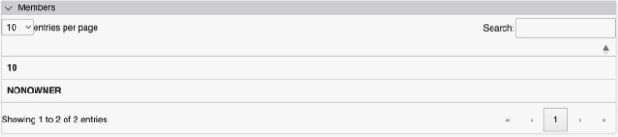
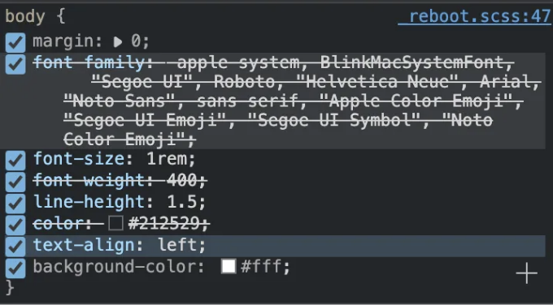
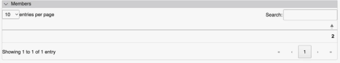
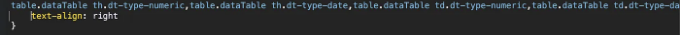

# TLDR

CSS에서 아래 코드를 추가하세요:

```js
table.dataTable th.dt-type-numeric, table.dataTable th.dt-type-date, table.dataTable td.dt-type-numeric, table.dataTable td.dt-type-date {
    text-align: left;
}
```

<!-- ui-log 수평형 -->
<ins class="adsbygoogle"
  style="display:block"
  data-ad-client="ca-pub-4877378276818686"
  data-ad-slot="9743150776"
  data-ad-format="auto"
  data-full-width-responsive="true"></ins>
<component is="script">
(adsbygoogle = window.adsbygoogle || []).push({});
</component>

# 문제

DataTables 테이블이 때로는 기본적으로 왼쪽이어야 하는 데이터를 오른쪽으로 정렬합니다.

우리가 테이블이 이렇게 보이기를 기대합니다:



<!-- ui-log 수평형 -->
<ins class="adsbygoogle"
  style="display:block"
  data-ad-client="ca-pub-4877378276818686"
  data-ad-slot="9743150776"
  data-ad-format="auto"
  data-full-width-responsive="true"></ins>
<component is="script">
(adsbygoogle = window.adsbygoogle || []).push({});
</component>

행 요소의 CSS를 조사해 보면 텍스트 정렬이 의도한 대로 왼쪽으로 상속되는 것을 보여줍니다.



하지만 때로는 표가 이렇게 보일 수도 있습니다:



<!-- ui-log 수평형 -->
<ins class="adsbygoogle"
  style="display:block"
  data-ad-client="ca-pub-4877378276818686"
  data-ad-slot="9743150776"
  data-ad-format="auto"
  data-full-width-responsive="true"></ins>
<component is="script">
(adsbygoogle = window.adsbygoogle || []).push({});
</component>

이러한 원치 않는 동작이 발생하는 이유는 DataTables가 열의 모든 데이터를 숫자 값으로 해석할 수 있기 때문이며, 숫자 값은 기본적으로 오른쪽으로 정렬됩니다. CSS를 조사하면 행이 다음 CSS를 상속하고 있음을 알 수 있습니다:



# 해결 방법

DataTables가 숫자로 간주하는 열에 대해 왼쪽 텍스트 정렬을 적용하려면, 자체 스타일시트에서 CSS를 반전시키면 됩니다. DataTables 스타일시트 이후에 이 스타일시트가 로드되도록 해야 합니다.

<!-- ui-log 수평형 -->
<ins class="adsbygoogle"
  style="display:block"
  data-ad-client="ca-pub-4877378276818686"
  data-ad-slot="9743150776"
  data-ad-format="auto"
  data-full-width-responsive="true"></ins>
<component is="script">
(adsbygoogle = window.adsbygoogle || []).push({});
</component>

```json
{
    "table.dataTable th.dt-type-numeric,table.dataTable th.dt-type-date,table.dataTable td.dt-type-numeric,table.dataTable td.dt-type-date": {
        "text-align": "left"
    }
}
```