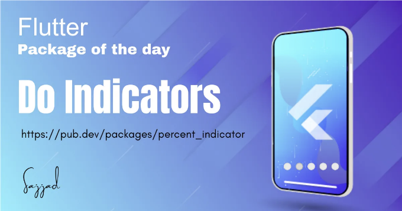

## 플러터 앱에서 도트 인디케이터 패키지를 구현하는 방법을 배워보세요. 사용자 경험을 향상시킬 수 있습니다.



제목: 플러터 앱에서 도트 인디케이터 패키지를 활용하여 내비게이션을 향상시켜보세요.

## 소개:

<!-- ui-log 수평형 -->
<ins class="adsbygoogle"
  style="display:block"
  data-ad-client="ca-pub-4877378276818686"
  data-ad-slot="9743150776"
  data-ad-format="auto"
  data-full-width-responsive="true"></ins>
<component is="script">
(adsbygoogle = window.adsbygoogle || []).push({});
</component>

플러터 앱 개발에서는 온보딩 화면과 같은 다양한 화면 또는 섹션 간 전환 시 사용자에게 시각적 피드백을 제공하기 위해 인디케이터가 필요합니다. Dot Indicators 패키지는 플러터 애플리케이션에 도트 인디케이터를 통합하는 놀라운 쉬운 방법을 제공합니다. 이 글에서는 Dot Indicators 패키지를 통합하는 방법, 장점, 구현 단계 및 내비게이션 및 사용자 경험을 향상시키기 위한 사용 예제에 대해 배우게 됩니다.

## Dot Indicators 패키지란?

Dot Indicators 패키지는 플러터 애플리케이션에 도트 인디케이터를 통합하는 놀라운 쉬운 방법을 제공합니다. 이러한 인디케이터는 주로 페이지 또는 섹션 모음 내에서 현재 위치를 시각화하는 데 사용됩니다. 예를 들어 이미지 캐러셀, 온보딩 화면 등에서 사용됩니다.

## Dot Indicators 패키지의 장점:

<!-- ui-log 수평형 -->
<ins class="adsbygoogle"
  style="display:block"
  data-ad-client="ca-pub-4877378276818686"
  data-ad-slot="9743150776"
  data-ad-format="auto"
  data-full-width-responsive="true"></ins>
<component is="script">
(adsbygoogle = window.adsbygoogle || []).push({});
</component>

- 사용자에 대한 시각적 피드백: 점 지시자는 페이지나 섹션 세트 내 현재 위치를 나타내어 사용자에게 명확한 시각적 피드백을 제공합니다.
- 쉬운 사용자 정의: 이 패키지를 사용하면 점의 크기, 색상, 간격 및 기타 속성을 쉽게 사용자 정의하여 앱의 디자인 요구를 맞출 수 있습니다.
- 유연성: 점 지시자는 PageViews, ListViews 또는 사용자 정의 네비게이션 위젯을 포함한 다양한 UI 구성 요소에 통합할 수 있습니다.
- 사용자 상호 작용: 시각적 네비게이션을 제공함으로써, 점 지시자는 사용자 참여를 향상시키고 전반적인 사용자 경험을 개선합니다.

## Dot Indicators 패키지 통합 방법:

Flutter 프로젝트에서 Dot Indicators 패키지를 구현하고 활용하는 단계를 살펴봅시다:

단계 1: 종속성 추가
pubspec.yaml 파일을 열고 Dot Indicators 패키지를 종속성으로 추가하세요:

<!-- ui-log 수평형 -->
<ins class="adsbygoogle"
  style="display:block"
  data-ad-client="ca-pub-4877378276818686"
  data-ad-slot="9743150776"
  data-ad-format="auto"
  data-full-width-responsive="true"></ins>
<component is="script">
(adsbygoogle = window.adsbygoogle || []).push({});
</component>

```js
dependencies:
  flutter:
    sdk: flutter
  dot_indicator: ^2.0.0  # 최신 버전으로 대체
```

단계 2: 의존성 설치 다음 명령을 터미널에서 실행하여 패키지와 그 의존성을 가져오고 설치합니다.

```js
flutter pub get
```

단계 3: 패키지 가져오기 Dart 파일에서 Dot Indicators 패키지를 가져올 위치에 가져오세요:``` 

<!-- ui-log 수평형 -->
<ins class="adsbygoogle"
  style="display:block"
  data-ad-client="ca-pub-4877378276818686"
  data-ad-slot="9743150776"
  data-ad-format="auto"
  data-full-width-responsive="true"></ins>
<component is="script">
(adsbygoogle = window.adsbygoogle || []).push({});
</component>

```js
import 'package:dot_indicator/dot_indicator.dart';
```

스텝 4: 도트 인디케이터를 구현하세요. 적합한 도트 인디케이터 위젯 유형을 선택하고 (예: DotIndicator, SlidingDotIndicator) 귀하의 요구에 맞게 해당 속성을 사용자 정의하세요.

```js
DotIndicator(
  itemCount: 3,
  currentIndex: _currentPage,
  indicatorRadius: 5,
  dotRadius: 3,
  dotColor: Colors.grey,
  dotSelectedColor: Colors.blue,
),
```

예시: 이 예시에서 pageLength는 표시할 총 도트 수를 나타내고 currentIndexPage는 강조할 위치 (활성 도트)를 나타냅니다.```

<!-- ui-log 수평형 -->
<ins class="adsbygoogle"
  style="display:block"
  data-ad-client="ca-pub-4877378276818686"
  data-ad-slot="9743150776"
  data-ad-format="auto"
  data-full-width-responsive="true"></ins>
<component is="script">
(adsbygoogle = window.adsbygoogle || []).push({});
</component>

- 간단한 점 표시기:


```js
new DotsIndicator(
 dotsCount: pageLength,
 position: currentIndexPage,
);
```

2. 사용자 정의 색상:

<!-- ui-log 수평형 -->
<ins class="adsbygoogle"
  style="display:block"
  data-ad-client="ca-pub-4877378276818686"
  data-ad-slot="9743150776"
  data-ad-format="auto"
  data-full-width-responsive="true"></ins>
<component is="script">
(adsbygoogle = window.adsbygoogle || []).push({});
</component>

```js
new DotsIndicator(
  dotsCount: pageLength,
  position: currentIndexPage,
  decorator: DotsDecorator(
    color: Colors.black87, // 비활성 상태 색상
    activeColor: Colors.redAccent,
  ),
);
```

3. 사용자 지정 크기 및 모양:

기본 점 크기와 모양을 변경할 수 있습니다. 비활성 상태 및 활성 상태의 모양을 선택할 수 있습니다. 기본적으로 점의 모양은 CircleBorder이므로, 활성 상태의 점을 둥근 사각형 모양으로 바꾸려면 activeShape를 변경해야 합니다.

<!-- ui-log 수평형 -->
<ins class="adsbygoogle"
  style="display:block"
  data-ad-client="ca-pub-4877378276818686"
  data-ad-slot="9743150776"
  data-ad-format="auto"
  data-full-width-responsive="true"></ins>
<component is="script">
(adsbygoogle = window.adsbygoogle || []).push({});
</component>


```js
new DotsIndicator(
  dotsCount: pageLength,
  position: currentIndexPage,
  decorator: DotsDecorator(
    size: const Size.square(9.0),
    activeSize: const Size(18.0, 9.0),
    activeShape: RoundedRectangleBorder(borderRadius: BorderRadius.circular(5.0)),
  ),
);
```

4. 사용자 지정 모양:

기본 점 모양을 변경할 수 있습니다. 기본적으로 CircleBorder입니다. 활성화되지 않은 상태와 활성 상태의 점 모양을 변경할 수 있습니다.

<!-- ui-log 수평형 -->
<ins class="adsbygoogle"
  style="display:block"
  data-ad-client="ca-pub-4877378276818686"
  data-ad-slot="9743150776"
  data-ad-format="auto"
  data-full-width-responsive="true"></ins>
<component is="script">
(adsbygoogle = window.adsbygoogle || []).push({});
</component>


```js
new DotsIndicator(
  dotsCount: pageLength,
  position: currentIndexPage,
  decorator: DotsDecorator(
    shape: const Border(),
    activeShape: RoundedRectangleBorder(borderRadius: BorderRadius.circular(5.0)),
  ),
);
```

더 많은 사용자 정의를 할 수 있어요.

이게 이번 글의 전부에요. 이것을 잘 활용해서 사용자 선호에 맞게 사용해 보세요.

<!-- ui-log 수평형 -->
<ins class="adsbygoogle"
  style="display:block"
  data-ad-client="ca-pub-4877378276818686"
  data-ad-slot="9743150776"
  data-ad-format="auto"
  data-full-width-responsive="true"></ins>
<component is="script">
(adsbygoogle = window.adsbygoogle || []).push({});
</component>

제 도움이 되었기를 바라며, 제 정보와 업데이트를 계속 받고 싶다면 플러터에 관한 더 많은 유용한 정보를 얻기 위해 나를 팔로우해 주세요. 이 기사가 도움이 되었다면 반드시 박수를 보내주세요. 읽어 주셔서 감사합니다!

즐거운 플러터 개발하시길 ✅!