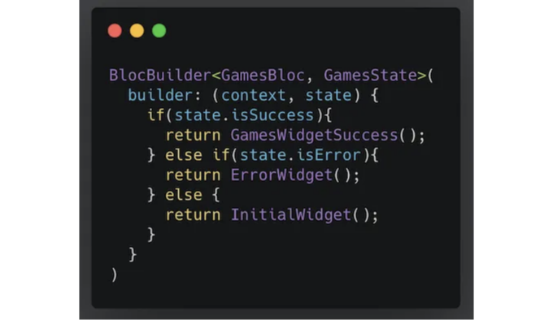

## 플러터 블록이란?

플러터 블록은 플러터 애플리케이션의 상태 관리 중 하나입니다. 응용 프로그램의 모든 가능한 상태를 쉽게 처리할 수 있습니다.

플러터 블록은 사용하기 쉽습니다. 팀원들과 함께 개념을 빠르게 이해할 수 있어요. 어느 수준에 있는지에 상관없이, 이 라이브러리는 매우 훌륭한 문서와 다양한 예제가 있으며, 플러터 커뮤니티에서 가장 많이 사용되는 라이브러리 중 하나입니다. 따라서 인터넷에서 간단한 검색으로 해결책을 찾을 수 있을 것입니다.

<!-- ui-log 수평형 -->
<ins class="adsbygoogle"
  style="display:block"
  data-ad-client="ca-pub-4877378276818686"
  data-ad-slot="9743150776"
  data-ad-format="auto"
  data-full-width-responsive="true"></ins>
<component is="script">
(adsbygoogle = window.adsbygoogle || []).push({});
</component>

강력한 이유는 모든 종류의 애플리케이션을 만들 수 있기 때문입니다. 예를 들어 학습 목적으로 애플리케이션을 만들 수 있고, 생산 환경에서 복잡한 애플리케이션을 만들 수도 있습니다. Flutter bloc은 두 경우에 모두 유효합니다.

이 라이브러리의 또 다른 중요한 측면은 블록 로직을 쉽게 테스트할 수 있다는 것입니다.

더 많은 정보를 원하시면 공식 웹사이트를 방문해보세요: [https://bloclibrary.dev/#/gettingstarted](https://bloclibrary.dev/#/gettingstarted)

# 그럼... Flutter bloc으로 어떻게 시작할 수 있을까요?

<!-- ui-log 수평형 -->
<ins class="adsbygoogle"
  style="display:block"
  data-ad-client="ca-pub-4877378276818686"
  data-ad-slot="9743150776"
  data-ad-format="auto"
  data-full-width-responsive="true"></ins>
<component is="script">
(adsbygoogle = window.adsbygoogle || []).push({});
</component>

내 첫 번째 제안은 문서를 살펴보고 기본 사항을 읽어보는 것입니다. 이 문서에서는 이를 설명하려고 노력할 것이지만, 더 자세히 알고 싶으면 문서를 방문하는 것을 강력히 권장합니다.

## 작동 방식

플러터 블록을 사용할 때 앱과의 상호 작용을 트리거하기 위해 이벤트를 생성한 후 블록이 요청된 데이터를 상태와 함께 방출할 것입니다. 실제 예시에서는 다음과 같을 것입니다:

1- 사용자가 게임 목록을 가져오기 위해 버튼을 클릭합니다.

<!-- ui-log 수평형 -->
<ins class="adsbygoogle"
  style="display:block"
  data-ad-client="ca-pub-4877378276818686"
  data-ad-slot="9743150776"
  data-ad-format="auto"
  data-full-width-responsive="true"></ins>
<component is="script">
(adsbygoogle = window.adsbygoogle || []).push({});
</component>

2. 이벤트가 트리거되고 사용자가 게임 목록을 원한다는 것이 블록에게 알려집니다.

3. 블록은 이 데이터를 요청할 것입니다 (예를 들어 API에 연결하는 책임을 지는 리포지토리로부터).

4. 블록이 데이터를 보유하면 데이터가 성공인지 오류인지를 결정하고, 그 후에 상태를 emit할 것입니다.

5. 뷰는 블록이 발생시킬 수 있는 모든 상태를 수신 대기하고, 반응하기 위해 리스닝할 것입니다. 예를 들어, 블록이 상태로 성공을 emit하면 뷰는 게임 목록으로 다시 빌드하겠지만, 상태가 오류라면, 오류 메시지나 표시할 내용을 다시 빌드할 것입니다.

<!-- ui-log 수평형 -->
<ins class="adsbygoogle"
  style="display:block"
  data-ad-client="ca-pub-4877378276818686"
  data-ad-slot="9743150776"
  data-ad-format="auto"
  data-full-width-responsive="true"></ins>
<component is="script">
(adsbygoogle = window.adsbygoogle || []).push({});
</component>

좋아요, 지금 플러터 블록이 어떻게 작동하는지 주요 개념을 알게 되었어요! 이제 사용하는 방법을 알아볼 시간이에요.

게임과 관련된 블록 로직을 만들고 싶다고 상상해봐요, 이 세 가지 클래스가 필요할 거예요:

- games_bloc.dart
- games_state.dart
- games_event.dart

<!-- ui-log 수평형 -->
<ins class="adsbygoogle"
  style="display:block"
  data-ad-client="ca-pub-4877378276818686"
  data-ad-slot="9743150776"
  data-ad-format="auto"
  data-full-width-responsive="true"></ins>
<component is="script">
(adsbygoogle = window.adsbygoogle || []).push({});
</component>

위의 내용을 보니 블록, 상태, 이벤트 클래스가 필요하다는 것을 알 수 있습니다. 각 클래스 안에서 필요한 정보를 관리할 것인데요, 걱정하지 마세요. 곧 이 내용을 자세히 살펴볼 거에요. 그런데 지금은 블록 위젯에 대한 기본 개념을 설명해 드리려고 합니다.

## 블록 위젯

이들은 라이브러리에서 제공하는 위젯으로, 가능한 모든 경우를 관리할 수 있게 도와줍니다. 예를 들어, 이벤트를 추가하거나 상태를 듣고, 상태를 내보내고, 상태에 따라 뷰를 다시 만들고, 등등입니다.

BlocProvider/MultiBlocProvider

<!-- ui-log 수평형 -->
<ins class="adsbygoogle"
  style="display:block"
  data-ad-client="ca-pub-4877378276818686"
  data-ad-slot="9743150776"
  data-ad-format="auto"
  data-full-width-responsive="true"></ins>
<component is="script">
(adsbygoogle = window.adsbygoogle || []).push({});
</component>

BlocProvider는 자식들에게 bloc을 제공하는 역할을 맡고 있어요. 사용하기 전에 bloc을 "초기화"하는 방법이에요.

만약 하나 이상의 bloc을 제공해야 한다면 MultiBlocProvider를 사용하여 다른 제공자들을 얻을 수 있어요.

<!-- ui-log 수평형 -->
<ins class="adsbygoogle"
  style="display:block"
  data-ad-client="ca-pub-4877378276818686"
  data-ad-slot="9743150776"
  data-ad-format="auto"
  data-full-width-responsive="true"></ins>
<component is="script">
(adsbygoogle = window.adsbygoogle || []).push({});
</component>

RepositoryProvider/MultiRepositoryProvider

RepositoryProvider은 자식 컴포넌트에 저장소를 제공하는 데 사용됩니다. 일반적으로는 저장소 클래스의 인스턴스를 생성해야 할 때 RepositoryProvider를 사용하고 BlocProvider를 사용하여 context.read`YourRepository`()를 통해 해당 저장소에 액세스할 수 있습니다.

다음은 예시입니다.

<!-- ui-log 수평형 -->
<ins class="adsbygoogle"
  style="display:block"
  data-ad-client="ca-pub-4877378276818686"
  data-ad-slot="9743150776"
  data-ad-format="auto"
  data-full-width-responsive="true"></ins>
<component is="script">
(adsbygoogle = window.adsbygoogle || []).push({});
</component>

다수의 저장소 제공업체가 필요한 경우 MultiRepositoryProvider를 사용할 수 있습니다.

BlocListener

이 위젯을 사용하면 블록에서 발생하는 다른 상태를 '듣고' 그에 반응하여 스낵바를 표시하거나 대화상자를 열거나 다른 페이지로 이동할 수 있습니다. 이 위젯은 뷰를 다시 빌드하지 않고 열심히 '듣기'만 합니다.

<!-- ui-log 수평형 -->
<ins class="adsbygoogle"
  style="display:block"
  data-ad-client="ca-pub-4877378276818686"
  data-ad-slot="9743150776"
  data-ad-format="auto"
  data-full-width-responsive="true"></ins>
<component is="script">
(adsbygoogle = window.adsbygoogle || []).push({});
</component>

BlocBuilder

이를 사용하면 상태에 따라 위젯을 다시 빌드할 수 있습니다.

<!-- ui-log 수평형 -->
<ins class="adsbygoogle"
  style="display:block"
  data-ad-client="ca-pub-4877378276818686"
  data-ad-slot="9743150776"
  data-ad-format="auto"
  data-full-width-responsive="true"></ins>
<component is="script">
(adsbygoogle = window.adsbygoogle || []).push({});
</component>

BlocConsumer

이 위젯은 블록 상태를 제어하여 위젯을 다시 빌드하거나 네비게이션 또는 대화 상자 표시 등에 사용해야 할 때 매우 유용합니다. 이 위젯에는 리스너(listener)와 빌더(builder) 함수가 있어 함께 사용할 수 있습니다.

BlocSelector

<!-- ui-log 수평형 -->
<ins class="adsbygoogle"
  style="display:block"
  data-ad-client="ca-pub-4877378276818686"
  data-ad-slot="9743150776"
  data-ad-format="auto"
  data-full-width-responsive="true"></ins>
<component is="script">
(adsbygoogle = window.adsbygoogle || []).push({});
</component>

이 위젯은 현재 블록 상태에 따라 새 값을 선택하여 업데이트를 필터링하는 것을 가능하게 합니다.

이러한 설명들은 높은 수준에서 제공되었으며, 더 많은 활용 방법이 있습니다. 자세한 내용은 문서를 확인해주세요.

이후에는 예제를 시작할 수 있습니다! 🙌

<!-- ui-log 수평형 -->
<ins class="adsbygoogle"
  style="display:block"
  data-ad-client="ca-pub-4877378276818686"
  data-ad-slot="9743150776"
  data-ad-format="auto"
  data-full-width-responsive="true"></ins>
<component is="script">
(adsbygoogle = window.adsbygoogle || []).push({});
</component>

# 실제 프로젝트에서 Flutter Bloc 사용하기

이 프로젝트에서는 게임 API에서 데이터를 소비하여 게임 정보를 가져와서 보여줄 것입니다.

내가 선택한 API는 RAWG입니다. 이를 사용하려면 API 키를 생성해야 합니다.

이것이 내가 만든 애플리케이션입니다.

<!-- ui-log 수평형 -->
<ins class="adsbygoogle"
  style="display:block"
  data-ad-client="ca-pub-4877378276818686"
  data-ad-slot="9743150776"
  data-ad-format="auto"
  data-full-width-responsive="true"></ins>
<component is="script">
(adsbygoogle = window.adsbygoogle || []).push({});
</component>

홈 페이지에는 다양한 부분이 있어요. 함께 살펴볼까요?

## 헤더

두 가지 텍스트와 원형 아바타가 표시되는 간단한 위젯이에요.

<!-- ui-log 수평형 -->
<ins class="adsbygoogle"
  style="display:block"
  data-ad-client="ca-pub-4877378276818686"
  data-ad-slot="9743150776"
  data-ad-format="auto"
  data-full-width-responsive="true"></ins>
<component is="script">
(adsbygoogle = window.adsbygoogle || []).push({});
</component>

## 카테고리 위젯

API를 호출하여 반환하는 다양한 장르를 보여줍니다. 이 위젯에는 네 가지 가능한 상태가 있습니다:

- 성공: 카테고리(장르) 목록을 표시합니다.
- 오류: 오류 메시지를 표시합니다.
- 로딩 중: CircularProgressIndicator를 표시합니다.
- 선택된 상태: 선택한 카테고리의 크기와 색상을 변경합니다.

<!-- ui-log 수평형 -->
<ins class="adsbygoogle"
  style="display:block"
  data-ad-client="ca-pub-4877378276818686"
  data-ad-slot="9743150776"
  data-ad-format="auto"
  data-full-width-responsive="true"></ins>
<component is="script">
(adsbygoogle = window.adsbygoogle || []).push({});
</component>

## 카테고리별 게임 위젯

API를 호출하여 장르별로 필터링된 서로 다른 게임을 보여줍니다. genres의 추가 매개변수를 사용하여 getGames를 호출해 API에서 반환한 게임을 보여줍니다. 이 위젯은 세 가지 상태를 가집니다:

- 성공: 카테고리별 게임 목록을 표시합니다.
- 에러: 오류 메시지를 표시합니다.
- 로딩: CircularProgressIndicator를 표시합니다.

<!-- ui-log 수평형 -->
<ins class="adsbygoogle"
  style="display:block"
  data-ad-client="ca-pub-4877378276818686"
  data-ad-slot="9743150776"
  data-ad-format="auto"
  data-full-width-responsive="true"></ins>
<component is="script">
(adsbygoogle = window.adsbygoogle || []).push({});
</component>

## 모든 게임 위젯

필터 없이 게임 목록을 보여줍니다. 이 위젯은 해당하는 블록이 Success 상태를 방출할 때만 표시되며 세 가지 가능한 상태가 있습니다:

- Success: 게임 목록 보여주기
- Error: 오류 메시지 표시
- Loading: CircularProgressIndicator 표시

<!-- ui-log 수평형 -->
<ins class="adsbygoogle"
  style="display:block"
  data-ad-client="ca-pub-4877378276818686"
  data-ad-slot="9743150776"
  data-ad-format="auto"
  data-full-width-responsive="true"></ins>
<component is="script">
(adsbygoogle = window.adsbygoogle || []).push({});
</component>

## 프로젝트 구조

이 예제에서는 다음과 같이 구조를 생성했습니다:

<!-- ui-log 수평형 -->
<ins class="adsbygoogle"
  style="display:block"
  data-ad-client="ca-pub-4877378276818686"
  data-ad-slot="9743150776"
  data-ad-format="auto"
  data-full-width-responsive="true"></ins>
<component is="script">
(adsbygoogle = window.adsbygoogle || []).push({});
</component>

홈 위젯 폴더 안을 보면 이전에 언급한 모든 위젯이 추가되어 있음을 알 수 있어요. 각 위젯은 자체 블록을 갖고 있어요. 그래서 더 깔끔하고 유지보수하기 좋아졌어요.

## 홈 페이지

이 페이지는 무척 중요해요. 여기서는 MultiBlocProvider와 RepositoryProvider 두 가지 Bloc 위젯을 사용했답니다.
이 페이지를 초기화할 때 모든 블록들이 준비되어 있어야 하는데요, 그래서 내 자식을 RepositoryProvider로 감싸서 모든 블록에 리포지토리를 제공하고, 또한 MultiBlocProvider로 모든 블록을 초기화해야 해요.

사실 이 코드를 보면 알 수 있듯, 시작할 때 두 이벤트를 추가하는 두 블록이 있어요:

<!-- ui-log 수평형 -->
<ins class="adsbygoogle"
  style="display:block"
  data-ad-client="ca-pub-4877378276818686"
  data-ad-slot="9743150776"
  data-ad-format="auto"
  data-full-width-responsive="true"></ins>
<component is="script">
(adsbygoogle = window.adsbygoogle || []).push({});
</component>

- GetGames
- GetCategories

이것은 새로운 이벤트를 추가하여 해당 블록에 데이터가 필요하다는 것을 알리는 한 가지 방법입니다. 따라서 이 시점에서 homePage에는 세 개의 블록과 두 개의 이벤트가 트리거되었습니다. 이제 HomeLayout을 살펴보겠습니다.

## HomeLayout

이 클래스에는 위에서 언급한 세 가지 주요 위젯과 뷰의 구조가 포함되어 있습니다.

<!-- ui-log 수평형 -->
<ins class="adsbygoogle"
  style="display:block"
  data-ad-client="ca-pub-4877378276818686"
  data-ad-slot="9743150776"
  data-ad-format="auto"
  data-full-width-responsive="true"></ins>
<component is="script">
(adsbygoogle = window.adsbygoogle || []).push({});
</component>

다음 단계는 각 위젯을 살펴보는 것이에요. 그럼 카테고리 위젯부터 시작해볼게요.

## 카테고리 위젯

카테고리 이벤트

여기에 필요한 모든 이벤트를 추가했어요.

<!-- ui-log 수평형 -->
<ins class="adsbygoogle"
  style="display:block"
  data-ad-client="ca-pub-4877378276818686"
  data-ad-slot="9743150776"
  data-ad-format="auto"
  data-full-width-responsive="true"></ins>
<component is="script">
(adsbygoogle = window.adsbygoogle || []).push({});
</component>

- GetCategories: 카테고리를 가져오는 이벤트입니다.
- SelectCategories: 카테고리가 선택되었을 때 알려주는 이벤트입니다.

카테고리 상태

이 클래스에는 블록이 내보낼 수 있는 다양한 상태가 있습니다. 뷰에서 모든 가능한 상태를 간결하고 깔끔하게 처리하는 확장을 만들었습니다.

Dart에서 객체를 비교하는 데 Equatable 라이브러리를 사용합니다. 이에 대해 아무것도 모르신다면, 문서를 확인하는 것을 강력히 추천드립니다.

<!-- ui-log 수평형 -->
<ins class="adsbygoogle"
  style="display:block"
  data-ad-client="ca-pub-4877378276818686"
  data-ad-slot="9743150776"
  data-ad-format="auto"
  data-full-width-responsive="true"></ins>
<component is="script">
(adsbygoogle = window.adsbygoogle || []).push({});
</component>

카테고리 블록

여기에서는 모든 이벤트를 처리해야 합니다. 13번 줄과 14번 줄에서 볼 수 있듯이, 이벤트가 하나인지 다른지 확인하여 해당 메소드를 생성합니다.

- mapGetCategoriesEventToState: 이 메소드는 API로부터 데이터를 얻기 위해 저장소를 호출합니다. 저장소가 데이터를 반환하거나 오류를 던질 때, 블록은 해당 상태를 방출합니다.
- mapSelectCategoryEventToState: 이 메소드는 '선택됨'과 같은 상태를 방출할 것입니다.

그리고 이제… 뷰에서 상태를 어떻게 확인할 수 있을까요?

<!-- ui-log 수평형 -->
<ins class="adsbygoogle"
  style="display:block"
  data-ad-client="ca-pub-4877378276818686"
  data-ad-slot="9743150776"
  data-ad-format="auto"
  data-full-width-responsive="true"></ins>
<component is="script">
(adsbygoogle = window.adsbygoogle || []).push({});
</component>

음, 상태가 발생하면 해당 데이터로 뷰를 다시 작성하려고 해요. 그 작업을 위해 뷰에 BlocBuilder가 있어요.

이 경우에는 현재 상태가 성공적일 때만 뷰를 다시 빌드하고 싶어서, buildWhen()을 사용해서 그렇게 했어요 (11번째 줄).

멋져요! 이 위젯이 표시되면 사용자가 카테고리 중 하나를 클릭할 수 있어요. 사용자가 클릭하면 두 가지 이벤트를 추가할 거예요:

- GetGamesByCategory: 장르별로 게임을 필터링하기 위해 사용할 이벤트에요. 이 이벤트는 다른 bloc, GamesByCategoryBloc (26번째 줄)을 사용해 처리할 거예요. 이 bloc에 대해 곧 설명할게요.
- SelectCategory: 선택한 항목의 색상과 크기를 뷰에서 바꾸기 위해 사용할 이벤트에요. 이 이벤트도 동일한 bloc, CategoryBloc (32번째 줄)을 사용해 처리할 거예요.

<!-- ui-log 수평형 -->
<ins class="adsbygoogle"
  style="display:block"
  data-ad-client="ca-pub-4877378276818686"
  data-ad-slot="9743150776"
  data-ad-format="auto"
  data-full-width-responsive="true"></ins>
<component is="script">
(adsbygoogle = window.adsbygoogle || []).push({});
</component>

이것은 완전한 클래스입니다.

상태 isSelected일 때(카테고리가 선택된 경우) 뷰를 살펴보겠습니다.
게임 카테고리 중 하나를 클릭하면 BlocSelector를 사용하여 해당 상황을 제어하고 이벤트가 트리거되며 블록은 선택된 카테고리의 ID로 상태 isSelected를 emit합니다. 따라서 블록 셀렉터에서 이러한 조건이 true인지 확인해야 합니다 (24번째 줄) 새로운 크기와 색상으로 뷰를 다시 빌드하기 위해(l 35, 36 및 39).

## GameByCategoryWidget

GameByCategoryEvent

<!-- ui-log 수평형 -->
<ins class="adsbygoogle"
  style="display:block"
  data-ad-client="ca-pub-4877378276818686"
  data-ad-slot="9743150776"
  data-ad-format="auto"
  data-full-width-responsive="true"></ins>
<component is="script">
(adsbygoogle = window.adsbygoogle || []).push({});
</component>

여기에 이벤트를 만들어서 카테고리별로 필터링된 모든 게임을 가져오고, 카테고리의 이름을 목록의 제목으로 표시하기 위해 추가했어요.

이전 상태 클래스와 마찬가지로, 여기에는 다른 상태를 확인하기 위한 확장 기능이 있고, 게임 목록과 카테고리 이름의 새 복사본을 만들기 위한 copyWith 메서드가 있어요.

<!-- ui-log 수평형 -->
<ins class="adsbygoogle"
  style="display:block"
  data-ad-client="ca-pub-4877378276818686"
  data-ad-slot="9743150776"
  data-ad-format="auto"
  data-full-width-responsive="true"></ins>
<component is="script">
(adsbygoogle = window.adsbygoogle || []).push({});
</component>

이 부분에서는 해당 장르 ID와 일치하는 모든 게임을 가져오기 위해 저장소를 호출하는 이벤트 GetGamesByCategory를 처리할 것입니다. 저장소가 유효한 데이터를 반환하면 해당 블록은 성공 상태 및 목록과 카테고리 이름의 새 복사본을 발행할 것이며, 그 결과가 유효하지 않으면 블록은 오류 상태를 발행할 것입니다.

좋아요, 다음 단계는 뷰에서 상태를 확인하여 반응하는 것입니다.

보시다시피, 제가 상태를 처리하는 방법을 보여주고 있습니다. 상태에 따라 세 가지 옵션이 있는 뷰를 처리하고 있습니다:

- 오류: 일반적인 오류 위젯을 표시합니다.
- 로딩: CircularProgressIndicator를 표시합니다.
- 성공: GameByCategorySuccessWidget을 표시합니다. 이 위젯은 해당 카테고리의 게임 목록을 보여주는 역할을 합니다. 여기에 위젯이 있습니다:

<!-- ui-log 수평형 -->
<ins class="adsbygoogle"
  style="display:block"
  data-ad-client="ca-pub-4877378276818686"
  data-ad-slot="9743150776"
  data-ad-format="auto"
  data-full-width-responsive="true"></ins>
<component is="script">
(adsbygoogle = window.adsbygoogle || []).push({});
</component>

그리고 마지막으로 홈 레이아웃의 마지막 부분인 AllGamesWidget 입니다.

## AllGamesWidget

AllGamesEvent

API에서 모든 게임을 가져오는 이벤트를 생성했습니다.

<!-- ui-log 수평형 -->
<ins class="adsbygoogle"
  style="display:block"
  data-ad-client="ca-pub-4877378276818686"
  data-ad-slot="9743150776"
  data-ad-format="auto"
  data-full-width-responsive="true"></ins>
<component is="script">
(adsbygoogle = window.adsbygoogle || []).push({});
</component>

AllGamesState

이전과 같이 가능한 모든 상태를 처리하기 위한 확장 기능을 만들었고, 필요할 때 객체의 새 복사본을 만들기 위한 copyWith 메서드도 만들었습니다.

AllGamesBloc

여기서 저장소를 호출하고 유효한 데이터를 반환할 때 블록은 게임 목록의 복사본으로 성공을 emit하며, 그렇지 않은 경우 저장소가 유효하지 않은 데이터를 반환하면 블록은 오류 상태를 emit할 것입니다.

<!-- ui-log 수평형 -->
<ins class="adsbygoogle"
  style="display:block"
  data-ad-client="ca-pub-4877378276818686"
  data-ad-slot="9743150776"
  data-ad-format="auto"
  data-full-width-responsive="true"></ins>
<component is="script">
(adsbygoogle = window.adsbygoogle || []).push({});
</component>

AllGamesWidget

이것은 모든 게임 위젯입니다. 여기에는 상태에 따라 view를 다시 빌드하는 BlocBuilder가 있었습니다.

다음은 세 가지 유형의 상태입니다:

- Error: 일반 오류 위젯을 보여줍니다.
- Loading: CircularProgressIndicator를 보여줍니다.
- Success: AllGamesSuccessWidget을 표시합니다. 이 위젯은 게임 목록을 보여주는 역할을 합니다. 여기 위젯입니다:

<!-- ui-log 수평형 -->
<ins class="adsbygoogle"
  style="display:block"
  data-ad-client="ca-pub-4877378276818686"
  data-ad-slot="9743150776"
  data-ad-format="auto"
  data-full-width-responsive="true"></ins>
<component is="script">
(adsbygoogle = window.adsbygoogle || []).push({});
</component>

## 추가 사항 🙌

만약 현재 상태와 다음 추가 될 이벤트를 파악하기 위한 로그를 보고 싶다면, Bloc Observer 클래스가 필요합니다. 이 클래스를 생성하고 메인 클래스에 초기화해야 합니다.

# 결론

플러터 애플리케이션에 대한 좋은 상태 관리는 필수적입니다. 플러터 블록은 좋은 선택지이며, 사용하기 복잡하지 않고 어떻게 사용하는지 메인 개념을 이해하기 쉽습니다. 또한, 뷰나 위젯을 관리하는 많은 방법을 제공합니다.
개인적으로, 코드를 더 깨끗하고 유지보수 가능하게 하기 위해 특정 로직을 가진 작은 블록을 생성하는 것을 선호합니다. 많은 것을 관리하는 큰 블록보다 귀하는 효율적입니다만, 귀하의 논리가 그렇게 요구한다면 큰 블록을 만들 수도 있습니다.

<!-- ui-log 수평형 -->
<ins class="adsbygoogle"
  style="display:block"
  data-ad-client="ca-pub-4877378276818686"
  data-ad-slot="9743150776"
  data-ad-format="auto"
  data-full-width-responsive="true"></ins>
<component is="script">
(adsbygoogle = window.adsbygoogle || []).push({});
</component>

# Github 저장소

코드는 오픈 소스이므로 가져가고 싶다면 여기에서 할 수 있어요: [https://github.com/AnnaPS/infogames](https://github.com/AnnaPS/infogames)

게다가, 이 글에서 언급한 부분에 대해 유닛 테스트와 블록 테스트를 추가했어요. 🧪

<!-- ui-log 수평형 -->
<ins class="adsbygoogle"
  style="display:block"
  data-ad-client="ca-pub-4877378276818686"
  data-ad-slot="9743150776"
  data-ad-format="auto"
  data-full-width-responsive="true"></ins>
<component is="script">
(adsbygoogle = window.adsbygoogle || []).push({});
</component>
