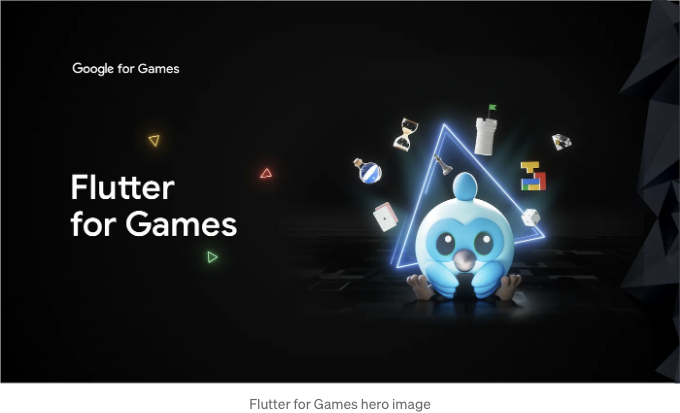

작년에는 Flutter Casual Games 툴킷에 대한 주요 업데이트가 있었습니다. 이번 주에는 Flutter가 게임 개발자 컨퍼런스 (GDC)에서 샌프란시스코에서 데뷔했습니다. GDC는 게임 산업의 주요 전문가 행사로, 게임 개발자들과 그들의 기술 발전을 지지합니다. Flutter를 사용하여 게임을 개발한 개발자들이 얼마나 발전했는지 그리고 Flutter 게임 개발의 미래에 대해 알아보세요.

Flutter Casual Games Toolkit를 출시한 이후에 Flutter는 게임 개발 분야에서 큰 진전을 이루었습니다. 지난 12개월 동안 Flutter로 15,000개 이상의 새로운 모바일 게임이 개발되었습니다.

Flutter는 모든 크기의 게임 앱에 대한 매력적인 옵션이 되었으며, 플러터를 사용하여 여가 시간에 Tinies Merge를 만들고 Google Play의 인디 게임 축제에서 상위 20의 파이널리스트 자리를 확보한 Tatsuya와 같은 처음으로 게임을 개발하는 개발자들뿐만 아니라 전 세계적으로 수억 다운로드를 기록하고 있는 인기 타이틀 Trivia Crack팀과 같은 팀까지 모두에게 힘을 실어 주고 있습니다!

<!-- ui-log 수평형 -->
<ins class="adsbygoogle"
  style="display:block"
  data-ad-client="ca-pub-4877378276818686"
  data-ad-slot="9743150776"
  data-ad-format="auto"
  data-full-width-responsive="true"></ins>
<component is="script">
(adsbygoogle = window.adsbygoogle || []).push({});
</component>

# 왜 게임에 플러터를 선택해야 하는가?

플러터는 2D 캐주얼 게임에 매력적인 장점을 제공합니다, 특히 인터페이스 중심이거나 턴 기반의 제목에게. 오픈 소스인 것은 라이선스 비용을 제거하고 게임 메커니즘에 대한 깊은 제어를 제공하며 풍부한 플러그인 생태계에 접근할 수 있게 합니다. 플러터의 "핫 리로드" 기능은 개발을 가속화하며 최적화된 엔진은 브라우저를 포함한 기기 전체에서 부드러운 성능을 보장합니다. iOS, Android, 웹, 데스크톱 및 PC용 Google Play Games를 포함하여 한 번 빌드하고 크로스 플랫폼으로 배포할 수 있는 능력을 가지고 플러터는 게임의 접근성을 향상시킵니다. 그래서, 게임 개발자라면 Flutter의 잠재력을 간과하지 마세요 — 다음 게임에는 플러터를 시도해 보고 함께 이야기를 퍼뜨리는 데 도움을 주세요!

# 2024년 이후: 함께 발전하는 플러터 게임 개발 생태계

2024년에는 플러터를 통해 놀라운 캐주얼 게임 경험을 만들 수 있도록 노력할 것입니다. 다음에 초점을 맞출 것은:

<!-- ui-log 수평형 -->
<ins class="adsbygoogle"
  style="display:block"
  data-ad-client="ca-pub-4877378276818686"
  data-ad-slot="9743150776"
  data-ad-format="auto"
  data-full-width-responsive="true"></ins>
<component is="script">
(adsbygoogle = window.adsbygoogle || []).push({});
</component>

- 개발 간소화: 템플릿, 플러그인 통합 및 심층 가이드와 같은 확장된 게임 개발 리소스를 기대하십시오. 이를 통해 작업 흐름을 가속화하고 Flutter의 게임 개발 잠재력을 발휘할 수 있습니다.
- 전파 확대: 웹 및 기타 플랫폼에 Flutter 게임을 배포하는 과정을 더 순조롭게 만들기 위해 노력하고 있습니다. 이를 통해 창작물을 위한 새로운 관객층을 열어줍니다.
- 미래를 위한 기초: 2D 모바일 게임 지원이 우리의 주요 관심사이지만, Flutter GPU 노력의 일환으로 3D 기능을 탐구하는 것에 열정적입니다. 진행 상황을 확인하려면 초기 실험 중 일부를 따라가보세요.

# 커뮤니티에 특별한 감사

게임 개발 분야에서 Flutter의 놀라운 성장을 뒷받침해 준 커뮤니티에 대해 깊은 감사를 표합니다.

여러분의 끊임없는 지원과 중요한 기여에 우리는 대단히 감사하며, 여러분의 업적에 감탄하고 다음과 같은 많은 훌륭한 기여에 대해 극도로 감사드립니다:

<!-- ui-log 수평형 -->
<ins class="adsbygoogle"
  style="display:block"
  data-ad-client="ca-pub-4877378276818686"
  data-ad-slot="9743150776"
  data-ad-format="auto"
  data-full-width-responsive="true"></ins>
<component is="script">
(adsbygoogle = window.adsbygoogle || []).push({});
</component>

- 루안 니코, 루카스 클링스보, 에릭 자나르도, 레난 아라우조, 아론 워싱턴, 파샤 스테첸코, 요훔 반 데르 플루흐, 페르난도 울트레마레, 데브카게 (Flame): 플러터 게임 개발에 혁명적인 역할을 한 Flame 엔진 및 관련 프로젝트에 대해 감사드립니다.
- 라파엘 바르보사 (Bonfire): 강력하고 다재다능한 게임 엔진으로 RPG 스타일 게임을 구축하는 데 탁월한 도구입니다.
- 필립 헤라체크: 여러분의 템플릿과 튜토리얼은 많은 신규 게임 개발자에게 가치 있는 창출의 시작점을 제공합니다.
- 제프 워드: 다른 게임 엔진에 Dart를 임베딩하는 것은 흥미로운 가능성을 열어줍니다.
- 매우 귀중한 벤처 팀 (@VeryGoodVentures)의 놀라운 팀: 아름다운 게임과 최고의 실천 방법을 나누는 의지는 모두에게 기준을 세우는 데 이바지합니다.
- Abedalkareem Omreyh (게임 서비스), August, subhash279 (audioplayers), Marco Bavagnoli (Flutter SoLoud)을 비롯한 수많은 필수 패키지 제공자들: 여러분이 제공한 기반은 플러터로 복잡하고 매료시키는 게임을 가능하게 합니다.

이 목록은 이 커뮤니티의 재능을 조금밖에 담아내지 못했습니다. 개별적으로 언급하지 못한 모든 분들께: 여러분의 기여에 깊이 감사드리며, 플러터를 게임 개발을 위한 활기찬 장소로 만들어 주시는 데 도움이 되었습니다!

한편, 플러터를 사용하여 게임을 출시한 개발자분들께도 가장 깊은 감사를 전합니다. 여러분의 창의성과 열정은 우리에게 계속해서 가능한 한 경계를 넓히고자 하는 영감을 줍니다. 전 세계 개발자를 위한 더욱 강력한 도구로 플러터가 발전하는 데 일조할 수 있도록 약속드립니다!

게임 개발 플랫폼으로서의 플러터의 여정은 시작에 불과합니다. 커뮤니티와 함께 성장하고 여러분의 피드백을 경청하며 여러분이 필요로 하는 도구를 제공하는 데 헌신하겠습니다.

<!-- ui-log 수평형 -->
<ins class="adsbygoogle"
  style="display:block"
  data-ad-client="ca-pub-4877378276818686"
  data-ad-slot="9743150776"
  data-ad-format="auto"
  data-full-width-responsive="true"></ins>
<component is="script">
(adsbygoogle = window.adsbygoogle || []).push({});
</component>

기대돼요! 당신이 만드는 것을 보러 기대돼요!