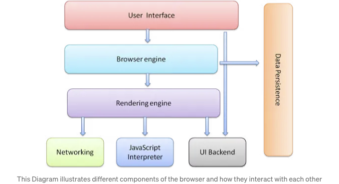
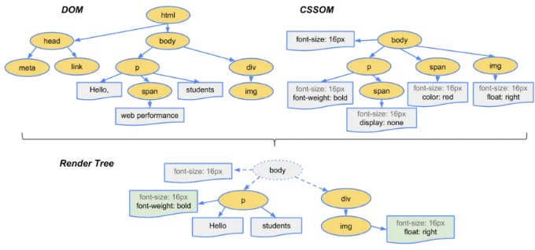
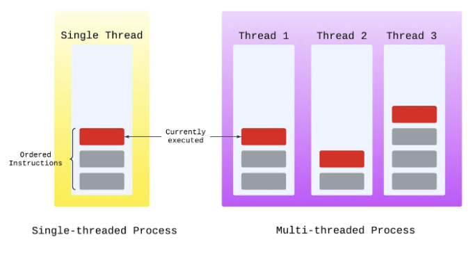

경험이 풍부한 개발자이든 막 시작한 개발자이든, 브라우저가 어떻게 작동하는지를 파악하는 것은 웹 프로젝트를 향상시키고 부드러운 사용자 경험을 만드는 데 중요합니다. 브라우저 기술을 해독해 보겠습니다. 당신을 렌더링 엔진부터 네트워크 프로토콜까지 핵심 부분을 다룰 것입니다. 이러한 통찰력을 통해, 더 빠르고 효율적인 웹사이트와 어플리케이션을 만들 준비가 될 것입니다. 함께 웹 개발의 매혹적인 영역으로 들어가 브라우저의 비밀을 발견해 봅시다!

# 웹 브라우저의 기본 아키텍처 :

<!-- ui-log 수평형 -->
<ins class="adsbygoogle"
  style="display:block"
  data-ad-client="ca-pub-4877378276818686"
  data-ad-slot="9743150776"
  data-ad-format="auto"
  data-full-width-responsive="true"></ins>
<component is="script">
(adsbygoogle = window.adsbygoogle || []).push({});
</component>

## 1 — 사용자 인터페이스

브라우저의 사용자 인터페이스 또는 UI는 주소 표시줄, 뒤로 가기 버튼, 즐겨찾기 및 새로 고침 버튼과 같이 보고 상호 작용하는 부분입니다.

브라우저 UI를 디자인하기 위한 공식적인 규칙집은 없지만, 여러 해의 경험과 서로 아이디어를 가져다주면서 형성되었습니다.

그래서 대부분의 브라우저가 비슷하게 보이고 느껴집니다.

<!-- ui-log 수평형 -->
<ins class="adsbygoogle"
  style="display:block"
  data-ad-client="ca-pub-4877378276818686"
  data-ad-slot="9743150776"
  data-ad-format="auto"
  data-full-width-responsive="true"></ins>
<component is="script">
(adsbygoogle = window.adsbygoogle || []).push({});
</component>

## 2 - 브라우저 엔진

브라우저 엔진은 브라우저의 사용자 인터페이스(상호 작용하는 부분)와 렌더링 엔진(웹사이트를 표시하는 부분) 사이에서 중개자 역할을 합니다.

따라서 새로운 웹사이트를 입력하고 엔터를 누르면, 브라우저 엔진은 UI에서 요청을 받아 렌더링 엔진으로 전달하여 해당 사이트를 표시해 줍니다.

## 3 - 렌더링 엔진

<!-- ui-log 수평형 -->
<ins class="adsbygoogle"
  style="display:block"
  data-ad-client="ca-pub-4877378276818686"
  data-ad-slot="9743150776"
  data-ad-format="auto"
  data-full-width-responsive="true"></ins>
<component is="script">
(adsbygoogle = window.adsbygoogle || []).push({});
</component>

렌더링 엔진은 요청된 콘텐츠를 표시하는 역할을 합니다.

렌더링 엔진은 먼저 네트워킹 레이어에서 요청된 문서의 내용을 가져오는 것으로 시작합니다.

HTML 코드를 가져와 파싱하여 DOM (문서 객체 모델) 트리를 생성합니다.

그런 다음 렌더링 엔진은 CSS를 파싱하여 CSSOM (CSS 객체 모델)을 구축합니다. DOM과 비슷하지만 HTML이 아닌 CSS에 대한 것입니다.

<!-- ui-log 수평형 -->
<ins class="adsbygoogle"
  style="display:block"
  data-ad-client="ca-pub-4877378276818686"
  data-ad-slot="9743150776"
  data-ad-format="auto"
  data-full-width-responsive="true"></ins>
<component is="script">
(adsbygoogle = window.adsbygoogle || []).push({});
</component>

CSS가 파싱되는 동안과 CSSOM이 생성되는 동안, 브라우저는 JavaScript 파일과 같은 다른 에셋을 Networking 레이어를 통해 다운로드합니다.

렌더링 엔진은 JavaScript 엔진과 통신하여 JavaScript 코드를 실행하고 DOM 및 CSSOM을 조작합니다.

렌더링 엔진은 다음에 DOM과 CSSOM을 가져와 Render 트리를 만듭니다.

<!-- ui-log 수평형 -->
<ins class="adsbygoogle"
  style="display:block"
  data-ad-client="ca-pub-4877378276818686"
  data-ad-slot="9743150776"
  data-ad-format="auto"
  data-full-width-responsive="true"></ins>
<component is="script">
(adsbygoogle = window.adsbygoogle || []).push({});
</component>

한국어로 번역하면 아래와 같습니다:

렌더링 엔진은 그런 다음 화면 위에 웹 사이트를 레이아웃하는 UI 백엔드를 사용하고 마지막으로 픽셀을 화면에 그리기 위해 사용합니다.

렌더링 엔진이 거치는 전체 프로세스는 (중요한 렌더링 경로) 라고 부릅니다.

## 4 — 네트워킹 레이어

네트워킹 레이어는 리소스를 가져오기 위해 네트워크 호출을 수행하는 데 책임이 있습니다.

<!-- ui-log 수평형 -->
<ins class="adsbygoogle"
  style="display:block"
  data-ad-client="ca-pub-4877378276818686"
  data-ad-slot="9743150776"
  data-ad-format="auto"
  data-full-width-responsive="true"></ins>
<component is="script">
(adsbygoogle = window.adsbygoogle || []).push({});
</component>

위에서는 올바른 연결 제한을 부과하고 요청 형식을 지정하며 프록시, 캐싱 등을 처리합니다.

## 5 — JavaScript 엔진

JavaScript 엔진은 DOM 또는 CSSOM에서 JavaScript 코드를 구문 분석하고 실행하는 데 사용됩니다.

JavaScript 코드는 웹 서버에서 제공되거나 웹 브라우저(브라우저 확장 프로그램이나 자동 광고 차단과 같은 브라우저 기능)에서 제공될 수 있습니다.

<!-- ui-log 수평형 -->
<ins class="adsbygoogle"
  style="display:block"
  data-ad-client="ca-pub-4877378276818686"
  data-ad-slot="9743150776"
  data-ad-format="auto"
  data-full-width-responsive="true"></ins>
<component is="script">
(adsbygoogle = window.adsbygoogle || []).push({});
</component>

과거 브라우저는 JavaScript 인터프리터를 사용했지만, 현대의 JavaScript 엔진은 성능 향상을 위해 Just-In-Time 컴파일을 사용합니다.

JavaScript 엔진의 예시는 다음과 같습니다.

- Chrome — V8 JavaScript Engine
- Safari — JavaScriptCore
- FireFox — SpiderMonkey Engine

## 6 — UI 백엔드

<!-- ui-log 수평형 -->
<ins class="adsbygoogle"
  style="display:block"
  data-ad-client="ca-pub-4877378276818686"
  data-ad-slot="9743150776"
  data-ad-format="auto"
  data-full-width-responsive="true"></ins>
<component is="script">
(adsbygoogle = window.adsbygoogle || []).push({});
</component>

이 레이어는 선택 상자 또는 입력 상자와 창과 같은 기본 위젯을 그리는 역할을 합니다. 이 레이어 아래에서는 운영 체제 UI 방법을 사용합니다.

렌더링 엔진은 웹 페이지를 브라우저에 표시하기 위해 레이아웃 및 페인팅 단계 중에 UI 백엔드 레이어를 사용합니다.

## 7 — 데이터 저장

브라우저는 데이터를 로컬에 저장해야 하므로 데이터 저장 구성 요소가 이 부분을 처리합니다.

<!-- ui-log 수평형 -->
<ins class="adsbygoogle"
  style="display:block"
  data-ad-client="ca-pub-4877378276818686"
  data-ad-slot="9743150776"
  data-ad-format="auto"
  data-full-width-responsive="true"></ins>
<component is="script">
(adsbygoogle = window.adsbygoogle || []).push({});
</component>

현대 브라우저는 localStorage, IndexedDB 및 FileSystem과 같은 저장 메커니즘을 지원합니다.

# 브라우저는 단일 스레드입니다 :

이 개념은 이해해야 할 중요한 요소인데, 즉, 브라우저는 한 번에 하나의 JavaScript 코드만 실행할 수 있다는 것을 의미합니다. JavaScript가 실행 중일 때 다른 JavaScript가 실행되기 전에 해당 실행을 완료해야 합니다. 이는 JavaScript가 역사적으로도 그리고 설계상 브라우저 내에서 단일 스레드 환경에서 동작하기 때문인데, 이를 주 스레드라고 합니다. 이 주 스레드는 또한 페이지 렌더링, 사용자 입력에 대한 응답 및 레이아웃 조정 실행과 같은 다른 중요한 작업을 담당합니다.

<!-- ui-log 수평형 -->
<ins class="adsbygoogle"
  style="display:block"
  data-ad-client="ca-pub-4877378276818686"
  data-ad-slot="9743150776"
  data-ad-format="auto"
  data-full-width-responsive="true"></ins>
<component is="script">
(adsbygoogle = window.adsbygoogle || []).push({});
</component>

위의 예시에서 하나의 작업만 실행할 수 있는 단일 스레드와 다중 스레드 프로세스에서 (스레드 수에 따라 다르지만) 한 번에 여러 작업을 실행할 수 있는 차이를 볼 수 있습니다.

# 결론:

결론적으로, 브라우저 작동 방식에 대한 탐구를 통해 우리는 매일 상호 작용하는 웹 페이지 뒤의 정교한 메커니즘에 대한 일부를 엿볼 수 있었습니다. 이것은 브라우저가 탐색하는 복잡한 우주의 표면일 뿐입니다. 웹 개발자로서 이러한 영역을 더 깊게 파고들면 우리의 이해를 깊이 있게 하고 웹 애플리케이션을 더 빠르고 안전하며 사용자 친화적으로 만들어줄 것입니다.