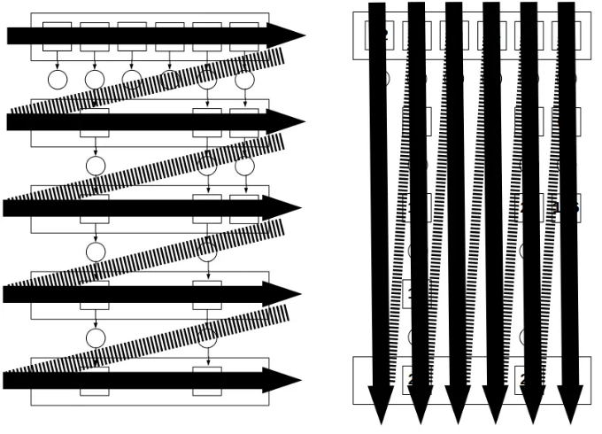
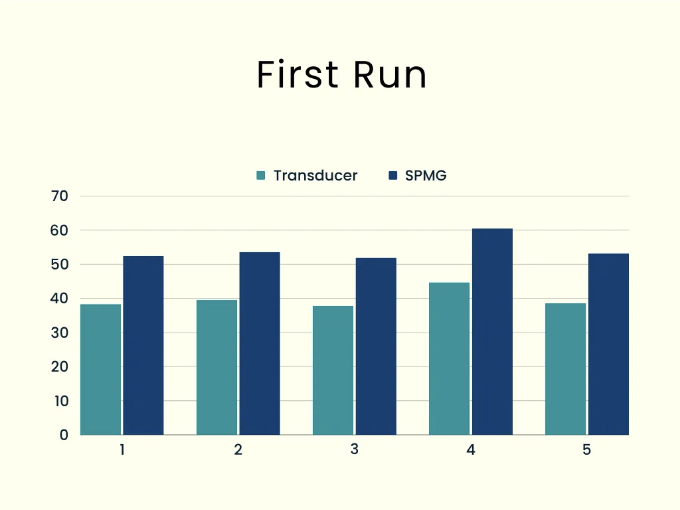
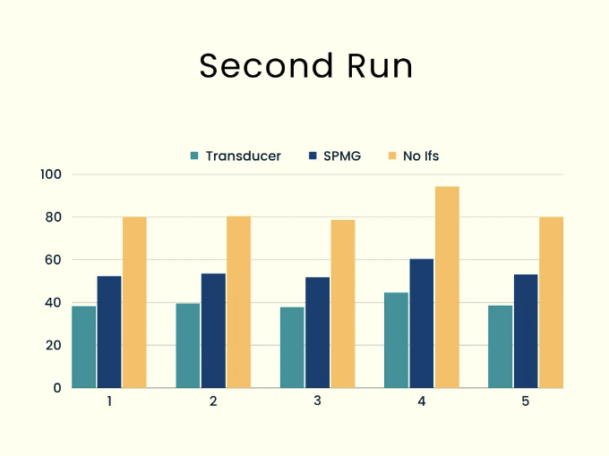
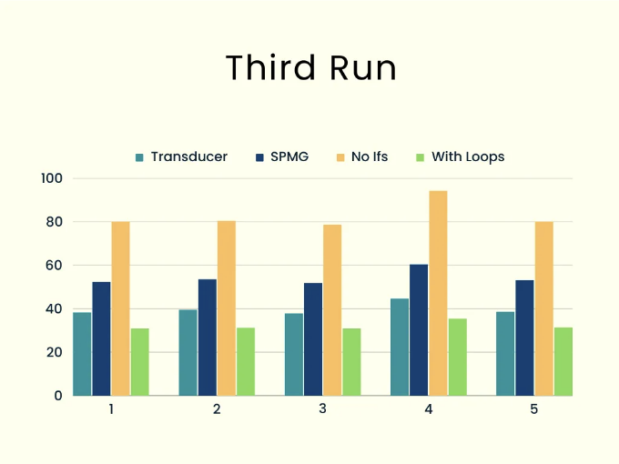
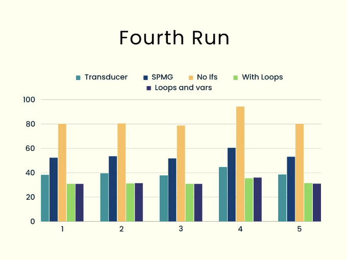
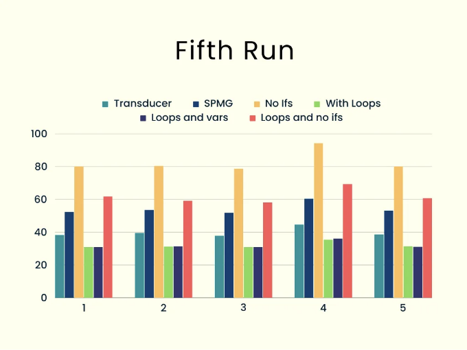

이전 글에서는 긴 배열 작업을 최적화하기 위한 두 가지 다른 방법을 살펴보았어요... 그렇다면 어느 쪽이 더 나은 방법일까요? 실제 성능에 주목하지 않고 본다면, 트랜스듀서를 사용하는 첫 번째(매우 기능적인!) 솔루션이 복잡하고 이해하기 어려울 수 있지만, 더 직관적인 트랜스듀서 없이 구현된 솔루션은 길지만 명확할 수 있습니다.

어쨌든, 우리가 걱정하는 것은 아니죠; 어쨌든 두 솔루션 모두 사용법이 유사했기 때문에 내부 복잡성은 중요하지 않습니다. 성능 면에서 두 솔루션을 비교하고 어떻게 최적화할지 고민해야 해요.

이 글에서는 정확히 그런 작업을 할 거에요:

- 먼저 어떻게 테스트할지 계획을 세워볼 거에요.
- 그 다음 시도를 몇 번해볼 거에요.
- 마지막으로 여러가지 가능한 JavaScript 최적화 기술을 적용하고 결과를 측정하겠습니다.

<!-- ui-log 수평형 -->
<ins class="adsbygoogle"
  style="display:block"
  data-ad-client="ca-pub-4877378276818686"
  data-ad-slot="9743150776"
  data-ad-format="auto"
  data-full-width-responsive="true"></ins>
<component is="script">
(adsbygoogle = window.adsbygoogle || []).push({});
</component>

글 끝까지 다 읽으면, 두 해결책 중 전체 속도 측면에서 어떤 것이 더 좋은지에 대해 좋은 아이디어를 갖게 될 거에요. 하지만 먼저, 문제와 그 해결책을 상기해 봅시다.

# 문제 및 해결 방법

상상해보세요. (대규모) 배열이 있고, 여러 매핑 및 필터링 연산(최종적으로 줄이기 연산도 있을지도 모름)을 수행하려고 한다고 해봅시다. .map() 및 .filter() 메소드를 사용하면, 왼쪽 이미지에 표시된 것과 같이 여러 중간 배열을 생성하고 나중에 제거해야 하는 해결책이 나올 거에요.



<!-- ui-log 수평형 -->
<ins class="adsbygoogle"
  style="display:block"
  data-ad-client="ca-pub-4877378276818686"
  data-ad-slot="9743150776"
  data-ad-format="auto"
  data-full-width-responsive="true"></ins>
<component is="script">
(adsbygoogle = window.adsbygoogle || []).push({});
</component>

더 좋은 아이디어는 변환 단계별이 아니라 값 단위로 진행하는 것입니다. 위 이미지 오른쪽에서 보여지는 것처럼 말이죠. 이렇게 하면 동일한 작업 횟수를 수행하지만 중간 배열이 필요 없어지고 시간을 절약할 수 있어요. 멋지죠!

트랜스듀서 솔루션은 transduce2() 함수를 생성했습니다. 이 함수는 전체 작업 집합을 단일 reduce() 호출로 변환했어요. 자세한 내용과 설명은 이전 글을 참고해주세요.

대체 솔루션인 트랜스듀서 없는 방법은 간단한 루프를 사용하여 적용할 작업 배열 (fnList)과 각각을 매핑 ("M") 또는 필터링 ("F")으로 식별하는 방식으로 작동합니다. 자세한 내용은 이전 글을 확인하는 것이 좋습니다.

<!-- ui-log 수평형 -->
<ins class="adsbygoogle"
  style="display:block"
  data-ad-client="ca-pub-4877378276818686"
  data-ad-slot="9743150776"
  data-ad-format="auto"
  data-full-width-responsive="true"></ins>
<component is="script">
(adsbygoogle = window.adsbygoogle || []).push({});
</component>

```js
const singlePassMoreGeneral = (
 someArray,
 fnList,
 reduceAccumFn = (accum, value) => {
  accum.push(value);
  return accum;
 },
 initialAccum = []
) => {
 let result = initialAccum;
 someArray.forEach((value) => {
  if (
   fnList.every(([type, fn]) => {
    if (type === "M") {
     value = fn(value);
     return true;
    } else {
     return fn(value);
    }
   })
  ) {
   result = reduceAccumFn(result, value);
  }
 });
 return result;
};
```

코드를 보면 변환자 솔루션을 최적화하기 위해 크게 할 수있는 것이 없어 보입니다 — 결국 한 줄이기 때문입니다! 그러나 두 번째 솔루션을 개선할 수 있을 것으로 보이므로 먼저 성능을 측정하는 것에 대해 생각해 보겠습니다.

# 성능 측정

성능은 어떻게 측정합니까? 실제 정확한 타이밍을 얻어야합니다. 또한 코드의 성능은 사용할 함수 및 데이터에 크게 의존하기 때문에 단일 측정으로는 충분하지 않습니다.```

<!-- ui-log 수평형 -->
<ins class="adsbygoogle"
  style="display:block"
  data-ad-client="ca-pub-4877378276818686"
  data-ad-slot="9743150776"
  data-ad-format="auto"
  data-full-width-responsive="true"></ins>
<component is="script">
(adsbygoogle = window.adsbygoogle || []).push({});
</component>

이전 글에서 고차 함수에 대해 다루었는데, 함수를 시간 측정을 보고하는 새로운 함수로 변환하는 방법을 소개했습니다. 그러나 정확히 필요한 것은 아닙니다. 유효한 측정값을 얻기 위해 무작위 데이터를 사용하여 여러 테스트를 실행해야 하므로 특정 실행에 대해 관심을 갖지 않고 모든 실행에 대한 시간을 누적해야 합니다.

시간을 측정하는 보다 일반적인 방법은 Performance 인터페이스를 사용하는 것입니다. 이 인터페이스는 프론트엔드와 백엔드 모두에서 사용할 수 있습니다. 사용 예제를 보고 싶다면, 바로 위에서 언급한 시간 측정 고차 함수를 작성할 때 작업한 내용과 일치합니다.

다양성을 위해 다른 방법을 선택하기로 결정했습니다: Node의 process.hrtime() 메서드를 사용했습니다. 이 메서드는 performance.now() 와 유사하게 작동하지만 BigInt 숫자 값을 반환합니다. 정밀도가 더 높습니다: 밀리초가 아닌 나노초 단위로 값을 얻습니다.

좋아요, 그런데 당연히 물론, 이 정밀도가 필요한가요? 안타깝게도 그렇지 않습니다 - 그렇지만 이전에 사용하지 않은 BigInt 값으로 작업하고 싶었기 때문에 일단 진행했습니다!

<!-- ui-log 수평형 -->
<ins class="adsbygoogle"
  style="display:block"
  data-ad-client="ca-pub-4877378276818686"
  data-ad-slot="9743150776"
  data-ad-format="auto"
  data-full-width-responsive="true"></ins>
<component is="script">
(adsbygoogle = window.adsbygoogle || []).push({});
</component>

시간 측정 코드는 매우 간단합니다: 코드를 실행하기 전과 후에 process.hrtime.bigint()의 값을 가져오고, 두 값의 차이가 필요한 시간입니다. 이제 우리가 시간을 측정하는 방법을 알았으니, 테스트 자체를 계획해 봅시다.

# 테스트 계획

모든 가능한 배열과 필터링, 매핑 및 축소 함수의 모든 가능한 조합으로 함수를 테스트할 수는 없다는 것은 명백합니다. 이전 두 기사에서 사용한 함수들로만 제한해 보겠습니다. 아래는 샘플 사용법입니다.

```js
const testOdd = (x) => x % 2 === 1;
const duplicate = (x) => x + x;
const testUnderFifty = (x) => x < 50;
const addThree = (x) => x + 3;
const myArray = [22, 9, 60, 24, 11, 63];
const newArray = myArray
 .filter(testOdd)
 .map(duplicate)
 .filter(testUnderFifty)
 .map(addThree);
console.log(newArray); // [21,25]
```

<!-- ui-log 수평형 -->
<ins class="adsbygoogle"
  style="display:block"
  data-ad-client="ca-pub-4877378276818686"
  data-ad-slot="9743150776"
  data-ad-format="auto"
  data-full-width-responsive="true"></ins>
<component is="script">
(adsbygoogle = window.adsbygoogle || []).push({});
</component>

랜덤 배열을 사용하여 작업할 것이며, 0~100 사이의 TEST_SIZE 항목이 있습니다. (값을 변경함으로써 다양한 크기의 테스트를 실행할 수 있도록 const를 사용하고 있습니다.) 또한 TRIALS번 실행하여 다양한 결과를 얻을 것이며, 모든 실행의 총 시간을 최종 측정값으로 삼겠습니다.

마지막으로, 다양성을 위해 testUnderFifty 함수 대신 랜덤 리미트를 사용하도록 약간 수정하였습니다. 기본 코드는 다음과 같이 비 추상화된 버전과 비교할 것입니다:

```js
// 랜덤 숫자 생성
const random_0_100 = () => Math.floor(Math.random() * 100);
// 필터링할 경계값 설정
let LIMIT_FOR_TEST = 0;
const testUnderLimit = (x) => x < LIMIT_FOR_TEST;
// 테스트할 각 함수 별 누산기
let accum1st = 0n;
let accum2nd = 0n;
.
.
.
for (let i = 0; i < TRIALS; i++) {
 const myArray = [];
 for (let i = 0; i < TEST_SIZE; i++) {
  myArray[i] = random_0_100();
 }
 LIMIT_FOR_TEST = random_0_100() / 3;
 start = process.hrtime.bigint();
 const result1st = transduce2(myArray, [
  testOddR,
  duplicateR,
  testUnderLimitR,
  addThreeR,
 ]);
 accum1st += process.hrtime.bigint() - start;
 start = process.hrtime.bigint();
 const result2nd = singlePassMoreGeneral(myArray, [
  applyFilter(testOdd),
  applyMap(duplicate),
  applyFilter(testUnderLimit),
  applyMap(addThree),
 ]);
 accum2nd += process.hrtime.bigint() - start;
 .
 .
 .
}
// accum1, accum2 등의 값 보고
```

랜덤성의 영향을 최소화하고 더 나은 결과를 얻기 위해 TRIALS 번 실행할 것입니다. 작은 배열의 경우 모두 짧은 시간이 소요되므로 최적화가 큰 효과를 내지 못할 것이기 때문에 대규모 배열을 사용할 것입니다. 위와 같이 진행하기로 결정하였습니다.

<!-- ui-log 수평형 -->
<ins class="adsbygoogle"
  style="display:block"
  data-ad-client="ca-pub-4877378276818686"
  data-ad-slot="9743150776"
  data-ad-format="auto"
  data-full-width-responsive="true"></ins>
<component is="script">
(adsbygoogle = window.adsbygoogle || []).push({});
</component>

```js
const TRIALS = 100;
const TEST_SIZE = 10_000_000;
```

테스트에 대해 말씀드리자면, 각 시행마다 TEST_SIZE 범위 내의 0에서 100 사이의 임의의 값으로 배열을 초기화하고, 필터링 함수 중 하나에서 사용될 LIMIT_FOR_TEST를 설정한 다음 코드의 여러 버전을 실행하여 소요된 시간을 측정하고 해당 총합에 추가합니다. 모든 시행이 완료되면 단순히 추가 분석을 위해 모든 총합을 보고합니다.

모든 구현이 올바른지 확실하게 확인하기 위해 결과를 일치시켰습니다. 구현이 버그가 있다면 즉시 알게 되었을 것입니다. 예를 들어, 2번째 계산 후에 다음을 추가했습니다:

```js
 console.assert(
  JSON.stringify(result1st) === JSON.stringify(result2nd),
  "test2nd"
 );
```

<!-- ui-log 수평형 -->
<ins class="adsbygoogle"
  style="display:block"
  data-ad-client="ca-pub-4877378276818686"
  data-ad-slot="9743150776"
  data-ad-format="auto"
  data-full-width-responsive="true"></ins>
<component is="script">
(adsbygoogle = window.adsbygoogle || []).push({});
</component>

그래서, 이제 테스트를 진행하는 방법을 알게 되었어요. 결과를 얻기 시작합시다!

# 첫 번째 실행

첫 실험에서는 우리의 트랜스듀서 버전을 단일 패스 더 일반적인(SPMG 약자로) 트랜스듀서 없는 버전과 비교했고 결과가 좋지 않았어요! 간단한 버전이 트랜스듀서 버전보다 약 35%-40% 정도 느리다는 것을 다섯 번의 완전한 시행에서 일관되게 보여주었고, 눈에 띄는 차이였어요. (그런데, 모든 차트는 Canva를 사용해서 만들었어요.)



<!-- ui-log 수평형 -->
<ins class="adsbygoogle"
  style="display:block"
  data-ad-client="ca-pub-4877378276818686"
  data-ad-slot="9743150776"
  data-ad-format="auto"
  data-full-width-responsive="true"></ins>
<component is="script">
(adsbygoogle = window.adsbygoogle || []).push({});
</component>

저희는 "no-transducer" 버전을 최적화해 보아야 합니다. 함께 해보죠!

# 두 번째 실행: if문 피하기

if 문을 피하도록 하여 세 번째 솔루션을 만들었습니다. every() 호출의 각 패스에서, 값을 업데이트하거나 플래그를 사용하기 위해 if문을 사용했습니다. 매핑 및 필터링 함수에 변환을 적용할 수 있다고 생각했습니다:

- 매핑을 수행 중이면, 첫 번째 값을 업데이트하고 계속 루핑을 유지하기 위해 두 번째 값에 true를 반환합니다.
- 필터링을 수행 중이면, 첫 번째 값(매핑되지 않음)을 유지하고 함수를 사용하여 true 또는 false를 반환할 것입니다.

<!-- ui-log 수평형 -->
<ins class="adsbygoogle"
  style="display:block"
  data-ad-client="ca-pub-4877378276818686"
  data-ad-slot="9743150776"
  data-ad-format="auto"
  data-full-width-responsive="true"></ins>
<component is="script">
(adsbygoogle = window.adsbygoogle || []).push({});
</component>

```js
const applyMap3 = (fn) => (value) => [fn(value), true];
const applyFilter3 = (fn) => (value) => [value, fn(value)];
```

이 기법을 적용하면 코드에 더 이상 if 문이 없습니다; 값과 플래그를 동시에 업데이트할 수 있습니다.

```js
const singlePassMoreGeneralNoIf = (
 someArray,
 fnList,
 reduceAccumFn = (accum, value) => {
  accum.push(value);
  return accum;
 },
 initialAccum = []
) => {
 let result = initialAccum;
 someArray.forEach((value) => {
  let flag = true;
  if (
   fnList.every((fn) => {
    [value, flag] = fn(value);
    return flag;
   })
  ) {
   result = reduceAccumFn(result, value);
  }
 });
 return result;
};
```

이는 새로운 비교를 추가할 수 있었다는 의미였습니다.

<!-- ui-log 수평형 -->
<ins class="adsbygoogle"
  style="display:block"
  data-ad-client="ca-pub-4877378276818686"
  data-ad-slot="9743150776"
  data-ad-format="auto"
  data-full-width-responsive="true"></ins>
<component is="script">
(adsbygoogle = window.adsbygoogle || []).push({});
</component>

```js
 start = process.hrtime.bigint();
 const result3rd = singlePassMoreGeneralNoIf(myArray, [
  applyFilter3(testOdd),
  applyMap3(duplicate),
  applyFilter3(testUnderLimit),
  applyMap3(addThree),
 ]);
 accum3rd += process.hrtime.bigint() - start;
```

아쉽게도 결과는 엉망이었어요!



이 기술을 사용하니 시간이 두 배로 늘어났어요. 아주 기능적인 아이디어가 있었을 수 있지만, 성능 면에서는 별 효과가 없었네요. 다른 방법을 시도해봅시다!

<!-- ui-log 수평형 -->
<ins class="adsbygoogle"
  style="display:block"
  data-ad-client="ca-pub-4877378276818686"
  data-ad-slot="9743150776"
  data-ad-format="auto"
  data-full-width-responsive="true"></ins>
<component is="script">
(adsbygoogle = window.adsbygoogle || []).push({});
</component>

# 세 번째 실행: 루프 사용하기

앗, 대부분의 시간이 루프에 소요된다는 것을 감안해서 또 다른 방법을 시도하기로 결심했어요. 약간 구글링을 해보면, 빠른 루프는 기본 for() 형태라는 내용이 몇몇 기사에 언급되어 있습니다. 따라서 나는 forEach()와 every()를 피하기 위해 비-transducer 원본 코드를 수정했죠.

```js
const singlePassMoreGeneralWithLoops = (
 someArray,
 fnList,
 reduceAccumFn = (accum, value) => {
  accum.push(value);
  return accum;
 },
 initialAccum = []
) => {
 let result = initialAccum;
 loop: for (let i = 0; i < someArray.length; i++) {
  let value = someArray[i];
  for (let j = 0; j < fnList.length; j++) {
   if (fnList[j][0] === "M") {
    value = fnList[j][1](value);
   } else if (!fnList[j][1](value)) {
    continue loop;
   }
  }
  result = reduceAccumFn(result, value);
 }
 return result;
};
```

내부 루프에서 벗어나는 방법은 무엇일까요? every() 메서드는 조건이 충족되지 않을 때 중단됩니다. 같은 동작을 위해 continue 문을 사용하여 외부 루프의 맨 위로 돌아가야 했어요. 이 함수의 테스트는 비-transducer 함수와 동일했고, 결과는 정말로 훌륭했어요. 소요 시간은 transducer 함수보다 약 20% 더 적었답니다!

<!-- ui-log 수평형 -->
<ins class="adsbygoogle"
  style="display:block"
  data-ad-client="ca-pub-4877378276818686"
  data-ad-slot="9743150776"
  data-ad-format="auto"
  data-full-width-responsive="true"></ins>
<component is="script">
(adsbygoogle = window.adsbygoogle || []).push({});
</component>



이 아이디어가 작동했어요. 간단한 루프를 사용하는 게 명백히 더 좋습니다. 어떻게 하면 더 속도를 높일 수 있을까요?

# 네 번째 실행: 루프와 변수 사용

한 가지 일반적인 최적화 방법은 배열 값들을 변수에 저장하여 빨리 액세스할 수 있는 것입니다. 이전 섹션의 코드를 확인하면 fnList[j]를 저장할 변수를 사용하여 하나의 인덱싱 액세스를 피할 수 있습니다. 또한 .length 프로퍼티에 액세스하는 것을 피할 수 있습니다; 우리는 someArray와 fnList 배열의 길이를 저장할 쌍의 값을 사용할 수 있습니다. 마지막으로, JavaScript가 변수들을 여러 번 생성하는 것을 피하기 위해 모든 루프 이전에 i, j 등을 정의할 수도 있습니다. 그러면 어디서든 새 변수가 생기지 않습니다.

<!-- ui-log 수평형 -->
<ins class="adsbygoogle"
  style="display:block"
  data-ad-client="ca-pub-4877378276818686"
  data-ad-slot="9743150776"
  data-ad-format="auto"
  data-full-width-responsive="true"></ins>
<component is="script">
(adsbygoogle = window.adsbygoogle || []).push({});
</component>

다음은 변경된 코드입니다.

```js
const singlePassMoreGeneralWithLoopsAndManyVars = (
 someArray,
 fnList,
 reduceAccumFn = (accum, value) => {
  accum.push(value);
  return accum;
 },
 initialAccum = []
) => {
 const someArrayLength = someArray.length;
 const fnListLength = fnList.length;
 let i;
 let j;
 let value;
 let fnListJ;
 let result = initialAccum;
 loop: for (i = 0; i < someArrayLength; i++) {
  value = someArray[i];
  for (j = 0; j < fnListLength; j++) {
   fnListJ = fnList[j];
   if (fnListJ[0] === "M") {
    value = fnListJ[1](value);
   } else if (!fnListJ[1](value)) {
    continue loop;
   }
  }
  result = reduceAccumFn(result, value);
 }
 return result;
};
```

코드 크기가 실제로 커졌군요! 하지만 결과는 기대에 미치지 못하는군요; 성능은 본질적으로 동일하며, 때로는 약간 높고 때로는 약간 낮은 경우가 있지만 뚜렷한 차이는 없습니다.


```

<!-- ui-log 수평형 -->
<ins class="adsbygoogle"
  style="display:block"
  data-ad-client="ca-pub-4877378276818686"
  data-ad-slot="9743150776"
  data-ad-format="auto"
  data-full-width-responsive="true"></ins>
<component is="script">
(adsbygoogle = window.adsbygoogle || []).push({});
</component>

우리가 흔히 사용하는 루프가 있는 코드가 여전히 최상이에요. 마지막 아이디어를 시도해볼게요!

# 다섯 번째 실행: 객체 또는 배열 사용하기

"if문 회피" 섹션에서 시도한 함수형 아이디어가 여전히 마음에 들었고, 루프 기반 코드에서 어떻게 작동할지 궁금했어요.

```js
const singlePassMoreGeneralWithArray = (
 someArray,
 fnList,
 reduceAccumFn = (accum, value) => {
  accum.push(value);
  return accum;
 },
 initialAccum = []
) => {
 let result = initialAccum;
 let value;
 let flag;
 loop: for (let i = 0; i < someArray.length; i++) {
  value = someArray[i];
  for (let j = 0; j < fnList.length; j++) {
   [value, flag] = fnList[j](value);
   if (!flag) continue loop;
  }
  result = reduceAccumFn(result, value);
 }
 return result;
};
```

<!-- ui-log 수평형 -->
<ins class="adsbygoogle"
  style="display:block"
  data-ad-client="ca-pub-4877378276818686"
  data-ad-slot="9743150776"
  data-ad-format="auto"
  data-full-width-responsive="true"></ins>
<component is="script">
(adsbygoogle = window.adsbygoogle || []).push({});
</component>

우리는 같은 방식으로 작업 중이에요. 우리의 fnList 함수들은 이제 업데이트된 값이나 플래그를 반환하지만, 어떠한 if 문도 없이요. 어떻게 진행되고 있나요?



아직 아쉽게도 도움이 되지 않았어요! 제가 수정된 버전을 시도해 봤는데, 배열 대신 객체를 반환하는 버전이었지만, 그 외에는 본질적으로 동일하였고, 나아졌어요 (기대하지 않았던 부분인데) 하지만 여전히 루프만 있던 버전보다 훨씬 나빴어요.

# 결론

<!-- ui-log 수평형 -->
<ins class="adsbygoogle"
  style="display:block"
  data-ad-client="ca-pub-4877378276818686"
  data-ad-slot="9743150776"
  data-ad-format="auto"
  data-full-width-responsive="true"></ins>
<component is="script">
(adsbygoogle = window.adsbygoogle || []).push({});
</component>

지난 두 편의 글에서 최적화 문제를 살펴보았고 두 가지 다른 해결책을 찾아냈습니다: 기능 중심적인 접근과 더 간단한 도구를 사용한 "일반적인 스타일"의 접근 방식입니다. 본 글에서는 이 두 접근 방식의 성능을 분석한 결과, 첫 번째, 기능 중심적인 접근 방식이 두 번째 방식보다 더 빠르다는 사실을 발견했습니다. 시간을 테스트할 방법을 계획하고 테스트를 실행한 후 두 번째 함수에 여러 변경을 적용하여 성능을 개선하는 방법을 찾아냈습니다. 일부 변경 사항은 훨씬 나빴지만 우리는 더 나은, 빠른 해결책을 얻을 수 있었습니다.

이 글에서 최적화가 성공한 것 외에도, (무작위) 테스트를 작성하는 방법, 시간을 측정하는 방법, 그리고 코드를 더 나은 함수로 발전시키는 방법에 대한 중요한 포인트를 제시했습니다. 이제 여러분도 동일한 절차를 여러분의 작업에 적용할 수 있습니다. 행운을 빕니다!

## 모든 버그를 이해하세요

OpenReplay를 활용하여 고객 데이터를 완전한 통제하며 몇 분 안에 자체 호스팅할 수 있는 오픈소스 세션 리플레이 도구를 활용하여 극한의 어려움을 해결하고 버그를 이해하고 속도 저하를 해결하세요. GitHub 리포지토리를 확인하고 수천 명의 개발자들과 함께 커뮤니티에 참여해보세요.

<!-- ui-log 수평형 -->
<ins class="adsbygoogle"
  style="display:block"
  data-ad-client="ca-pub-4877378276818686"
  data-ad-slot="9743150776"
  data-ad-format="auto"
  data-full-width-responsive="true"></ins>
<component is="script">
(adsbygoogle = window.adsbygoogle || []).push({});
</component>
