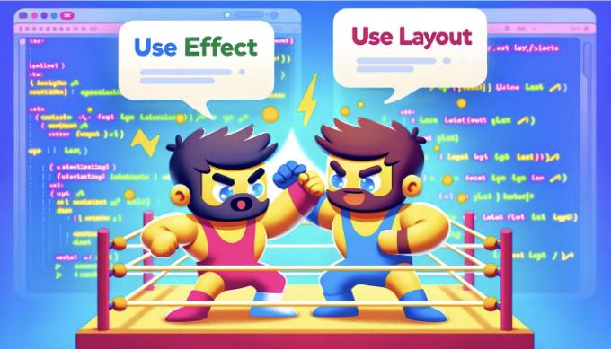
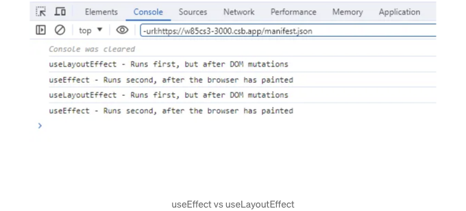

## 소개 🌟

React 16.8에서 훅스가 도입되면서 함수형 컴포넌트를 작성하는 방식이 근본적으로 변화했습니다. 그 중에서도 useEffect와 useLayoutEffect는 코드 내의 부작용을 처리하는 데 특히 중요합니다. 처음에는 비슷해보일 수 있지만, 이 둘 사이에는 중요한 차이점이 있습니다. 이 블로그에서는 이러한 차이점을 명확하고 직관적으로 살펴보겠습니다. useEffect를 언제 사용해야 하고 React 프로젝트에서 useLayoutEffect가 더 나은 선택일 수 있는지 이해하는 데 도움을 줄 것입니다.

이 두 가지 필수적인 React 훅에 대한 실용적인 탐구를 시작해보겠습니다.

<!-- ui-log 수평형 -->
<ins class="adsbygoogle"
  style="display:block"
  data-ad-client="ca-pub-4877378276818686"
  data-ad-slot="9743150776"
  data-ad-format="auto"
  data-full-width-responsive="true"></ins>
<component is="script">
(adsbygoogle = window.adsbygoogle || []).push({});
</component>

들어가기 전에, 웹 개발에 관한 보다 심층적인 기사들을 제 개인 웹사이트에서 더 알아보세요:

## useEffect란 무엇인가요? 🔍

useEffect는 함수형 컴포넌트에서 부수 효과를 수행할 수 있게 해주는 React 훅입니다. 부수 효과란 실행 중인 함수의 범위 외부에 영향을 미치는 어떠한 작업이라도 포괄합니다. 이에는 데이터 가져오기, 구독, 수동으로 DOM 변경하기 등이 포함될 수 있습니다.

useEffect 사용 방법: 🚀

<!-- ui-log 수평형 -->
<ins class="adsbygoogle"
  style="display:block"
  data-ad-client="ca-pub-4877378276818686"
  data-ad-slot="9743150776"
  data-ad-format="auto"
  data-full-width-responsive="true"></ins>
<component is="script">
(adsbygoogle = window.adsbygoogle || []).push({});
</component>

useEffect를 사용하면 렌더링 후에 React에게 어떤 작업을 수행할지 알립니다. React는 전달한 함수를 기억하고 DOM 업데이트를 수행한 후에 나중에 호출합니다.

useEffect의 구문:

```js
useEffect(() => {
  // 여기에 사이드 이펙트용 코드를 작성합니다.
}, [dependencies]);
```

두 번째 인수인 [dependencies]는 종속성(dependencies) 배열입니다. React는 종속성 중 하나가 변경될 때만 사이드 이펙트를 다시 실행합니다. 빈 배열([])을 전달하면 초기 렌더링 후 한 번만 사이드 이펙트가 실행되므로 클래스 컴포넌트의 componentDidMount와 유사합니다.

<!-- ui-log 수평형 -->
<ins class="adsbygoogle"
  style="display:block"
  data-ad-client="ca-pub-4877378276818686"
  data-ad-slot="9743150776"
  data-ad-format="auto"
  data-full-width-responsive="true"></ins>
<component is="script">
(adsbygoogle = window.adsbygoogle || []).push({});
</component>

## useLayoutEffect이란 무엇인가요? 🤔

useLayoutEffect은 useEffect와 유사하지만 실행 시기에 주요 차이점이 있는 또 다른 React hook입니다. 직접 DOM을 조작하거나 브라우저가 화면을 그리기 전 레이아웃을 조정해야 하는 작업과 같은 동기화가 필요한 작업에 사용됩니다.

언제 useLayoutEffect를 사용해야 하나요? 📐

useLayoutEffect는 화면이 업데이트되기 전에 DOM 변경을 해야 하는 경우에 사용해야 합니다. 화면에 그려진 후에 DOM을 조작하면 발생할 수 있는 깜박임과 같은 시각적 문제를 피하고 싶은 경우에 중요합니다.

<!-- ui-log 수평형 -->
<ins class="adsbygoogle"
  style="display:block"
  data-ad-client="ca-pub-4877378276818686"
  data-ad-slot="9743150776"
  data-ad-format="auto"
  data-full-width-responsive="true"></ins>
<component is="script">
(adsbygoogle = window.adsbygoogle || []).push({});
</component>

useLayoutEffect 의 구문:

```js
useLayoutEffect(() => {
  // DOM과 상호 작용하는 코드
}, [의존성]);
```

useEffect 와 마찬가지로 두 번째 인자로 의존성 배열을 전달합니다.

## useEffect 와 useLayoutEffect 의 비교 동작 ⚖️

<!-- ui-log 수평형 -->
<ins class="adsbygoogle"
  style="display:block"
  data-ad-client="ca-pub-4877378276818686"
  data-ad-slot="9743150776"
  data-ad-format="auto"
  data-full-width-responsive="true"></ins>
<component is="script">
(adsbygoogle = window.adsbygoogle || []).push({});
</component>

useEffect와 useLayoutEffect를 개별적으로 탐색한 후, 동일한 컴포넌트 내에서 이 두 훅을 함께 사용하는 것이 도움이 될 수 있습니다. 이 비교를 통해 실행 순서와 동작에 대한 보다 명확한 이해를 얻을 수 있습니다.

useEffect와 useLayoutEffect를 모두 포함하는 단일 함수형 컴포넌트를 만들어 보겠습니다. 각 훅에 콘솔 로그를 추가하여 실행 순서를 관찰할 것입니다.

```js
import React, { useEffect, useLayoutEffect } from 'react';

const Home = () => {
  
  useLayoutEffect(() => {
    console.log('useLayoutEffect - DOM 수정 이후에 실행되지만 가장 먼저 실행됨');
  }, []);

  useEffect(() => {
    console.log('useEffect - 브라우저가 그린 후에 실행됨');
  }, []);

  return (
    <div>안녕, React Hooks!</div>
  );
};

export default Home;
```

이 컴포넌트에서는 useLayoutEffect와 useEffect를 모두 빈 의존성 배열로 사용하여, 초기 렌더 이후에 실행되어야 합니다.

<!-- ui-log 수평형 -->
<ins class="adsbygoogle"
  style="display:block"
  data-ad-client="ca-pub-4877378276818686"
  data-ad-slot="9743150776"
  data-ad-format="auto"
  data-full-width-responsive="true"></ins>
<component is="script">
(adsbygoogle = window.adsbygoogle || []).push({});
</component>




- useLayoutEffect: 이 훅은 가장 먼저 실행됩니다. 모든 DOM 변이가 완료된 후에, 브라우저가 그림을 그리기 전에 실행됩니다. 따라서 DOM 업데이트 직후에 사용자가 아무것도 보기 전에 발생해야 하는 모든 DOM 조작 또는 계산에 이상적입니다. useLayoutEffect 내의 콘솔 로그가 가장 먼저 나타납니다.
- useEffect: 이 훅은 useLayoutEffect 후에 실행됩니다. 컴포넌트 렌더 주기가 완료된 후에, 화면이 업데이트된 후에 실행됩니다. 이 동작은 useEffect가 DOM에 즉시 동기적으로 업데이트가 필요하지 않은 작업에 최적화되어 있음을 의미합니다. API 호출이나 구독 설정과 같은 작업에 적합합니다. useEffect 내의 콘솔 로그가 useLayoutEffect로부터 나온 것 다음에 나타납니다.

## 실제 예제: useEffect와 useLayoutEffect 실전 활용 💫

useEffect와 useLayoutEffect의 세부사항을 잘 이해하기 위해, 각 훅이 다른 상황에서 어떻게 효과적으로 활용될 수 있는지 살펴봅시다.

<!-- ui-log 수평형 -->
<ins class="adsbygoogle"
  style="display:block"
  data-ad-client="ca-pub-4877378276818686"
  data-ad-slot="9743150776"
  data-ad-format="auto"
  data-full-width-responsive="true"></ins>
<component is="script">
(adsbygoogle = window.adsbygoogle || []).push({});
</component>

## 1️⃣ 데이터 패칭을 위한 useEffect🌐📈

데이터 패칭은 useEffect의 일반적인 사용 사례입니다. 컴포넌트가 렌더링될 때 API로부터 데이터를 요청하고 로드할 수 있습니다.

다음은 JSONPlaceholder API에서 데이터를 가져오기 위해 useEffect를 사용하는 React 컴포넌트의 전체 예제입니다:

```js
import React, { useState, useEffect } from 'react';

const App = () => {
  const [data, setData] = useState([]);

  useEffect(() => {
    const fetchData = async () => {
      try {
        const response = await fetch('https://jsonplaceholder.typicode.com/posts');
        const jsonData = await response.json();
        setData(jsonData);
      } catch (error) {
        console.error('데이터를 가져오는 중 오류 발생: ', error);
      }
    };
    fetchData();
  }, []); 
  return (
    <div>
      <h1>JSONPlaceholder API에서 가져온 데이터</h1>
      <ul>
        {data.map(item => (
          <li key={item.id}>{item.title}</li> 
        ))}
      </ul>
    </div>
  );
};

export default App;
```

<!-- ui-log 수평형 -->
<ins class="adsbygoogle"
  style="display:block"
  data-ad-client="ca-pub-4877378276818686"
  data-ad-slot="9743150776"
  data-ad-format="auto"
  data-full-width-responsive="true"></ins>
<component is="script">
(adsbygoogle = window.adsbygoogle || []).push({});
</component>

컴포넌트는 API에서 가져온 제목 목록을 렌더링합니다. useEffect의 의존성 목록에 빈 배열을 넣어 데이터 가져오기가 클래스 컴포넌트의 componentDidMount와 유사하게 한 번만 실행되도록 합니다.

## 2️⃣ DOM 조작을 위한 useLayoutEffect: 📜

상태가 변경된 후 목록의 스크롤 위치를 즉시 상단으로 조정하려는 상황을 생각해보겠습니다. useEffect로 이 작업을 수행하면 화면이 업데이트된 후에 조정이 발생하여 화면이 깜박거릴 수 있습니다. useLayoutEffect는 화면 업데이트 전에 조정이 이루어지도록 보장하여 이 문제를 해결합니다.

다음은 예시입니다:

<!-- ui-log 수평형 -->
<ins class="adsbygoogle"
  style="display:block"
  data-ad-client="ca-pub-4877378276818686"
  data-ad-slot="9743150776"
  data-ad-format="auto"
  data-full-width-responsive="true"></ins>
<component is="script">
(adsbygoogle = window.adsbygoogle || []).push({});
</component>

```js
import React, { useState, useLayoutEffect, useRef } from 'react';

const App = () => {
  const [items, setItems] = useState([]);
  const listRef = useRef(null);

  const addItems = () => {
    const newItems = [...Array(5).keys()].map(i => `Item ${i + items.length}`);
    setItems([...items, ...newItems]);
  };

  useLayoutEffect(() => {
    // 화면이 업데이트되기 전에 스크롤 위치를 조정합니다.
    if (listRef.current) {
      listRef.current.scrollTop = 0;
    }
  }, [items]); // 'items' 상태에 의존

  return (
    <div>
      <button onClick={addItems}>항목 추가</button>
      <ul ref={listRef}>
        {items.map((item, index) => (
          <li key={index}>{item}</li>
        ))}
      </ul>
    </div>
  );
};

export default App;
```

이 컴포넌트에서:

- useState를 사용하여 항목 목록을 저장하는 items 상태를 생성합니다.
- 목록에 새 항목을 추가하는 버튼이 제공됩니다.
- useLayoutEffect 훅을 사용하여 새 항목이 추가될 때마다 목록을 맨 위로 스크롤합니다. 이는 브라우저가 업데이트된 UI를 그리기 전에 수행되어 스크롤 위치에서 깜빡임이나 점프가 발생하지 않습니다.
- ref 속성 (listRef)은 목록 DOM 요소를 참조하여 스크롤 위치를 조작하는 데 사용됩니다.

이 예시는 useLayoutEffect를 사용하여 React 컴포넌트에서 상태 변경에 따른 DOM의 부드럽고 깜빡임 없는 조정을 어떻게 할 수 있는지 보여줍니다.```

<!-- ui-log 수평형 -->
<ins class="adsbygoogle"
  style="display:block"
  data-ad-client="ca-pub-4877378276818686"
  data-ad-slot="9743150776"
  data-ad-format="auto"
  data-full-width-responsive="true"></ins>
<component is="script">
(adsbygoogle = window.adsbygoogle || []).push({});
</component>

## 결론 ✅

useEffect와 useLayoutEffect 사이의 선택은 주로 수행되는 DOM 작업의 구체적인 요구사항에 따라 다를 수 있습니다. 시각적 차이가 항상 명확하지는 않겠지만, 이러한 훅의 내부 동작을 이해하는 것이 React 애플리케이션 성능을 최적화하고 부드러운 사용자 경험을 보장하는 데 중요합니다.

useEffect는 대부분 DOM 작업과 상호 작용이 필요하지 않는 사이드 이펙트에 가장 적합한 훅입니다. 데이터 가져오기나 구독 설정과 같이 DOM과 직접 상호작용이 필요하지 않는 작업에 적합합니다. 상태와 프롭의 변경에 반응할 수 있는 능력 덕분에 다양한 사용 사례에 매우 다재다능하게 사용됩니다.

반면에 useLayoutEffect는 DOM 변경에 직접적으로 동기적 업데이트를 수행해야 할 때 필수적입니다. DOM을 조작할 때 시각적인 문제를 피하고 부드러운 사용자 경험을 보장하기 위한 완벽한 도구입니다.

<!-- ui-log 수평형 -->
<ins class="adsbygoogle"
  style="display:block"
  data-ad-client="ca-pub-4877378276818686"
  data-ad-slot="9743150776"
  data-ad-format="auto"
  data-full-width-responsive="true"></ins>
<component is="script">
(adsbygoogle = window.adsbygoogle || []).push({});
</component>